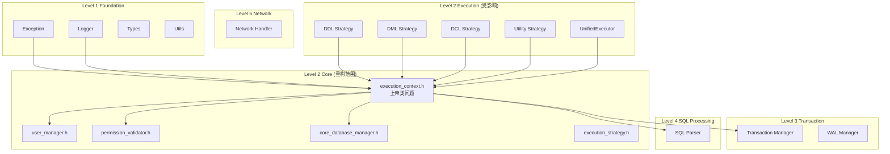
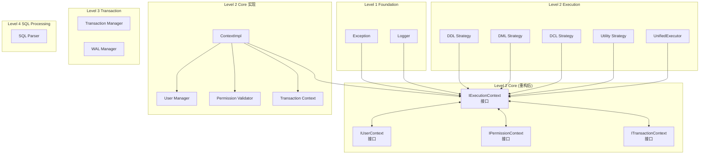
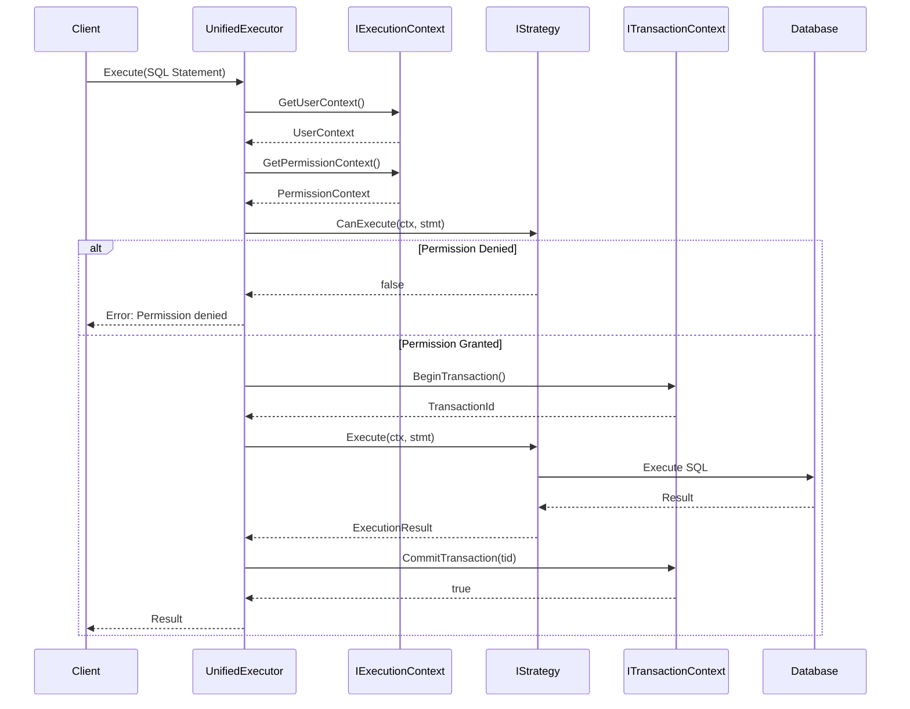

# Level 2 Core 重构架构设计规范

## 1. 概述

### 1.1 功能名称
Level 2 Core 模块拆分解耦重构

### 1.2 版本
1.0

### 1.3 日期
2026-02-02

### 1.4 作者
SQLCC AI 开发团队

### 1.5 状态
草稿

### 1.6 对应需求
REQ-CORE-001, REQ-CORE-002, REQ-CORE-003

---

## 2. 架构决策记录 (ADR)

### 2.1 决策列表

| 决策 ID | 决策内容 | 理由 | 状态 |
|---------|---------|------|------|
| ADR-CORE-001 | 使用接口抽象解耦 execution 与 core | 消除 28 个反向依赖，支持增量编译 | 待审批 |
| ADR-CORE-002 | 拆分 execution_context 为多个单一职责接口 | 降低耦合度，提高可测试性 | 待审批 |
| ADR-CORE-003 | 引入依赖注入模式 | 解耦具体实现依赖 | 待审批 |
| ADR-CORE-004 | 执行策略接口独立 | 支持独立测试和扩展 | 待审批 |

### 2.2 详细决策

#### ADR-CORE-001: 使用接口抽象解耦 execution 与 core

**问题**: execution 模块直接依赖 core 的具体实现，导致：
- 28 个 execution 文件依赖 core 具体类
- 无法增量编译和测试
- core 变更会影响所有 execution 代码

**选项**:
- 选项 A: 引入接口抽象层
  - 优点: 完全解耦，支持依赖注入
  - 缺点: 增加代码复杂度
- 选项 B: 重构代码移动功能
  - 优点: 减少抽象层
  - 缺点: 可能引入新的循环依赖

**决策**: 选项 A - 引入接口抽象层

**影响**: 
- 新增 8-10 个接口文件
- 修改 28 个依赖文件
- 编译时间可能增加 10%

---

## 3. 系统上下文

### 3.1 当前架构上下文图



### 3.2 目标架构上下文图



---

## 4. 组件架构

### 4.1 组件图

```mermaid
classDiagram
    %% 核心接口定义
    class IExecutionContext {
        <<interface>>
        +GetSessionId() string
        +GetCurrentDatabase() string
        +SetCurrentDatabase(db string)
        +GetUserContext() IUserContext
        +GetPermissionContext() IPermissionContext
        +GetTransactionContext() ITransactionContext
        +GetConnectionId() int64
        +GetClientInfo() ClientInfo
    }

    class IUserContext {
        <<interface>>
        +GetCurrentUser() User
        +GetUserRoles() vector~Role~
        +HasPermission(perm string) bool
        +GetSessionVariables() SessionVariables
    }

    class IPermissionContext {
        <<interface>>
        +CheckPermission(user User, resource string, action string) bool
        +ValidateAccess(resource string, operation Operation) PermissionResult
        +GetGrantedPermissions(user User) vector~Permission~
    }

    class ITransactionContext {
        <<interface>>
        +GetCurrentTransaction() Transaction
        +BeginTransaction() TransactionId
        +CommitTransaction(tid TransactionId) bool
        +RollbackTransaction(tid TransactionId) bool
        +GetTransactionState(tid TransactionId) TransactionState
    }

    %% 执行策略接口
    class IExecutionStrategy {
        <<interface>>
        +CanExecute(ctx IExecutionContext, stmt Statement) bool
        +Execute(ctx IExecutionContext, stmt Statement) ExecutionResult
        +Validate(ctx IExecutionContext, stmt Statement) ValidationResult
    }

    class IDDLStrategy {
        <<interface>>
        +ExecuteCreate(ctx IExecutionContext, stmt CreateStatement) ExecutionResult
        +ExecuteAlter(ctx IExecutionContext, stmt AlterStatement) ExecutionResult
        +ExecuteDrop(ctx IExecutionContext, stmt DropStatement) ExecutionResult
    }

    class IDMLStrategy {
        <<interface>>
        +ExecuteSelect(ctx IExecutionContext, stmt SelectStatement) ExecutionResult
        +ExecuteInsert(ctx IExecutionContext, stmt InsertStatement) ExecutionResult
        +ExecuteUpdate(ctx IExecutionContext, stmt UpdateStatement) ExecutionResult
        +ExecuteDelete(ctx IExecutionContext, stmt DeleteStatement) ExecutionResult
    }

    class IDCLStrategy {
        <<interface>>
        +ExecuteGrant(ctx IExecutionContext, stmt GrantStatement) ExecutionResult
        +ExecuteRevoke(ctx IExecutionContext, stmt RevokeStatement) ExecutionResult
    }

    class IUtilityStrategy {
        <<interface>>
        +ExecuteShow(ctx IExecutionContext, stmt ShowStatement) ExecutionResult
        +ExecuteUse(ctx IExecutionContext, stmt UseStatement) ExecutionResult
        +ExecuteExplain(ctx IExecutionContext, stmt ExplainStatement) ExecutionResult
    }

    %% 实现类
    class ExecutionContextImpl {
        -session_id_: string
        -current_database_: string
        -user_context_: unique_ptr~IUserContext~
        -permission_context_: unique_ptr~IPermissionContext~
        -transaction_context_: unique_ptr~ITransactionContext~
        +constructor(session_id string)
        +GetSessionId() string
        +GetCurrentDatabase() string
        +SetCurrentDatabase(db string)
        +GetUserContext() IUserContext
        +GetPermissionContext() IPermissionContext
        +GetTransactionContext() ITransactionContext
    }

    class UserContextImpl {
        -current_user_: User
        -user_roles_: vector~Role~
        -session_variables_: SessionVariables
        +constructor(user_id string)
        +GetCurrentUser() User
        +GetUserRoles() vector~Role~
        +HasPermission(perm string) bool
    }

    class PermissionContextImpl {
        -permission_cache_: PermissionCache
        +constructor()
        +CheckPermission(user User, resource string, action string) bool
        +ValidateAccess(resource string, operation Operation) PermissionResult
    }

    class TransactionContextImpl {
        -current_transaction_: Transaction
        -transaction_store_: TransactionStore
        +constructor()
        +GetCurrentTransaction() Transaction
        +BeginTransaction() TransactionId
        +CommitTransaction(tid TransactionId) bool
    }

    %% 关系
    IExecutionContext <|.. ExecutionContextImpl
    IUserContext <|.. UserContextImpl
    IPermissionContext <|.. PermissionContextImpl
    ITransactionContext <|.. TransactionContextImpl

    ExecutionContextImpl --> IUserContext
    ExecutionContextImpl --> IPermissionContext
    ExecutionContextImpl --> ITransactionContext

    UnifiedExecutor --> IExecutionContext
    DDLStrategy --> IDDLStrategy
    DMLStrategy --> IDMLStrategy
    DCLStrategy --> IDCLStrategy
    UtilityStrategy --> IUtilityStrategy
```



### 4.2 组件说明

#### IExecutionContext: 执行上下文接口

**职责**: 提供执行上下文的抽象接口，解耦具体实现

**接口**:

```cpp
// src/core/interfaces/execution_context.h
#pragma once

#include <string>
#include <memory>

namespace sqlcc::core {

class IUserContext;
class IPermissionContext;
class ITransactionContext;
class ClientInfo;

class IExecutionContext {
public:
    virtual ~IExecutionContext() = default;

    // 会话管理
    virtual std::string GetSessionId() const = 0;
    virtual int64_t GetConnectionId() const = 0;
    virtual const ClientInfo& GetClientInfo() const = 0;

    // 数据库上下文
    virtual std::string GetCurrentDatabase() const = 0;
    virtual bool SetCurrentDatabase(const std::string& db_name) = 0;

    // 子上下文访问
    virtual IUserContext* GetUserContext() = 0;
    virtual IPermissionContext* GetPermissionContext() = 0;
    virtual ITransactionContext* GetTransactionContext() = 0;

protected:
    // 工厂方法（仅供实现使用）
    virtual void SetUserContext(std::unique_ptr<IUserContext> ctx) = 0;
    virtual void SetPermissionContext(std::unique_ptr<IPermissionContext> ctx) = 0;
    virtual void SetTransactionContext(std::unique_ptr<ITransactionContext> ctx) = 0;

    // 友元工厂
    friend class ExecutionContextFactory;
};

}  // namespace sqlcc::core
```

#### IUserContext: 用户上下文接口

**职责**: 抽象用户相关操作

```cpp
// src/core/interfaces/user_context.h
#pragma once

#include <string>
#include <vector>

namespace sqlcc::core {

struct User;
struct Role;

class IUserContext {
public:
    virtual ~IUserContext() = default;

    virtual User GetCurrentUser() const = 0;
    virtual std::vector<Role> GetUserRoles() const = 0;
    virtual bool HasPermission(const std::string& permission) const = 0;
    virtual bool HasRole(const std::string& role_name) const = 0;
    virtual const SessionVariables& GetSessionVariables() const = 0;
    virtual void SetSessionVariable(const std::string& key, const Variant& value) = 0;
};

}  // namespace sqlcc::core
```

#### IPermissionContext: 权限上下文接口

**职责**: 抽象权限检查操作

```cpp
// src/core/interfaces/permission_context.h
#pragma once

#include <string>
#include <memory>

namespace sqlcc::core {

struct User;
struct PermissionResult;

class IPermissionContext {
public:
    virtual ~IPermissionContext() = default;

    virtual bool CheckPermission(
        const User& user,
        const std::string& resource,
        const std::string& action) = 0;

    virtual PermissionResult ValidateAccess(
        const std::string& resource,
        const std::string& operation) = 0;

    virtual std::vector<Permission> GetGrantedPermissions(
        const User& user) = 0;
};

}  // namespace sqlcc::core
```

#### ITransactionContext: 事务上下文接口

**职责**: 抽象事务管理操作

```cpp
// src/core/interfaces/transaction_context.h
#pragma once

#include <string>
#include <memory>

namespace sqlcc::transaction {

struct Transaction;
struct TransactionId;
struct TransactionState;

class ITransactionContext {
public:
    virtual ~ITransactionContext() = default;

    virtual std::unique_ptr<Transaction> GetCurrentTransaction() = 0;
    virtual TransactionId BeginTransaction() = 0;
    virtual bool CommitTransaction(TransactionId tid) = 0;
    virtual bool RollbackTransaction(TransactionId tid) = 0;
    virtual TransactionState GetTransactionState(TransactionId tid) = 0;
    virtual bool IsInTransaction() const = 0;
};

}  // namespace sqlcc::transaction
```

---

## 5. 详细设计

### 5.1 目录结构

```
src/core/
├── interfaces/                    # 新增：接口定义
│   ├── BUILD.bazel
│   ├── execution_context.h
│   ├── user_context.h
│   ├── permission_context.h
│   └── transaction_context.h
├── impl/                          # 新增：接口实现
│   ├── BUILD.bazel
│   ├── execution_context_impl.h
│   ├── execution_context_impl.cpp
│   ├── user_context_impl.h
│   ├── user_context_impl.cpp
│   ├── permission_context_impl.h
│   ├── permission_context_impl.cpp
│   ├── transaction_context_impl.h
│   └── transaction_context_impl.cpp
├── BUILD.bazel                    # 修改：添加接口依赖
├── execution_context.h            # 迁移到 impl/
├── user_manager.h                 # 保留：具体实现
├── permission_validator.h         # 保留：具体实现
├── core_database_manager.h        # 保留：具体实现
└── ...

src/execution/
├── strategies/
│   ├── BUILD.bazel                # 修改：依赖接口
│   ├── ddl/
│   │   ├── BUILD.bazel
│   │   ├── ddl_execution_strategy.h
│   │   └── ddl_execution_strategy.cpp
│   ├── dml/
│   │   ├── BUILD.bazel
│   │   ├── dml_execution_strategy.h
│   │   └── dml_execution_strategy.cpp
│   ├── dcl/
│   │   ├── BUILD.bazel
│   │   ├── dcl_execution_strategy.h
│   │   └── dcl_execution_strategy.cpp
│   └── utility/
│       ├── BUILD.bazel
│       ├── utility_execution_strategy.h
│       └── utility_execution_strategy.cpp
├── unified_executor.h             # 修改：依赖 IExecutionContext
├── BUILD.bazel                    # 修改：依赖核心接口
└── ...
```

### 5.2 工厂模式

```cpp
// src/core/interfaces/context_factory.h
#pragma once

#include <memory>
#include <string>

namespace sqlcc::core {

class IExecutionContext;
class IUserContext;
class IPermissionContext;
class ITransactionContext;

class ContextFactory {
public:
    static std::unique_ptr<IExecutionContext> CreateExecutionContext(
        const std::string& session_id,
        int64_t connection_id);

    static std::unique_ptr<IUserContext> CreateUserContext(
        const std::string& user_id);

    static std::unique_ptr<IPermissionContext> CreatePermissionContext();

    static std::unique_ptr<ITransactionContext> CreateTransactionContext();

private:
    ContextFactory() = default;
};

}  // namespace sqlcc::core
```

### 5.3 依赖注入配置

```cpp
// src/core/di/dependency_injection.h
#pragma once

#include <memory>
#include <functional>

namespace sqlcc::core {

// 依赖注入容器
class DependencyContainer {
public:
    template<typename T>
    using Creator = std::function<std::unique_ptr<T>()>;

    template<typename Interface, typename Implementation>
    void Register(Creator<Interface> creator) {
        auto type_id = typeid(Interface).name();
        creators_[type_id] = [creator]() {
            return creator();
        };
    }

    template<typename Interface>
    std::unique_ptr<Interface> Resolve() {
        auto type_id = typeid(Interface).name();
        auto it = creators_.find(type_id);
        if (it != creators_.end()) {
            return std::unique_ptr<Interface>(
                static_cast<Interface*>(it->second().release())
            );
        }
        return nullptr;
    }

private:
    std::unordered_map<std::string, std::function<std::unique_ptr<void>()>> creators_;
};

}  // namespace sqlcc::core
```

---

## 6. 交互设计

### 6.1 UnifiedExecutor 执行流程



### 6.2 策略选择流程

```mermaid
stateDiagram
    [*] --> ParseStatement
    ParseStatement --> DetermineType

    DetermineType --> IsDDL: StatementType::DDL
    DetermineType --> IsDML: StatementType::DML
    DetermineType --> IsDCL: StatementType::DCL
    DetermineType --> IsUtility: StatementType::Utility

    IsDDL --> SelectDDLStrategy
    IsDML --> SelectDMLStrategy
    IsDCL --> SelectDCLStrategy
    IsUtility --> SelectUtilityStrategy

    SelectDDLStrategy --> Validate
    SelectDMLStrategy --> Validate
    SelectDCLStrategy --> Validate
    SelectUtilityStrategy --> Validate

    Validate --> Execute: Valid
    Validate --> ReturnError: Invalid

    Execute --> [*]
    ReturnError --> [*]
```

---

## 7. 依赖关系

### 7.1 内部依赖

| 源模块 | 目标模块 | 依赖类型 | 说明 |
|--------|---------|---------|------|
| execution | core/interfaces | 编译时 | 仅依赖接口 |
| core/impl | core/interfaces | 编译时 | 实现接口 |
| execution/strategies | core/interfaces | 编译时 | 仅依赖接口 |
| core | execution | 无 | 解耦成功 |

### 7.2 BUILD 配置

```bazel
# src/core/interfaces/BUILD.bazel
load("@rules_cc//cc:defs.bzl", "cc_library")

cc_library(
    name = "core_interfaces",
    hdrs = glob(["*.h"]),
    deps = [
        "//src/types:types",
        "//src/utils:utils",
        "@com_google_abseil//:absl_strings",
        "@com_google_abseil//:absl_status",
    ],
    visibility = ["//src/core:all", "//src/execution:all"],
)

# src/core/impl/BUILD.bazel
cc_library(
    name = "core_impl",
    srcs = glob(["*.cpp"]),
    hdrs = glob(["*.h"]),
    deps = [
        ":core_interfaces",
        "//src/core:core_database_manager",
        "//src/core:user_manager",
        "//src/core:permission_validator",
        "//src/transaction:transaction_manager",
    ],
    visibility = ["//src/core:all"],
)

# src/execution/BUILD.bazel
cc_library(
    name = "execution",
    srcs = glob(["*.cpp"]),
    hdrs = glob(["*.h"]),
    deps = [
        "//src/core/interfaces:core_interfaces",
        "//src/core/impl:core_impl",
        "//src/sql_parser:sql_parser",
        "//src/transaction:transaction_manager",
    ],
    visibility = ["//visibility:public"],
)
```

---

## 8. 测试策略

### 8.1 测试覆盖目标

| 类型 | 目标覆盖率 | 最低覆盖率 |
|------|-----------|-----------|
| 单元测试 | 85% | 75% |
| 集成测试 | 70% | 60% |
| 边界测试 | 100% | 90% |
| 异常测试 | 100% | 90% |

### 8.2 Mock 测试

```cpp
// tests/execution/mock_context_test.cpp

using ::testing::Return;
using ::testing::NiceMock;

class MockIExecutionContext : public IExecutionContext {
public:
    MOCK_METHOD(std::string, GetSessionId, (), (const, override));
    MOCK_METHOD(IUserContext*, GetUserContext, (), (override));
    MOCK_METHOD(bool, SetCurrentDatabase, (const std::string&), (override));
    // ... 其他方法
};

class MockIUserContext : public IUserContext {
public:
    MOCK_METHOD(User, GetCurrentUser, (), (const, override));
    MOCK_METHOD(bool, HasPermission, (const std::string&), (const, override));
    // ... 其他方法
};

TEST(UnifiedExecutorTest, ExecuteSelectWithPermission) {
    // Arrange
    auto mock_ctx = std::make_unique<NiceMock<MockIExecutionContext>>();
    auto mock_user_ctx = std::make_unique<NiceMock<MockIUserContext>>();

    EXPECT_CALL(*mock_user_ctx, GetCurrentUser())
        .WillRepeatedly(Return(TestUser::Admin()));
    EXPECT_CALL(*mock_user_ctx, HasPermission("SELECT"))
        .WillRepeatedly(Return(true));

    EXPECT_CALL(*mock_ctx, GetUserContext())
        .WillRepeatedly(Return(mock_user_ctx.get()));

    UnifiedExecutor executor(mock_ctx.get());

    // Act
    auto result = executor.Execute(SelectStatement("SELECT * FROM users"));

    // Assert
    EXPECT_EQ(result.status(), ExecutionStatus::OK);
}
```

---

## 9. 性能考虑

### 9.1 性能目标

| 指标 | 目标值 | 说明 |
|------|--------|------|
| 上下文创建时间 | < 1ms | P99 |
| 权限检查时间 | < 0.1ms | P99 |
| 策略分发时间 | < 0.05ms | P99 |

### 9.2 性能优化策略

- 缓存用户权限信息
- 使用对象池复用 Context 对象
- 延迟初始化不常用的子上下文

---

## 10. 评审检查表

| 检查项 | 状态 | 备注 |
|--------|------|------|
| [ ] 架构决策合理 | 待评审 | |
| [ ] 接口定义完整 | 待评审 | |
| [ ] 类图准确 | 待评审 | |
| [ ] 时序图完整 | 待评审 | |
| [ ] 依赖关系清晰 | 待评审 | |
| [ ] BUILD 配置正确 | 待评审 | |
| [ ] 测试策略完整 | 待评审 | |
| [ ] 性能考虑充分 | 待评审 | |

---

## 11. 变更历史

| 版本 | 日期 | 变更内容 | 变更人 |
|------|------|---------|--------|
| 1.0 | 2026-02-02 | 初始设计 | SQLCC AI |
