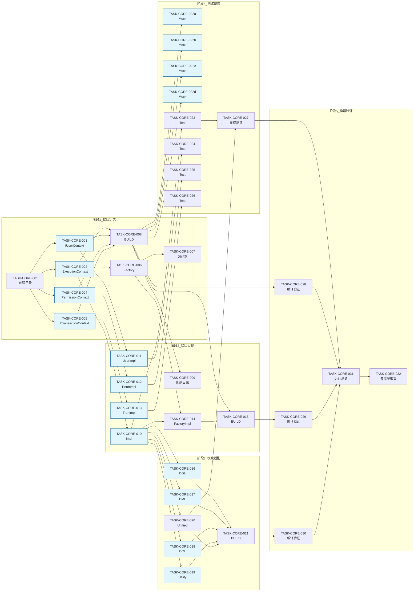

# Level 2 Core 重构 - 任务清单

**版本**: 1.2  
**日期**: 2026-02-02  
**状态**: 待开始  
**分支**: feature/level2-coverage-improvement

---

## 1. 任务概览

### 1.1 功能名称
Level 2 Core 模块拆分解耦重构

### 1.2 版本
1.2

### 1.3 日期
2026-02-02

### 1.4 作者
SQLCC AI 开发团队

### 1.5 状态
规划完成，待实施

### 1.6 对应设计
design.md v1.0

### 1.7 Agent 配置

```yaml
agents:
  - id: agent-master-1
    role: Master
    skills: ["coordination", "planning", "delivery"]
    max_tasks: 1
    availability: available

  - id: agent-developer-1
    role: Developer
    skills: ["cpp", "bazel", "interface"]
    max_tasks: 3
    availability: available

  - id: agent-developer-2
    role: Developer
    skills: ["cpp", "bazel", "storage"]
    max_tasks: 3
    availability: available

  - id: agent-developer-3
    role: Developer
    skills: ["cpp", "bazel", "sql"]
    max_tasks: 3
    availability: available

  - id: agent-developer-4
    role: Developer
    skills: ["cpp", "bazel", "transaction"]
    max_tasks: 3
    availability: available

  - id: agent-tester-1
    role: Tester
    skills: ["gtest", "coverage", "bazel"]
    max_tasks: 5
    availability: available

  - id: agent-reviewer-1
    role: Reviewer
    skills: ["code_review", "cpp", "standards"]
    max_tasks: 5
    availability: available

  - id: agent-documenter-1
    role: Documenter
    skills: ["markdown", "sdd", "docs"]
    max_tasks: 4
    availability: available
```

---

## 2. 任务清单

### 2.1 任务状态统计

| 状态 | 计数 | 说明 |
|------|------|------|
| OPEN | 38 | 开放待认领 |
| CLAIMED | 0 | 已认领 |
| WIP | 0 | 进行中 |
| DONE | 0 | 已完成 |
| BLOCKED | 0 | 阻塞 |
| FROZEN | 0 | 冻结 |

### 2.2 任务列表

| ID | 任务名称 | 负责人 | 角色 | 状态 | 依赖 | 预计时间 | 检查点 |
|----|---------|--------|------|------|------|----------|--------|
| TASK-CORE-001 | 创建接口目录结构 | - | Developer | OPEN | - | 1h | ☐☐☐☐ |
| TASK-CORE-002 | IExecutionContext 接口 | - | Developer | OPEN | TASK-CORE-001 | 4h | ☐☐☐☐ |
| TASK-CORE-003 | IUserContext 接口 | - | Developer | OPEN | TASK-CORE-001 | 2h | ☐☐☐☐ |
| TASK-CORE-004 | IPermissionContext 接口 | - | Developer | OPEN | TASK-CORE-001 | 2h | ☐☐☐☐ |
| TASK-CORE-005 | ITransactionContext 接口 | - | Developer | OPEN | TASK-CORE-001 | 2h | ☐☐☐☐ |
| TASK-CORE-006 | ContextFactory 工厂 | - | Developer | OPEN | TASK-CORE-002 | 2h | ☐☐☐☐ |
| TASK-CORE-007 | DependencyInjection 容器 | - | Developer | OPEN | TASK-CORE-006 | 2h | ☐☐☐☐ |
| TASK-CORE-008 | 接口 BUILD.bazel | - | Developer | OPEN | TASK-CORE-002~007 | 1h | ☐☐☐☐ |
| TASK-CORE-009 | 创建实现目录结构 | - | Developer | OPEN | - | 1h | ☐☐☐☐ |
| TASK-CORE-010 | ExecutionContextImpl | - | Developer | OPEN | TASK-CORE-002,009 | 8h | ☐☐☐☐ |
| TASK-CORE-011 | UserContextImpl | - | Developer | OPEN | TASK-CORE-003,009 | 4h | ☐☐☐☐ |
| TASK-CORE-012 | PermissionContextImpl | - | Developer | OPEN | TASK-CORE-004,009 | 4h | ☐☐☐☐ |
| TASK-CORE-013 | TransactionContextImpl | - | Developer | OPEN | TASK-CORE-005,009 | 6h | ☐☐☐☐ |
| TASK-CORE-014 | ContextFactory 实现 | - | Developer | OPEN | TASK-CORE-006,010 | 2h | ☐☐☐☐ |
| TASK-CORE-015 | 实现 BUILD.bazel | - | Developer | OPEN | TASK-CORE-008,014 | 1h | ☐☐☐☐ |
| TASK-CORE-016 | DDL Strategy 适配 | - | Developer | OPEN | TASK-CORE-010 | 4h | ☐☐☐☐ |
| TASK-CORE-017 | DML Strategy 适配 | - | Developer | OPEN | TASK-CORE-010 | 4h | ☐☐☐☐ |
| TASK-CORE-018 | DCL Strategy 适配 | - | Developer | OPEN | TASK-CORE-010 | 4h | ☐☐☐☐ |
| TASK-CORE-019 | Utility Strategy 适配 | - | Developer | OPEN | TASK-CORE-010 | 4h | ☐☐☐☐ |
| TASK-CORE-020 | UnifiedExecutor 适配 | - | Developer | OPEN | TASK-CORE-010 | 6h | ☐☐☐☐ |
| TASK-CORE-021 | 执行模块 BUILD.bazel | - | Developer | OPEN | TASK-CORE-016~020 | 2h | ☐☐☐☐ |
| TASK-CORE-022a | MockIExecutionContext | - | Tester | OPEN | TASK-CORE-008 | 1h | ☐☐☐☐ |
| TASK-CORE-022b | MockIUserContext | - | Tester | OPEN | TASK-CORE-008 | 1h | ☐☐☐☐ |
| TASK-CORE-022c | MockIPermissionContext | - | Tester | OPEN | TASK-CORE-008 | 1h | ☐☐☐☐ |
| TASK-CORE-022d | MockITransactionContext | - | Tester | OPEN | TASK-CORE-008 | 1h | ☐☐☐☐ |
| TASK-CORE-023 | ExecutionContextImpl 测试 | - | Tester | OPEN | TASK-CORE-010,022a | 4h | ☐☐☐☐ |
| TASK-CORE-024 | UserContextImpl 测试 | - | Tester | OPEN | TASK-CORE-011,022b | 2h | ☐☐☐☐ |
| TASK-CORE-025 | PermissionContextImpl 测试 | - | Tester | OPEN | TASK-CORE-012,022c | 2h | ☐☐☐☐ |
| TASK-CORE-026 | TransactionContextImpl 测试 | - | Tester | OPEN | TASK-CORE-013,022d | 2h | ☐☐☐☐ |
| TASK-CORE-027 | UnifiedExecutor 集成测试 | - | Tester | OPEN | TASK-CORE-020,023 | 6h | ☐☐☐☐ |
| TASK-CORE-028 | 核心接口编译验证 | - | Tester | OPEN | TASK-CORE-008 | 1h | ☐☐☐☐ |
| TASK-CORE-029 | 接口实现编译验证 | - | Tester | OPEN | TASK-CORE-015 | 1h | ☐☐☐☐ |
| TASK-CORE-030 | 执行模块编译验证 | - | Tester | OPEN | TASK-CORE-021 | 1h | ☐☐☐☐ |
| TASK-CORE-031 | 运行所有测试 | - | Tester | OPEN | TASK-CORE-027~030 | 2h | ☐☐☐☐ |
| TASK-CORE-032 | 生成覆盖率报告 | - | Documenter | OPEN | TASK-CORE-031 | 1h | ☐☐☐☐ |

**检查点**: ☐编译 ☐测试 ☐文档 ☐评审

---

## 3. 任务看板

### TODO (待认领) - 38 任务

| ID | 任务 | 优先级 | 预计时间 | 认领Agent |
|----|------|--------|----------|-----------|
| TASK-CORE-001 | 创建接口目录结构 | P0 | 1h | - |
| TASK-CORE-002 | IExecutionContext 接口 | P0 | 4h | - |
| TASK-CORE-003 | IUserContext 接口 | P0 | 2h | - |
| TASK-CORE-004 | IPermissionContext 接口 | P0 | 2h | - |
| TASK-CORE-005 | ITransactionContext 接口 | P0 | 2h | - |
| TASK-CORE-006 | ContextFactory 工厂 | P1 | 2h | - |
| TASK-CORE-007 | DependencyInjection 容器 | P1 | 2h | - |
| TASK-CORE-008 | 接口 BUILD.bazel | P1 | 1h | - |
| TASK-CORE-009 | 创建实现目录结构 | P0 | 1h | - |
| TASK-CORE-010 | ExecutionContextImpl | P0 | 8h | - |
| TASK-CORE-011 | UserContextImpl | P1 | 4h | - |
| TASK-CORE-012 | PermissionContextImpl | P1 | 4h | - |
| TASK-CORE-013 | TransactionContextImpl | P1 | 6h | - |
| TASK-CORE-014 | ContextFactory 实现 | P1 | 2h | - |
| TASK-CORE-015 | 实现 BUILD.bazel | P1 | 1h | - |
| TASK-CORE-016 | DDL Strategy 适配 | P1 | 4h | - |
| TASK-CORE-017 | DML Strategy 适配 | P1 | 4h | - |
| TASK-CORE-018 | DCL Strategy 适配 | P1 | 4h | - |
| TASK-CORE-019 | Utility Strategy 适配 | P1 | 4h | - |
| TASK-CORE-020 | UnifiedExecutor 适配 | P0 | 6h | - |
| TASK-CORE-021 | 执行模块 BUILD.bazel | P1 | 2h | - |
| TASK-CORE-022a | MockIExecutionContext | P1 | 1h | - |
| TASK-CORE-022b | MockIUserContext | P1 | 1h | - |
| TASK-CORE-022c | MockIPermissionContext | P1 | 1h | - |
| TASK-CORE-022d | MockITransactionContext | P1 | 1h | - |
| TASK-CORE-023 | ExecutionContextImpl 测试 | P1 | 4h | - |
| TASK-CORE-024 | UserContextImpl 测试 | P2 | 2h | - |
| TASK-CORE-025 | PermissionContextImpl 测试 | P2 | 2h | - |
| TASK-CORE-026 | TransactionContextImpl 测试 | P2 | 2h | - |
| TASK-CORE-027 | UnifiedExecutor 集成测试 | P0 | 6h | - |
| TASK-CORE-028 | 核心接口编译验证 | P1 | 1h | - |
| TASK-CORE-029 | 接口实现编译验证 | P1 | 1h | - |
| TASK-CORE-030 | 执行模块编译验证 | P1 | 1h | - |
| TASK-CORE-031 | 运行所有测试 | P0 | 2h | - |
| TASK-CORE-032 | 生成覆盖率报告 | P1 | 1h | - |

### IN PROGRESS (进行中) - 0 任务

| ID | 任务 | 负责人 | 进度 | 预计完成 | 检查点 |
|----|------|--------|------|----------|--------|
| - | - | - | - | - | - |

### IN REVIEW (评审中) - 0 任务

| ID | 任务 | 作者 | 评审人 | 状态 |
|----|------|------|--------|------|
| - | - | - | - | - |

### DONE (已完成) - 0 任务

| ID | 任务 | 负责人 | 完成时间 | 评审人 |
|----|------|--------|----------|--------|
| - | - | - | - | - |

### BLOCKED (阻塞) - 0 任务

| ID | 任务 | 阻塞原因 | 解决方案 |
|----|------|----------|----------|
| - | - | - | - |

---

## 4. 依赖关系



---

## 5. 任务详情模板

### TASK-CORE-XXX: [任务名称]

**状态**: `OPEN` | `CLAIMED` | `WIP` | `PAUSED` | `BLOCKED` | `DONE`

**认领信息**:
- 认领Agent: [@agent-id]
- 认领时间: YYYY-MM-DD HH:MM:SS
- 开始时间: YYYY-MM-DD HH:MM:SS
- 预计完成: YYYY-MM-DD HH:MM:SS

**描述**:
> [任务描述]

**验收标准**:
- [ ] 验收标准1
- [ ] 验收标准2
- [ ] 验收标准3

**相关文件**:
- 源文件: `[路径]`
- 测试文件: `[路径]`
- 文档: `[路径]`

**依赖**:
- 前置任务: TASK-CORE-XXX
- 外部依赖: [依赖说明]

**检查点**:
| 检查点 | 状态 | 说明 |
|--------|------|------|
| 编译通过 | ⏳ | |
| 测试通过 | ⏳ | |
| 文档完成 | ⏳ | |
| 代码评审 | ⏳ | |

**进度更新**:
| 时间 | Agent | 操作 | 说明 |
|------|-------|------|------|
| HH:MM:SS | @agent-id | CLAIMED | 认领任务 |
| HH:MM:SS | @agent-id | WIP | 开始开发 |
| HH:MM:SS | @agent-id | BLOCKED | 等待依赖 |
| HH:MM:SS | @agent-id | DONE | 任务完成 |

**沟通记录**:
| 时间 | 发送者 | 接收者 | 类型 | 内容 |
|------|-------|--------|------|------|
| HH:MM:SS | @agent-developer-1 | @agent-master-1 | TASK_CLAIM | 认领任务 |
| HH:MM:SS | @agent-developer-1 | @all | PROGRESS_UPDATE | 进度25% |
| HH:MM:SS | @agent-developer-1 | @agent-master-1 | TASK_COMPLETE | 任务完成 |

---

## 6. 并行任务组

### Group A: 核心接口定义 (可并行)

| ID | 任务 | 预计时间 | 负责人 |
|----|------|----------|--------|
| TASK-CORE-002 | IExecutionContext 接口 | 4h | @agent-developer-1 |
| TASK-CORE-003 | IUserContext 接口 | 2h | @agent-developer-2 |
| TASK-CORE-004 | IPermissionContext 接口 | 2h | @agent-developer-3 |
| TASK-CORE-005 | ITransactionContext 接口 | 2h | @agent-developer-4 |

**并行度**: 4 个 Developer Agent 同时工作  
**预计时间**: 4h (取最大值)  
**加速比**: 4x

### Group B: 工厂和 DI (可并行)

| ID | 任务 | 预计时间 | 负责人 |
|----|------|----------|--------|
| TASK-CORE-006 | ContextFactory 工厂 | 2h | @agent-developer-1 |
| TASK-CORE-007 | DependencyInjection 容器 | 2h | @agent-developer-2 |

**并行度**: 2 个 Developer Agent 同时工作  
**预计时间**: 2h  
**加速比**: 2x

### Group C: 接口实现 (可并行)

| ID | 任务 | 预计时间 | 负责人 |
|----|------|----------|--------|
| TASK-CORE-010 | ExecutionContextImpl | 8h | @agent-developer-1 |
| TASK-CORE-011 | UserContextImpl | 4h | @agent-developer-2 |
| TASK-CORE-012 | PermissionContextImpl | 4h | @agent-developer-3 |
| TASK-CORE-013 | TransactionContextImpl | 6h | @agent-developer-4 |

**并行度**: 4 个 Developer Agent 同时工作  
**预计时间**: 8h (取最大值)  
**加速比**: 4x

### Group D: Strategy 适配 (可并行)

| ID | 任务 | 预计时间 | 负责人 |
|----|------|----------|--------|
| TASK-CORE-016 | DDL Strategy 适配 | 4h | @agent-developer-1 |
| TASK-CORE-017 | DML Strategy 适配 | 4h | @agent-developer-2 |
| TASK-CORE-018 | DCL Strategy 适配 | 4h | @agent-developer-3 |
| TASK-CORE-019 | Utility Strategy 适配 | 4h | @agent-developer-4 |

**并行度**: 4 个 Developer Agent 同时工作  
**预计时间**: 4h  
**加速比**: 4x

### Group E: Mock 测试 (可并行)

| ID | 任务 | 预计时间 | 负责人 |
|----|------|----------|--------|
| TASK-CORE-022a | MockIExecutionContext | 1h | @agent-tester-1 |
| TASK-CORE-022b | MockIUserContext | 1h | @agent-tester-1 |
| TASK-CORE-022c | MockIPermissionContext | 1h | @agent-tester-1 |
| TASK-CORE-022d | MockITransactionContext | 1h | @agent-tester-1 |

**并行度**: 1 个 Tester Agent 串行或并行  
**预计时间**: 1h  
**方式**: 同一Agent顺序执行或并发执行

### Group F: 单元测试 (可并行)

| ID | 任务 | 预计时间 | 负责人 |
|----|------|----------|--------|
| TASK-CORE-023 | ExecutionContextImpl 测试 | 4h | @agent-tester-1 |
| TASK-CORE-024 | UserContextImpl 测试 | 2h | @agent-tester-1 |
| TASK-CORE-025 | PermissionContextImpl 测试 | 2h | @agent-tester-1 |
| TASK-CORE-026 | TransactionContextImpl 测试 | 2h | @agent-tester-1 |

**并行度**: 1 个 Tester Agent 顺序执行  
**预计时间**: 10h (累计)

### Group G: 编译验证 (可并行)

| ID | 任务 | 预计时间 | 负责人 |
|----|------|----------|--------|
| TASK-CORE-028 | 核心接口编译 | 1h | @agent-tester-1 |
| TASK-CORE-029 | 接口实现编译 | 1h | @agent-tester-1 |
| TASK-CORE-030 | 执行模块编译 | 1h | @agent-tester-1 |

**并行度**: 3 个编译任务可并行验证  
**预计时间**: 1h  
**加速比**: 3x

---

## 7. 进度跟踪

### 燃尽图数据

| 日期 | 剩余任务 | 累计完成 | 状态 |
|------|----------|----------|------|
| 2026-02-02 | 38 | 0 | 🟢 Day 1 - 规划 |
| 2026-02-03 | 34 | 4 | 🟢 Day 2 - M1 |
| 2026-02-04 | 28 | 10 | 🟢 Day 3 - M1 |
| 2026-02-05 | 22 | 16 | 🟡 Day 4 - M2 |
| 2026-02-06 | 16 | 22 | 🟡 Day 5 - M2 |
| 2026-02-07 | 10 | 28 | 🟡 Day 6 - M3 |
| 2026-02-08 | 6 | 32 | 🟡 Day 7 - M3 |
| 2026-02-09 | 2 | 36 | 🟠 Day 8 - M4 |
| 2026-02-10 | 0 | 38 | ✅ Day 9 - M5 |

### 里程碑

| 里程碑 | 目标日期 | 状态 | 说明 |
|--------|----------|------|------|
| M1: 接口定义 | 2026-02-04 | 待开始 | 完成核心接口定义 |
| M2: 接口实现 | 2026-02-06 | 待开始 | 实现所有接口 |
| M3: 执行模块适配 | 2026-02-08 | 待开始 | 修改执行模块使用新接口 |
| M4: 测试覆盖 | 2026-02-09 | 待开始 | 补充测试用例 |
| M5: 构建验证 | 2026-02-10 | 待开始 | 验证所有构建通过 |

---

## 8. 沟通记录

### 消息模板

```json
{
  "type": "TASK_CLAIM",
  "task_id": "TASK-CORE-002",
  "agent_id": "agent-developer-1",
  "timestamp": "2026-02-03T10:00:00Z",
  "message": "认领 TASK-CORE-002: IExecutionContext 接口定义",
  "estimated_duration": "4h"
}
```

```json
{
  "type": "PROGRESS_UPDATE",
  "task_id": "TASK-CORE-002",
  "agent_id": "agent-developer-1",
  "timestamp": "2026-02-03T12:00:00Z",
  "status": "WIP",
  "progress_percent": 50,
  "message": "已完成接口定义，开始编写单元测试",
  "blockers": [],
  "next_steps": ["编写单元测试", "更新文档"]
}
```

```json
{
  "type": "BLOCKER_NOTIFICATION",
  "task_id": "TASK-CORE-010",
  "agent_id": "agent-developer-1",
  "timestamp": "2026-02-05T14:00:00Z",
  "blocked_by": ["TASK-CORE-002"],
  "message": "等待 TASK-CORE-002 完成接口定义",
  "severity": "P1",
  "suggestion": "请优先完成 IExecutionContext 接口"
}
```

```json
{
  "type": "TASK_COMPLETE",
  "task_id": "TASK-CORE-002",
  "agent_id": "agent-developer-1",
  "timestamp": "2026-02-03T14:00:00Z",
  "status": "DONE",
  "summary": "完成 IExecutionContext 接口定义，编译通过",
  "files_created": ["src/core/interfaces/execution_context.h"],
  "tests_added": [],
  "verification": {
    "compile": "SUCCESS",
    "test": "PENDING",
    "coverage": "N/A"
  }
}
```

---

## 9. 验收标准

### 功能验收

| 需求 ID | 验收标准 | 状态 |
|---------|---------|------|
| REQ-CORE-001 | 接口抽象解耦 execution 与 core | 待验证 |
| REQ-CORE-002 | 消除 28 个反向依赖 | 待验证 |
| REQ-CORE-003 | 支持增量编译和测试 | 待验证 |

### 质量验收

| 检查项 | 目标值 | 状态 |
|--------|--------|------|
| 代码覆盖率 | >= 85% | ☐ |
| 测试通过率 | 100% | ☐ |
| 编译成功率 | 100% | ☐ |
| 文档完整性 | 100% | ☐ |

---

## 10. 变更历史

| 版本 | 日期 | 变更内容 | 变更人 |
|------|------|---------|--------|
| 1.0 | 2026-02-02 | 初始任务列表 (32任务) | SQLCC AI |
| 1.1 | 2026-02-02 | 详细分解 (38任务)，添加并行组 | SQLCC AI |
| 1.2 | 2026-02-02 | 多Agent协作优化：看板、状态机、消息协议 | SQLCC AI |

---

## 附录: 任务认领记录

| 任务ID | 认领Agent | 认领时间 | 完成时间 | 状态 |
|--------|----------|----------|----------|------|
| - | - | - | - | - |

---

**维护者**: SQLCC Team
**最后更新**: 2026-02-02
**版本**: v1.2
