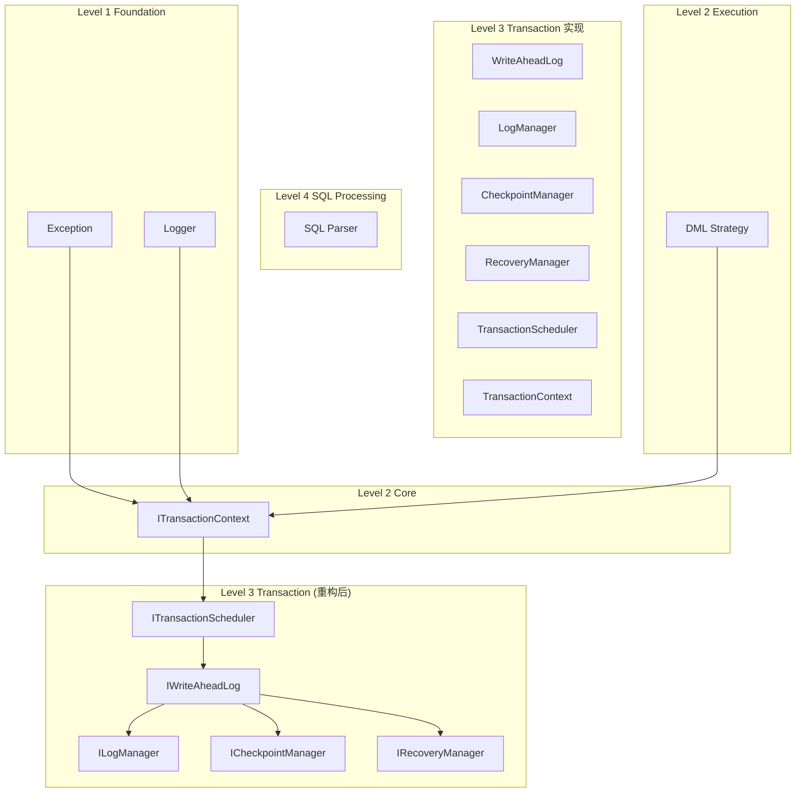
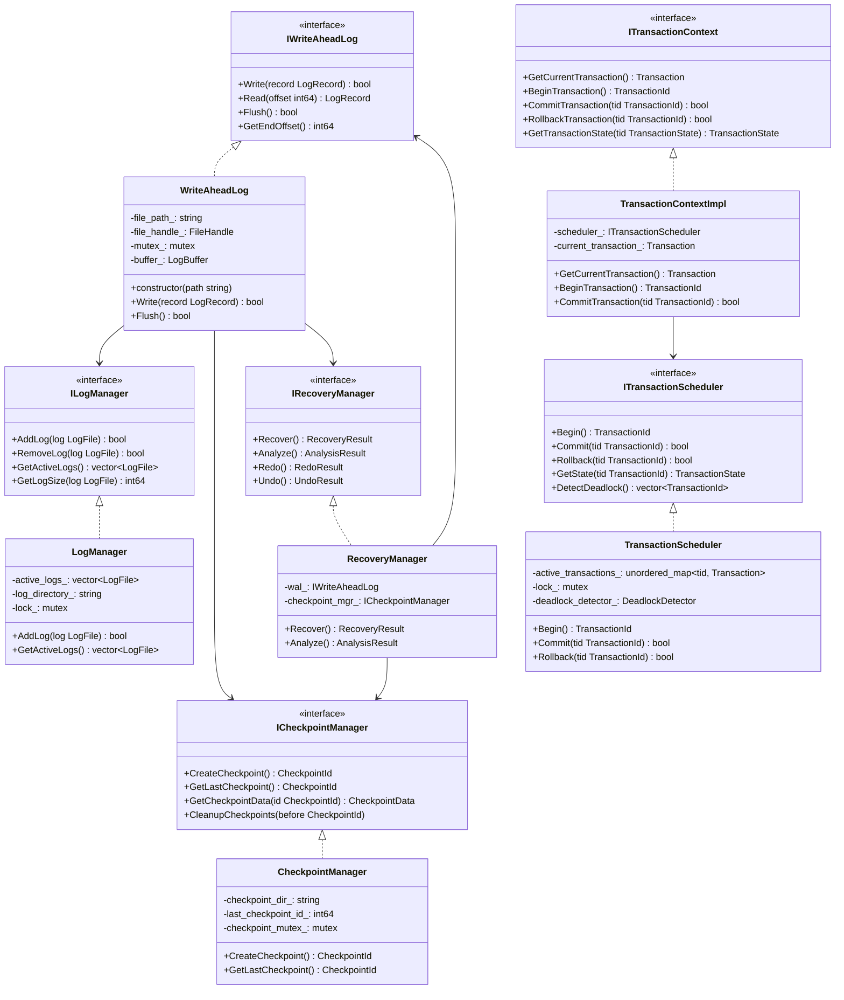

# Level 3 Transaction 重构架构设计规范

## 1. 概述

### 1.1 功能名称
Level 3 Transaction 模块拆分解耦重构

### 1.2 版本
1.0

### 1.3 日期
2026-02-02

### 1.4 作者
SQLCC AI 开发团队

### 1.5 状态
草稿

### 1.6 对应需求
REQ-TRAN-001, REQ-TRAN-002, REQ-TRAN-003

---

## 2. 架构决策记录 (ADR)

### 2.1 决策列表

| 决策 ID | 决策内容 | 理由 | 状态 |
|---------|---------|------|------|
| ADR-TRAN-001 | WAL 管理组件拆分 | 职责分离，提高可维护性 | 待审批 |
| ADR-TRAN-002 | 事务上下文接口抽象 | 解耦执行模块依赖 | 待审批 |
| ADR-TRAN-003 | 事务调度器独立 | 支持并发控制和死锁检测 | 待审批 |

### 2.2 详细决策

#### ADR-TRAN-001: WAL 管理组件拆分

**问题**: wal_manager.cpp (54.3 KB) 包含 WAL 写入、日志管理、检查点、恢复等职责

**选项**:
- 选项 A: 拆分为多个单一职责类
  - 优点: 职责清晰，易于测试
  - 缺点: 增加类数量
- 选项 B: 使用策略模式
  - 优点: 可配置
  - 缺点: 增加复杂度

**决策**: 选项 A - 拆分为多个单一职责类

**影响**:
- 新增 4 个组件文件
- 编译时间可能增加 5%

---

## 3. 系统上下文

### 3.1 目标架构上下文图



---

## 4. 组件架构

### 4.1 组件图



---

## 5. 详细设计

### 5.1 WAL 接口定义

```cpp
// src/transaction/interfaces/write_ahead_log.h
#pragma once

#include <cstdint>
#include <string>
#include <memory>

namespace sqlcc::transaction {

struct LogRecord {
    int64_t lsn;
    int64_t transaction_id;
    LogType type;
    std::vector<uint8_t> data;
    int64_t prev_lsn;
    std::chrono::timestamp timestamp;
};

enum class LogType {
    UPDATE,
    INSERT,
    DELETE,
    COMMIT,
    ROLLBACK,
    CHECKPOINT,
    BEGIN
};

class IWriteAheadLog {
public:
    virtual ~IWriteAheadLog() = default;

    virtual bool Write(const LogRecord& record) = 0;
    virtual bool Flush() = 0;
    virtual bool Read(int64_t offset, LogRecord& record) = 0;
    virtual int64_t GetEndOffset() const = 0;
    virtual int64_t GetSize() const = 0;
};

}  // namespace sqlcc::transaction
```

### 5.2 事务调度器接口

```cpp
// src/transaction/interfaces/transaction_scheduler.h
#pragma once

#include <string>
#include <memory>
#include <vector>

namespace sqlcc::transaction {

enum class TransactionState {
    ACTIVE,
    COMMITTED,
    ABORTED,
    PREPARED
};

struct Transaction {
    int64_t id;
    TransactionState state;
    std::chrono::timestamp start_time;
    std::vector<int64_t> modified_pages;
    IsolationLevel isolation_level;
};

class ITransactionScheduler {
public:
    virtual ~ITransactionScheduler() = default;

    virtual int64_t Begin() = 0;
    virtual bool Commit(int64_t transaction_id) = 0;
    virtual bool Rollback(int64_t transaction_id) = 0;
    virtual bool Abort(int64_t transaction_id) = 0;

    virtual TransactionState GetState(int64_t transaction_id) = 0;
    virtual const Transaction& GetTransaction(int64_t transaction_id) = 0;

    virtual std::vector<int64_t> DetectDeadlock() = 0;
    virtual void SetTimeout(int64_t transaction_id, std::chrono::seconds timeout) = 0;
};

}  // namespace sqlcc::transaction
```

---

## 6. BUILD 配置

```bazel
# src/transaction/interfaces/BUILD.bazel
cc_library(
    name = "transaction_interfaces",
    hdrs = glob(["*.h"]),
    deps = [
        "//src/types:types",
        "//src/utils:utils",
        "@com_google_abseil//:absl_strings",
    ],
    visibility = ["//src/transaction:all", "//src/execution:all"],
)

# src/transaction/scheduler/BUILD.bazel
cc_library(
    name = "transaction_scheduler",
    srcs = ["transaction_scheduler.cpp"],
    hdrs = ["transaction_scheduler.h"],
    deps = [
        "//src/transaction/interfaces:transaction_interfaces",
        "//src/transaction/wal:write_ahead_log",
        "//src/exception:exception",
    ],
    visibility = ["//src/transaction:all"],
)
```

---

## 7. 测试策略

### 7.1 测试覆盖目标

| 类型 | 目标覆盖率 | 最低覆盖率 |
|------|-----------|-----------|
| 单元测试 | 85% | 75% |
| 集成测试 | 70% | 60% |
| 边界测试 | 100% | 90% |

### 7.2 测试用例

```cpp
// tests/transaction/wal_test.cpp

class WriteAheadLogTest : public testing::Test {
protected:
    void SetUp() override {
        wal_ = std::make_unique<WriteAheadLog>("/tmp/test.wal");
    }

    std::unique_ptr<WriteAheadLog> wal_;
};

TEST_F(WriteAheadLogTest, WriteAndRead) {
    LogRecord record;
    record.transaction_id = 1;
    record.type = LogType::BEGIN;
    record.data = {'t', 'e', 's', 't'};

    EXPECT_TRUE(wal_->Write(record));

    LogRecord read_record;
    EXPECT_TRUE(wal_->Read(0, read_record));
    EXPECT_EQ(record.transaction_id, read_record.transaction_id);
    EXPECT_EQ(record.type, read_record.type);
}
```

---

## 8. 评审检查表

| 检查项 | 状态 | 备注 |
|--------|------|------|
| [ ] 架构决策合理 | 待评审 | |
| [ ] 接口定义完整 | 待评审 | |
| [ ] 依赖关系清晰 | 待评审 | |
| [ ] BUILD 配置正确 | 待评审 | |

---

## 9. 变更历史

| 版本 | 日期 | 变更内容 | 变更人 |
|------|------|---------|--------|
| 1.0 | 2026-02-02 | 初始设计 | SQLCC AI |
