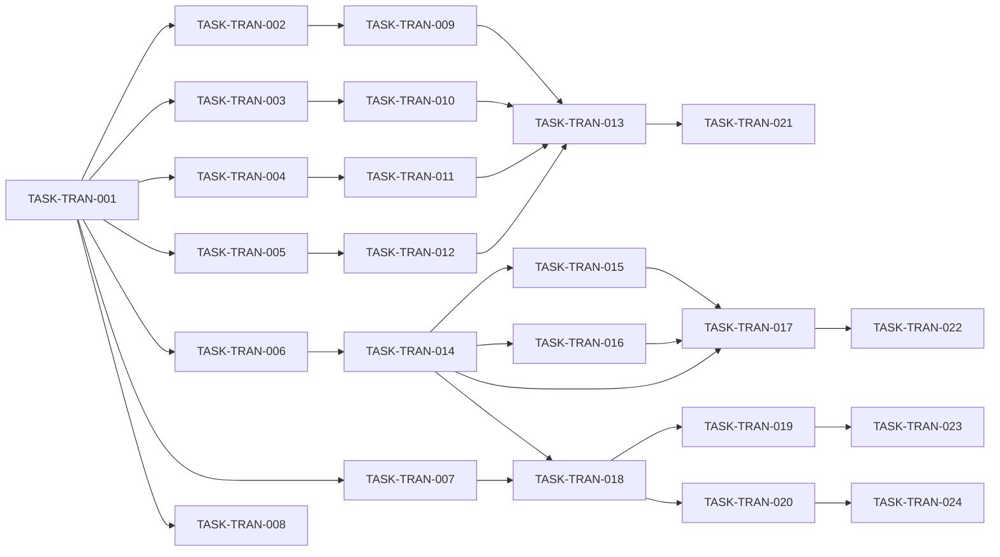

# Level 3 Transaction 重构实现任务清单

## 1. 概述

### 1.1 功能名称
Level 3 Transaction 模块拆分解耦重构

### 1.2 版本
1.0

### 1.3 日期
2026-02-02

### 1.4 作者
SQLCC AI 开发团队

### 1.5 状态
规划中

### 1.6 对应设计
design.md v1.0

---

## 2. 里程碑

| 里程碑 | 目标日期 | 状态 | 说明 |
|--------|----------|------|------|
| M1: 接口定义 | 2026-02-09 | 待开始 | 完成事务相关接口定义 |
| M2: WAL 组件拆分 | 2026-02-16 | 待开始 | 拆分 WAL 管理组件 |
| M3: 事务调度器 | 2026-02-23 | 待开始 | 实现事务调度器 |
| M4: 上下文集成 | 2026-03-02 | 待开始 | 集成事务上下文 |
| M5: 测试覆盖 | 2026-03-09 | 待开始 | 补充测试用例 |

---

## 3. 任务列表

### 阶段 1: 接口定义

| ID | 任务 | 依赖 | 负责人 | 状态 | 估计时间 |
|----|------|------|--------|------|----------|
| TASK-TRAN-001 | 创建事务接口目录 | 无 | AI | 待处理 | 1h |
| TASK-TRAN-002 | 定义 IWriteAheadLog 接口 | TASK-TRAN-001 | AI | 待处理 | 2h |
| TASK-TRAN-003 | 定义 ILogManager 接口 | TASK-TRAN-001 | AI | 待处理 | 2h |
| TASK-TRAN-004 | 定义 ICheckpointManager 接口 | TASK-TRAN-001 | AI | 待处理 | 2h |
| TASK-TRAN-005 | 定义 IRecoveryManager 接口 | TASK-TRAN-001 | AI | 待处理 | 2h |
| TASK-TRAN-006 | 定义 ITransactionScheduler 接口 | TASK-TRAN-001 | AI | 待处理 | 4h |
| TASK-TRAN-007 | 定义 ITransactionContext 接口 | TASK-TRAN-001 | AI | 待处理 | 2h |
| TASK-TRAN-008 | 创建接口 BUILD.bazel | TASK-TRAN-001 | AI | 待处理 | 1h |

### 阶段 2: WAL 组件拆分

| ID | 任务 | 依赖 | 负责人 | 状态 | 估计时间 |
|----|------|------|--------|------|----------|
| TASK-TRAN-009 | 实现 WriteAheadLog | TASK-TRAN-002 | AI | 待处理 | 6h |
| TASK-TRAN-010 | 实现 LogManager | TASK-TRAN-003 | AI | 待处理 | 4h |
| TASK-TRAN-011 | 实现 CheckpointManager | TASK-TRAN-004 | AI | 待处理 | 4h |
| TASK-TRAN-012 | 实现 RecoveryManager | TASK-TRAN-005, TASK-TRAN-011 | AI | 待处理 | 6h |
| TASK-TRAN-013 | 创建 WAL BUILD.bazel | TASK-TRAN-009~TASK-TRAN-012 | AI | 待处理 | 1h |

### 阶段 3: 事务调度器

| ID | 任务 | 依赖 | 负责人 | 状态 | 估计时间 |
|----|------|------|--------|------|----------|
| TASK-TRAN-014 | 实现 TransactionScheduler | TASK-TRAN-006 | AI | 待处理 | 8h |
| TASK-TRAN-015 | 实现死锁检测器 | TASK-TRAN-014 | AI | 待处理 | 4h |
| TASK-TRAN-016 | 实现事务超时管理 | TASK-TRAN-014 | AI | 待处理 | 2h |
| TASK-TRAN-017 | 创建调度器 BUILD.bazel | TASK-TRAN-014 | AI | 待处理 | 1h |

### 阶段 4: 上下文集成

| ID | 任务 | 依赖 | 负责人 | 状态 | 估计时间 |
|----|------|------|--------|------|----------|
| TASK-TRAN-018 | 实现 TransactionContextImpl | TASK-TRAN-007, TASK-TRAN-014 | AI | 待处理 | 4h |
| TASK-TRAN-019 | 创建上下文 BUILD.bazel | TASK-TRAN-018 | AI | 待处理 | 1h |
| TASK-TRAN-020 | 集成到执行模块 | TASK-TRAN-018 | AI | 待处理 | 4h |

### 阶段 5: 测试覆盖

| ID | 任务 | 依赖 | 负责人 | 状态 | 估计时间 |
|----|------|------|--------|------|----------|
| TASK-TRAN-021 | 创建 WAL 测试 | TASK-TRAN-013 | AI | 待处理 | 4h |
| TASK-TRAN-022 | 创建调度器测试 | TASK-TRAN-017 | AI | 待处理 | 6h |
| TASK-TRAN-023 | 创建上下文测试 | TASK-TRAN-019 | AI | 待处理 | 4h |
| TASK-TRAN-024 | 运行集成测试 | TASK-TRAN-020 | AI | 待处理 | 2h |

---

## 4. 任务详情

### TASK-TRAN-002: 定义 IWriteAheadLog 接口

**描述**: 创建 `src/transaction/interfaces/write_ahead_log.h` 文件

**验收标准**:
- [ ] 文件位置正确
- [ ] 定义 LogRecord 结构
- [ ] 定义 LogType 枚举
- [ ] 定义 IWriteAheadLog 接口
- [ ] 编译通过

**相关文件**:
- 源文件: `src/transaction/interfaces/write_ahead_log.h`
- 测试: `tests/transaction/interfaces/write_ahead_log_test.cpp`

**估计时间**: 2h

---

### TASK-TRAN-014: 实现 TransactionScheduler

**描述**: 实现事务调度器，支持并发控制和死锁检测

**验收标准**:
- [ ] 支持事务开始、提交、回滚
- [ ] 支持事务状态查询
- [ ] 实现死锁检测算法
- [ ] 支持事务超时
- [ ] 编译通过，测试通过

**相关文件**:
- 头文件: `src/transaction/scheduler/transaction_scheduler.h`
- 源文件: `src/transaction/scheduler/transaction_scheduler.cpp`
- 测试: `tests/transaction/scheduler/transaction_scheduler_test.cpp`

**注意事项**:
- 使用等待-图算法检测死锁
- 考虑性能优化
- 支持可配置的隔离级别

**估计时间**: 8h

---

## 5. 依赖图

---

## 6. 进度跟踪

| 日期 | 剩余任务数 | 累计完成 | 状态 |
|------|------------|----------|------|
| 2026-02-02 | 24 | 0 | 🟢 规划 |
| 2026-02-09 | 16 | 8 | 🟢 M1 完成 |
| 2026-02-16 | 11 | 13 | 🟢 M2 完成 |
| 2026-02-23 | 7 | 17 | 🟡 M3 完成 |
| 2026-03-02 | 4 | 20 | 🟡 M4 完成 |
| 2026-03-09 | 0 | 24 | ⚪ M5 完成 |

---

## 7. 风险与缓解

| 风险 ID | 风险 | 影响 | 概率 | 严重性 | 缓解措施 |
|---------|------|------|------|--------|----------|
| RISK-TRAN-001 | 死锁检测性能 | 系统吞吐量 | 中 | 中 | 定期检测 |
| RISK-TRAN-002 | 恢复逻辑复杂 | 恢复时间 | 中 | 高 | 充分测试 |
| RISK-TRAN-003 | 并发控制问题 | 数据一致性 | 低 | 高 | 严格测试 |

---

## 8. 变更历史

| 版本 | 日期 | 变更内容 | 变更人 |
|------|------|---------|--------|
| 1.0 | 2026-02-02 | 初始任务列表 | SQLCC AI |
