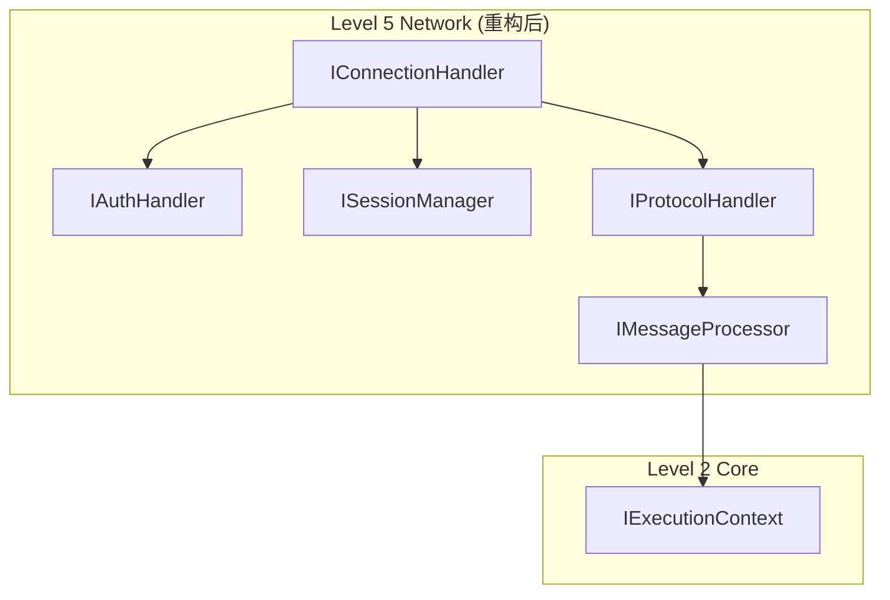
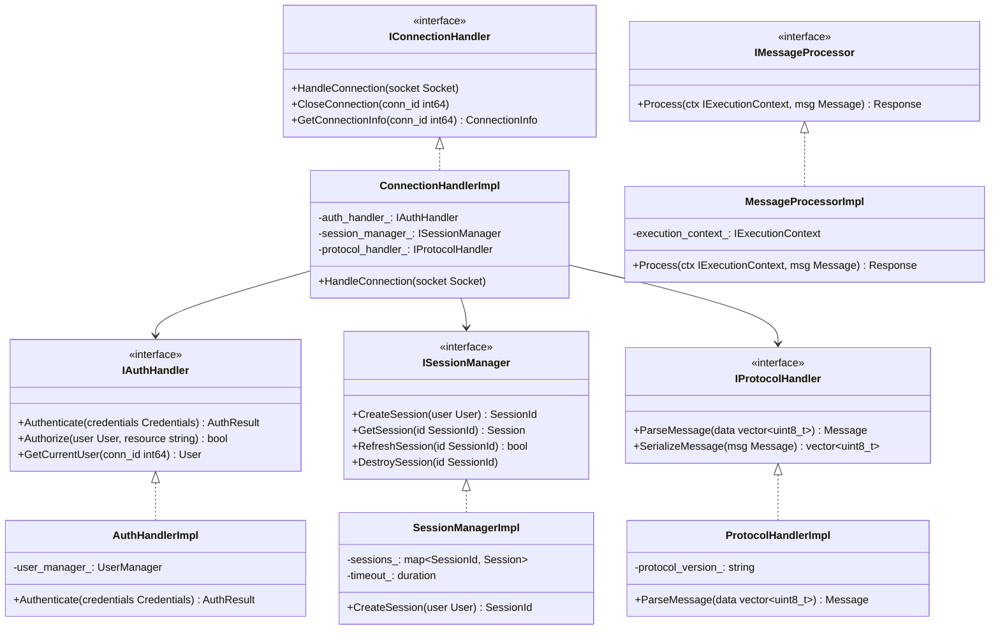

# Level 5 Network 重构架构设计规范

## 1. 概述

### 1.1 功能名称
Level 5 Network 模块拆分解耦重构

### 1.2 版本
1.0

### 1.3 日期
2026-02-02

### 1.4 作者
SQLCC AI 开发团队

### 1.5 状态
草稿

### 1.6 对应需求
REQ-NET-001, REQ-NET-002

---

## 2. 架构决策

### 2.1 决策列表

| 决策 ID | 决策内容 | 状态 |
|---------|---------|------|
| ADR-NET-001 | ConnectionHandler 拆分 | 待审批 |
| ADR-NET-002 | 消息处理器接口 | 待审批 |

---

## 3. 系统上下文



---

## 4. 组件架构

### 4.1 组件图



---

## 5. 接口定义

```cpp
// src/network/interfaces/connection_handler.h
#pragma once

#include <string>
#include <memory>

namespace sqlcc::network {

struct ConnectionInfo {
    int64_t id;
    std::string remote_address;
    std::chrono::timestamp connected_at;
    Protocol protocol;
};

class IConnectionHandler {
public:
    virtual ~IConnectionHandler() = default;
    virtual void HandleConnection(int64_t socket) = 0;
    virtual void CloseConnection(int64_t conn_id) = 0;
    virtual std::optional<ConnectionInfo> GetConnectionInfo(int64_t conn_id) = 0;
};

}  // namespace sqlcc::network
```

---

## 6. BUILD 配置

```bazel
# src/network/interfaces/BUILD.bazel
cc_library(
    name = "network_interfaces",
    hdrs = glob(["*.h"]),
    deps = [
        "//src/types:types",
        "//src/utils:utils",
    ],
    visibility = ["//src/network:all"],
)
```

---

## 7. 变更历史

| 版本 | 日期 | 变更内容 | 变更人 |
|------|------|---------|--------|
| 1.0 | 2026-02-02 | 初始设计 | SQLCC AI |
