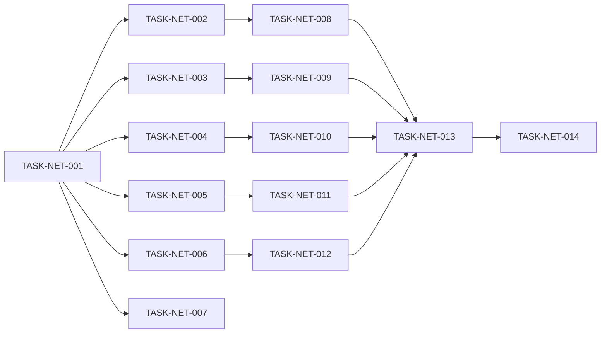

# Level 5 Network 重构实现任务清单

## 1. 概述

### 1.1 功能名称
Level 5 Network 模块拆分解耦重构

### 1.2 版本
1.0

### 1.3 日期
2026-02-02

### 1.4 作者
SQLCC AI 开发团队

### 1.5 状态
规划中

---

## 2. 里程碑

| 里程碑 | 目标日期 | 说明 |
|--------|----------|------|
| M1: 接口定义 | 2026-02-09 | 完成网络接口定义 |
| M2: 组件实现 | 2026-02-16 | 实现各组件 |
| M3: 集成测试 | 2026-02-23 | 集成测试验证 |

---

## 3. 任务列表

### 阶段 1: 接口定义

| ID | 任务 | 依赖 | 状态 | 估计时间 |
|----|------|------|------|----------|
| TASK-NET-001 | 创建网络接口目录 | 无 | 待处理 | 1h |
| TASK-NET-002 | 定义 IConnectionHandler | TASK-NET-001 | 待处理 | 2h |
| TASK-NET-003 | 定义 IAuthHandler | TASK-NET-001 | 待处理 | 2h |
| TASK-NET-004 | 定义 ISessionManager | TASK-NET-001 | 待处理 | 2h |
| TASK-NET-005 | 定义 IProtocolHandler | TASK-NET-001 | 待处理 | 2h |
| TASK-NET-006 | 定义 IMessageProcessor | TASK-NET-001 | 待处理 | 2h |
| TASK-NET-007 | 创建接口 BUILD.bazel | TASK-NET-001 | 待处理 | 1h |

### 阶段 2: 组件实现

| ID | 任务 | 依赖 | 状态 | 估计时间 |
|----|------|------|------|----------|
| TASK-NET-008 | 实现 ConnectionHandlerImpl | TASK-NET-002 | 待处理 | 4h |
| TASK-NET-009 | 实现 AuthHandlerImpl | TASK-NET-003 | 待处理 | 4h |
| TASK-NET-010 | 实现 SessionManagerImpl | TASK-NET-004 | 待处理 | 4h |
| TASK-NET-011 | 实现 ProtocolHandlerImpl | TASK-NET-005 | 待处理 | 4h |
| TASK-NET-012 | 实现 MessageProcessorImpl | TASK-NET-006 | 待处理 | 4h |

### 阶段 3: 集成测试

| ID | 任务 | 依赖 | 状态 | 估计时间 |
|----|------|------|------|----------|
| TASK-NET-013 | 创建组件测试 | TASK-NET-008~TASK-NET-012 | 待处理 | 6h |
| TASK-NET-014 | 运行集成测试 | TASK-NET-013 | 待处理 | 2h |

---

## 4. 依赖图

---

## 5. 变更历史

| 版本 | 日期 | 变更内容 | 变更人 |
|------|------|---------|--------|
| 1.0 | 2026-02-02 | 初始任务列表 | SQLCC AI |
