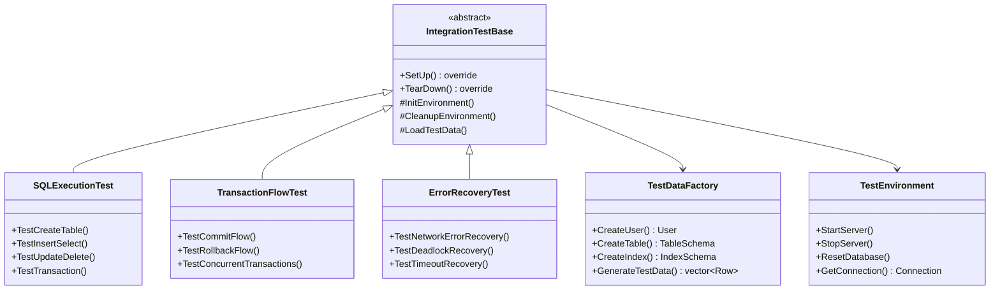

# Level 6 Integration 重构架构设计规范

## 1. 概述

### 1.1 功能名称
Level 6 Integration 模块测试重构

### 1.2 版本
1.0

### 1.3 日期
2026-02-02

### 1.4 作者
SQLCC AI 开发团队

### 1.5 状态
草稿

---

## 2. 集成测试框架设计

### 2.1 架构图



---

## 3. 测试场景定义

### 3.1 SQL 执行流程测试

```cpp
// tests/integration/sql_execution_test.cpp

class SQLExecutionTest : public IntegrationTestBase {
protected:
    void SetUp() override {
        IntegrationTestBase::SetUp();
        test_data_factory_ = std::make_unique<TestDataFactory>();
    }

    void TestCreateTable() {
        auto conn = GetConnection();
        auto result = conn->Execute(
            "CREATE TABLE test_table ("
            "  id INT PRIMARY KEY,"
            "  name VARCHAR(100),"
            "  created_at TIMESTAMP"
            ")"
        );

        EXPECT_EQ(result.status(), ExecutionStatus::OK);
        EXPECT_TRUE(VerifyTableExists("test_table"));
    }

    void TestInsertSelect() {
        auto conn = GetConnection();

        // Insert
        auto insert_result = conn->Execute(
            "INSERT INTO test_table VALUES (1, 'test', NOW())"
        );
        EXPECT_EQ(insert_result.status(), ExecutionStatus::OK);

        // Select
        auto select_result = conn->Execute(
            "SELECT * FROM test_table WHERE id = 1"
        );
        EXPECT_EQ(select_result.status(), ExecutionStatus::OK);
        EXPECT_EQ(select_result.rows().size(), 1);
    }
};
```

---

## 4. BUILD 配置

```bazel
# tests/integration/BUILD.bazel
cc_test(
    name = "sql_execution_test",
    srcs = ["sql_execution_test.cpp"],
    deps = [
        "//src/execution:execution",
        "//src/network:network",
        "//src/transaction:transaction_manager",
        "@com_google_googletest//:gtest_main",
    ],
    tags = ["integration"],
)

cc_test(
    name = "transaction_flow_test",
    srcs = ["transaction_flow_test.cpp"],
    deps = [
        "//src/transaction:transaction_manager",
        "@com_google_googletest//:gtest_main",
    ],
    tags = ["integration", "transaction"],
)
```

---

## 5. 变更历史

| 版本 | 日期 | 变更内容 | 变更人 |
|------|------|---------|--------|
| 1.0 | 2026-02-02 | 初始设计 | SQLCC AI |
