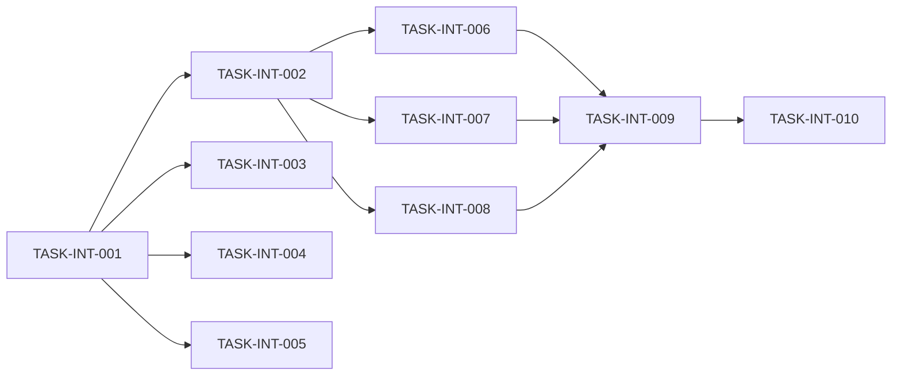

# Level 6 Integration 重构实现任务清单

## 1. 概述

### 1.1 功能名称
Level 6 Integration 模块测试重构

### 1.2 版本
1.0

### 1.3 日期
2026-02-02

### 1.4 作者
SQLCC AI 开发团队

---

## 2. 里程碑

| 里程碑 | 目标日期 | 说明 |
|--------|----------|------|
| M1: 框架基础 | 2026-02-09 | 完成测试框架基础 |
| M2: 测试场景 | 2026-02-16 | 实现测试场景 |
| M3: CI 集成 | 2026-02-23 | 集成到 CI/CD |

---

## 3. 任务列表

### 阶段 1: 框架基础

| ID | 任务 | 依赖 | 状态 | 估计时间 |
|----|------|------|------|----------|
| TASK-INT-001 | 创建集成测试目录 | 无 | 待处理 | 1h |
| TASK-INT-002 | 实现 IntegrationTestBase | TASK-INT-001 | 待处理 | 4h |
| TASK-INT-003 | 实现 TestDataFactory | TASK-INT-001 | 待处理 | 4h |
| TASK-INT-004 | 实现 TestEnvironment | TASK-INT-001 | 待处理 | 4h |
| TASK-INT-005 | 创建框架 BUILD.bazel | TASK-INT-002~TASK-INT-004 | 待处理 | 1h |

### 阶段 2: 测试场景

| ID | 任务 | 依赖 | 状态 | 估计时间 |
|----|------|------|------|----------|
| TASK-INT-006 | 实现 SQLExecutionTest | TASK-INT-002 | 待处理 | 6h |
| TASK-INT-007 | 实现 TransactionFlowTest | TASK-INT-002 | 待处理 | 6h |
| TASK-INT-008 | 实现 ErrorRecoveryTest | TASK-INT-002 | 待处理 | 6h |

### 阶段 3: CI 集成

| ID | 任务 | 依赖 | 状态 | 估计时间 |
|----|------|------|------|----------|
| TASK-INT-009 | 配置 CI 测试流水线 | TASK-INT-006~TASK-INT-008 | 待处理 | 2h |
| TASK-INT-010 | 生成测试报告 | TASK-INT-009 | 待处理 | 2h |

---

## 4. 依赖图

---

## 5. 变更历史

| 版本 | 日期 | 变更内容 | 变更人 |
|------|------|---------|--------|
| 1.0 | 2026-02-02 | 初始任务列表 | SQLCC AI |
