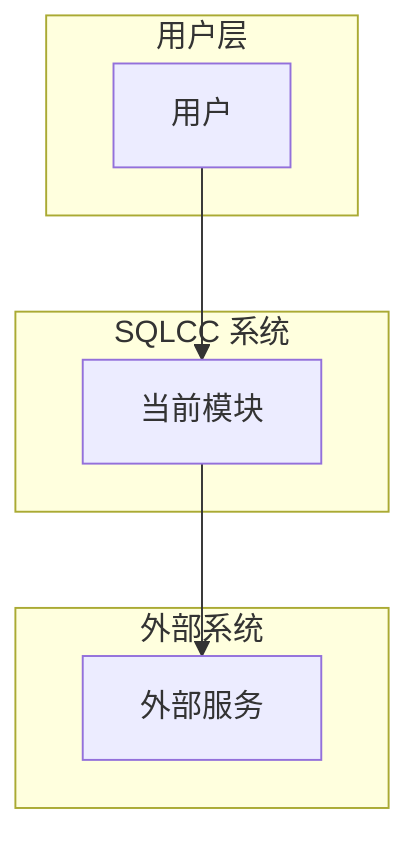
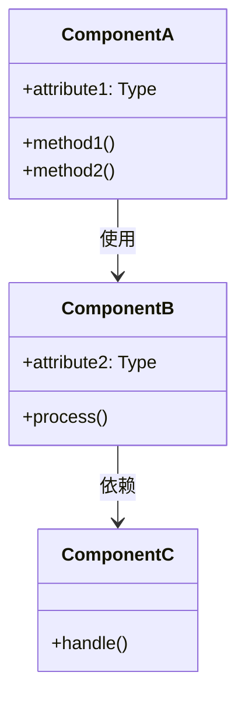
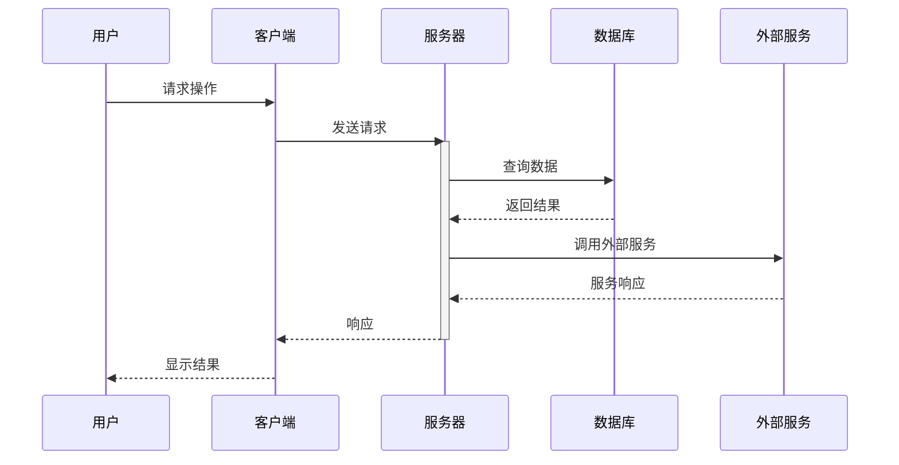
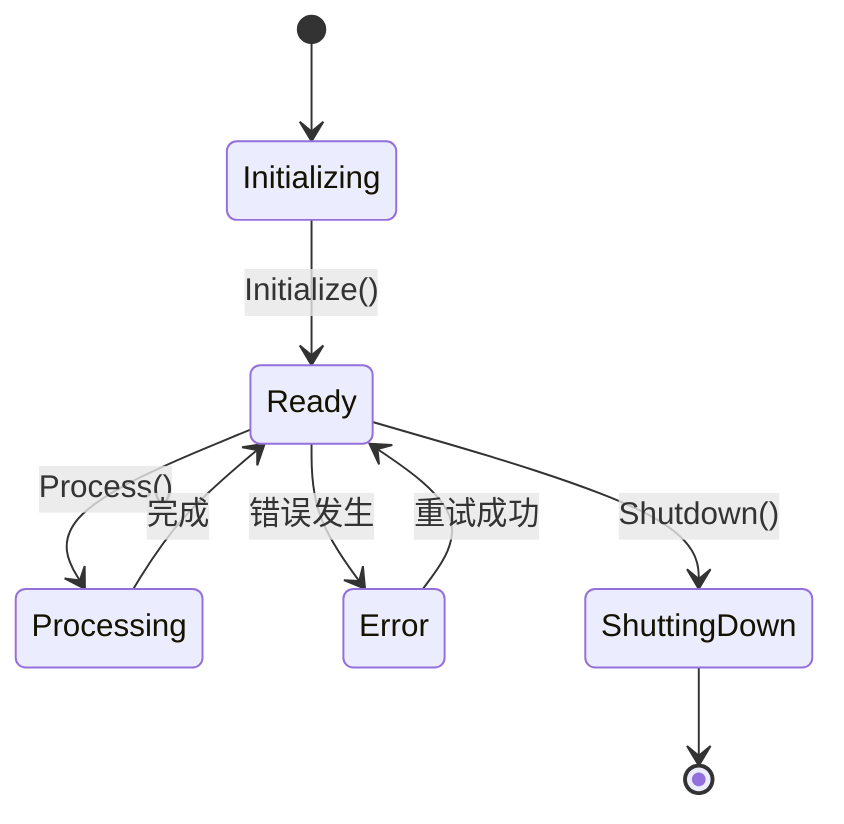

# 架构设计规范

## 1. 概述

### 1.1 功能名称
[功能名称]

### 1.2 版本
1.0

### 1.3 日期
2026-02-02

### 1.4 作者
[作者]

### 1.5 状态
[草稿/评审中/已批准/已实现]

### 1.6 对应需求
[REQ-001, REQ-002, ...]

---

## 2. 架构决策记录 (ADR)

### 2.1 决策列表

| 决策 ID | 决策内容 | 理由 | 状态 |
|---------|---------|------|------|
| ADR-001 | [决策描述] | [理由] | 已批准 |
| ADR-002 | [决策描述] | [理由] | 待审批 |

### 2.2 详细决策

#### ADR-001: [决策标题]

**问题**: [描述需要决策的问题]

**选项**:
- 选项 A: [描述]
  - 优点: [优点]
  - 缺点: [缺点]
- 选项 B: [描述]
  - 优点: [优点]
  - 缺点: [缺点]

**决策**: [选择的选项]

**影响**: [决策的影响]

---

## 3. 系统上下文

### 3.1 上下文图



### 3.2 输入输出

| 输入 | 来源 | 说明 |
|------|------|------|
| [输入1] | [来源] | [说明] |

| 输出 | 目标 | 说明 |
|------|------|------|
| [输出1] | [目标] | [说明] |

---

## 4. 组件架构

### 4.1 组件图



### 4.2 组件说明

#### ComponentA: [组件名称]

**职责**: [描述组件职责]

**接口**:

```cpp
class ComponentA {
public:
    virtual ~ComponentA() = default;

    // 初始化
    virtual bool Initialize() = 0;

    // 核心方法
    virtual Result Process(InputType input) = 0;

    // 状态查询
    virtual bool IsReady() const = 0;

protected:
    // 内部方法
    virtual void internalMethod() = 0;
};
```

**依赖**:
- [依赖组件]: [依赖类型]

#### ComponentB: [组件名称]

[同上格式]

---

## 5. 详细设计

### 5.1 数据结构

```cpp
// 数据结构定义

struct FeatureData {
    std::string id;              // 标识符
    std::string name;            // 名称
    std::vector<Value> values;   // 值列表
    std::chrono::timestamp created_at;  // 创建时间
};

class FeatureManager {
public:
    explicit FeatureManager(Config config);
    ~FeatureManager();

    // 禁止拷贝
    FeatureManager(const FeatureManager&) = delete;
    FeatureManager& operator=(const FeatureManager&) = delete;

    // 允许移动
    FeatureManager(FeatureManager&&) noexcept;
    FeatureManager& operator=(FeatureManager&&) noexcept;

private:
    std::unique_ptr<InternalData> data_;
};
```

### 5.2 接口定义

```cpp
// 接口定义 (放在头文件中)

class IFeature {
public:
    virtual ~IFeature() = default;

    // 生命周期
    virtual bool Initialize() = 0;
    virtual void Shutdown() = 0;

    // 核心功能
    virtual Result Process(const Request& req) = 0;
    virtual std::future<Result> ProcessAsync(const Request& req) = 0;

    // 状态管理
    virtual State GetState() const = 0;
    virtual std::string GetStatus() const = 0;
};
```

### 5.3 关键算法

#### 算法 1: [算法名称]

**输入**: [输入参数]
**输出**: [输出结果]

**步骤**:
1. [步骤1]
2. [步骤2]
3. [步骤3]

**复杂度**: [时间/空间复杂度]

**伪代码**:
```
function Algorithm(input):
    step1 = preprocess(input)
    step2 = process(step1)
    return step2
```

---

## 6. 交互设计

### 6.1 时序图



### 6.2 状态图



---

## 7. 依赖关系

### 7.1 内部依赖

| 源模块 | 目标模块 | 依赖类型 | 说明 |
|--------|---------|---------|------|
| [模块A] | [模块B] | [编译/运行时] | [说明] |

### 7.2 外部依赖

| 依赖项 | 版本 | 用途 | 许可证 |
|--------|------|------|--------|
| [依赖库] | [版本] | [用途] | [许可证] |

### 7.3 被依赖关系

| 源模块 | 目标模块 | 说明 |
|--------|---------|------|
| [当前模块] | [依赖模块] | [说明] |

---

## 8. BUILD 配置

```bazel
# src/module/BUILD.bazel
load("@rules_cc//cc:defs.bzl", "cc_library", "cc_test")

cc_library(
    name = "feature",
    srcs = ["feature.cpp"],
    hdrs = ["feature.h"],
    deps = [
        "//src/dependency:dependency",
        "@com_google_abseil//:absl_strings",
    ],
    copts = [
        "-std=c++20",
        "-stdlib=libc++",
        "-Wall",
        "-Wextra",
        "-Werror",
    ],
    visibility = ["//visibility:public"],
)

cc_test(
    name = "feature_test",
    srcs = ["feature_test.cpp"],
    deps = [
        ":feature",
        "@com_google_googletest//:gtest_main",
    ],
    tags = ["core"],
)
```

---

## 9. 测试策略

### 9.1 测试覆盖目标

| 类型 | 目标覆盖率 | 最低覆盖率 | 说明 |
|------|-----------|-----------|------|
| 单元测试 | 80% | 70% | 核心逻辑 |
| 集成测试 | 60% | 50% | 模块交互 |
| 边界测试 | 100% | 90% | 边界条件 |
| 异常测试 | 100% | 90% | 错误处理 |

### 9.2 测试用例

```cpp
// tests/module/feature_test.cpp

class FeatureTest : public testing::Test {
protected:
    void SetUp() override {
        feature_ = std::make_unique<Feature>();
    }

    void TearDown() override {
        feature_->Shutdown();
    }

    std::unique_ptr<Feature> feature_;
};

TEST_F(FeatureTest, NormalOperation) {
    EXPECT_TRUE(feature_->Initialize());
    auto result = feature_->Process(TestData::Normal());
    EXPECT_EQ(result.status(), Status::OK);
}

TEST_F(FeatureTest, EdgeCase) {
    EXPECT_TRUE(feature_->Initialize());
    auto result = feature_->Process(TestData::EdgeCase());
    EXPECT_EQ(result.status(), Status::OK);
}
```

---

## 10. 性能考虑

### 10.1 性能目标

| 指标 | 目标值 | 说明 |
|------|--------|------|
| 响应时间 | < 100ms | P99 |
| 吞吐量 | > 1000 QPS | |
| 内存使用 | < 100MB | |

### 10.2 性能优化策略

- [策略1]: [说明]
- [策略2]: [说明]

---

## 11. 安全性考虑

### 11.1 安全需求

- [需求1]: [说明]
- [需求2]: [说明]

### 11.2 安全措施

- [措施1]: [说明]
- [措施2]: [说明]

---

## 12. 评审检查表

| 检查项 | 状态 | 备注 |
|--------|------|------|
| [ ] 架构决策合理 | [通过/未通过] | |
| [ ] 类图准确 | [通过/未通过] | |
| [ ] 时序图完整 | [通过/未通过] | |
| [ ] 依赖关系清晰 | [通过/未通过] | |
| [ ] BUILD 配置正确 | [通过/未通过] | |
| [ ] 测试策略完整 | [通过/未通过] | |
| [ ] 性能考虑充分 | [通过/未通过] | |
| [ ] 安全措施到位 | [通过/未通过] | |

---

## 13. 评审签字

| 角色 | 姓名 | 日期 | 签字 |
|------|------|------|------|
| 架构师 | | | |
| 开发负责人 | | | |
| 测试负责人 | | | |

---

## 14. 变更历史

| 版本 | 日期 | 变更内容 | 变更人 | 审批人 |
|------|------|---------|--------|--------|
| 1.0 | 2026-02-02 | 初始设计 | [姓名] | [姓名] |
| 1.1 | [日期] | [变更内容] | [姓名] | [姓名] |
