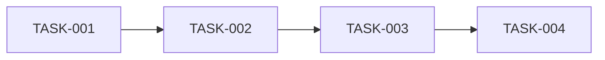

# SQLCC 多Agent并行开发规范 v1.0

**版本**: 1.0
**日期**: 2026-02-02
**适用范围**: AI Agent 团队并行开发

---

## 1. 概述

### 1.1 功能名称
多Agent并行开发协作规范

### 1.2 目标
实现多个AI Agent像人类团队一样并行工作，通过标准化的任务认领、进度更新、沟通机制来协调开发。

### 1.3 适用范围
- 单用户多会话Agent并行开发
- 团队协作开发（人类+AI混合）
- 分布式任务分解与执行

---

## 2. 核心概念

### 2.1 Agent角色定义

| 角色 | 标识 | 职责 | 权限 |
|------|------|------|------|
| **主Agent (Master)** | 🤖 | 任务分解、进度汇总、最终交付 | 全权限 |
| **开发Agent (Developer)** | 🔨 | 代码实现、单元测试 | 代码读写 |
| **测试Agent (Tester)** | 🧪 | 测试执行、覆盖率分析 | 测试执行 |
| **文档Agent (Documenter)** | 📝 | 文档编写、SDD维护 | 文档读写 |
| **评审Agent (Reviewer)** | 👀 | 代码评审、规范检查 | 只读+评论 |

### 2.2 任务状态机

```
                    ┌─────────────────────────────────────────────────────┐
                    │                   任务生命周期                        │
                    └─────────────────────────────────────────────────────┘

        ┌─────────┐     ┌─────────┐     ┌─────────┐     ┌─────────┐
        │  OPEN   │────▶│ CLAIMED │────▶│  WIP    │────▶│  DONE   │
        │  开放   │     │  已认领  │     │  进行中  │     │  完成   │
        └─────────┘     └─────────┘     └─────────┘     └─────────┘
              │               │               │               │
              │               │               │               │
              ▼               ▼               ▼               ▼
        ┌─────────┐     ┌─────────┐     ┌─────────┐     ┌─────────┐
        │ BLOCKED │     │ YIELDED │     │ PAUSED  │     │ FROZEN  │
        │  阻塞   │     │  让出   │     │  暂停   │     │  冻结   │
        └─────────┘     └─────────┘     └─────────┘     └─────────┘
```

### 2.3 状态定义

| 状态 | 英文 | 代码 | 说明 |
|------|------|------|------|
| 开放 | OPEN | `0` | 任务待认领，任何Agent可认领 |
| 已认领 | CLAIMED | `1` | 已被Agent认领，尚未开始 |
| 进行中 | WIP | `2` | 正在积极开发中 |
| 暂停 | PAUSED | `3` | 暂时停止，等待资源或依赖 |
| 让出 | YIELDED | `4` | Agent主动释放，需重新认领 |
| 阻塞 | BLOCKED | `5` | 等待前置任务或外部依赖 |
| 完成 | DONE | `6` | 任务完成，已验证 |
| 冻结 | FROZEN | `7` | 代码冻结，待发布 |

---

## 3. 任务模板

### 3.1 任务清单模板

```markdown
# 任务清单 [功能名称]

## 任务概览

| 属性 | 值 |
|------|-----|
| 需求ID | REQ-XXX-XXX |
| SDD版本 | v1.X |
| 创建日期 | YYYY-MM-DD |
| 截止日期 | YYYY-MM-DD |
| 主Agent | [@agent-id] |
| 优先级 | P0 / P1 / P2 |

## 任务列表

| ID | 任务名称 | 负责人 | 角色 | 状态 | 依赖 | 预计时间 | 实际时间 |
|----|---------|--------|------|------|------|----------|----------|
| TASK-001 | [任务名] | @agent-id | Developer | OPEN | - | 1h | |
| ... | ... | ... | ... | ... | ... | ... | ... |

## 依赖关系



## 进度跟踪

| 周次 | 已完成任务 | 累计进度 | 状态 |
|------|-----------|----------|------|
| Week 1 | TASK-001 | 25% | 🟢 进行中 |
| Week 2 | TASK-002, TASK-003 | 75% | 🟢 进行中 |
| Week 3 | TASK-004 | 100% | ✅ 完成 |

---

## 任务详情模板

### TASK-XXX: [任务名称]

**状态**: `OPEN` | `CLAIMED` | `WIP` | `PAUSED` | `YIELDED` | `BLOCKED` | `DONE`

**认领信息**:
- 认领Agent: [@agent-id]
- 认领时间: YYYY-MM-DD HH:MM:SS
- 开始时间: YYYY-MM-DD HH:MM:SS
- 预计完成: YYYY-MM-DD HH:MM:SS

**描述**:
> [任务描述]

**验收标准**:
- [ ] 验收标准1
- [ ] 验收标准2
- [ ] 验收标准3

**相关文件**:
- 源文件: `[路径]`
- 测试文件: `[路径]`
- 文档: `[路径]`

**依赖**:
- 前置任务: TASK-XXX
- 外部依赖: [依赖说明]

**检查点**:
| 检查点 | 状态 | 说明 |
|--------|------|------|
| 编译通过 | ⏳ | |
| 测试通过 | ⏳ | |
| 文档完成 | ⏳ | |
| 代码评审 | ⏳ | |

**进度更新**:
| 时间 | Agent | 操作 | 说明 |
|------|-------|------|------|
| HH:MM:SS | @agent-id | CLAIMED | 认领任务 |
| HH:MM:SS | @agent-id | WIP | 开始开发 |
| HH:MM:SS | @agent-id | DONE | 任务完成 |

**沟通记录**:
| 时间 | 发送者 | 接收者 | 内容 |
|------|-------|--------|------|
| HH:MM:SS | @agent-id | @all | [消息内容] |

---

## 任务认领记录

| 任务ID | 认领Agent | 认领时间 | 完成时间 | 状态 |
|--------|----------|----------|----------|------|
| TASK-001 | @agent-1 | 2026-02-02 10:00 | 2026-02-02 11:00 | DONE |
| TASK-002 | @agent-2 | 2026-02-02 10:00 | | WIP |
| ... | ... | ... | ... | ... |

---

## 沟通协调

### Agent间通信协议

#### 3.2 任务认领消息

```json
{
  "type": "TASK_CLAIM",
  "task_id": "TASK-001",
  "agent_id": "agent-developer-1",
  "timestamp": "2026-02-02T10:00:00Z",
  "message": "I claim TASK-001: [任务名]",
  "estimated_duration": "1h"
}
```

#### 3.3 进度更新消息

```json
{
  "type": "PROGRESS_UPDATE",
  "task_id": "TASK-001",
  "agent_id": "agent-developer-1",
  "timestamp": "2026-02-02T10:30:00Z",
  "status": "WIP",
  "progress_percent": 25,
  "message": "已完成接口定义，开始实现核心逻辑",
  "blockers": [],
  "next_steps": ["实现函数A", "实现函数B"]
}
```

#### 3.4 阻塞通知消息

```json
{
  "type": "BLOCKER_NOTIFICATION",
  "task_id": "TASK-002",
  "agent_id": "agent-developer-2",
  "timestamp": "2026-02-02T11:00:00Z",
  "blocked_by": ["TASK-001"],
  "message": "等待 TASK-001 完成依赖接口",
  "severity": "P1",
  "suggestion": "请 TASK-001 优先完成 [具体接口]"
}
```

#### 3.5 任务完成消息

```json
{
  "type": "TASK_COMPLETE",
  "task_id": "TASK-001",
  "agent_id": "agent-developer-1",
  "timestamp": "2026-02-02T11:00:00Z",
  "status": "DONE",
  "summary": "完成接口定义和核心实现",
  "files_created": ["src/xxx.cpp"],
  "files_modified": ["src/xxx.h"],
  "tests_added": ["tests/xxx_test.cpp"],
  "verification": {
    "compile": "SUCCESS",
    "test": "SUCCESS",
    "coverage": "95%"
  }
}
```

#### 3.6 协助请求消息

```json
{
  "type": "ASSISTANCE_REQUEST",
  "task_id": "TASK-003",
  "agent_id": "agent-developer-3",
  "timestamp": "2026-02-02T14:00:00Z",
  "request_type": "REVIEW/HELP/INFO",
  "subject": "[请求主题]",
  "description": "[详细描述]",
  "priority": "P0/P1/P2",
  "target_agent": "agent-reviewer-1",
  "status": "PENDING/RESOLVED"
}
```

### 3.7 沟通记录模板

```markdown
## 沟通记录

### [日期] YYYY-MM-DD

#### 消息 #001
- **发送者**: @agent-developer-1
- **接收者**: @all
- **时间**: HH:MM:SS
- **类型**: TASK_CLAIM / PROGRESS_UPDATE / BLOCKER_NOTIFICATION / ASSISTANCE_REQUEST
- **内容**: [消息内容]
- **关联任务**: TASK-XXX

#### 消息 #002
- **发送者**: @agent-reviewer-1
- **接收者**: @agent-developer-1
- **时间**: HH:MM:SS
- **类型**: ASSISTANCE_RESPONSE
- **内容**: [回复内容]
```

---

## 4. Agent工作流程

### 4.1 主Agent (Master) 流程

```
┌─────────────────────────────────────────────────────────────────────────┐
│                         主Agent工作流程                                   │
├─────────────────────────────────────────────────────────────────────────┤
│                                                                         │
│  ┌─────────────┐                                                        │
│  │   接收需求   │  从需求文档 (requirements.md) 解析需求                   │
│  └──────┬──────┘                                                        │
│         │                                                                │
│         ▼                                                                │
│  ┌─────────────┐    ┌─────────────────────────────────────────────┐    │
│  │   任务分解   │───▶│  1. 分析任务依赖关系                          │    │
│  │              │    │  2. 按技能分配Agent角色                       │    │
│  │  任务清单     │    │  3. 设置检查点和里程碑                        │    │
│  │  (tasks.md)  │    │  4. 定义验收标准                             │    │
│  └──────┬──────┘    └─────────────────────────────────────────────┘    │
│         │                                                                │
│         ▼                                                                │
│  ┌─────────────┐    ┌─────────────────────────────────────────────┐    │
│  │   启动Agent  │───▶│  1. 发送初始任务分配                         │    │
│  │              │    │  2. 设置通信频道                             │    │
│  │  CLAIM 消息  │    │  3. 启动心跳监控                             │    │
│  └──────┬──────┘    └─────────────────────────────────────────────┘    │
│         │                                                                │
│         ▼                                                                │
│  ┌─────────────┐    ┌─────────────────────────────────────────────┐    │
│  │   进度汇总   │◀───│  1. 接收各Agent进度更新                       │    │
│  │              │    │  2. 更新燃尽图                               │    │
│  │  监控协调    │    │  3. 检测阻塞并协调                           │    │
│  │              │    │  4. 重新分配失败任务                          │    │
│  └──────┬──────┘    └─────────────────────────────────────────────┘    │
│         │                                                                │
│         ▼                                                                │
│  ┌─────────────┐                                                        │
│  │   验证交付   │  确保所有任务完成，生成验证报告                          │
│  └─────────────┘                                                        │
│                                                                         │
└─────────────────────────────────────────────────────────────────────────┘
```

### 4.2 开发Agent (Developer) 流程

```
┌─────────────────────────────────────────────────────────────────────────┐
│                         开发Agent工作流程                                 │
├─────────────────────────────────────────────────────────────────────────┤
│                                                                         │
│  ┌─────────────┐    ┌─────────────────────────────────────────────┐    │
│  │   接收任务   │───▶│  1. 解析任务描述和验收标准                     │    │
│  │              │    │  2. 理解相关文件和上下文                      │    │
│  │ CLAIM 消息   │    │  3. 识别依赖任务                             │    │
│  └──────┬──────┘    └─────────────────────────────────────────────┘    │
│         │                                                                │
│         ▼                                                                │
│  ┌─────────────┐                                                        │
│  │   状态更新   │  发送 PROGRESS_UPDATE (状态: CLAIMED → WIP)           │
│  └──────┬──────┘                                                        │
│         │                                                                │
│         ▼                                                                │
│  ┌─────────────┐    ┌─────────────────────────────────────────────┐    │
│  │   任务实现   │───▶│  1. 按验收标准逐步实现                        │    │
│  │              │    │  2. 定期发送进度更新 (建议每30分钟)            │    │
│  │  代码编写    │    │  3. 遇到问题发送 BLOCKER_NOTIFICATION         │    │
│  └──────┬──────┘    └─────────────────────────────────────────────┘    │
│         │                                                                │
│         ▼                                                                │
│  ┌─────────────┐    ┌─────────────────────────────────────────────┐    │
│  │   自测验证   │───▶│  1. bazel build 编译                         │    │
│  │              │    │  2. bazel test 执行测试                      │    │
│  │  编译+测试   │    │  3. 检查覆盖率是否达标                        │    │
│  └──────┬──────┘    └─────────────────────────────────────────────┘    │
│         │                                                                │
│         ▼                                                                │
│  ┌─────────────┐    ┌─────────────────────────────────────────────┐    │
│  │   任务完成   │───▶│  1. 发送 TASK_COMPLETE 消息                  │    │
│  │              │    │  2. 附上验证结果 (编译/测试/覆盖率)           │    │
│  │ DONE 消息    │    │  3. 等待评审Agent确认                        │    │
│  └─────────────┘    └─────────────────────────────────────────────┘    │
│                                                                         │
└─────────────────────────────────────────────────────────────────────────┘
```

### 4.3 评审Agent (Reviewer) 流程

```
┌─────────────────────────────────────────────────────────────────────────┐
│                         评审Agent工作流程                                 │
├─────────────────────────────────────────────────────────────────────────┤
│                                                                         │
│  ┌─────────────┐    ┌─────────────────────────────────────────────┐    │
│  │   接收请求   │───▶│  1. 解析任务完成消息                          │    │
│  │              │    │  2. 获取变更文件列表                         │    │
│  │ REVIEW 请求  │    │  3. 检查验收标准                             │    │
│  └──────┬──────┘    └─────────────────────────────────────────────┘    │
│         │                                                                │
│         ▼                                                                │
│  ┌─────────────┐    ┌─────────────────────────────────────────────┐    │
│  │   代码评审   │───▶│  1. 代码风格检查 (CPP规范)                   │    │
│  │              │    │  2. 逻辑正确性检查                           │    │
│  │  质量保证    │    │  3. 安全性检查                               │    │
│  │              │    │  4. 性能影响评估                             │    │
│  └──────┬──────┘    └─────────────────────────────────────────────┘    │
│         │                                                                │
│         ▼                                                                │
│  ┌─────────────┐    ┌─────────────────────────────────────────────┐    │
│  │   发送反馈   │───▶│  1. 通过: 发送 APPROVE                       │    │
│  │              │    │  2. 需修改: 发送 CHANGE_REQUESTED            │    │
│  │ 评审结果     │    │  3. 阻塞: 发送 BLOCKER_NOTIFICATION          │    │
│  └──────┬──────┘    └─────────────────────────────────────────────┘    │
│                                                                         │
└─────────────────────────────────────────────────────────────────────────┘
```

---

## 5. 并行开发协调

### 5.1 任务并行度配置

```yaml
# .claude/parallel-config.yaml
parallel_development:
  # 最大并行Agent数
  max_concurrent_agents: 4

  # 任务分配策略
  assignment_strategy: "skill_based"  # skill_based / load_balanced / round_robin

  # 任务依赖检查
  dependency_check: true

  # 冲突检测
  conflict_detection: true

  # 心跳间隔 (秒)
  heartbeat_interval: 300

  # 进度更新间隔 (秒)
  progress_update_interval: 1800

# Agent角色配置
agents:
  - id: agent-developer-1
    role: Developer
    skills: ["cpp", "bazel", "storage"]
    max_tasks: 2
    availability: available

  - id: agent-developer-2
    role: Developer
    skills: ["sql", "parser", "execution"]
    max_tasks: 2
    availability: available

  - id: agent-tester-1
    role: Tester
    skills: ["gtest", "coverage", "benchmark"]
    max_tasks: 3
    availability: available

  - id: agent-documenter-1
    role: Documenter
    skills: ["markdown", "sdd", "docs"]
    max_tasks: 4
    availability: available
```

### 5.2 资源冲突检测

```python
# scripts/agent_collision_check.py
"""
资源冲突检测脚本
检测多个Agent是否同时修改同一文件
"""

def detect_file_conflicts(task_files: List[Dict]) -> List[Conflict]:
    """
    检测文件冲突
    返回冲突列表
    """
    conflicts = []
    file_map = {}

    for task in task_files:
        for file in task["files"]:
            if file in file_map:
                file_map[file].append(task)
            else:
                file_map[file] = [task]

    for file, tasks in file_map.items():
        if len(tasks) > 1:
            conflicts.append({
                "file": file,
                "tasks": [t["task_id"] for t in tasks],
                "severity": "HIGH" if len(tasks) > 2 else "MEDIUM",
                "resolution": "SEQUENTIAL / MERGE / REASSIGN"
            })

    return conflicts
```

### 5.3 进度同步机制

```bash
#!/bin/bash
# scripts/agent_progress_sync.sh

# 进度同步脚本
# 运行方式: ./scripts/agent_progress_sync.sh [task_file]

TASK_FILE=$1

echo "=== Agent 进度同步 ==="
echo "时间: $(date '+%Y-%m-%d %H:%M:%S')"
echo ""

# 解析任务状态
echo "当前任务状态:"
awk -F'|' '
    NR>1 && /TASK-/ {
        gsub(/^[ \t]+|[ \t]+$/, "", $2)
        gsub(/^[ \t]+|[ \t]+$/, "", $5)
        printf "  %s: %s\n", $2, $5
    }
' "$TASK_FILE"

echo ""
echo "并行任务数: $(grep -c 'WIP' "$TASK_FILE")"
echo "已完成任务数: $(grep -c 'DONE' "$TASK_FILE")"
echo "阻塞任务数: $(grep -c 'BLOCKED' "$TASK_FILE")"
```

---

## 6. 任务看板

### 6.1 看板状态视图

```markdown
## 任务看板 - [功能名称]

### TODO (待认领)
| ID | 任务 | 优先级 | 预计时间 | 认领Agent |
|----|------|--------|----------|-----------|
| TASK-001 | [任务名] | P0 | 1h | - |
| TASK-002 | [任务名] | P1 | 2h | - |
| ... | ... | ... | ... | ... |

### IN PROGRESS (进行中)
| ID | 任务 | 负责人 | 进度 | 预计完成 |
|----|------|--------|------|----------|
| TASK-003 | [任务名] | @agent-1 | 50% | 17:00 |
| TASK-004 | [任务名] | @agent-2 | 25% | 18:00 |
| ... | ... | ... | ... | ... |

### IN REVIEW (评审中)
| ID | 任务 | 作者 | 评审人 | 状态 |
|----|------|------|--------|------|
| TASK-005 | [任务名] | @agent-1 | @agent-reviewer-1 | PENDING |
| ... | ... | ... | ... | ... |

### DONE (已完成)
| ID | 任务 | 负责人 | 完成时间 |
|----|------|--------|----------|
| TASK-006 | [任务名] | @agent-2 | 2026-02-02 |
| ... | ... | ... | ... |

### BLOCKED (阻塞)
| ID | 任务 | 阻塞原因 | 解决方案 |
|----|------|----------|----------|
| TASK-007 | [任务名] | 等待 TASK-001 | TASK-001 优先 |
| ... | ... | ... | ... |
```

### 6.2 燃尽图数据

| 日期 | 剩余任务 | 累计完成 | 状态 |
|------|----------|----------|------|
| 2026-02-02 | 10 | 0 | 🟢 Day 1 |
| 2026-02-03 | 8 | 2 | 🟢 Day 2 |
| 2026-02-04 | 5 | 5 | 🟡 Day 3 |
| 2026-02-05 | 2 | 8 | 🟡 Day 4 |
| 2026-02-06 | 0 | 10 | ✅ Day 5 |

---

## 7. 沟通协议

### 7.1 消息类型定义

| 类型 | 方向 | 说明 |
|------|------|------|
| TASK_CLAIM | Agent → Master | 任务认领 |
| TASK_RELEASE | Agent → Master | 任务释放 |
| PROGRESS_UPDATE | Agent → Master | 进度更新 |
| BLOCKER_NOTIFICATION | Agent → Master | 阻塞通知 |
| TASK_COMPLETE | Agent → Master | 任务完成 |
| ASSISTANCE_REQUEST | Agent → Agent | 协助请求 |
| ASSISTANCE_RESPONSE | Agent → Agent | 协助响应 |
| REVIEW_REQUEST | Agent → Reviewer | 评审请求 |
| REVIEW_RESPONSE | Reviewer → Agent | 评审响应 |
| HEARTBEAT | Agent → Master | 心跳保活 |

### 7.2 消息格式规范

```json
{
  "message_id": "msg-uuid-xxx",
  "type": "PROGRESS_UPDATE",
  "version": "1.0",
  "timestamp": "2026-02-02T10:30:00Z",
  "sender": {
    "agent_id": "agent-developer-1",
    "role": "Developer",
    "session_id": "session-xxx"
  },
  "receiver": {
    "agent_id": "agent-master-1",
    "role": "Master"
  },
  "payload": {
    "task_id": "TASK-001",
    "status": "WIP",
    "progress": {
      "percent": 50,
      "checkpoints": ["接口定义", "核心实现"],
      "remaining": ["测试编写", "文档更新"]
    },
    "metrics": {
      "time_spent": "30m",
      "files_modified": 3,
      "lines_added": 150,
      "lines_removed": 20
    },
    "message": "已完成核心逻辑，正在编写测试",
    "blockers": [],
    "next_actions": ["完成测试用例", "更新文档"]
  },
  "metadata": {
    "priority": "NORMAL",
    "visibility": "ALL",
    "reply_to": null
  }
}
```

### 7.3 沟通频率规范

| 事件 | 触发条件 | 响应时间 |
|------|----------|----------|
| 任务认领 | 认领时 | 即时 |
| 进度更新 | 每30分钟或里程碑达成 | 5分钟内Master确认 |
| 阻塞通知 | 发现阻塞时 | 即时 |
| 任务完成 | 完成所有验收标准 | 即时 |
| 协助请求 | 需要帮助时 | 15分钟内响应 |
| 心跳 | 每5分钟 | - |
| 评审反馈 | 收到评审请求后 | 1小时内 |

---

## 8. 验收标准

### 8.1 任务验收清单

| 检查项 | 状态 | 说明 |
|--------|------|------|
| 编译通过 (bazel build) | ☐ | 0 错误 |
| 测试通过 (bazel test) | ☐ | 100% 通过 |
| 覆盖率达标 | ☐ | >= 90% (Level 1), >= 70% (Level 2+) |
| 代码评审通过 | ☐ | 无 BLOCKER |
| 文档完整 | ☐ | SDD文档已更新 |
| CHANGELOG 已更新 | ☐ | 版本号已升级 |

### 8.2 Agent验收清单

| 检查项 | 状态 | 说明 |
|--------|------|------|
| 任务状态正确 | ☐ | 按状态机流转 |
| 进度更新及时 | ☐ | 符合沟通频率 |
| 消息格式规范 | ☐ | 符合协议格式 |
| 阻塞及时上报 | ☐ | 无遗漏阻塞 |

---

## 9. 故障处理

### 9.1 Agent故障处理

| 故障类型 | 检测方式 | 处理措施 |
|----------|----------|----------|
| Agent超时 | 心跳缺失 (>10分钟) | 任务重新分配 |
| Agent失联 | 消息无响应 (>30分钟) | 任务释放，通知主Agent |
| Agent冲突 | 文件冲突检测 | 协调执行顺序或重新分配 |
| Agent重复 | 同一任务多次认领 | 按优先级保留，其他释放 |

### 9.2 任务恢复流程

```markdown
## 任务恢复流程

### 步骤 1: 检测故障
- 主Agent检测心跳超时
- 或用户报告Agent失联

### 步骤 2: 确认状态
- 检查任务最后状态
- 评估已完成工作量

### 步骤 3: 重新分配
- 发送 TASK_RECOVERY 消息给其他Agent
- 提供任务上下文和已完成工作

### 步骤 4: 继续执行
- 新Agent从最后状态继续
- 必要时回滚部分代码
```

---

## 10. 变更历史

| 版本 | 日期 | 变更内容 | 变更人 |
|------|------|---------|--------|
| 1.0 | 2026-02-02 | 初始版本 | SQLCC AI |

---

## 附录

### A. 常用命令

```bash
# 启动多Agent并行开发
./scripts/start_parallel_agents.sh --config .claude/parallel-config.yaml --task-file tasks.md

# 检查任务状态
./scripts/check_task_status.sh tasks.md

# 同步进度
./scripts/sync_progress.sh tasks.md

# 检测冲突
./scripts/detect_conflicts.sh tasks.md

# 生成看板
./scripts/generate_kanban.sh tasks.md
```

### B. 模板文件列表

| 文件 | 路径 | 用途 |
|------|------|------|
| 任务清单模板 | `docs/sdd/templates/task_list_template.md` | 主任务列表 |
| 任务详情模板 | `docs/sdd/templates/task_detail_template.md` | 单任务详情 |
| 沟通模板 | `docs/sdd/templates/communication_template.md` | 消息模板 |
| 看板模板 | `docs/sdd/templates/kanban_template.md` | 看板视图 |
| 验证模板 | `docs/sdd/templates/verification_template.md` | 验收确认 |

### C. Agent ID命名规范

| 角色 | ID格式 | 示例 |
|------|--------|------|
| Master | `agent-master-{n}` | agent-master-1 |
| Developer | `agent-developer-{n}` | agent-developer-1 |
| Tester | `agent-tester-{n}` | agent-tester-1 |
| Documenter | `agent-documenter-{n}` | agent-documenter-1 |
| Reviewer | `agent-reviewer-{n}` | agent-reviewer-1 |

---

**维护者**: SQLCC AI 开发团队
**最后更新**: 2026-02-02
**版本**: v1.0
