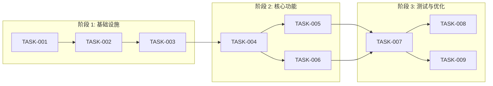

# 实现任务清单

## 1. 概述

### 1.1 功能名称
[功能名称]

### 1.2 版本
1.0

### 1.3 日期
2026-02-02

### 1.4 作者
[作者]

### 1.5 状态
[规划中/进行中/已完成]

### 1.6 对应设计
[design.md 版本号]

---

## 2. 里程碑

| 里程碑 | 目标日期 | 状态 | 说明 |
|--------|----------|------|------|
| M1: 基础设施 | 2026-02-09 | 待开始 | 完成基础框架 |
| M2: 核心功能 | 2026-02-16 | 待开始 | 实现核心逻辑 |
| M3: 测试完善 | 2026-02-23 | 待开始 | 补充测试用例 |
| M4: 发布准备 | 2026-03-02 | 待开始 | 文档和发布 |

---

## 3. 任务列表

### 阶段 1: 基础设施

| ID | 任务 | 依赖 | 负责人 | 状态 | 估计时间 | 实际时间 |
|----|------|------|--------|------|----------|----------|
| TASK-001 | [任务描述] | 无 | [姓名] | 待处理 | 2h | ___h |
| TASK-002 | [任务描述] | TASK-001 | [姓名] | 待处理 | 4h | ___h |
| TASK-003 | [任务描述] | TASK-002 | [姓名] | 待处理 | 2h | ___h |

### 阶段 2: 核心功能

| ID | 任务 | 依赖 | 负责人 | 状态 | 估计时间 | 实际时间 |
|----|------|------|--------|------|----------|----------|
| TASK-004 | [任务描述] | TASK-003 | [姓名] | 待处理 | 8h | ___h |
| TASK-005 | [任务描述] | TASK-004 | [姓名] | 待处理 | 4h | ___h |
| TASK-006 | [任务描述] | TASK-004 | [姓名] | 待处理 | 4h | ___h |

### 阶段 3: 测试与优化

| ID | 任务 | 依赖 | 负责人 | 状态 | 估计时间 | 实际时间 |
|----|------|------|--------|------|----------|----------|
| TASK-007 | [任务描述] | TASK-006 | [姓名] | 待处理 | 4h | ___h |
| TASK-008 | [任务描述] | TASK-007 | [姓名] | 待处理 | 2h | ___h |
| TASK-009 | [任务描述] | TASK-007 | [姓名] | 待处理 | 2h | ___h |

---

## 4. 任务详情

### TASK-001: [任务标题]

**描述**: [任务详细描述]

**验收标准**:
- [ ] 标准 1
- [ ] 标准 2
- [ ] 标准 3

**相关文件**:
- 源文件: `src/module/file.cpp`
- 头文件: `src/module/file.h`
- 测试: `tests/module/file_test.cpp`

**BUILD 目标**: `//src/module:feature`

**注意事项**:
- [注意事项1]
- [注意事项2]

**估计时间**: 2h
**实际时间**: ___h

**实际完成日期**: ___

**负责人签字**: ___

---

### TASK-002: [任务标题]

[同上格式]

---

## 5. 依赖图

---

## 6. 进度跟踪

### 燃尽图数据

| 日期 | 剩余任务数 | 累计完成 | 状态 |
|------|------------|----------|------|
| 2026-02-02 | 9 | 0 | 🟢 规划 |
| 2026-02-09 | 6 | 3 | 🟢 M1 预计完成 |
| 2026-02-16 | 3 | 6 | 🟡 M2 预计完成 |
| 2026-02-23 | 1 | 8 | 🟡 M3 预计完成 |
| 2026-03-02 | 0 | 9 | ⚪ M4 预计完成 |

### 周报摘要

| 周次 | 完成任务 | 遇到问题 | 下周计划 |
|------|----------|----------|----------|
| 第 1 周 | | | |
| 第 2 周 | | | |
| 第 3 周 | | | |

---

## 7. 风险与缓解

| 风险 ID | 风险 | 影响 | 概率 | 严重性 | 缓解措施 | 状态 |
|---------|------|------|------|--------|----------|------|
| RISK-001 | [风险1] | [影响] | [概率] | [严重性] | [措施] | [状态] |
| RISK-002 | [风险2] | [影响] | [概率] | [严重性] | [措施] | [状态] |

---

## 8. 资源需求

### 人员

| 角色 | 姓名 | 投入比例 | 时间段 |
|------|------|----------|--------|
| 开发 | [姓名] | 100% | [时间段] |
| 测试 | [姓名] | 50% | [时间段] |

### 环境

| 环境 | 需求 | 状态 |
|------|------|------|
| 开发环境 | [需求] | [就绪/未就绪] |
| 测试环境 | [需求] | [就绪/未就绪] |
| 预发布环境 | [需求] | [就绪/未就绪] |

---

## 9. 验收标准

### 功能验收

| 需求 ID | 验收标准 | 状态 |
|---------|---------|------|
| REQ-001 | [标准] | [待验证/已验证] |
| REQ-002 | [标准] | [待验证/已验证] |

### 质量验收

| 检查项 | 目标值 | 实际值 | 状态 |
|--------|--------|--------|------|
| 代码覆盖率 | >= 80% | ___% | [待检查/通过/未通过] |
| 测试通过率 | 100% | ___% | [待检查/通过/未通过] |
| 文档完整性 | 100% | ___% | [待检查/通过/未通过] |

---

## 10. 发布检查表

| 检查项 | 状态 | 备注 |
|--------|------|------|
| [ ] 所有测试通过 | [通过/未通过] | |
| [ ] 代码覆盖率达标 | [通过/未通过] | |
| [ ] 文档已更新 | [通过/未通过] | |
| [ ] CHANGELOG 已更新 | [通过/未通过] | |
| [ ] 代码评审已完成 | [通过/未通过] | |

---

## 11. 变更历史

| 版本 | 日期 | 变更内容 | 变更人 | 原因 |
|------|------|---------|--------|------|
| 1.0 | 2026-02-02 | 初始任务列表 | [姓名] | 新功能 |
| 1.1 | [日期] | [变更内容] | [姓名] | [原因] |
