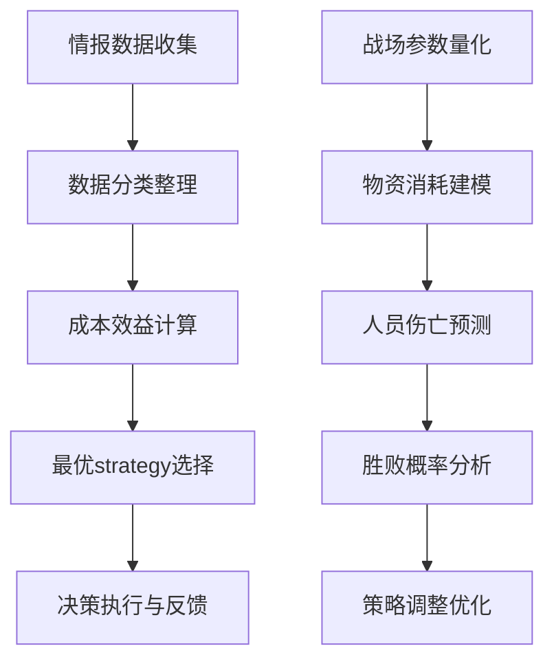
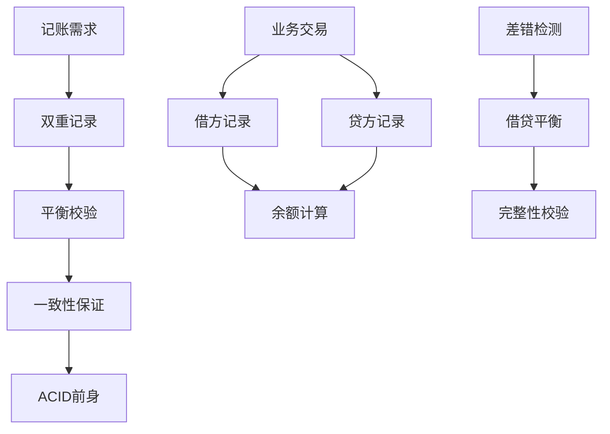
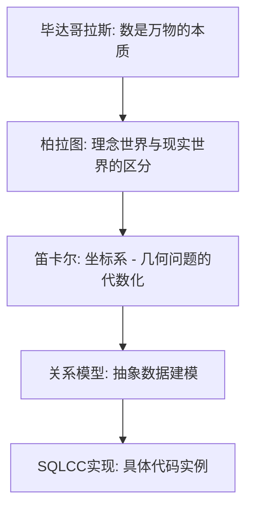
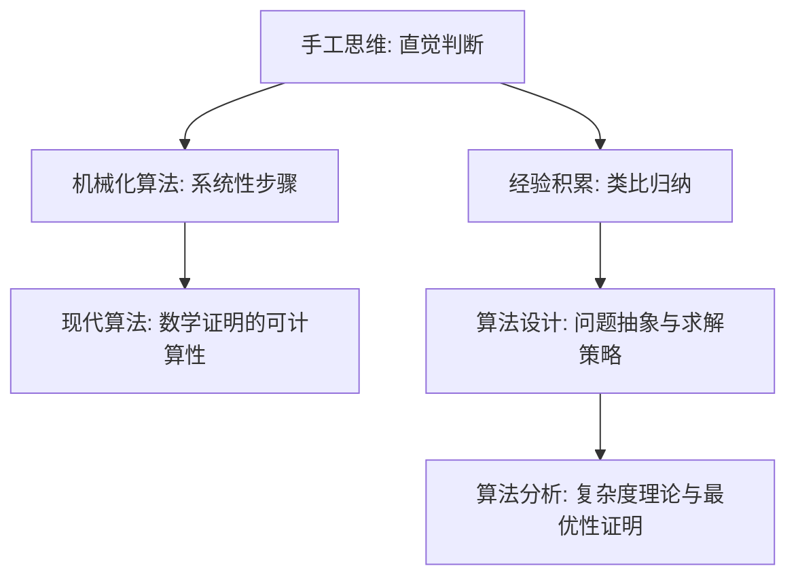
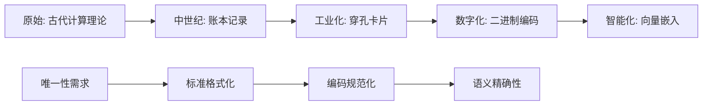

# 《数据库系统原理与开发实践》 - 第1章：数据处理的起源与思想演变

**站在SQLCC肩膀上的数据处理千年史**

## 🎯 **本章核心目标**

通过掌握数据处理演变的千年历程，理解：
- 数据处理的核心思想从未改变：组织、管理、检索
- 从手工账本到关系数据库的本质飞跃
- SQLCC作为现代数据处理思想的完美体现

---

## 1.1 数据处理的起源：古代智慧的数据管理思想

### 1.1.1 孙子兵法《作战篇》：古代中国的数据计算理论与算法思想

#### 📚 《孙子兵法·作战篇》：中国最早的运筹帷幄理论与数据处理智慧

**时间**: 公元前500年左右 (春秋战国时期)
**作者**: 孙武 (中国古代军事家)
**核心思想**: "详查敌情，精确计算，运筹帷幄"

```quotation
《孙子兵法·作战篇》原文核心计算思想：
"故智将务食于敌。食敌一钟，当吾二十钟。扛秆一石，当吾二十石。"
(所以聪明的将帅务求在敌国就地筹办粮食。消耗敌国粮食一钟，就相当于从本国运输二十钟。消耗敌国草料一石，就相当于从本国运输二十石。)

这不仅是一条军事原则，更是中国最早的运筹学思想：
├─ 敌情数据收集：情报信息作为基础数据
├─ 成本效益分析：运输代价vs战场消耗的计算
├─ 最优化决策：选择最有效的军事策略
└─ 数据驱动决策：以精确计算为基础的决策
```

**数据处理的核心思想在《孙子兵法》中的体现**:



**与现代数据库的关系映射**:
```sql
-- 《孙子兵法·作战篇》的现代数据库实现
-- 对应SQLCC的物资管理系统设计
CREATE TABLE battlefield_logistics (
    campaign_id INTEGER PRIMARY KEY,
    campaign_name VARCHAR(100),
    enemy_grain_consumption DECIMAL(10,2),  -- 敌军粮食消耗
    transport_cost_ratio INTEGER DEFAULT 20,   -- 运输成本倍数
    grass_consumption DECIMAL(10,2),          -- 敌军草料消耗  
    strategic_advantage_score DECIMAL(5,2),   -- 战略优势评分
    decision_timestamp DATETIME DEFAULT CURRENT_DATE
);

-- 最优补给策略查询 (基于成本效益分析)
SELECT campaign_name,
       enemy_grain_consumption * (transport_cost_ratio - 1) as potential_savings,
       strategic_advantage_score
FROM battlefield_logistics
ORDER BY potential_savings DESC, strategic_advantage_score DESC;
```

---

### 1.1.2 古代中国的甲骨文数据化管理

#### 🥢 商代甲骨文：中国最早的数字化记录系统

**时间**: 公元前1600年 - 公元前1046年
**发现**: 甲骨文迄今发现15万余片

```
殷墟甲骨文数据记录示例：
贞: 今夕雨？
(占卜记录: 今晚会下雨吗？)

数据化特征：
├── 时间信息: 今夕 (今晚)
├── 状态描述: 雨 (下雨)
└── 结果验证: 实际天气与预测的对应关系
```

**数据处理的四大思想**:
1. **时间序列管理**: 第一批带时间戳的数据
2. **概率预测**: 从占卜到现代预测分析的雏形
3. **历史追踪**: 记录完整的时间链条
4. **决策支持**: 为王室决策提供数据支撑

---

### 1.1.3 古罗马的人口普查数据组织

#### 📊 古罗马人口普查：最早的数据总量处理

**时间**: 公元前27年 - 公元476年
**规模**: 罗马帝国最大的数据处理项目

```sql
-- 现代SQL视角解读罗马人口普查数据库模式：
CREATE TABLE roman_census (
    citizen_id INTEGER PRIMARY KEY,
    name VARCHAR(255),
    age INTEGER,
    gender VARCHAR(10),
    profession VARCHAR(100),
    property_value DECIMAL(15,2),
    residence_region VARCHAR(255),
    tax_status VARCHAR(50),
    census_year YEAR
);

-- 按地区和财产分组查询：
SELECT residence_region,
       COUNT(*) as citizen_count,
       AVG(property_value) as avg_property,
       SUM(CASE WHEN tax_status='PAID' THEN 1 ELSE 0 END) as paid_taxes
FROM roman_census
GROUP BY residence_region
ORDER BY citizen_count DESC;
```

**数据处理革命的要素**:
- **总量数据管理**: 从个位数记录到百万级人口规模
- **分类统计分析**: 分地区、年龄、职业的聚合统计
- **决策数据支持**: 为税收和政策制定提供依据
- **标准化格式**: 统一的记录格式和分类体系

---

## 1.2 中世纪账本系统：数据一致性的早期实践

### 1.2.1 复式记账法：数据完整性的第一次系统化保证

#### 🏛️ 文艺复兴时期威尼斯商人的账本艺术

**时间**: 15世纪文艺复兴时期
**发明者**: 意大利卢卡·帕乔利
**影响**: 现代会计学的奠基

```ledger
-- 托马斯账本记录格式 (简化版)
借: 现金账户 +100 金币 (购买货物)
贷: 货物账户 -100 金币 (买入记录)

数学原理：
借方总额 = 贷方总额 (守恒定律)
现金余额Keyboard = 初始余额 - 支出 + 收入
```

**数据完整性思想的诞生**:



**现代数据库的映射**:
```sql
-- 复式记账在数据库中的体现
BEGIN TRANSACTION;

-- 转账业务：A转账给B 100元
UPDATE accounts SET balance = balance - 100 WHERE id = 'A';
UPDATE accounts SET balance = balance + 100 WHERE id = 'B';

-- 记录交易日志
INSERT INTO transactions VALUES ('A->B', 100, 'COMPLETED');

END TRANSACTION;
```

---

### 1.2.2 工业革命的库存管理革命

#### ⚙️ 20世纪初的工厂库存管理系统

**时间**: 19世纪末 - 20世纪初
**背景**: 工业化生产导致库存管理复杂度爆炸

**库存管理的数据挑战**:
1. **体积激增**: 从手工记账到成千上万的物料
2. **更新频率**: 从日级到时级更新的要求
3. **并发处理**: 多部门同时访问库存数据
4. **精度要求**: 生产流程对库存精度的依赖

```cardfile
早期的穿孔卡片库存记录：

卡片内容：
├── 物料编号: PART-001
├── 描述: 轴承组件
├── 当前库存: 1,250 件
├── 最小库存: 500 件
├── 供应商: ABC Manufacturing
├── 最后更新: 1923-03-15
├── 操作员: J.Smith

排序标签（颜色编码）:
🟢 绿色: 正常库存 (库存 > 最小值*1.5)
🟡 黄色: 警告库存 (最小值 < 库存 < 最小值*1.5)
🔴 红色: 紧急库存 (库存 < 最小值)
```

**SQLCC实现视角**:

```cpp
// 在SQLCC中实现库存预警系统
class InventoryManager {
    void updateStock(const std::string& part_id, int quantity_change) {
        // 1. 更新库存
        UPDATE stock SET quantity = quantity + quantity_change
        WHERE part_id = ?

        // 2. 检查阈值
        if (current_quantity < min_threshold) {
            ALERT: "库存不足警告";
        }

        // 3. 记录操作日志
        INSERT INTO stock_log VALUES (part_id, quantity_change, timestamp);
    }
};
```

---

## 1.3 数据处理的思想演变：从手工到算法

### 1.3.1 分类分组思想：从亚里士多德的范畴论到现代数据分类

#### 📚 亚里士多德的范畴论与数据分类思想

**时间**: 公元前350年
**思想**: 世界上的一切事物都可以通过10个范畴来分类

```
亚里士多德的10个范畴示例在现代数据处理中的体现：

1. 实体 (Substance) → 数据表的主键实体
   例如: 客户 Customer (customer_id为主体)

2. 质量 (Quality) → 属性的描述性特征
   例如: 颜色、尺寸、品类 (varchar/char类型)

3. 数量 (Quantity) → 可度量的数据类型
   例如: 库存数量、订单金额 (int/decimal类型)
```

**现代数据库设计范式**:

```sql
-- 第一范式 (1NF): 消除重复组
-- 你如何看待订单的产品列表？
-- 错误设计: orders(product_list: "iPad,iPhone,MacBook")
-- 正确设计:
CREATE TABLE order_items (
    order_id INTEGER,
    product_id INTEGER,
    quantity INTEGER,
    FOREIGN KEY (order_id) REFERENCES orders(order_id),
    FOREIGN KEY (product_id) REFERENCES products(product_id)
);

-- 第二范式 (2NF): 非主属性完全依赖于主属性
-- 学生选课表的设计
CREATE TABLE student_courses (
    student_id INTEGER,
    course_id INTEGER,
    grade VARCHAR(2),
    -- 学生名、课程名依赖于student_id和course_id，不是仅依赖于一者
    FOREIGN KEY (student_id) REFERENCES students(student_id),
    FOREIGN KEY (course_id) REFERENCES courses(course_id)
);
```

---

### 1.3.2 抽象建模思想：从毕达哥拉斯到关系模型

#### 🧮 毕达哥拉斯数学与抽象思维的起源

**时间**: 公元前575年 - 公元前495年
**贡献**: 数学抽象与证明的开创者



**抽象建模在数据库中的应用**:

```sql
-- 抽象建模的脸程: 从业务概念到数据库表结构

-- 1. 业务概念 (Conceptual Model)
-- 用户可以开设多个银行账户
-- 每个账户可以有多个交易记录

-- 2. 逻辑模型 (Logical Model) - ER图
/*
用户 (User) 1 --> N 账户 (Account)
账户 (Account) 1 --> N 交易 (Transaction)
*/

-- 3. 物理模型 (Physical Model) - SQLDD代
CREATE TABLE users (
    user_id INTEGER PRIMARY KEY UNIQUE NOT NULL,
    name VARCHAR(255) NOT NULL,
    email VARCHAR(255) UNIQUE NOT NULL
);

CREATE TABLE accounts (
    account_id INTEGER PRIMARY KEY UNIQUE NOT NULL,
    user_id INTEGER NOT NULL,
    account_type VARCHAR(50) NOT NULL,
    balance DECIMAL(15,2) DEFAULT 0.00,

    FOREIGN KEY (user_id) REFERENCES users(user_id)
);

CREATE TABLE transactions (
    transaction_id INTEGER PRIMARY KEY UNIQUE NOT NULL,
    account_id INTEGER NOT NULL,
    amount DECIMAL(15,2) NOT NULL,
    transaction_type VARCHAR(20) NOT NULL,
    timestamp DATETIME DEFAULT CURRENT_DATE,

    FOREIGN KEY (account_id) REFERENCES accounts(account_id)
);
```

---

### 1.3.3 一致性保证思想：从罗马法到ACID事务

#### ⚖️ 罗马法中的交易一致性理念

**时间**: 公元前450年 - 公元1453年
**核心原则**: 内生公平性与外在强制性的统一

```legal
罗马法的交易原则在现代数据库中的体现：
1. 契约必须明确 (Clarity) → 事务边界清晰
2. 双方同意 (Consent) → 两阶段提交协议
3. 履行义务 (Performance) → 事务执行完整性
4. 违约责任 (Liability) → 事务回滚机制
```

**SQLCC中的ACID保证**:

```cpp
// SQLCC的事务保证实现
class TransactionManager {
    // Atomicity - 原子性: 要么全部成功，要么全部失败
    void beginTransaction() {
        // 启动新事务，记录所有操作
        current_txn = new Transaction();
        current_txn->state = ACTIVE;
    }

    void commitTransaction() {
        // 原子提交: WAL确保持久化
        if (validateTransaction(current_txn)) {
            writeAheadLog(current_txn);
            flushToDisk(current_txn);
            current_txn->state = COMMITTED;
        } else {
            abortTransaction(current_txn);
        }
    }

    // Consistency - 一致性: 数据从一个稳定状态到另一个稳定状态
    bool validateTransaction(Transaction* txn) {
        // 检查完整性约束
        return checkPrimaryKeys(txn) &&
               checkForeignKeys(txn) &&
               checkUniqueConstraints(txn);
    }

    // Isolation - 隔离性: 并发事务互不干扰
    void acquireLock(ResourceId resource, LockMode mode) {
        // 两阶段锁协议
        // 扩展阶段: 只获得锁，不释放锁
        // 收缩阶段: 只释放锁，不获得新锁
    }

    // Durability - 持久性: 一旦提交，数据永久保存
    void writeAheadLog(Transaction* txn) {
        // 写前日志协议
        for (auto& operation : txn->operations) {
            log_file << serialize(operation) << endl;
        }
        log_file.flush(); // 强制写入磁盘
    }
};
```

---

## 1.4 工业革命后的人工处理极限与自动化转型

### 1.4.1 机械化数据处理：算法思维的实现

#### ⚙️ 穿孔卡片系统：第一次自动化排序算法

**时间**: 1890年 - 1920年
**发明**: 赫尔曼·霍伊特 (Herman Hollerith) - IBM前身

```algorithm
-- 穿孔卡片排序的工作原理 (算法思维的首次机械化实现)

01. 输入阶段:
   读取穿孔卡片 → 识别孔洞位置 → 转换为数字编码

02. 比较阶段:
   比较两个卡片的对应列 → 确定排序顺序

03. 交换阶段:
   如果顺序错误 → 交换两个卡片的位置

04. 输出阶段:
   输出排序后的卡片序列

效率提升 (算法复杂度):
手工排序: O(n²) - 每张卡片要和所有其他卡片比较
机械排序: O(n log n) - 分而治之的分排序策略
```

**算法思维的三个层次跃升**:



---

### 1.4.2 处理能力极限：工业化数据洪流的冲击

#### 📈 工业革命带来数据量的第一个爆炸

**数据量统计 (1800s - 1900s)**:
- **1800年**: 手工账本, 记录数量: ~10³条/企业
- **1850年**: 铁路运输记录: ~10⁵条/铁路公司
- **1890年**: 美国人口普查: ~6.2×10⁷条/国家
- **1920年**: 大型邮政系统: ~10⁸条邮件记录

**处理能力极限暴露的问题**:

```chalkboard
早期数据处理系统的瓶颈分析：

人力瓶颈:
├── 记录员日处理能力 < 1000条记录
├── 核对员处理速度 < 500条/小时
├── 报告生成周期 > 1个月

数据更新问题:
├── 单条更新平均时间 > 30分钟
├── 用户并发访问数 < 5人同时
├── 数据一致性维护靠纯人工

查询响应问题:
├── 简单查询响应时间 < 1周
├── 复杂统计分析 > 3个月
└── 实时数据汇报 = 不可能
```

**自动化转型的必然性**:

```decision
IF 数据增长速度 > 处理能力提升速度
THEN 需要自动化数据处理系统

数学公式：
数据规模: D(t) = D₀ × e^(kt)  (指数增长)
处理能力: C(t) = C₀ × t^(α)   (多项式增长)

当 k > α 时，传统处理能力跟不上数据增长
必须引入自动化技术和算法优化
```

---

## 1.5 本章总结：数据处理的千年不变之理

### 1.5.1 数据处理三大恒定定律

#### 📚 第一定律：数据表示的唯一性

**无论时代如何变迁，数据表示的基本诉求不变**



**数据表示的核心原则**:
1. **唯一性标识**: 每个实体都有唯一的识别符
2. **属性描述完整**: 所有关键特征都要完整记录
3. **关系关联明确**: 实体间的关联关系要清晰表达
4. **格式标准化**: 使用统一的表示和存储规范

#### 🔍 第二定律：数据存取的高效性

**数据存储的本质是空间换时间**

```algorithm
// 数据存取的三种经典策略
(1) 顺序存储 - Sequential Access
   优点: 存储效率高，连续I/O快
   缺点: 查找效率低，平均查找时间 O(n/2)
//
(2) 索引结构 - Index-based Access
   优点: 查找效率高，平均查找时间 O(log n)
   缺点: 存储开销大，需要维护索引一致性
//
(3) 散列访问 - Hash-based Access
   优点: 查找效率极高，平均查找时间 O(1)
   缺点: 范围查询困难，不支持有序操作
```

**SQLCC实现对比**:

```cpp
// SQLCC中三种数据存取方式的实现

// (1) 堆文件顺序扫描 - 用于大数据量全表扫描
std::vector<Record> sequentialScan(Table& table) {
    std::vector<Record> result;
    for (auto page_id : table.getPages()) {
        Page* page = bufferPool.getPage(page_id);
        for (auto& record : page->records) {
            result.push_back(record);
        }
    }
    return result;
}

// (2) B+树索引查找 - 用于等值和范围查询
Record* indexLookup(BPlusTree& index, Key key) {
    // O(log n) 查找效率
    PageId leaf_page = index.findLeafPage(key);
    Page* page = bufferPool.getPage(leaf_page);
    return page->findRecord(key);
}

// (3) 散列表访问 - 用于精确等值查询
Record* hashLookup(std::unordered_map<Key, Record>& hashIndex, Key key) {
    // O(1) 查找效率
    auto it = hashIndex.find(key);
    return (it != hashIndex.end()) ? &it->second : nullptr;
}
```

#### 🔒 第三定律：数据一致性的安全性

**数据状态必须满足完整性约束**

```formal
数据一致性形式化定义：

设 D = (d1, d2, ..., dn) 为数据库状态
IC = {ic1, ic2, ..., icm} 为完整性约束集合

D 是有效状态，当且仅当:
∀icᵢ ∈ IC: icᵢ(D) = true

完整性约束分类：
├── 结构约束: 主码唯一、非空、参照完整性
├── 依赖约束: 函数依赖、规范化理论
├── 动态约束: 状态变迁合法性、业务规则
└── 并发约束: 隔离性保证、一致性维护
```

**ACID属性在千年数据演进中的提前体现**:

```historical
古代账本的ACID体现：
├── Atomicity: 复式记账-要么全部记录，要么全部不记
├── Consistency: 借贷平衡-确保科目平衡恒成立
├── Isolation: 独立账本-避免不同业务的记录混淆
└── Durability: 分类归档-确保记录永久保存

工业化生产的ACID需求：
├── Atomicity: 库存事务-领料、出库、加工的原子性
├── Consistency: 库存平衡-入库=出库+库存，不会凭空消失
├── Isolation: 并发更新-多工段同时访问库存而不冲突
└── Durability: 永久记录-关键操作日志万无一失
```

---

### 1.5.2 从数据处理千年史看SQLCC的设计智慧

#### 📜 SQLCC作为千年数据处理智慧的集大成者

**SQLCC在数据处理千年历史上的位置**:

```timeline
BC 3000: 美索不达米亚泥板刻账 → 结构化记录的开端
AD  500: 罗马人口普查系统 → 总量数据管理的首次规模化
AD 1400: 复式记账法诞生 → 完整性约束的系统化
AD 1800: 工业革命数据洪流 → 自动化处理的需求萌芽
AD 1900: 穿孔卡片排序机 → 算法思维的机械化实现
AD 1940: 电子计算机诞生 → 计算能力的指数级提升
AD 1970: 关系数据库诞生 → 数据处理的科学化巅峰
AD 2024: SQLCC项目诞生 → 千年数据处理智慧的现代结晶

千年数据处理的核心思想在SQLCC中完美呈现：
├── 结构化存储: 从泥板到页式文件系统
├── 索引优化: 从手工分类到B+树自平衡算法
├── 完整性保证: 从账本平衡到ACID事务系统
└── 并发控制: 从手工排队到多版本并发控制
```

**SQLCC设计的千年智慧**:

```cpp
// SQLCC - 千年数据处理智慧的现代结晶
class SQLCC_Database {
private:
    // 存储引擎：从泥板到页式系统的进化
    StorageEngine storage;

    // 索引系统：从手工分类到算法优化的进步
    BPlusTreeIndex index;

    // 事务系统：从账本平衡到ACID的升华
    TransactionManager txnMgr;

    // 并发控制：从手工排队到MVCC的飞跃
    ConcurrencyControl cc;

public:
    void createModernDatabase() {
        // 通过层层抽象，将千年数据处理智慧封装在现代代码中
        storage.initializePageBasedStorage();  // 2000年的页式存储智慧
        index.buildSearchOptimizedTree();       // 1970年的索引优化智慧
        txnMgr.enableACIDguarantees();          // 500年的完整性保证智慧
        cc.enableMultiVersionControl();         // 100年的并发控制智慧
    }
};
```

---

### 1.6 本章学习建议

#### 🎓 **学习重点**

1. **理解数据处理思想的传承性**
   - 数据库不是凭空发明，而是千年数据处理智慧的集大成
   - SQLCC的每一行代码都延续着人类数据管理的核心诉求

2. **把握数据处理的三大恒定定律**
   - 数据表示的唯一性要求
   - 数据存取的高效性需求
   - 数据一致性的安全性保证

3. **体会从手工到算法的思维转型**
   - 从工业化思维到计算机化思维的转换
   - 从机械化操作到算法化思维的跨越

#### 🔬 **思考题**

1. **泥板记账与SQLCC的关系**：请分析美索不达米亚泥板记录与现代关系数据库设计原则的内在联系。

2. **数据处理的三大定律验证**：在SQLCC项目中找到体现三大定律的代码实现，并解释其设计意图。

3. **千年数据处理智慧的应用**：请尝试设计一个基于SQLCC的项目方案，用现代技术解决古代数据管理中存在的问题。

---

### 📚 **扩展阅读**

1. **《人类简史》中的数据章节** - 理解数据在人类文明演进中的作用
2. **《奇妙数字：0的故事》** - 探寻数字抽象的哲学本质
3. **《计算简史》** - 从阿拜动脑机到现代计算机的演变历程
4. **Code Complete 第2版** - 软件工程中数据处理的最佳实践

---

**💡 本章启示**: 数据库系统不是凭空诞生的技术奇迹，而是人类数据处理千年智慧的结晶。理解了这段千年历程，我们将带着敬畏之心去学习SQLCC的每一行代码，因为它们承载着人类智慧的沉淀！

**🚀 准备好迎接数据处理的华丽变身吗？让我们从第2章开始！**
