# 《数据库系统原理与开发实践》 - 第5章：DBMS总体架构设计与核心组件实现

## 引言

数据库管理系统作为现代信息系统的核心基础设施，其架构设计与实现质量直接决定了企业数据管理的效能与可靠性。本章从工程实现的角度，系统阐述数据库管理系统的总体架构设计思想、核心组件实现原理，以及不同数据库使用角色的需求分析与实现机制。通过深入剖析DBMS内部工作机制，读者将建立起对数据库系统整体架构的深刻理解，为后续的数据库设计、优化与开发工作奠定坚实基础。

## 5.1 从需求出发的DBMS架构设计方法论

### 5.1.1 多角色视角下的数据库系统需求分析

数据库系统的设计必须充分考虑不同类型用户的使用需求，这种差异化的需求分析直接决定了系统架构的设计方向。

#### 数据库管理员（DBA）的核心需求

数据库管理员承担着数据库系统的整体运维管理职责，其需求主要体现在系统级的管控能力上：

1. **系统安全管理需求**
   - 用户身份认证与访问控制机制
   - 细粒度权限分配与回收功能
   - 安全审计与合规性检查能力
   - 数据加密与脱敏处理支持

2. **系统运维保障需求**
   - 自动化备份与恢复机制
   - 性能监控与故障诊断工具
   - 资源配置与容量规划支持
   - 系统升级与版本管理能力

#### 数据库开发人员的技术需求

数据库开发人员关注如何高效地实现业务逻辑，其需求主要集中在数据建模与操作层面：

1. **数据结构定义需求**
   - 灵活的数据类型支持
   - 完整的约束定义机制
   - 索引与存储参数配置
   - 数据库对象生命周期管理

2. **数据操作处理需求**
   - 高效的数据增删改查接口
   - 复杂业务逻辑的实现支持
   - 事务处理与并发控制
   - 查询性能优化机制

#### 业务用户的功能需求

业务用户作为系统的最终使用者，其需求主要体现在易用性与功能性方面：

1. **数据访问需求**
   - 直观的数据查询界面
   - 灵活的查询条件组合
   - 多样化的结果展示方式
   - 批量数据处理能力

2. **业务操作需求**
   - 简化的数据录入流程
   - 业务规则自动执行
   - 实时数据更新反馈
   - 操作错误预防与恢复

### 5.1.2 SQL语言分类的体系化演进

基于不同用户角色的需求分析，SQL语言在演进过程中自然形成了四个主要类别，每个类别都有其特定的设计目标和使用场景。

#### 数据控制语言（DCL）的安全管理体系

DCL的设计目标是建立完善的数据库安全控制机制，其核心功能包括：

```sql
-- 用户管理范式
CREATE USER username IDENTIFIED BY password;
ALTER USER username ACCOUNT LOCK/UNLOCK;
DROP USER username;

-- 权限控制范式  
GRANT privilege_type ON database_object TO user_or_role;
REVOKE privilege_type ON database_object FROM user_or_role;

-- 角色管理范式
CREATE ROLE role_name;
GRANT role_name TO user_name;
```

在工程实现上，DCL命令通过权限验证模块、安全策略引擎和审计日志系统共同协作，构建了多层次的安全防护体系。

#### 数据定义语言（DDL）的元数据管理机制

DDL负责数据库对象的定义和管理，其实现基于元数据管理子系统：

```sql
-- 数据库对象创建范式
CREATE TABLE table_name (
    column1 datatype [constraints],
    column2 datatype [constraints],
    ...
    [table_constraints]
);

-- 对象修改范式
ALTER TABLE table_name 
ADD column_name datatype |
MODIFY column_name new_datatype |
DROP COLUMN column_name;

-- 对象删除范式
DROP OBJECT_TYPE object_name [CASCADE | RESTRICT];
```

DDL的执行涉及语法解析、语义检查、元数据更新和存储结构创建等多个处理阶段，需要保证操作的原子性和一致性。

#### 数据操作语言（DML）的事务处理架构

DML关注数据的增删改操作，其实现依赖于事务管理机制：

```sql
-- 数据操作基本范式
INSERT INTO table_name (columns) VALUES (values);
UPDATE table_name SET column = value WHERE conditions;
DELETE FROM table_name WHERE conditions;

-- 事务控制范式
BEGIN TRANSACTION;
-- 系列DML操作
COMMIT | ROLLBACK;
```

DML的实现需要协调存储引擎、锁管理器、日志系统和恢复管理器等多个组件，确保满足ACID特性要求。

#### 数据查询语言（DQL）的查询处理流水线

DQL专注于数据检索，其处理过程构成了复杂的查询执行流水线：

```sql
-- 查询语句完整结构
SELECT [DISTINCT] select_list
FROM table_sources
[WHERE search_condition]
[GROUP BY group_by_expression]
[HAVING search_condition]
[ORDER BY order_expression [ASC | DESC]];

-- 高级查询特性
WITH cte_name AS (subquery)
SELECT ... FROM cte_name JOIN ... ON ...;
```

查询处理包括解析、验证、优化、执行等多个阶段，每个阶段都有专门的算法和数据结构支持。

### 5.1.3 从语言分类到系统架构的映射关系

SQL语言的分类直接影响了DBMS的模块化架构设计，形成了清晰的职责分离和接口规范。

#### 层次化架构的功能映射

现代DBMS普遍采用层次化架构设计，各层次与SQL语言类别存在明确的对应关系：

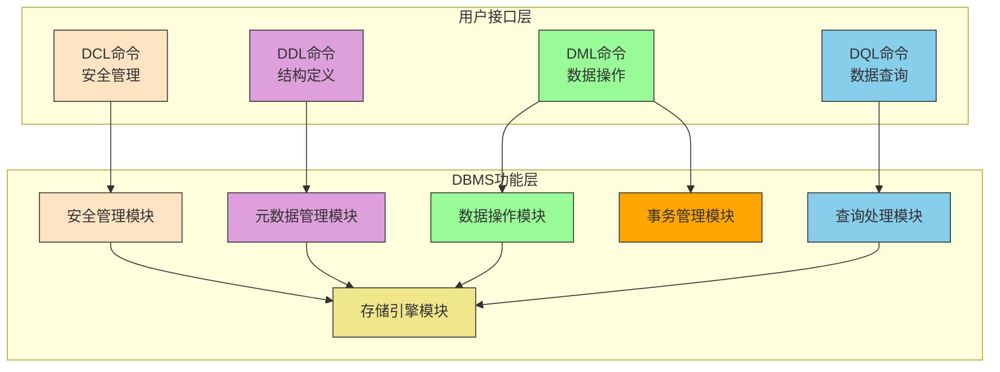

1. **接口适配层**
   - 负责接收和解析各类SQL命令
   - 提供统一的命令分发接口
   - 实现用户会话管理和连接池

2. **查询处理层** 
   - 专门处理DQL命令的解析与优化
   - 生成最优的查询执行计划
   - 管理查询执行期间的系统资源

3. **事务处理层**
   - 处理DML命令的事务管理
   - 实现并发控制和恢复机制
   - 保证数据操作的ACID特性

4. **存储管理层**
   - 执行DDL命令的存储结构管理
   - 管理数据文件的组织与访问
   - 实现缓冲区管理和索引维护

5. **安全管理层**
   - 处理DCL命令的权限管理
   - 实现用户认证和访问控制
   - 维护审计日志和安全策略

#### 模块化设计的工程优势

这种基于功能划分的模块化设计带来了显著的工程优势：

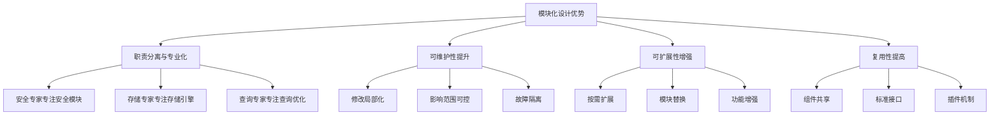

1. **功能内聚性**
   每个模块专注于特定功能的实现，代码维护性和可测试性显著提升。

2. **接口标准化**
   模块间通过明确定义的接口进行通信，降低了系统复杂度。

3. **可扩展性**
   新功能的添加或现有功能的修改可以局限在特定模块内进行。

4. **技术异构性**
   不同模块可以采用最适合的技术栈实现，如存储引擎的可插拔架构。

## 5.2 DBMS对计算机科学各领域的依赖与集成

数据库管理系统作为复杂的软件系统，其设计与实现深度依赖于计算机科学的多个基础学科，同时也对这些学科的发展产生了重要推动作用。

### 5.2.1 操作系统层面的依赖与协同

DBMS与操作系统之间存在深度的协同关系，操作系统为DBMS提供了基础的运行环境和支持服务。

#### 进程与线程管理

现代DBMS普遍采用多进程或多线程架构来支持并发访问，这依赖于操作系统提供的进程管理能力：

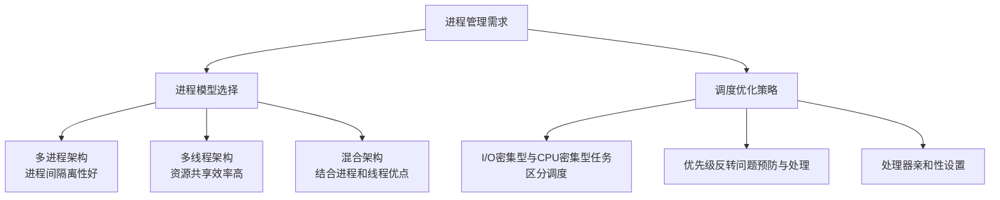

1. **进程模型选择**
   - 多进程架构：进程间隔离性好，但上下文切换开销大
   - 多线程架构：资源共享效率高，但需要复杂的同步机制
   - 混合架构：结合进程和线程的优点，实现灵活的并发控制

2. **调度优化策略**
   - I/O密集型与CPU密集型任务的区分调度
   - 优先级反转问题的预防与处理
   - 处理器亲和性设置以提升缓存命中率

#### 内存管理机制

DBMS的内存管理需要与操作系统虚拟内存系统紧密配合：

1. **缓冲池管理**
   - 基于LRU、Clock等算法的页面替换策略
   - 预读机制与缓存预热优化
   - 大页内存支持以减少TLB缺失

2. **内存映射技术**
   - 文件映射内存实现零拷贝I/O
   - 共享内存支持多进程间数据交换
   - 内存锁定防止关键页面被换出

#### 文件系统优化

DBMS在文件系统层面进行大量优化以适应数据库工作负载：

1. **文件组织策略**
   - 表空间与数据文件的逻辑映射
   - 段空间管理的自动扩展机制
   - 文件格式的列存储与行存储选择

2. **I/O路径优化**
   - 直接I/O绕过操作系统缓存
   - 异步I/O提升并发处理能力
   - I/O调度算法的针对性优化

### 5.2.2 算法与数据结构的核心支撑

DBMS的性能在很大程度上依赖于高效的算法和精心设计的数据结构。

#### 索引结构的算法实现

索引是数据库性能的关键，各种索引结构基于不同的算法思想：

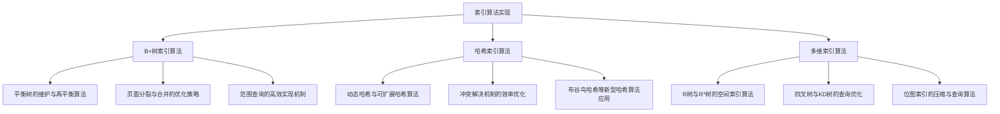

1. **B+树索引算法**
   - 平衡树的维护与再平衡算法
   - 页面分裂与合并的优化策略
   - 范围查询的高效实现机制

2. **哈希索引算法**
   - 动态哈希与可扩展哈希算法
   - 冲突解决机制的效率优化
   - 布谷鸟哈希等新型哈希算法应用

3. **多维索引算法**
   - R树与R*树的空间索引算法
   - 四叉树与KD树的查询优化
   - 位图索引的压缩与查询算法

#### 查询处理算法

查询处理涉及多种经典算法的应用与优化：

1. **连接算法族**
   - 嵌套循环连接的自适应优化
   - 排序合并连接的外部排序算法
   - 哈希连接的动态分区策略

2. **聚合算法优化**
   - 流式聚合与哈希聚合的选择策略
   - 分布式环境下的聚合下推优化
   - 近似聚合算法的误差控制

3. **查询优化算法**
   - 基于动态规划的最优计划搜索
   - 遗传算法在复杂查询优化中的应用
   - 机器学习驱动的代价估计改进

### 5.2.3 计算机网络与分布式系统集成

现代DBMS普遍支持分布式部署和网络访问，这要求深度的网络技术集成。

#### 分布式数据库架构

分布式DBMS基于计算机网络技术构建统一的数据访问视图：

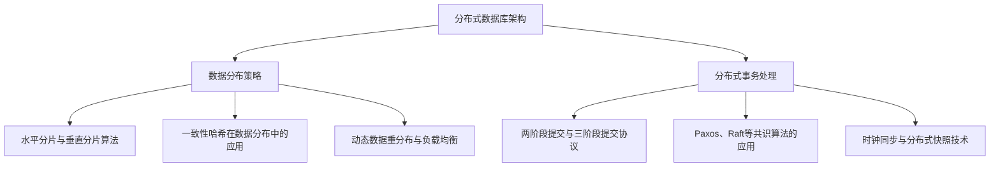

1. **数据分布策略**
   - 水平分片与垂直分片算法
   - 一致性哈希在数据分布中的应用
   - 动态数据重分布与负载均衡

2. **分布式事务处理**
   - 两阶段提交与三阶段提交协议
   - Paxos、Raft等共识算法的应用
   - 时钟同步与分布式快照技术

#### 网络通信优化

数据库网络通信需要专门的优化策略：

1. **协议优化技术**
   - 自定义二进制协议减少序列化开销
   - 数据压缩与批量传输机制
   - 连接复用与流水线请求处理

2. **高可用网络架构**
   - 负载均衡与故障转移机制
   - 多活数据中心的网络拓扑设计
   - 网络分区检测与恢复策略

### 5.2.4 软件工程原则在DBMS中的应用

DBMS作为大型复杂软件系统，其开发过程充分体现了软件工程的原则和方法。

#### 模块化设计与接口抽象

DBMS通过模块化设计实现系统的可维护性和可扩展性：

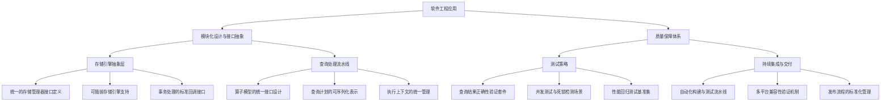

1. **存储引擎抽象层**
   - 统一的存储管理器接口定义
   - 可插拔存储引擎支持
   - 事务处理的标准回调接口

2. **查询处理流水线**
   - 算子模型的统一接口设计
   - 查询计划的可序列化表示
   - 执行上下文的统一管理

#### 质量保障体系

DBMS的质量保障需要系统化的工程方法：

1. **测试策略**
   - 查询结果正确性验证套件
   - 并发测试与死锁检测场景
   - 性能回归测试基准集

2. **持续集成与交付**
   - 自动化构建与测试流水线
   - 多平台兼容性验证机制
   - 发布流程的标准化管理

## 5.3 DBMS核心组件的工程实现

### 5.3.1 查询处理组件的实现架构

查询处理器是DBMS的核心组件，负责将SQL查询转换为高效的可执行计划。

#### 查询解析与验证

查询处理的第一阶段是语法解析和语义验证：

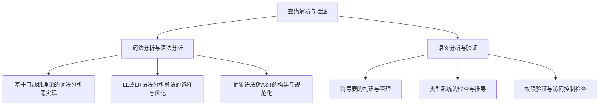

1. **词法分析与语法分析**
   - 基于自动机理论的词法分析器实现
   - LL或LR语法分析算法的选择与优化
   - 抽象语法树（AST）的构建与规范化

2. **语义分析与验证**
   - 符号表的构建与管理
   - 类型系统的检查与推导
   - 权限验证与访问控制检查

#### 查询优化器架构

查询优化器是查询处理器中最复杂的组件：

1. **逻辑优化阶段**
   - 查询重写与等价变换规则
   - 子查询优化与表达式下推
   - 视图合并与谓词推导

2. **物理优化阶段**
   - 基于代价的访问路径选择
   - 连接顺序的动态规划求解
   - 并行执行计划的生成策略

#### 查询执行引擎

执行引擎负责将优化后的查询计划转换为实际的数据操作：

1. **迭代模型实现**
   - Volcano迭代模型的工程实现
   - 物化策略与流水线执行的权衡
   - 向量化执行与编译执行优化

2. **资源管理机制**
   - 内存配额与使用监控
   - 执行进度的跟踪与报告
   - 查询终止与资源回收

### 5.3.2 事务管理组件的实现机制

事务管理器保证数据库操作的ACID特性，是DBMS可靠性的关键保障。

#### 并发控制实现

并发控制机制确保事务的隔离性：

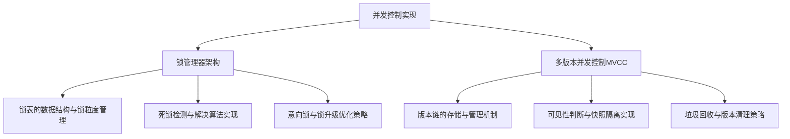

1. **锁管理器架构**
   - 锁表的数据结构与锁粒度管理
   - 死锁检测与解决算法实现
   - 意向锁与锁升级优化策略

2. **多版本并发控制（MVCC）**
   - 版本链的存储与管理机制
   - 可见性判断与快照隔离实现
   - 垃圾回收与版本清理策略

#### 恢复管理实现

恢复机制确保数据库在故障后的一致性：

1. **日志管理器设计**
   - 预写式日志（WAL）的实现机制
   - 日志序列号（LSN）的生成与管理
   - 组提交与日志刷盘优化

2. **检查点机制**
   - 模糊检查点的实现原理
   - 检查点触发条件与频率优化
   - 恢复时的重做与回滚算法

### 5.3.3 存储管理组件的实现架构

存储管理器负责数据的物理存储和访问，直接影响系统性能。

#### 缓冲区管理

缓冲区是内存与磁盘之间的缓存层：

1. **页面替换算法**
   - LRU-K与Clock算法的工程实现
   - 预取算法的自适应调整
   - 脏页回刷的异步处理机制

2. **缓冲区配置优化**
   - 多缓冲池的划分与管理
   - 缓冲区大小的动态调整
   - 压缩页面的缓存策略

#### 存储引擎架构

存储引擎决定数据的物理组织方式：

1. **行存储引擎实现**
   - 堆文件的组织与管理
   - 空闲空间管理算法
   - 行溢出处理机制

2. **列存储引擎实现**
   - 列数据的压缩算法实现
   - 轻量级压缩与编码技术
   - 向量化处理与SIMD优化

## 5.4 SQLCC数据库管理系统架构设计

### 5.4.1 项目概述

SQLCC (Simple Compact Course Computer) 是一个轻量级的关系型数据库管理系统，采用客户端-服务器架构，旨在通过简洁的设计实现数据库核心功能，同时为学习者和开发者提供一个清晰的数据库内部实现参考。该项目采用模块化设计，每个模块都有明确的功能边界和性能要求，便于独立开发和测试。

### 5.4.2 模块功能清单

| 模块 | 核心功能要求 | 自动化测试基准 | 
|------|--------------|----------------| 
| **存储引擎** | 8KB定长页，空间管理，定/变长记录 | 10万次INSERT后，文件体积≤1.2倍理论值 | 
| **SQL解析** | 解析指定6种SQL语句，生成正确AST | 全部测试SQL解析通过，AST打印正确 | 
| **索引** | B+树，单字段唯一，支持=, >, <, 范围查询 | 100万主键下，点查页面访问≤4次 | 
| **CRUD** | 插入、点查、范围扫描、更新、删除 | 1-10万行数据，单操作耗时<5ms (SSD) | 
| **事务** | WAL(预写日志) + 两阶段锁，读已提交隔离级别 | 10线程并发转账1000次，无丢失更新 | 
| **工具** | 交互式命令行isql，支持-f执行脚本 | 执行1000行脚本无崩溃 | 
| **网络通信** | 客户端-服务器通信，支持远程访问 | 100并发连接下，查询响应时间<10ms |

### 5.4.3 客户端-服务器架构

#### 架构概览

SQLCC采用经典的客户端-服务器架构模式：

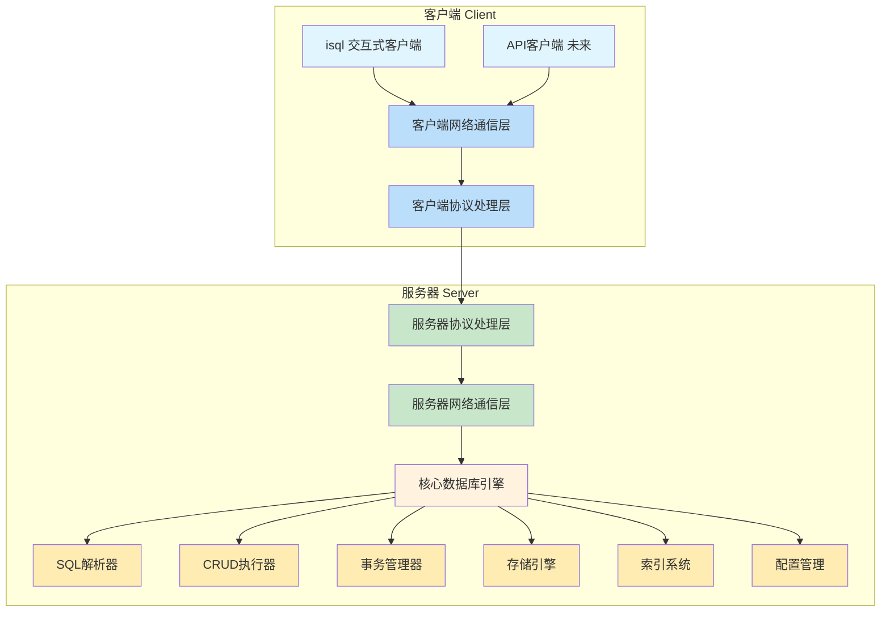

#### 客户端组件

1. **交互式客户端 (isql)**
   - **Why**: 为用户提供与数据库交互的命令行界面，支持本地和远程连接模式
   - **What**: 实现交互式SQL命令行工具，支持SQL语句执行、脚本执行和数据库管理功能
   - **How**: 支持本地模式（直接访问数据库文件）、远程模式（通过网络连接到数据库服务器）、实现命令行解析和交互循环

2. **客户端网络通信层**
   - **Why**: 实现客户端与服务器之间的网络通信
   - **What**: 提供TCP连接管理、消息收发和连接状态维护功能
   - **How**: 实现TCP客户端连接、处理网络消息的发送和接收、管理连接状态和异常处理

3. **客户端协议处理层**
   - **Why**: 封装客户端与服务器之间的通信协议细节
   - **What**: 提供高层API屏蔽底层协议复杂性，处理请求-响应模式
   - **How**: 实现消息的序列化和反序列化、处理认证和会话管理、提供SQL执行接口

#### 服务器组件

1. **服务器网络通信层**
   - **Why**: 处理来自多个客户端的并发连接请求
   - **What**: 实现高并发TCP服务器，管理客户端连接和网络I/O
   - **How**: 实现基于epoll/ioctl的异步I/O模型、管理连接池和资源分配、处理连接建立、维护和关闭

2. **服务器协议处理层**
   - **Why**: 解析客户端发送的协议消息并生成相应响应
   - **What**: 实现协议消息的解析、路由和执行结果的封装
   - **How**: 解析协议消息格式、路由请求到相应处理模块、封装执行结果为响应消息

3. **核心数据库引擎**
   - **Why**: 实现数据库的核心功能，处理SQL请求并返回结果
   - **What**: 提供SQL解析、执行、事务管理和存储访问功能
   - **How**: 集成现有的存储引擎、SQL解析器、事务管理器等模块、实现多线程安全的请求处理、提供统一的执行接口

### 5.4.4 模块关系与设计

#### 存储引擎 (Storage Engine)

**Why**: 存储引擎是数据库系统的核心基础，负责数据的持久化存储和高效访问。它是所有上层功能的基础，决定了数据库的基本性能特征。

**What**: 实现8KB定长页面的存储管理，支持定长和变长记录的存储，提供高效的空间分配和回收机制。

**How**: 
- 采用页面式存储架构，每页8KB
- 实现页面分配器管理空闲空间
- 支持记录的定长和变长存储格式
- 提供页面缓存接口减少磁盘I/O

**性能要求合理性**: 10万次INSERT后文件体积≤1.2倍理论值是合理的，它允许合理的碎片和元数据开销，同时避免了空间浪费。

#### SQL解析 (SQL Parser)

**Why**: SQL解析器是用户与数据库交互的桥梁，将人类可读的SQL语句转换为机器可理解的内部表示，是数据库执行SQL的第一步。

**What**: 解析6种基本SQL语句(SELECT, INSERT, UPDATE, DELETE, CREATE, DROP)，生成抽象语法树(AST)。

**How**:
- 使用词法分析器和语法分析器分离设计
- 采用递归下降解析算法
- 构建AST节点表示SQL语句结构
- 提供AST打印和验证功能

**性能要求合理性**: 解析正确性是首要目标，性能要求相对宽松，因为解析开销通常远小于执行开销。

#### 索引 (Index)

**Why**: 索引是提升查询性能的关键技术，通过预排序的数据结构加速数据检索，是现代数据库不可或缺的组件。

**What**: 实现B+树索引结构，支持单字段唯一索引，提供点查询和范围查询功能。

**How**:
- 实现B+树节点结构和分裂合并算法
- 支持键值对的插入、删除和查找
- 实现范围查询的迭代器接口
- 与存储引擎页面系统集成

**性能要求合理性**: 100万主键下点查页面访问≤4次是合理的，这对应于3-4层高的B+树，是典型数据库系统的设计目标。

#### CRUD (Create, Read, Update, Delete)

**Why**: CRUD操作是数据库的基本数据操作接口，是应用程序与数据库交互的主要方式，直接决定了用户体验和系统性能。

**What**: 实现数据的插入、点查询、范围扫描、更新和删除功能。

**How**:
- 集成存储引擎和索引模块
- 实现查询计划和执行引擎
- 支持事务上下文下的操作
- 提供结果集管理和游标功能

**性能要求合理性**: 1-10万行数据下单操作<5ms(SSD)是合理的，这对应于现代数据库系统在SSD上的典型性能表现。

#### 事务 (Transaction)

**Why**: 事务是数据库保证数据一致性和并发控制的核心机制，是关系型数据库区别于简单文件系统的关键特性。

**What**: 实现WAL(预写日志)和两阶段锁协议，提供读已提交隔离级别。

**How**:
- 实现WAL日志记录和恢复机制
- 构建锁管理器和死锁检测
- 设计事务上下文和状态管理
- 集成到CRUD操作中

**性能要求合理性**: 10线程并发转账1000次无丢失更新是合理的一致性测试，验证了并发控制的正确性。

#### 网络通信 (Network Communication)

**Why**: 网络通信模块使数据库能够通过网络接受远程客户端连接，是现代数据库系统必备的功能，也是实现分布式数据库的基础。

**What**: 实现客户端-服务器架构，支持远程SQL执行、连接管理、认证授权等功能。

**How**:
- 实现TCP/IP网络通信
- 设计客户端-服务器通信协议
- 实现用户认证和权限控制
- 提供连接池和会话管理

**性能要求合理性**: 100并发连接下查询响应时间<10ms是合理的，考虑到网络延迟因素，此性能指标适合大多数应用场景。

### 5.4.5 模块间关系

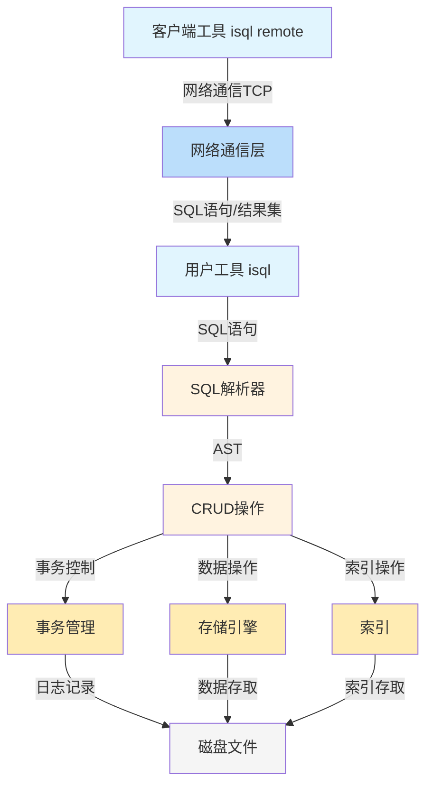

1. **客户端工具**是远程用户的入口，通过网络与服务器通信
2. **网络通信层**处理客户端和服务器间的网络通信
3. **用户工具**是系统的本地入口，接收用户输入的SQL语句或脚本
4. **SQL解析器**将SQL语句转换为抽象语法树(AST)
5. **CRUD操作**根据AST执行具体的数据操作
6. **事务管理**提供ACID保证，通过WAL和锁机制确保数据一致性
7. **索引**加速数据访问，提供高效的数据查找路径
8. **存储引擎**负责数据的物理存储和页面管理
9. **磁盘文件**是数据的最终持久化存储

### 5.4.6 性能要求合理性分析

#### 存储性能要求

1. **空间效率**：10万次INSERT后文件体积≤1.2倍理论值
   - 合理性：允许20%的额外空间用于元数据、索引和碎片，是实际数据库系统的常见设计目标
   - 实现思路：紧凑存储格式、延迟空间回收、批量更新元数据

2. **查询性能**：100万主键下点查页面访问≤4次
   - 合理性：对应3-4层高的B+树，是平衡查询性能和维护成本的合理选择
   - 实现思路：优化B+树节点填充率、实现缓存友好的节点布局

3. **操作延迟**：1-10万行数据，单操作耗时<5ms (SSD)
   - 合理性：现代SSD随机访问延迟约0.1ms，5ms允许50次页面访问，足够完成复杂操作
   - 实现思路：批量I/O操作、异步写入、优化锁粒度

#### 并发性能要求

1. **并发正确性**：10线程并发转账1000次，无丢失更新
   - 合理性：中等并发度下的正确性验证，确保事务机制的有效性
   - 实现思路：细粒度锁、死锁检测、乐观并发控制

#### 网络性能要求

1. **网络响应时间**：100并发连接下，查询响应时间<10ms
   - 合理性：考虑网络延迟，10ms的响应时间对于大多数OLTP应用是可以接受的
   - 实现思路：连接池、异步I/O、协议优化

### 5.4.7 初步实现思路

#### 存储引擎实现

1. **页面管理**：
   - 设计页面头部结构，包含页面类型、空闲空间等信息
   - 实现页面分配器，管理空闲页面链表
   - 支持页面内记录的定长和变长存储格式

2. **记录管理**：
   - 设计记录头部，包含记录长度、标志位等信息
   - 实现记录的插入、删除和更新操作
   - 支持页面内记录的紧凑存储和碎片整理

3. **空间管理**：
   - 实现扩展和收缩机制，动态调整数据库文件大小
   - 设计空闲空间管理算法，减少空间碎片
   - 提供空间使用统计和监控功能

#### SQL解析实现

1. **词法分析**：
   - 定义SQL关键字、标识符、操作符等词法单元
   - 实现有限状态机进行词法分析
   - 处理注释、字符串和特殊字符

2. **语法分析**：
   - 设计SQL语法的BNF表示
   - 实现递归下降解析器
   - 构建抽象语法树(AST)节点结构

3. **语义分析**：
   - 验证表名、字段名的存在性
   - 检查类型兼容性
   - 生成执行计划的初步表示

#### 索引实现

1. **B+树结构**：
   - 设计内部节点和叶子节点的结构
   - 实现节点的分裂和合并算法
   - 优化节点大小以适应页面边界

2. **索引操作**：
   - 实现键值对的插入、删除和查找
   - 支持范围查询的迭代器接口
   - 处理重复键和唯一约束

## 5.5 数据库使用者角色与系统用例

### 5.5.1 数据库使用者角色分析

#### 数据库管理员 (DBA)

职责范围：
- 数据库安装与配置管理
- 用户权限与安全策略管理
- 系统性能监控与调优
- 数据备份与灾难恢复
- 故障诊断与系统维护

技术需求：
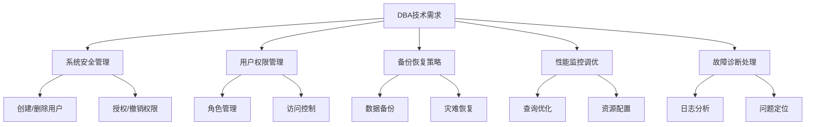

#### 数据库开发人员

职责范围：
- 数据库设计与数据建模
- SQL语句编写与性能优化
- 存储过程与触发器开发
- 数据库应用集成与API设计

技术需求：
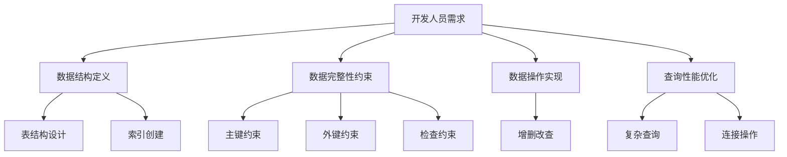

#### 业务用户

职责范围：
- 日常业务数据查询与分析
- 业务报表生成与数据导出
- 业务数据录入与更新
- 业务流程执行与监控

技术需求：
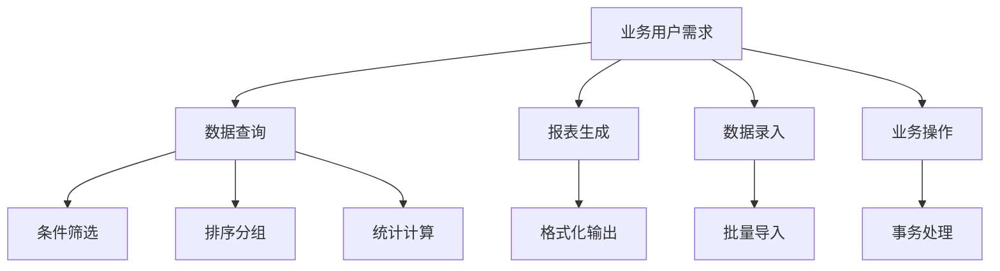

### 5.5.2 系统用例图

使用Mermaid图表展示不同角色如何使用RDBMS完成企业信息管理任务：

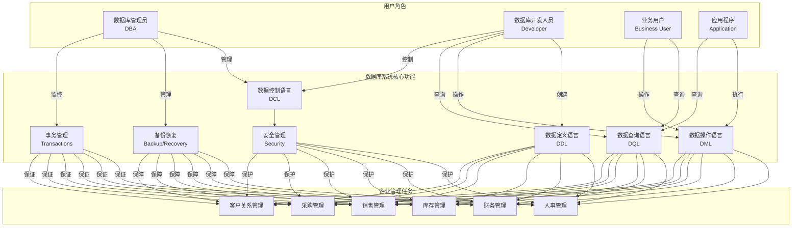

### 5.5.3 企业信息管理系统的演进路径

#### 单机版企业信息管理系统

架构特点：
- 集中部署在本地服务器
- 服务单一企业或部门
- 数据量相对较小
- 用户数量有限
- 简单的备份恢复机制

技术架构：


#### 分布式企业信息管理系统

随着企业发展，系统需要扩展：

架构特点：
- 多地点分布式部署
- 支持分支机构接入
- 数据同步与一致性机制
- 负载均衡与故障转移
- 高级别的安全控制

技术架构：
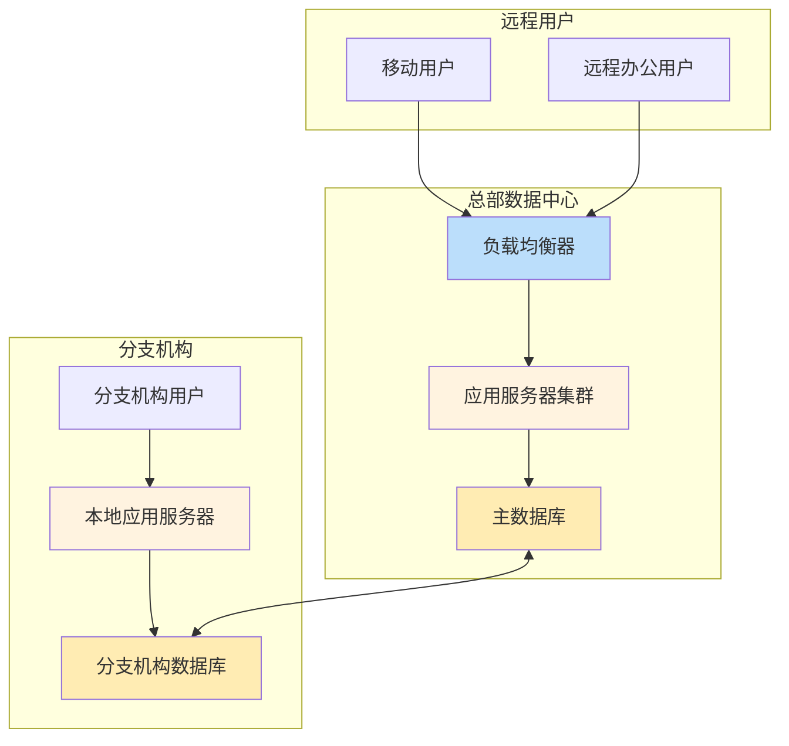

#### 跨国电商系统架构

面对国际贸易和供应链管理的复杂需求：

架构特点：
- 全球多区域分布式部署
- 高并发访问支持与弹性扩展
- 多语言多货币国际化支持
- 复杂的供应链协同管理
- 实时数据分析与商业智能
- 严格的安全合规要求

技术架构：
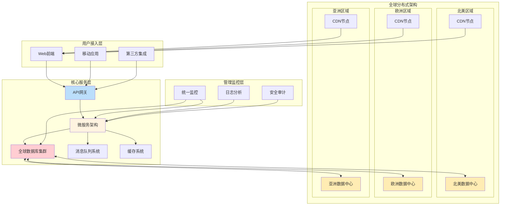

## 5.6 课程设计与实验指导

### 5.6.1 课程设计目标

本课程设计旨在通过实践深入理解数据库管理系统的内部架构和实现原理，培养学生以下能力：

1. **系统分析能力**：分析数据库系统需求，设计合理的系统架构
2. **工程实现能力**：掌握数据库核心模块的实现技术和方法
3. **性能优化能力**：理解并应用数据库性能优化策略
4. **团队协作能力**：在大型软件项目中有效协作和沟通

### 5.6.2 实验一：SQLCC基础模块实现

#### 实验目标
实现SQLCC数据库系统的存储引擎和SQL解析器基础模块

#### 实验内容
1. **存储引擎实现**
   - 设计8KB页面格式和文件组织结构
   - 实现页面管理器和空间分配算法
   - 支持定长和变长记录存储

2. **SQL解析器实现**
   - 实现词法分析器识别SQL关键字
   - 构建递归下降语法分析器
   - 生成抽象语法树(AST)

#### 实验要求
- 存储引擎支持10万条记录的高效存储
- SQL解析器正确解析6种基本SQL语句
- 代码注释完整，模块接口清晰

#### 验收标准
```sql
-- 测试用例
CREATE TABLE students (
    id INT PRIMARY KEY,
    name VARCHAR(50),
    age INT
);

INSERT INTO students VALUES (1, '张三', 20);
SELECT * FROM students WHERE age > 18;
```

### 5.6.3 实验二：查询优化器实现

#### 实验目标
实现基于代价的查询优化器，支持查询重写和执行计划选择

#### 实验内容
1. **逻辑优化**
   - 实现查询重写规则（谓词下推、子查询优化等）
   - 构建关系代数表达式树
   - 应用等价变换规则

2. **物理优化**
   - 实现基于动态规划的连接顺序优化
   - 设计代价模型和基数估计
   - 生成最优执行计划

#### 实验要求
- 支持多表连接查询的优化
- 代价估计误差在合理范围内
- 执行计划可视化输出

#### 验收标准
```sql
-- 复杂查询优化测试
SELECT s.name, c.course_name, sc.score
FROM students s 
JOIN scores sc ON s.id = sc.student_id
JOIN courses c ON sc.course_id = c.id
WHERE s.age > 18 AND c.credit > 2
ORDER BY sc.score DESC;
```

### 5.6.4 实验三：事务与并发控制实现

#### 实验目标
实现基于WAL的事务管理和两阶段锁并发控制

#### 实验内容
1. **事务管理**
   - 实现预写式日志(WAL)机制
   - 设计事务状态管理和恢复流程
   - 支持事务的提交和回滚

2. **并发控制**
   - 实现两阶段锁协议(2PL)
   - 构建锁管理器和死锁检测
   - 支持读已提交隔离级别

#### 实验要求
- 保证事务的ACID特性
- 正确处理并发事务冲突
- 支持系统故障恢复

#### 验收标准
```sql
-- 并发事务测试
-- 事务1
BEGIN TRANSACTION;
UPDATE accounts SET balance = balance - 100 WHERE id = 1;
UPDATE accounts SET balance = balance + 100 WHERE id = 2;
COMMIT;

-- 事务2（并发执行）
BEGIN TRANSACTION;
SELECT balance FROM accounts WHERE id = 1;
SELECT balance FROM accounts WHERE id = 2;
COMMIT;
```

### 5.6.5 课程设计项目：微型数据库系统实现

#### 项目要求
以小组形式完成一个完整的微型数据库系统，包含以下模块：

1. **存储管理模块**
   - 页面管理和缓冲区管理
   - 记录存储和空间回收
   - 文件组织和管理

2. **查询处理模块**
   - SQL解析和语义分析
   - 查询优化和执行
   - 结果集处理

3. **事务管理模块**
   - 并发控制和恢复管理
   - 锁管理和死锁处理
   - 日志管理和检查点

4. **系统接口模块**
   - 命令行交互界面
   - 网络通信接口
   - 系统监控和管理

#### 项目交付物
1. **系统源代码**：完整可编译的源代码
2. **设计文档**：系统架构设计和模块说明
3. **测试报告**：功能测试和性能测试结果
4. **用户手册**：系统使用和配置说明

#### 评分标准
- 功能完整性（40%）
- 代码质量（25%）
- 系统性能（20%）
- 文档质量（15%）

## 5.7 数据库系统的发展趋势与未来展望

### 5.7.1 云原生数据库架构

云环境下的数据库架构正在发生深刻变革：

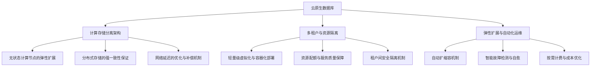

1. **计算存储分离架构**
   - 无状态计算节点的弹性扩展
   - 分布式存储的强一致性保证
   - 网络延迟的优化与补偿机制

2. **多租户与资源隔离**
   - 轻量级虚拟化与容器化部署
   - 资源配额与服务质量保障
   - 租户间安全隔离机制

### 5.7.2 智能化数据库系统

人工智能技术正在改变数据库系统的设计和运维方式：

1. **自适应优化技术**
   - 基于机器学习的代价估计
   - 工作负载感知的自动调优
   - 异常检测与自愈机制

2. **自然语言接口**
   - 自然语言到SQL的自动转换
   - 查询意图理解与语义扩展
   - 交互式查询结果探索

### 5.7.3 异构计算集成

新型硬件技术为数据库系统带来新的优化机会：

1. **硬件加速技术**
   - FPGA在查询处理中的应用
   - GPU加速的复杂分析查询
   - 持久内存的存储层次优化

2. **专用处理器集成**
   - 智能网卡的数据过滤与预处理
   - 存储处理器的计算下推优化
   - 异构计算资源的统一管理

### 5.7.4 分布式与微服务架构演进

现代数据库系统向分布式和微服务架构发展：

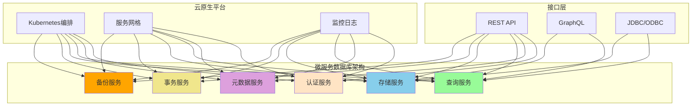

## 5.8 本章总结

本章系统阐述了数据库管理系统的总体架构设计和核心组件实现原理。从多角色需求分析出发，探讨了SQL语言分类的体系化演进及其与系统架构的映射关系。深入分析了DBMS对计算机科学各基础学科的依赖与集成，详细介绍了查询处理、事务管理和存储管理等核心组件的工程实现架构。

通过引入SQLCC数据库管理系统的具体设计案例，展示了如何从工程实现角度构建一个完整的数据库系统。课程设计与实验指导部分提供了系统的实践方案，帮助读者将理论知识转化为实际工程能力。

### 核心知识点总结

1. **DBMS架构设计原理**
   - 基于用户角色的需求分析方法
   - SQL语言分类与系统架构的映射关系
   - 模块化设计的工程优势和实践方法

2. **核心组件实现技术**
   - 查询处理器的解析、优化和执行架构
   - 事务管理的并发控制和恢复机制
   - 存储引擎的缓冲区管理和数据组织

3. **系统集成与依赖**
   - 操作系统层面的进程、内存和文件系统优化
   - 算法与数据结构在数据库中的核心应用
   - 分布式系统和网络通信的技术集成

4. **现代发展趋势**
   - 云原生数据库架构的技术特点
   - 智能化优化和自然语言接口
   - 异构计算和硬件加速技术

### 能力培养目标

通过本章学习，读者应该能够：
1. 理解DBMS分层架构的设计原理和工程优势
2. 掌握SQL四大语言类别的实现机制和技术要点
3. 熟悉DBMS核心组件的工作原理和交互关系
4. 具备设计和实现简单数据库系统的能力
5. 了解数据库技术的最新发展趋势和未来方向

这些知识为数据库系统的设计、优化和开发工作提供了理论基础和工程实践指导，帮助读者在真实项目中做出更合理的技术决策和架构设计。

---

**思考与练习**

1. DBMS的层次化架构设计如何体现关注点分离原则？各层次之间如何保证接口的稳定性和系统的可扩展性？

2. 在查询优化器的实现中，基于规则的优化和基于代价的优化各有哪些优缺点？现代DBMS如何平衡这两种优化策略？

3. 多版本并发控制（MVCC）与基于锁的并发控制机制在实现上有何根本区别？它们分别适用于哪些应用场景？

4. SQLCC数据库系统的模块化设计有哪些优点？如果要将单机版本的SQLCC扩展为分布式版本，需要考虑哪些技术挑战？

5. 随着硬件技术的发展，新型存储介质和计算架构将如何改变DBMS的存储管理和查询处理机制？数据库系统应该如何适应这种硬件演进趋势？

**课程设计拓展题目**

6. 设计一个支持弹性扩展的分布式数据库架构，考虑数据分片、副本同步和负载均衡等机制。

7. 实现一个基于机器学习的查询优化器，使用历史查询信息来改进代价估计准确性。

8. 研究新型硬件（如持久内存、FPGA、GPU）在数据库系统中的应用方案，设计相应的加速架构。

---

## 参考资料

1. Ramakrishnan, R., & Gehrke, J. (2003). Database Management Systems. McGraw-Hill.
2. Garcia-Molina, H., Ullman, J. D., & Widom, J. (2008). Database Systems: The Complete Book. Pearson.
3. Stonebraker, M., & Hellerstein, J. M. (2005). Readings in Database Systems. MIT Press.
4. Abadi, D. J., et al. (2016). The Seattle Report on Database Research. ACM SIGMOD Record.
5. 数据库内核月报 - 阿里云数据库团队技术博客
6. SQLCC项目文档与源码 - 教学参考实现

## 附录：SQLCC核心接口定义

### 存储引擎接口
```c
// 页面管理接口
typedef struct {
    int (*create_page)(PageID page_id, PageType type);
    int (*read_page)(PageID page_id, Page* page);
    int (*write_page)(PageID page_id, const Page* page);
    int (*allocate_page)(PageType type, PageID* page_id);
    int (*free_page)(PageID page_id);
} StorageEngine;
```

### SQL解析器接口
```c
// 语法树节点定义
typedef struct ASTNode {
    NodeType type;
    char* value;
    struct ASTNode** children;
    int child_count;
} ASTNode;

// 解析器接口
typedef struct {
    ASTNode* (*parse_sql)(const char* sql);
    void (*free_ast)(ASTNode* root);
    void (*print_ast)(const ASTNode* root, int indent);
} SQLParser;
```

### 事务管理器接口
```c
// 事务接口
typedef struct {
    TransactionID (*begin_transaction)(IsolationLevel level);
    int (*commit_transaction)(TransactionID tid);
    int (*rollback_transaction)(TransactionID tid);
    int (*add_log_record)(TransactionID tid, LogRecord* record);
} TransactionManager;
```

*注：完整接口定义和实现代码请参考SQLCC项目源码仓库。*
