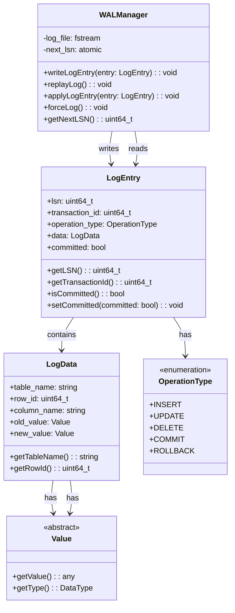
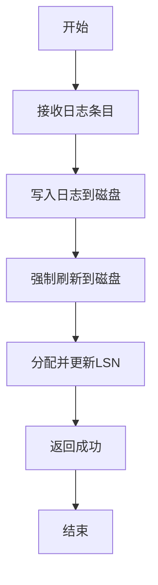
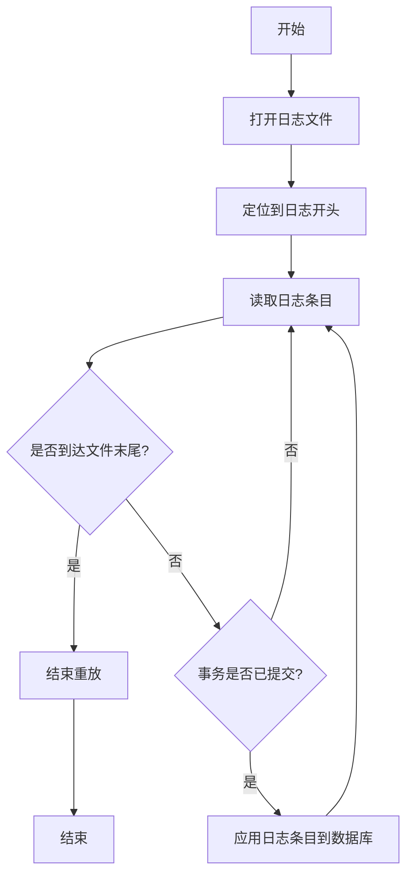

# 《数据库系统原理与开发实践》 - 第11章：事务管理：ACID保证的艺术

**从理论到实践的事务处理机制**

---

## 🎯 **本章核心目标**

深入理解数据库事务管理的核心原理和实现机制：
- ACID属性的理论基础和实践挑战
- 并发控制协议的设计与实现
- 事务日志与故障恢复机制
- 分布式事务的处理策略

---

## 11.1 事务的基本概念与ACID属性

### 11.1.1 事务的定义与特性

事务是数据库操作的基本单位，具有原子性、一致性、隔离性和持久性四个核心属性。

```
事务的ACID属性:
├── Atomicity (原子性): 事务要么全部执行，要么全部不执行
├── Consistency (一致性): 事务执行前后，数据库状态保持一致
├── Isolation (隔离性): 并发执行的事务之间互不影响
└── Durability (持久性): 事务提交后，数据的修改永久保存
```

### 11.1.2 事务状态与生命周期

```
事务的生命周期:
├── 活动状态 (Active): 事务正在执行
├── 部分提交状态 (Partially Committed): 最后一条语句执行完成
├── 提交状态 (Committed): 事务成功完成
├── 失败状态 (Failed): 事务执行过程中发生错误
└── 中止状态 (Aborted): 事务已回滚
```

## 11.2 并发控制协议

### 11.2.1 锁机制

锁机制是实现并发控制的最常用方法，通过对数据对象加锁来控制并发访问。

```
锁的类型:
├── 共享锁 (S锁): 允许多个事务读取同一数据
├── 排他锁 (X锁): 只允许一个事务修改数据
├── 意向锁 (IX/IS锁): 表示对数据的子对象加锁的意向
```

### 11.2.2 两阶段锁协议

两阶段锁协议是保证事务串行化的常用协议，包括扩展阶段和收缩阶段。

```
两阶段锁协议:
├── 扩展阶段 (Growing Phase): 事务可以获取锁，但不能释放锁
├── 收缩阶段 (Shrinking Phase): 事务可以释放锁，但不能获取新锁
```

## 11.3 事务日志与故障恢复

### 11.3.1 WAL (Write-Ahead Logging) 机制

WAL机制是保证事务持久性的核心技术，要求在修改数据之前先写入日志。

### UML类图：WAL管理器设计



### UML活动图：日志写入流程



### UML活动图：日志重放流程



### 11.3.2 故障恢复算法

故障恢复算法包括撤销(UNDO)和重做(REDO)两个阶段，用于恢复数据库到一致状态。

```
故障恢复的基本步骤:
1. 分析阶段: 扫描日志，确定需要撤销和重做的事务
2. 重做阶段: 重新执行所有已提交的事务
3. 撤销阶段: 撤销所有未提交的事务
```

## 11.4 分布式事务

### 11.4.1 两阶段提交协议

两阶段提交协议是实现分布式事务的常用方法，包括准备阶段和提交阶段。

```
两阶段提交协议:
├── 准备阶段 (Prepare Phase): 协调者向所有参与者发送准备请求
├── 提交阶段 (Commit Phase): 协调者根据参与者的响应决定提交或中止事务
```

### 11.4.2 三阶段提交协议

三阶段提交协议是对两阶段提交协议的改进，增加了超时机制和预提交阶段，减少了阻塞问题。

```
三阶段提交协议:
├── 询问阶段 (CanCommit Phase): 协调者询问参与者是否可以提交
├── 准备阶段 (PreCommit Phase): 协调者向参与者发送预提交请求
├── 提交阶段 (DoCommit Phase): 协调者根据参与者的响应决定提交或中止
```

## 📚 **本章总结：事务管理的核心原理与实践**

事务管理是数据库系统的核心功能之一，通过ACID属性保证数据的一致性和可靠性。本章介绍了事务的基本概念、并发控制协议、事务日志与故障恢复机制以及分布式事务的处理策略，为理解和实现可靠的事务管理系统提供了全面的指导。

---

**思考题**：
1. 什么是ACID属性？如何保证这些属性的实现？
2. 并发控制的主要方法有哪些？它们的优缺点是什么？
3. WAL机制的原理是什么？为什么它能保证事务的持久性？
4. 两阶段提交协议和三阶段提交协议的区别是什么？