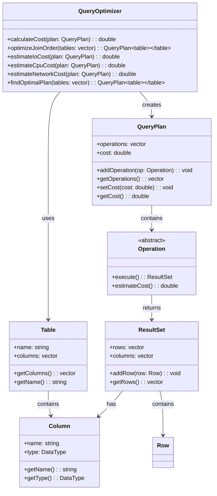
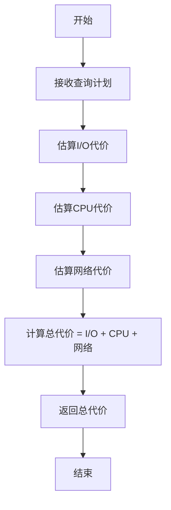
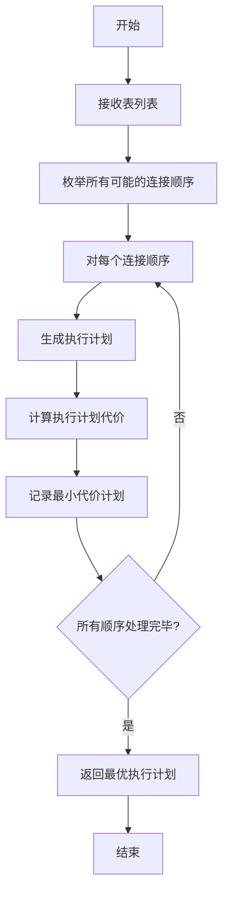

# 《数据库系统原理与开发实践》 - 第12章：SQL引擎：查询处理的完整流水线

**从SQL语句到执行结果的完整过程**

---

## 🎯 **本章核心目标**

深入理解SQL查询处理的完整流水线：
- SQL解析与语法分析
- 查询优化与执行计划生成
- 查询执行与结果返回
- 性能优化与调优技术

---

## 12.1 SQL解析与语法分析

### 12.1.1 词法分析与语法分析

SQL查询处理的第一步是将SQL字符串转换为结构化的抽象语法树(AST)。

```
SQL语句: SELECT name FROM users WHERE age > 18;

词法分析 (Tokenizer):
SELECT → KEYWORD_SELECT
name → IDENTIFIER
FROM → KEYWORD_FROM
users → IDENTIFIER
WHERE → KEYWORD_WHERE
age → IDENTIFIER
> → OPERATOR_GT
18 → NUMBER

语法分析 (Parser):
Statement: SELECT_STATEMENT
├── Columns: [name]
├── From: users
└── Where: age > 18
```

### 12.1.2 语义分析与类型检查

语义分析阶段检查SQL语句的语义正确性，包括表和列的存在性、类型兼容性等。

```
语义分析的主要任务:
├── 符号表构建: 记录表和列的信息
├── 类型检查: 确保表达式类型兼容
├── 约束验证: 检查约束条件的合法性
└── 视图展开: 将视图转换为基础表查询
```

## 12.2 查询优化与执行计划生成

### 12.2.1 查询优化的基本概念

查询优化是选择最优执行计划的过程，包括基于规则的优化(RBO)和基于代价的优化(CBO)。

```
查询优化的两个主要阶段:
├── 逻辑优化: 基于关系代数等价变换，重写查询
├── 物理优化: 选择最优的物理操作符和执行顺序
```

### 12.2.2 基于规则的优化

基于规则的优化通过应用一系列预定义的规则来重写查询，提高查询效率。

```
常用的优化规则:
├── 谓词下推: 将过滤条件尽可能下移到叶子节点
├── 常量折叠: 计算常量表达式的值
├── 冗余消除: 移除冗余的连接和过滤条件
└── 子查询优化: 将子查询转换为连接或半连接
```

### 12.2.3 基于代价的优化

基于代价的优化通过估算不同执行计划的代价，选择代价最小的执行计划。

### UML类图：查询优化器设计



### UML活动图：查询代价计算流程



### UML活动图：连接顺序优化流程



## 12.3 查询执行与结果返回

### 12.3.1 执行计划的物理执行

查询执行器根据执行计划，调用相应的物理操作符来执行查询。

```
常用的物理操作符:
├── 扫描操作符: 全表扫描、索引扫描
├── 连接操作符: 嵌套循环连接、排序归并连接、哈希连接
├── 聚合操作符: 分组、聚合函数计算
└── 排序操作符: 外部排序、内存排序
```

### 12.3.2 流水线执行模型

流水线执行模型允许不同操作符并行执行，提高查询执行的效率。

```
流水线执行的优势:
├── 减少中间结果的存储开销
├── 提高CPU利用率
├── 降低I/O等待时间
└── 支持流式处理
```

## 12.4 性能优化与调优技术

### 12.4.1 查询性能调优的基本方法

```
查询性能调优的主要方法:
├── 索引优化: 选择合适的索引，避免全表扫描
├── 统计信息更新: 确保优化器有准确的统计信息
├── 查询重写: 优化SQL语句的结构
└── 系统参数调优: 调整数据库系统参数
```

### 12.4.2 执行计划分析

分析执行计划是调优查询性能的重要步骤，通过查看执行计划可以识别性能瓶颈。

```
执行计划分析的关键点:
├── 操作符的执行顺序
├── 每个操作符的代价估计
├── 索引的使用情况
└── 数据访问方式
```

## 📚 **本章总结：SQL查询处理的完整流程**

SQL查询处理是数据库系统的核心功能之一，包括解析、优化和执行三个主要阶段。本章介绍了SQL解析与语法分析、查询优化与执行计划生成、查询执行与结果返回以及性能优化与调优技术，为理解和优化SQL查询提供了全面的指导。

---

**思考题**：
1. SQL查询处理的主要阶段有哪些？每个阶段的主要任务是什么？
2. 基于规则的优化和基于代价的优化有什么区别？
3. 常用的查询优化规则有哪些？它们的作用是什么？
4. 如何分析执行计划来识别性能瓶颈？