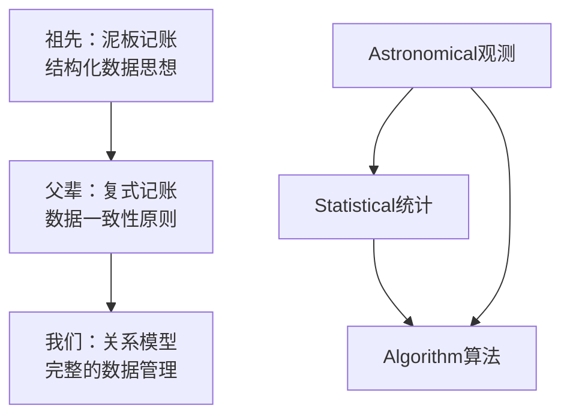
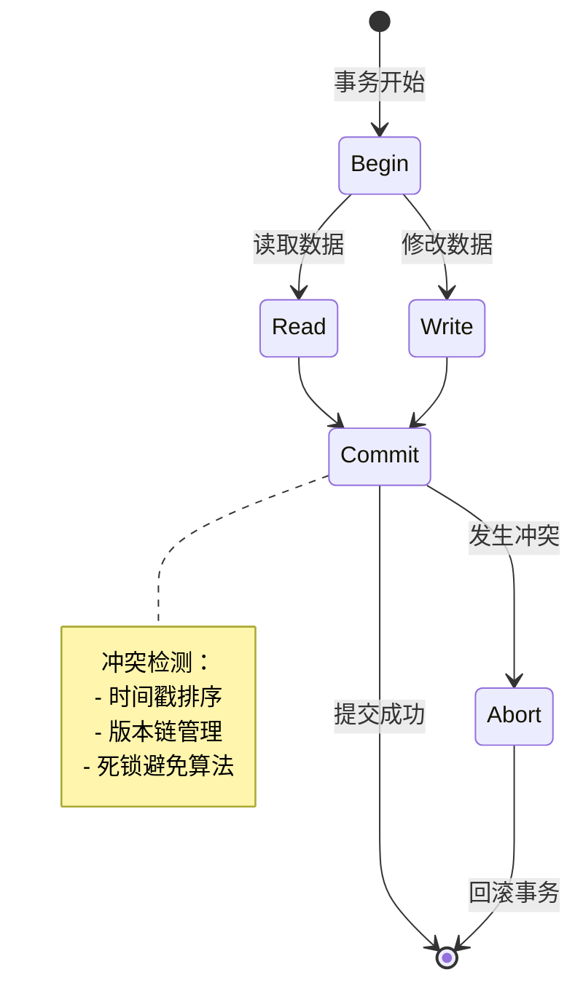
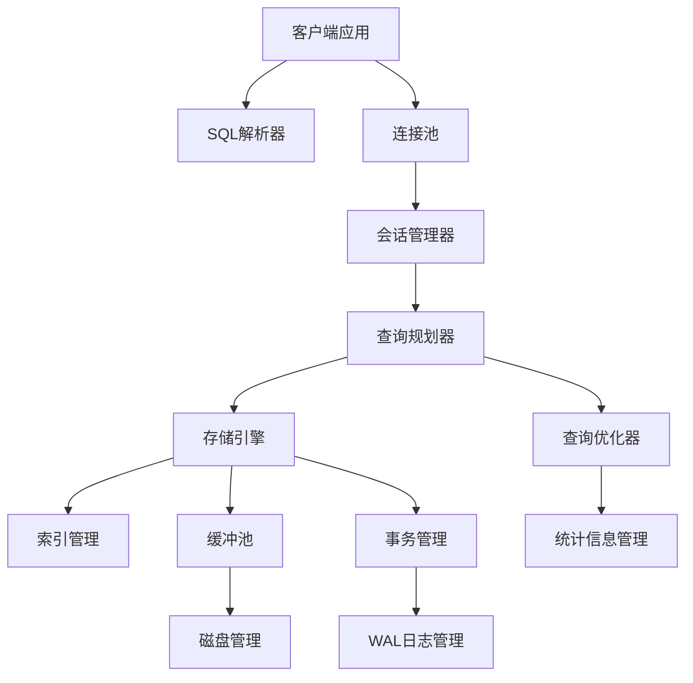

# 《数据库系统原理与开发实践》 - 教材大纲

**配合SQLCC项目使用的完整数据库教科书**

**教材特色**：
- ✅ **SQLCC项目驱动**: 基于实际可运行的数据库系统进行学习
- ✅ **理论实践结合**: 从历史发展到现代技术，全景展现
- ✅ **CS知识整合**: 展示数据库与计算机科学各领域知识的交织关系
- ✅ **AI时代思维**: 结合AI技术的发展趋势和应用前景
- ✅ **工程素养培养**: 软件工程规范、测试驱动、质量保证等现代开发理念

---

## 🎯 **教学培养目标**

**通过本书学习，学生将实现从"编程初学者"到"计算机科学思维者"的华丽转身**

### **思维层次的跃升**
**从"技术实现导向" → "思维方法主导"**
```
我们培养的不是"编程工匠"，而是"计算机科学家"

技术知识: ✅ SQL语法、数据库操作、系统实现
思维方法: ⭐ 数学建模思想、算法优化思维、系统架构理念
跨学科融合: ⭐ 计算机科学各领域的知识整合与应用
创新能力: ⭐ 从问题分析到解决方案设计的完整链条
```

### **学习范式的革新**
**从"单一技术学习" → "完整生态系统认知"**
```
传统计算机教育: 各课程分割学习、理论脱离实践、缺乏系统思维
本教材创新模式: 数据库项目作为桥梁、CS各领域知识融合、理论实践一体化

- 从单一《数据库原理》课程 → 完整计算机科学认知框架
- 从技术实现验证 → 思维方法与知识整合的范式
- 从编程练习积累 → 职业素养与工程规范的培养
- 从传统学术思维 → AI时代现代化工作方式转变
```

### **能力培养的体系化**
**从"技能点堆砌" → "系统能力构建"**
```
编程技术能力:
├── 基础编程: C++语言、数据结构、算法实现
├── 系统编程: OS/编译原理/网络知识的综合运用
└── 工程开发: 版本控制、质量保证、团队协作

思维认知能力:
├── 数学思维: 集合论、关系代数、算法复杂度的运用
├── 系统思维: 领域知识融合、权衡取舍、架构设计理念
└── 创新思维: 问题分析、方案设计、持续改进的方法

职业素养能力:
├── 工程规范: 测试驱动开发、文档编写、代码质量保证
├── 协作标准: Git工作流、企业级开发协作模式
└── 持续学习: 技术趋势把握、知识体系扩展、自学能力培养
```

### **价值塑造的升华**
**从"工具学习者" → "技术创造者"**
```
学习价值:
├── 职业转型: 从大学生到大型系统架构师的成长路径
├── 创新基础: 开源项目贡献、技术方案设计的思考框架
└── 终身学习: 计算机科学的核心思维与方法论永久储备

社会贡献:
├── 开源文化: 参与开源项目，为社区贡献代码与智慧
├── 教育推广: 将所学知识分享给更多学习者，传递技术火种
└── 行业影响: 在AI时代推动数据库技术与应用的创新发展
```

---

#### **课程结束时学生应掌握的核心能力**

##### **技术能力层级**
```
入门级 (Chapter 1-4): 理解数据处理的千年演进与数学基础
├── 掌握: 关系模型、SQL查询、事务ACID属性
└── 学会: 使用SQLCC进行基础数据库操作和数据管理

进阶级 (Chapter 5-8): 掌握计算机科学各领域知识的应用
├── 掌握: 存储引擎设计、B+树索引、并发控制算法
└── 学会: SQLCC存储引擎、索引系统、事务管理器的实现

专家级 (Chapter 9-16): 构建完整数据库系统与前沿技术探索
├── 掌握: 分布式数据库思维、AI驱动优化、数据库安全
└── 学会: 完整数据库系统架构设计与实现、前沿技术应用
```

##### **思维能力构建**
```
系统思维: 从局部模块理解到整体系统架构的思维跃升
数学思维: 集合论、关系代数、算法复杂度分析的实际运用
工程思维: 测试驱动、质量保证、团队协作的专业规范
创新思维: 问题分析、方案设计、技术演进趋势的把握
```

##### **实践能力提升**
```
项目实践: SQLCC完整实现，涵盖从存储到查询的全部环节
工程技能: 版本管理、文档编写、性能调优的实际操作
团队协作: Gitee/Git工作流、代码审查、质量保证流程
持续学习: 技术栈扩展、领域知识深化、开源社区参与
```

---

**🎯 本教材的终极目标**:

**不是让学生成为"数据库管理员"，而是培养他们成为具备完整计算机科学素养的"技术架构师"和"系统创新者"**

**从数据库学习的起点出发，最终实现计算机科学的全面认知与技术创新能力的培养！**

---

## 📖 **教材总体框架**

### **上册：数据处理的历史演进与计算机技术基础**

#### **第一篇：数据处理的千年历程**
##### **第1章：数据处理的起源与思想演变**

**1.1 从古代贸易到现代数据**
- **手工作坊时期 (公元前3000年-1800年)**
  - 📜 美索不达米亚泥板记账：最早的结构化数据记录
  - 🏛️ 古代中国甲骨文与商代青铜器铭文的数据化管理
  - 📊 古罗马税务登记与人口普查的数据组织

- **手工账本时期 (1800年-1900年)**
  - 🏦 银行票据与复式记账法：数据完整性与一致性的最早实践
  - 🏭 工业革命期间的库存管理和生产统计
  - 📈 统计学的兴起：数据的描述与分析方法

- **机械化时期 (1900年-1950年)**
  - ⚙️ 机械加法机与打孔卡片：数据处理的机械化
  - 💡 图灵机的理论奠基：计算的数学基础
  - 📊 早期统计计算与数据存储技术



**1.2 数据处理的思想演变**

- **分类分组思想**：从亚里士多德的范畴论到现代数据分类
- **抽象建模思想**：从毕达哥拉斯数学到数据关系模型建模
- **一致性保证**：从罗马法到ACID事务理论
- **优化效率**：从手工排序到算法复杂度分析

**1.3 数据处理的方法论发展**
- **人工方法时代**：手工分类、记忆存储、口头传递
- **机械方法时代**：机械计算、卡片存储、批量处理
- **电子方法时代**：数字化存储、自动化处理、实时计算

---

##### **第2章：计算机技术的发展与数据处理革命**

**2.1 计算技术的进化历程**

- **第一代计算机 (1940s-1950s)**: 电子管时代
  - 🚀 ENIAC计算机与二进制计算
  - 💾 磁鼓与磁带存储：第一个随机访问存储设备
  - 📊 数据处理从手工到批处理模式的转变

- **第二代计算机 (1950s-1960s)**: 晶体管时代
  - 🖥️ 交互式终端的出现
  - 💽 磁盘驱动器的发明
  - 📋 操作系统概念的形成 (Multics系统)

- **第三代计算机 (1960s-1970s)**: 集成电路时代
  - 💾 大容量磁盘存储的普及
  - 🔗 计算机网络的雏形 (ARPANET)
  - 🛢️ 关系数据库理论的提出 (E.F.Codd)

- **第四代计算机 (1970s-1980s)**: 大规模集成电路
  - 💽 关系数据库的商业化 (Oracle, DB2)
  - 🌐 局域网与分布式系统的兴起
  - 📱 个人计算机普及

**2.2 数据存储技术的发展轨迹**

```
1950s: 磁带 → 顺序存储，单向访问
    ↓
1960s: 磁盘 → 随机访问，高速I/O
    ↓
1970s: 关系型 → 数据独立性，SQL语言
    ↓
1980s: 对象型 → 复杂数据，人工智能初探
    ↓
1990s: 数据仓库 → OLAP分析，海量数据
    ↓
2000s: NoSQL → 分布式，互联网规模
    ↓
2010s: 新SQL → 云原生，智能优化
    ↓
2020s: AI驱动 → 自治数据库，预测分析
```

---

##### **第3章：数据结构、算法思想与数学基础 (计算与数据处理的核心能力)**

**3.1 结构化数据的数学本质：集合论、关系代数与现代数据库核心**

**数据操作背后的数学思想：**

```
关系代数的七大基本操作：
1. σ (选择): 从关系中选择满足条件的元组 → WHERE子句
2. π (投影): 从关系中选择特定属性构成新关系 → SELECT子句
3. ∪ (并集): 两个关系的并 → UNION操作
4. - (差集): 从第一个关系中减去第二个关系 → EXCEPT操作
5. × (笛卡尔积): 两个关系的笛卡尔积 → CROSS JOIN
6. ⋈ (连接): 基于条件的连接 → JOIN操作
7. ρ (重命名): 给关系或属性重命名 → AS别名

这些操作的数学基础保证了数据处理的正确性和完整性！
```

**集合论在数据库设计中的关键作用：**

```
数据库设计的三范式 (Normalization)：

第1范式 (1NF): 消除重复组，表格的原子性
├── 数学基础: 集合的元素不可再分
└── 数据库实现: 确保每个字段不可再分割

第2范式 (2NF): 消除部分函数依赖
├── 数学基础: 函数依赖的传递性
└── 数据库实现: 非键属性完全依赖于主键

第3范式 (3NF): 消除传递函数依赖
├── 数学基础: 函数依赖的闭包性质
└── 数据库实现: 消除了非键属性间的传递依赖

反规范化时的权衡考量：性能vs数据一致性，体现了数学严谨性和工程妥协的统一。
```

**3.2 从手工处理到算法思维：早期数据处理与结构化数据的必要性**

**早期数据处理的算法思想演变：**

```
人工时代 (公元前3000年 - 1800s):
├── 基础算法思想: 分类、分组、排序 (手工实现的算法)
├── 数据结构雏形: 按时间顺序排列的账本记录
├── 完整性保障: 手工交叉验证，一致性靠人工监督
└── 效率瓶颈: O(n)的时间复杂度，规模受人力限制

机械时代 (1900s - 1950s):
├── 穿孔卡片排序: 首次实现自动化排序算法
├── 分类汇总机: 实现高效的分组和聚合操作
├── 并行处理思维: 多张穿孔卡片同时处理
└── 效率提升: 从O(n log n)的手工排序到机械化批量处理
```

**结构化数据处理的历史必然性：**

```
为什么要结构化数据处理？

1. 一致性要求 (Consistency):
├── 数学基础: 等价关系与等价类的划分
└── 业务需求: 确保数据语义的一致性

2. 查询效率 (Efficiency):
├── 算法复杂度: 从O(n)到O(log n)的查找优化
└── 空间效率: 关系模式的规范化节省存储空间

3. 操作正确性 (Correctness):
├── 关系运算: 数学运算的封闭性和组合性
└── 查询语义: 声明式查询的确定性语义保证

4. 并发控制 (Concurrency):
├── 事务理论: 串行化调度与冲突图
└── 隔离级别: 多版本控制的数学一致性模型
```

**3.3 计算机硬件的发展与数据库软件的演进**

**摩尔定律驱动的软件能力跃迁：**

```
第一代计算机时代 (1940s-1950s):
├── 硬件: 真空管 → 几千Hz的处理速度
├── 存储: 磁鼓 → 几KB的存储容量
├── 软件: 汇编语言 → 直接操作机器指令
├── 数据处理: 批处理 → 简单文件读写
└── 数据库萌芽: 文件系统的层次化组织

第二代计算机时代 (1960s-1970s):
├── 硬件: 晶体管 → 百万Hz的处理速度
├── 存储: 磁带+磁盘 → MB级存储容量
├── 软件: 高级语言 (COBOL/FORTRAN) → 结构化编程
├── 数据处理: 交互式处理 → 实时事务处理
└── 数据库诞生: IMS层次模型，CODASYL网状模型

第三代计算机时代 (1980s-1990s):
├── 硬件: 集成电路 → GHz级处理速度
├── 存储: 硬磁盘 → GB级存储容量
├── 软件: 数据库语言 (SQL) → 声明式查询
├── 数据处理: 客户端/服务器 → 分布计算
└── 数据库成熟: 关系模型标准化，商用数据库爆发
```

**编程语言的发展与数据库需求的协同演进：**

```cobol
-- COBOL时期的数据库操作 (1960s)
PROCEDURE DIVISION.
    OPEN INPUT CUSTOMER-FILE
    READ CUSTOMER-FILE INTO CUSTOMER-RECORD
        AT END MOVE 'Y' TO END-OF-FILE
    END-READ
    PERFORM PROCESS-CUSTOMER UNTIL END-OF-FILE
    CLOSE CUSTOMER-FILE.
-- 特点: 过程式编程，导航式数据访问
```

```sql
-- SQL时期的数据库操作 (1980s)
SELECT c.name, o.amount
  FROM customers c
  JOIN orders o ON c.id = o.customer_id
 WHERE o.amount > 1000
 ORDER BY o.amount DESC;
-- 特点: 声明式查询，集合式数据操作
```

**数据库软件发展的硬件驱动因素：**

```
1. 存储容量指数级增长 (KiB → TiB → PiB)
   ├── 问题: 如何组织和检索海量数据？
   ├── 解决方案: 索引结构、B+树、多级存储层次
   └── 算法需求: O(1)的时间复杂度设计

2. 处理速度大幅提升 (KHz → GHz → PHz)
   ├── 问题: 如何并行处理和优化算法？
   ├── 解决方案: 查询优化器，并发控制，多线程处理
   └── 算法需求: 并行算法，最优化理论

3. 网络通信普遍化 (局域网 → 互联网 → 5G)
   ├── 问题: 如何处理分布式数据？
   ├── 解决方案: 分布式数据库，CAP定理，共识算法
   └── 算法需求: 网络算法，一致性算法

这不仅是技术演进，更是数学思想在硬件能力的支持下的一次次飞跃！
```

---

##### **第4章：当代数据处理生态与发展趋势 (数学建模与智能计算的融合)**

**4.1 线性代数在现代数据库中的应用：多维数据处理与矩阵计算**

```
向量空间与数据库查询：
├── 向量空间模型: 数据表 = 向量空间，记录 = 向量，属性 = 维度
├── 相似性搜索: 余弦相似度 = 向量夹角计算
├── 主成分分析: 数据降维，异常检测

矩阵运算与关系代数：
├── 关系连接: 矩阵乘法 (R × S 的笛卡尔积)
├── 自然连接: 矩阵运算的限制条件
├── 聚合函数: 矩阵的行/列向量运算

线性变换与数据规范化 (范式化)：
├── 基变换: 从物理schema到逻辑schema的映射
├── 奇异值分解 (SVD): 数据降维和特征提取
├── 特征向量: 多维数据的主成分分析
```

**4.2 当代数据库技术的格局与发展走势**

```
数据库家族的数学思维差异：

关系型数据库 (SQL) - 集合论思维:
├── 基础: 集合论，关系代数，谓词逻辑
├── 查询: 声明式，基于关系闭包理论
├── 一致性: ACID，基于事务的串行化理论
└── 示例: PostgreSQL, MySQL

NoSQL数据库 - 图论与离散数学思维:
├── 文档型: JSON模式下的树结构和嵌套关系
├── 图数据库: 图论算法，最短路径，社群发现
├── 时序数据库: 时间序列分析，马尔可夫链
└── 示例: Neo4j, InfluxDB

NewSQL数据库 - 概率论与统计学思维:
├── 查询优化: 基数估计，概率统计模型
├── 索引选择: 统计信息维护，成本模型
├── 自适应: 在线学习，参数调整
└── 示例: CockroachDB，TiDB
```

**4.3 数据处理范式的数学本质**

```
单机数据处理 - 确定性数学:
├── 计算模型: 图灵机，有限自动机
├── 算法复杂度: 时间空间复杂度理论
├── 并发控制: 信号量，临界区，互斥锁
└── 数学保证: 确定性，一致性，可重复性

分布式数据处理 - 概率论数学:
├── 计算模型: 随机算法，不确定性图灵机
├── 算法复杂度: 期望复杂度，随机化算法
├── 一致性模型: CAP定理，3+1可选性，权衡取舍
└── 数学保证: 概率一致性，最佳努力，最終收斂

智能数据处理 - 机器学习数学:
├── 计算模型: 神经网络，统计学习理论
├── 算法复杂度: 计算学习理论 (VC维，样本复杂度)
├── 自适应优化: 在线学习，强化学习，遗传算法
└── 数学保证: 统计显著性，泛化误差，最小风险期望

每一代数据处理都有其独特的数学思维基础！
```

---

#### **第二篇：计算机科学各领域在数据库中的应用**

##### **第5章：数据结构与算法在数据库系统中的设计与实现**

**5.1 B+树索引：平衡多叉树的应用**

- **理论基础**：平衡树家族的演化 (AVL→红黑→B树→B+树)
- **存储优化**：页面大小与缓存行对齐的硬件意识设计
- **并发控制**：细粒度锁与乐观并发控制的融合

**SQLCC实践**: 在SQLCC项目中实现完整的B+树索引系统

```cpp
class BPlusTree {
    // Pages loaded into memory align with CPU cache lines
    static constexpr size_t PAGE_SIZE = 4096;  // 2^12 bytes

    // Split/merge operations maintain balance
    void insert(Key key, Value value) {
        // Navigate to leaf node
        Page* leaf = findLeafNode(key);

        // Insert with potential split
        if (leaf->isFull()) {
            splitLeafNode(leaf, key, value);
        }

        updateInternalNodes(); // Maintain balance
    }
};
```

**5.2 缓冲池管理：LRU缓存算法的工程实现**

- **缓存策略**：从理论算法到生产环境优化
- **并发访问**：多线程安全与性能平衡
- **内存管理**：操作系统虚拟内存与应用层缓冲的协同

**5.3 事务并发控制：多版本并发控制的艺术**



---

##### **第6章：操作系统原理在数据库存储中的应用**

**6.1 文件I/O与存储系统的协同**

操作系统视角:
- 📁 文件描述符管理与数据库文件句柄
- 💾 mmap内存映射与缓冲池实现
- 🔄 异步I/O与并发处理

数据库视角:
- WAL预写日志与fsync系统调用
- 零拷贝技术与网络数据传输
- 文件权限与数据库安全模型

**6.2 进程与线程管理在数据库服务器中的实现**

```cpp
class DatabaseServer {
    std::vector<std::thread> worker_threads;  // Thread pool
    std::queue<Connection*> connections;       // Connection queue

    void startServer() {
        // Listen for incoming connections
        int server_fd = socket(AF_INET, SOCK_STREAM, 0);

        // Process connections with thread pool
        for (auto& thread : worker_threads) {
            thread = std::thread([this]() {
                while (running) {
                    Connection* conn = dequeueConnection();
                    if (conn) {
                        processQuery(conn);
                    }
                }
            });
        }
    }
};
```

---

##### **第7章：编译原理在SQL处理中的实践应用**

**7.1 SQL语言的词法分析与语法解析**

```
SQL语句: SELECT name FROM users WHERE age > 18;

词法分析 (Tokenizer):
SELECT → KEYWORD_SELECT
name → IDENTIFIER
FROM → KEYWORD_FROM
users → IDENTIFIER
WHERE → KEYWORD_WHERE
age → IDENTIFIER
> → OPERATOR_GT
18 → NUMBER

语法分析 (Parser):
Statement: SELECT_STATEMENT
├── Columns: [name]
├── From: users
└── Where: age > 18
```

**SQLCC实践**: ANTLR语法分析与AST构建

**7.2 查询优化：编译器代码优化理论的应用**

- **代价模型**: I/O代价、CPU代价、网络代价的综合评估
- **查询重写**: 谓词下推、常量折叠、子查询展开
- **执行计划**: 物理算子树与管道化执行

---

### **下册：数据库系统设计与开发实践**

#### **第三篇：SQLCC项目：数据库系统完整实现**

##### **第8章：项目架构设计与模块拆分**

**8.1 SQLCC系统的整体架构**



**8.2 核心模块的设计原则**

- **单一职责**: 每个模块专注于一个特定领域
- **高内聚低耦合**: 模块间接口清晰，依赖最小化
- **可扩展性**: 预留扩展点，便于未来功能增强

---

##### **第9章：存储引擎的实现：从文件到数据的艺术**

**9.1 Page结构设计与硬件对齐优化**

```cpp
struct alignas(PAGE_SIZE) Page {
    PageHeader header;           // Metadata (128 bytes)
    char data[PAGE_SIZE - 128]; // Actual data

    // Hardware-conscious design
    static constexpr size_t PAGE_SIZE = 4096;    // 4KB page
    static constexpr size_t ALIGNMENT = 64;     // Cache line size
};

// Page types with different layouts
enum PageType {
    DATA_PAGE,      // Store table rows
    INDEX_PAGE,     // Store B+ tree nodes
    FREE_PAGE,      // Available for allocation
    WAL_PAGE        // Write-ahead log entries
};
```

**9.2 缓冲池：内存管理的工程实现**

```cpp
class BufferPool {
    std::unordered_map<PageId, PageFrame*> page_table;
    DoubleLinkedList<PageFrame*> lru_list;  // LRU eviction

    Page* getPage(PageId page_id) {
        // Check if page is in memory
        auto it = page_table.find(page_id);
        if (it != page_table.end()) {
            // Move to front of LRU list (most recently used)
            lru_list.moveToFront(it->second);
            return it->second->page;
        }

        // Page not in memory, load from disk
        return loadPageFromDisk(page_id);
    }

    void evictPage() {
        // Evict least recently used page
        PageFrame* victim = lru_list.getLast();
        writePageToDisk(victim);
        page_table.erase(victim->page_id);
    }
};
```

---

##### **第10章：索引系统：高效查找的数据结构设计**

**10.1 B+树的可视化构建过程**

```cpp
// B+ Tree Node Structure
template<typename Key, typename Value>
struct BPlusTreeNode {
    bool is_leaf;
    std::vector<Key> keys;
    std::vector<BPlusTreeNode*> children;  // Internal nodes
    std::vector<Value> values;             // Leaf nodes only
    BPlusTreeNode* next_leaf;              // Leaf node chain

    // Insertion with automatic balancing
    void insert(Key key, Value value) {
        if (is_leaf) {
            insertIntoLeaf(key, value);
        } else {
            BPlusTreeNode* child = findChild(key);
            child->insert(key, value);
            if (child->isOverflow()) {
                splitChild(child);
            }
        }
    }
};
```

**10.2 并发索引：读写锁与版本控制**

```cpp
class ConcurrentBPlusTree : public BPlusTree {
    std::shared_mutex tree_mutex;  // Multiple readers, single writer

    Value search(Key key) const {
        std::shared_lock lock(tree_mutex);  // Shared read lock
        return findValue(key);
    }

    void insert(Key key, Value value) {
        std::unique_lock lock(tree_mutex);  // Exclusive write lock
        BPlusTree::insert(key, value);
    }
};
```

---

##### **第11章：事务管理：ACID保证的艺术**

**11.1 WAL机制：持久性保证的核心**

```cpp
class WALManager {
    std::fstream log_file;
    std::atomic<uint64_t> next_lsn;  // Log sequence number

    void writeLogEntry(const LogEntry& entry) {
        // Write ahead logging protocol
        log_file.write(&entry, sizeof(entry));
        log_file.flush();  // Force to disk

        // Update LSN for ordering guarantees
        entry.lsn = next_lsn.fetch_add(1);
    }

    void replayLog() {
        // Crash recovery: replay committed transactions
        log_file.seekg(0);
        LogEntry entry;
        while (log_file.read(&entry, sizeof(entry))) {
            if (entry.committed) {
                applyLogEntry(entry);
            }
        }
    }
};
```

**11.2 两阶段锁协议与死锁检测**

```cpp
class LockManager {
    std::unordered_map<ResourceId, std::list<TransactionId>> waiting_queue;

    // Two-phase locking protocol
    void acquireLock(TransactionId txn, ResourceId res, LockMode mode) {
        if (canGrantLock(txn, res, mode)) {
            grantLock(txn, res, mode);
        } else {
            waiting_queue[res].push_back(txn);
            // Wait for lock or detect deadlock
            waitForLock(txn, res);
        }
    }

    void commitTransaction(TransactionId txn) {
        // Phase 1: No new locks can be acquired (strict 2PL)
        // Release all locks (Phase 2)
        releaseAllLocks(txn);
    }
};
```

---

##### **第12章：SQL引擎：查询处理的完整流水线**

**12.1 SQL解析过程的可视化**

```
原始SQL: SELECT u.name FROM users u WHERE u.age > 18;

1. 词法分析 (Lexical Analysis)
   输入流 → Token序列 → 语法符号识别

2. 语法分析 (Syntax Analysis)
   Token序列 → 语法树 → LL(1)递归下降

3. 语义分析 (Semantic Analysis)
   语法树 → 符号表 → 类型检查和引用验证

4. 语义分析结果:
   SELECT句: 查询用户姓名
   FROM句: 从users表
   WHERE句: 年龄条件筛选
```

**12.2 查询优化算法与代价模型**

```cpp
class QueryOptimizer {
    // Cost-based optimization
    double calculateCost(const QueryPlan& plan) {
        double io_cost = estimateIoCost(plan);
        double cpu_cost = estimateCpuCost(plan);
        double network_cost = estimateNetworkCost(plan);

        return io_cost + cpu_cost + network_cost;
    }

    // Dynamic programming for join order selection
    QueryPlan optimizeJoinOrder(const std::vector<Table>& tables) {
        // Enumerate all possible join orders
        // Calculate cost for each combination
        // Select minimum cost plan

        return findOptimalPlan(tables);
    }
};
```

---

#### **第四篇：现代数据库技术前沿与未来展望**

##### **第13章：大数据处理与分布式数据库**

**13.1 CAP定理与分布式系统的权衡**

```cpp
// Distributed database: consistency vs availability trade-offs

class DistributedCoordinator {
    // Strong consistency (stop-the-world approach)
    void ensureConsistency() {
        // Lock all replicas during updates
        acquireGlobalLocks();
        updateAllReplicas();
        releaseGlobalLocks();
        // Result: High consistency, low availability
    }

    // Eventual consistency (optimistic replication)
    void allowInconsistency() {
        // Update local replica immediately
        updateLocalReplica();
        // Replicate asynchronously in background
        replicateToPeers();
        // Result: High availability, eventual consistency
    }
};
```

**13.2 NoSQL数据库的案例分析与设计模式**

##### **第14章：AI驱动的智能数据库系统**

**14.1 机器学习在查询优化中的应用**

```python
import tensorflow as tf

class MLBasedQueryOptimizer:
    def __init__(self):
        # Neural network for query plan quality prediction
        self.model = tf.keras.Sequential([
            tf.keras.layers.Dense(128, activation='relu', input_shape=(feature_dim,)),
            tf.keras.layers.Dense(64, activation='relu'),
            tf.keras.layers.Dense(1, activation='sigmoid')  # Plan quality score
        ])

        self.model.compile(optimizer='adam', loss='mse', metrics=['accuracy'])

    def train(self, training_data):
        # Training data: (query_features, plan_cost) pairs
        X, y = extract_features_and_costs(training_data)
        self.model.fit(X, y, epochs=100, batch_size=32)

    def optimize_query(self, query):
        candidate_plans = enumerate_all_possible_plans(query)

        best_plan = None
        best_score = -1

        for plan in candidate_plans:
            features = extract_plan_features(plan)
            score = self.model.predict(features)

            if score > best_score:
                best_score = score
                best_plan = plan

        return best_plan
```

---

##### **第15章：数据库安全性与隐私保护**

**15.1 加密数据库与安全多方计算**

**15.2 GDPR与隐私保护技术在数据库中的应用**

---

##### **第16章：区块链数据库与可信计算**

**16.1 区块结构在数据存储中的应用**

**16.2 共识机制与分布式一致性保证**

---

#### **结语：数据库技术的发展趋势与学习指南**

**数据库技术的未来：从数据管理到智能决策支持**

- **🤖 自适应数据库**: 自动优化、自我管理、自主学习
- **🌐 联邦数据库**: 隐私保护、多方安全计算、跨组织协作
- **⚡ 实时数据库**: 毫秒级响应、事件驱动架构、流处理集成
- **🧠 认知数据库**: 自然语言理解、上下文感知、意图预测

**学习指南：如何掌握数据库技术和系统的精髓**

1. **理论学习**: 理解关系模型、ACID属性、规范化理论
2. **实践项目**: SQLCC完整实现，掌握工程技能
3. **系统思维**: 理解各领域知识如何有机协同
4. **前沿探索**: 关注AI、区块链、大数据等领域应用
5. **持续学习**: 数据库技术日新月异，跟上技术发展步伐

---

**📚 教材配套资源**

- **🔧 SQLCC项目源码**: 完整的数据库系统实现
- **🎮 交互式学习平台**: 在线SQL实验环境
- **📊 性能测试工具**: 自动化测试和性能分析
- **📝 练习题集**: 从基础理论到高级应用的练习
- **🎥 教学视频**: 核心概念的可视化讲解

**💡 教学理念**：
**不只是教数据库，更是建立计算机科学的系统思维！**
