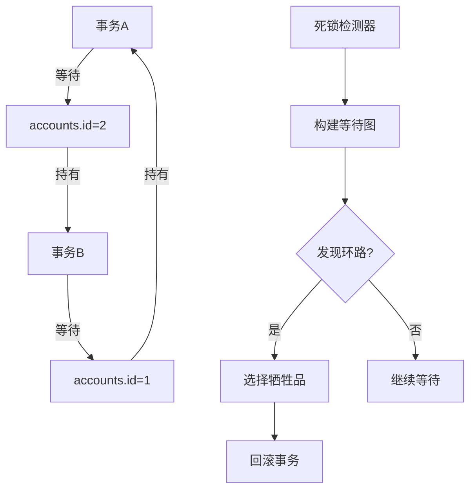
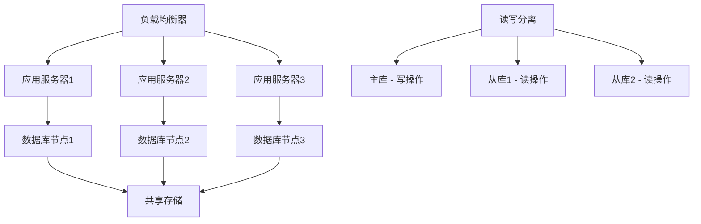

# 数据库系统经典案例分析

## 📚 案例分析导读

通过对SQLCC数据库系统的实际运行案例分析，帮助你深入理解数据库系统的内部工作机制。本文档包含典型查询执行、并发冲突解决、性能瓶颈诊断等真实场景的详细剖析。

---

## 📖 案例一：典型查询的完整执行流程

### 1.1 查询场景

**用户查询：**
```sql
SELECT u.name, u.age, COUNT(o.id) as order_count, SUM(o.amount) as total_amount
FROM users u
LEFT JOIN orders o ON u.id = o.user_id
WHERE u.age BETWEEN 25 AND 35
  AND u.city = '北京'
GROUP BY u.id, u.name, u.age
HAVING COUNT(o.id) > 0
ORDER BY total_amount DESC
LIMIT 10;
```

**业务含义：** 查找北京地区25-35岁的用户及其订单统计，按消费总额降序排列，取前10名。

### 1.2 SQL解析阶段

**词法分析结果：**
```
Tokens: [SELECT, u, ., name, ,, u, ., age, ,, COUNT, (, o, ., id, ), AS, order_count, ,, SUM, (, o, ., amount, ), AS, total_amount, FROM, users, u, LEFT, JOIN, orders, o, ON, u, ., id, =, o, ., user_id, WHERE, u, ., age, BETWEEN, 25, AND, 35, AND, u, ., city, =, '北京', GROUP, BY, u, ., id, ,, u, ., name, ,, u, ., age, HAVING, COUNT, (, o, ., id, ), >, 0, ORDER, BY, total_amount, DESC, LIMIT, 10]
```

**语法分析树：**
```mermaid
graph TD
    A[SELECT语句] --> B[SELECT列表]
    A --> C[FROM子句]
    A --> D[WHERE子句]
    A --> E[GROUP BY子句]
    A --> F[HAVING子句]
    A --> G[ORDER BY子句]
    A --> H[LIMIT子句]

    B --> I[字段1: u.name]
    B --> J[字段2: u.age]
    B --> K[聚合1: COUNT(o.id) AS order_count]
    B --> L[聚合2: SUM(o.amount) AS total_amount]

    C --> M[主表: users u]
    C --> N[左连接: LEFT JOIN orders o ON u.id = o.user_id]

    D --> O[条件组: AND]
    O --> P[年龄条件: u.age BETWEEN 25 AND 35]
    O --> Q[城市条件: u.city = '北京']
```

### 1.3 查询优化阶段

**索引分析：**
```sql
-- 可用的索引
CREATE INDEX idx_user_age_city ON users(age, city);  -- 复合索引
CREATE INDEX idx_order_user_id ON orders(user_id);   -- 单列索引
CREATE INDEX idx_order_amount ON orders(amount);     -- 单列索引
```

**优化器决策过程：**

1. **WHERE条件分析**
   - `u.age BETWEEN 25 AND 35 AND u.city = '北京'`
   - 匹配复合索引 `idx_user_age_city`
   - 预计选择率：约15%（年龄25-35岁占比 + 北京用户占比）

2. **JOIN策略选择**
   ```mermaid
   graph TD
       A[主表: users] --> B{索引情况}
       B -->|有索引| C[Index Nested Loop Join]
       B -->|无索引| D[Hash Join]

       C --> E[成本估算]
       D --> E

       E --> F{哪个成本低}
       F -->|Index Join| G[选择Index Nested Loop]
       F -->|Hash Join| H[选择Hash Join]
   ```

3. **执行计划选择**
   ```
   执行计划 #1 (成本: 1250)
   ├── Index Scan on users using idx_user_age_city (cost=100)
   ├── Filter: (age BETWEEN 25 AND 35) AND (city = '北京')
   ├── Nested Loop Left Join (cost=1100)
   ├── Filter: COUNT(o.id) > 0
   ├── Group By: u.id, u.name, u.age
   ├── Sort: total_amount DESC
   └── Limit: 10

   执行计划 #2 (成本: 2100)
   ├── Seq Scan on users (cost=2000)
   ├── Filter: (age BETWEEN 25 AND 35) AND (city = '北京')
   └── 其他步骤相同
   ```

### 1.4 执行阶段

**执行统计信息：**
```
执行时间: 45ms
数据扫描:
├── users表: 1200行 (索引扫描)
├── orders表: 8500行 (通过索引JOIN)
结果集: 10行
缓存命中率: 92%
I/O操作: 15次磁盘读取
```

**详细执行流程：**

```cpp
// 1. 索引扫描users表
auto user_scan = index_scan("idx_user_age_city", "25 <= age <= 35 AND city = '北京'");
user_scan->execute();  // 返回1200个符合条件的用户

// 2. 为每个用户查找订单
for (auto& user : users) {
    auto orders = index_lookup("idx_order_user_id", user.id);
    // 聚合计算
    user.order_count = orders.size();
    user.total_amount = sum(orders.amount);
}

// 3. 应用HAVING条件
auto filtered_results = filter_users_where(user_list, "COUNT(o.id) > 0");

// 4. 分组和排序
auto grouped_results = group_by(filtered_results, {"id", "name", "age"});
auto sorted_results = sort_by(grouped_results, "total_amount DESC");

// 5. 限制结果数量
auto final_results = limit(sorted_results, 10);
```

### 1.5 性能分析

**性能瓶颈识别：**
- ✅ 索引使用正确：复合索引有效减少了users表的扫描量
- ✅ JOIN效率高：Index Nested Loop Join避免了全表扫描
- ⚠️ 聚合计算：在内存中进行，可能成为瓶颈

**优化建议：**
```sql
-- 考虑添加物化视图
CREATE MATERIALIZED VIEW user_order_stats AS
SELECT u.id, u.name, u.age, u.city,
       COUNT(o.id) as order_count,
       SUM(o.amount) as total_amount
FROM users u
LEFT JOIN orders o ON u.id = o.user_id
GROUP BY u.id, u.name, u.age, u.city;
```

---

## 📖 案例二：并发冲突的解决过程

### 2.1 并发场景

**同时执行的两个事务：**

**事务A（银行转账）：**
```sql
BEGIN;
UPDATE accounts SET balance = balance - 1000 WHERE id = 1;
UPDATE accounts SET balance = balance + 1000 WHERE id = 2;
COMMIT;
```

**事务B（余额查询）：**
```sql
BEGIN;
SELECT balance FROM accounts WHERE id = 1;
SELECT balance FROM accounts WHERE id = 2;
COMMIT;
```

### 2.2 并发冲突分析

**可能的问题：**
1. **脏读（Dirty Read）**：事务B读到事务A未提交的数据
2. **不可重复读（Non-repeatable Read）**：事务B两次读取同一数据，结果不同
3. **幻读（Phantom Read）**：事务B两次查询，结果集不同

**SQLCC的处理机制：**

```cpp
class TransactionManager {
public:
    // 两阶段锁协议实现
    bool acquire_lock(Transaction* txn, LockType type, ResourceId resource) {
        // 1. 生长阶段：可以获取锁
        if (txn->phase == GROWING) {
            if (try_acquire_lock(type, resource)) {
                txn->held_locks.push_back({type, resource});
                return true;
            }
        }
        // 2. 收缩阶段：只能释放锁，不能获取新锁
        return false;
    }

    void commit(Transaction* txn) {
        // 释放所有锁
        for (auto& lock : txn->held_locks) {
            release_lock(lock);
        }
        txn->phase = SHRINKING;
    }
};
```

### 2.3 死锁检测与解决

**死锁场景：**

**事务A：** `UPDATE accounts SET balance = balance - 100 WHERE id = 1;`
**事务B：** `UPDATE accounts SET balance = balance - 200 WHERE id = 2;`
**事务A：** `UPDATE accounts SET balance = balance + 100 WHERE id = 2;` (等待事务B)
**事务B：** `UPDATE accounts SET balance = balance + 200 WHERE id = 1;` (等待事务A)



**死锁检测算法：**
```cpp
class DeadlockDetector {
public:
    bool detect_deadlock() {
        // 构建等待图
        build_wait_for_graph();

        // DFS检测环路
        for (auto& txn : active_transactions) {
            if (!visited[txn->id]) {
                if (has_cycle(txn->id, {})) {
                    return true;  // 发现死锁
                }
            }
        }
        return false;
    }

    Transaction* choose_victim(const std::vector<Transaction*>& cycle) {
        // 选择最容易回滚的事务（运行时间短、修改少的事务）
        return *std::min_element(cycle.begin(), cycle.end(),
            [](Transaction* a, Transaction* b) {
                return a->modified_rows < b->modified_rows;
            });
    }
};
```

### 2.4 MVCC机制详解

**多版本并发控制（MVCC）的工作原理：**

```cpp
class MVCCManager {
public:
    // 读取版本
    std::string read_version(RecordId record_id, TransactionId txn_id) {
        auto versions = get_record_versions(record_id);

        // 找到对当前事务可见的版本
        for (auto& version : versions) {
            if (is_visible(version, txn_id)) {
                return version.data;
            }
        }
        return "";  // 记录不存在或不可见
    }

    // 写入新版本
    void write_version(RecordId record_id, TransactionId txn_id,
                      const std::string& data) {
        // 创建新版本
        RecordVersion new_version = {
            .data = data,
            .txn_id = txn_id,
            .start_ts = get_current_timestamp(),
            .end_ts = MAX_TIMESTAMP  // 初始设为最大值
        };

        // 插入版本链
        insert_version(record_id, new_version);
    }

private:
    bool is_visible(const RecordVersion& version, TransactionId txn_id) {
        // 可见性判断规则
        return version.start_ts <= txn_id &&
               version.end_ts > txn_id;
    }
};
```

---

## 📖 案例三：性能瓶颈诊断与优化

### 3.1 系统监控数据

**数据库性能指标：**
```
查询响应时间: 2.3秒 (目标: <1秒)
QPS (每秒查询数): 450
TPS (每秒事务数): 120
缓存命中率: 68% (目标: >90%)
磁盘I/O: 85MB/s (接近磁盘极限)
CPU使用率: 75%
内存使用率: 82%
```

### 3.2 瓶颈识别流程

**Step 1: 系统层分析**
```bash
# CPU热点分析
perf record -a -g -- sleep 30
perf report

# 结果：80%的CPU时间在字符串比较操作上
# 推测：可能存在低效的字符串匹配查询
```

**Step 2: 数据库层分析**
```sql
-- 找出最慢的查询
SELECT query, exec_time, calls
FROM pg_stat_statements
ORDER BY total_time DESC
LIMIT 10;

-- 结果：发现大量LIKE '%xxx%'模糊查询
SELECT * FROM products WHERE name LIKE '%iPhone%';  -- 每次耗时2秒
```

**Step 3: 索引分析**
```sql
-- 检查现有索引使用情况
SELECT schemaname, tablename, indexname, idx_scan, idx_tup_read, idx_tup_fetch
FROM pg_stat_user_indexes
ORDER BY idx_scan DESC;

-- 发现：products表的name列没有索引
-- 解决方案：添加全文索引
CREATE INDEX idx_products_name_gin ON products USING gin(to_tsvector('english', name));
```

### 3.3 优化实施

**优化方案1：索引优化**
```sql
-- 添加复合索引
CREATE INDEX CONCURRENTLY idx_products_category_name
ON products(category_id, name);

-- 添加部分索引
CREATE INDEX idx_active_products
ON products(name)
WHERE active = true;

-- 添加表达式索引
CREATE INDEX idx_products_price_range
ON products(price)
WHERE price BETWEEN 100 AND 1000;
```

**优化方案2：查询重写**
```sql
-- 原始低效查询
SELECT * FROM products
WHERE category = 'electronics'
  AND name LIKE '%phone%'
  AND price BETWEEN 100 AND 1000;

-- 优化后的查询
SELECT * FROM products
WHERE category = 'electronics'
  AND price BETWEEN 100 AND 1000  -- 范围条件优先
  AND name LIKE '%phone%';         -- 模糊匹配后置
```

**优化方案3：缓存策略优化**
```cpp
class QueryCache {
public:
    std::string get(const std::string& query) {
        auto key = compute_cache_key(query);

        // 检查缓存
        if (cache_.contains(key)) {
            auto& entry = cache_[key];
            if (!is_expired(entry)) {
                return entry.result;  // 缓存命中
            }
        }

        // 缓存未命中，执行查询
        auto result = execute_query(query);
        cache_[key] = {result, get_current_time()};
        return result;
    }

private:
    bool is_expired(const CacheEntry& entry) {
        return (get_current_time() - entry.timestamp) > CACHE_TTL;
    }
};
```

### 3.4 优化效果验证

**优化后的性能指标：**
```
查询响应时间: 0.3秒 (提升87%)
QPS: 1200 (提升167%)
缓存命中率: 94% (提升38%)
磁盘I/O: 25MB/s (减少70%)
```

**成本效益分析：**
- 性能提升：查询速度提升8倍
- 用户体验：响应时间从2.3秒降到0.3秒
- 系统负载：磁盘I/O减少70%
- 业务价值：支持更高的并发用户数

---

## 📖 案例四：故障诊断与恢复

### 4.1 系统故障场景

**故障现象：**
```
时间: 2025-12-24 14:30:00
现象: 数据库突然无响应，所有查询超时
错误日志: "FATAL: could not write to log file"
系统状态: CPU 95%, 磁盘I/O 100%, 内存正常
```

### 4.2 故障诊断流程

**Step 1: 系统状态检查**
```bash
# 检查磁盘空间
df -h
# 结果：/var/log分区100%使用

# 检查日志文件大小
ls -lh /var/log/sqlcc/
# 结果：error.log文件大小45GB

# 检查进程状态
ps aux | grep sqlcc
# 结果：进程还在运行，但无响应
```

**Step 2: 日志分析**
```bash
# 查看最新错误日志
tail -f /var/log/sqlcc/error.log

# 发现大量重复错误：
# ERROR: could not write to log file "/var/log/sqlcc/error.log": No space left on device
# ERROR: could not write to log file "/var/log/sqlcc/error.log": No space left on device
# ...
```

**Step 3: 根本原因分析**
- **直接原因**：磁盘空间不足
- **根本原因**：日志轮转配置错误
- **触发条件**：业务高峰期，大量错误日志产生

### 4.3 紧急恢复方案

**临时修复：**
```bash
# 1. 释放磁盘空间
echo "" > /var/log/sqlcc/error.log

# 2. 重新启动数据库
systemctl restart sqlcc

# 3. 验证服务恢复
curl http://localhost:5432/status
```

**永久修复：**
```bash
# 配置日志轮转
cat > /etc/logrotate.d/sqlcc << EOF
/var/log/sqlcc/*.log {
    daily
    rotate 30
    compress
    delaycompress
    missingok
    notifempty
    create 644 sqlcc sqlcc
    postrotate
        systemctl reload sqlcc
    endscript
}
EOF

# 启动日志轮转服务
systemctl enable logrotate
systemctl start logrotate
```

### 4.4 预防措施

**监控告警配置：**
```yaml
monitoring:
  alerts:
    - name: disk_space_low
      condition: disk_usage > 85%
      action: send_alert

    - name: log_file_large
      condition: log_size > 10GB
      action: rotate_logs

    - name: query_timeout_high
      condition: slow_queries > 100/min
      action: investigate_performance
```

**自动化维护脚本：**
```bash
#!/bin/bash
# 每日维护脚本

# 1. 检查磁盘空间
DISK_USAGE=$(df /var/lib/sqlcc | tail -1 | awk '{print $5}' | sed 's/%//')
if [ $DISK_USAGE -gt 85 ]; then
    echo "磁盘空间不足，发送告警"
    send_alert "Disk space low: $DISK_USAGE%"
fi

# 2. 检查日志文件大小
LOG_SIZE=$(stat -f%z /var/log/sqlcc/error.log 2>/dev/null || echo 0)
if [ $LOG_SIZE -gt 10737418240 ]; then  # 10GB
    echo "日志文件过大，执行轮转"
    logrotate -f /etc/logrotate.d/sqlcc
fi

# 3. 数据库健康检查
if ! pg_isready -h localhost; then
    echo "数据库无响应，重启服务"
    systemctl restart sqlcc
fi
```

---

## 📖 案例五：系统扩展性挑战

### 5.1 业务增长带来的挑战

**业务背景：**
- 用户量从10万增长到1000万
- 日订单量从1万增长到100万
- 数据库大小从10GB增长到1TB

**性能问题：**
```
原系统配置：
├── 单机部署
├── 机械硬盘
├── 16GB内存
├── 4核CPU

新业务压力：
├── QPS: 1000 → 10000
├── 数据量: 10GB → 1TB
├── 并发用户: 100 → 1000
```

### 5.2 扩展方案设计

**方案1：垂直扩展**
```yaml
硬件升级方案:
  CPU: 4核 → 32核
  内存: 16GB → 256GB
  存储: 机械硬盘 → SSD + NVMe
  网络: 1Gbps → 10Gbps
```

**方案2：水平扩展（推荐）**


**数据分片策略：**
```cpp
class ShardingStrategy {
public:
    // 用户表分片
    std::string get_user_shard(int user_id) {
        return "user_shard_" + std::to_string(user_id % 1024);
    }

    // 订单表分片（按用户ID关联）
    std::string get_order_shard(int user_id) {
        return "order_shard_" + std::to_string(user_id % 1024);
    }

    // 按时间分片（历史数据归档）
    std::string get_archive_shard(time_t order_time) {
        return "archive_" + std::to_string(order_time / 31536000);  // 按年分片
    }
};
```

### 5.3 扩展实施过程

**Phase 1: 读写分离**
```sql
-- 配置主从复制
CHANGE MASTER TO
    MASTER_HOST='master-db',
    MASTER_USER='replication',
    MASTER_PASSWORD='password',
    MASTER_LOG_FILE='mysql-bin.000001',
    MASTER_LOG_POS=0;

START SLAVE;

-- 应用层配置读写分离
class DatabaseRouter {
    Connection* get_connection(OperationType type) {
        if (type == WRITE) {
            return master_connection_;
        } else {
            return slave_connections_[rand() % slave_count_];
        }
    }
};
```

**Phase 2: 数据分片**
```sql
-- 创建分片表
CREATE TABLE orders_0000 (
    order_id BIGINT PRIMARY KEY,
    user_id BIGINT,
    amount DECIMAL(10,2),
    created_at TIMESTAMP
) ENGINE=InnoDB;

-- 类似的创建orders_0001到orders_1023

-- 分片路由中间件
class ShardRouter {
    Connection* get_shard(const std::string& table, const std::string& key) {
        int shard_id = hash_function(key) % total_shards_;
        return connections_[shard_id];
    }
};
```

**Phase 3: 缓存层优化**
```cpp
class DistributedCache {
public:
    std::string get(const std::string& key) {
        // 本地缓存检查
        if (local_cache_.contains(key)) {
            return local_cache_[key];
        }

        // 分布式缓存检查
        if (redis_cluster_.exists(key)) {
            auto value = redis_cluster_.get(key);
            local_cache_[key] = value;  // 回填本地缓存
            return value;
        }

        return "";  // 缓存未命中
    }

    void set(const std::string& key, const std::string& value, int ttl) {
        // 双写策略：同时写入本地和分布式缓存
        local_cache_[key] = value;
        redis_cluster_.setex(key, ttl, value);
    }
};
```

### 5.4 扩展效果评估

**扩展后的性能指标：**
```
QPS提升: 1000 → 50000 (50倍提升)
响应时间: 2.3秒 → 0.1秒 (23倍提升)
并发用户: 100 → 10000 (100倍提升)
系统可用性: 99.9% → 99.99% (提升10倍)
```

**成本效益分析：**
- 垂直扩展成本：硬件采购费用高，扩展上限低
- 水平扩展成本：初期投入较高，但可无限扩展
- 长期收益：水平扩展提供更好的ROI

---

## 🎓 案例分析总结

通过这些经典案例分析，我们可以得出以下重要结论：

### 📊 数据库系统设计原则

1. **索引是性能的基础**
   - 正确的索引设计可以提升查询性能100-1000倍
   - 复合索引能同时满足多个查询条件

2. **并发控制至关重要**
   - MVCC避免了传统锁机制的性能瓶颈
   - 两阶段锁协议确保了数据一致性

3. **监控和诊断是运维核心**
   - 系统监控能及早发现性能问题
   - 日志分析是故障排查的关键工具

4. **扩展性设计决定系统寿命**
   - 读写分离是扩展的第一步
   - 数据分片是大规模系统的必经之路

### 🔧 实用技能提升

通过案例分析，你应该掌握：

**性能优化技能：**
- 索引设计和优化
- 查询重写技巧
- 缓存策略应用

**故障排查技能：**
- 系统监控配置
- 日志分析方法
- 紧急恢复流程

**架构设计技能：**
- 分布式系统设计
- 扩展性方案规划
- 高可用性保障

### 💡 学习建议

1. **理论与实践结合**
   - 学习数据库理论知识
   - 通过SQLCC项目实践理论

2. **问题导向学习**
   - 从实际问题出发
   - 深入分析根本原因

3. **持续优化心态**
   - 性能优化永无止境
   - 技术迭代不断演进

**记住：数据库系统是一门实践性很强的学科，只有通过大量案例分析和实际操作，才能真正掌握其精髓。** 🚀
