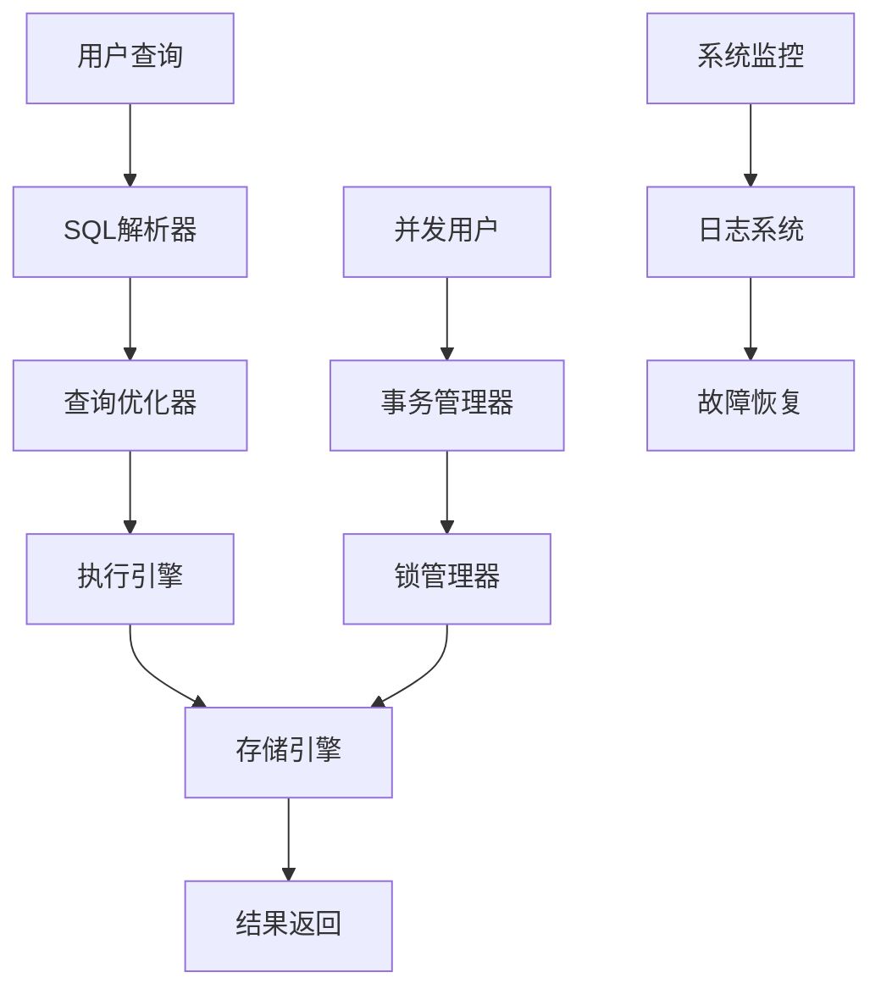
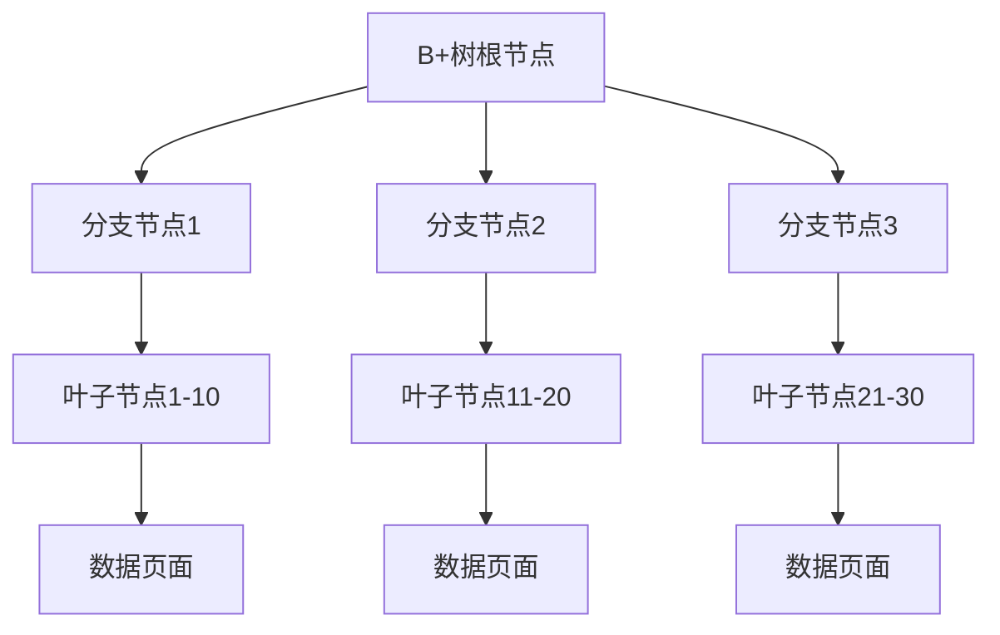
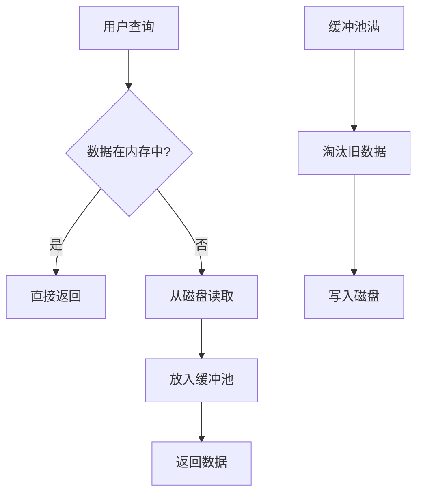
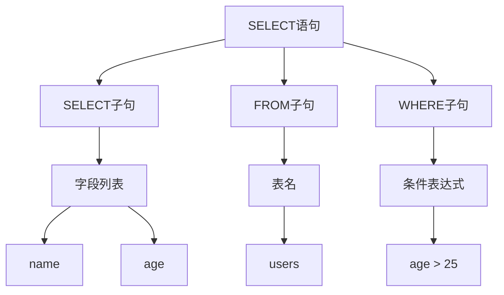
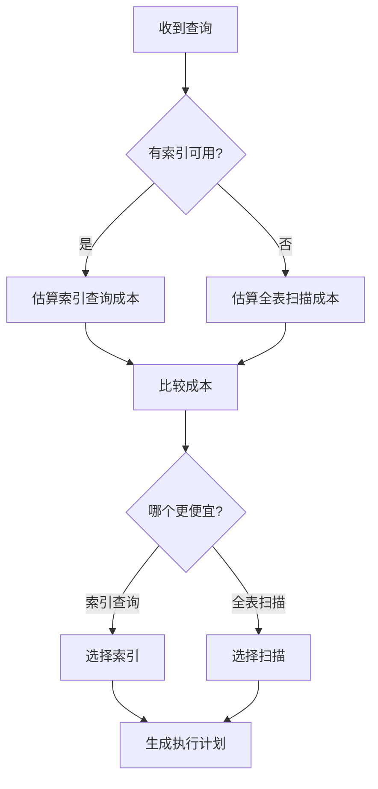
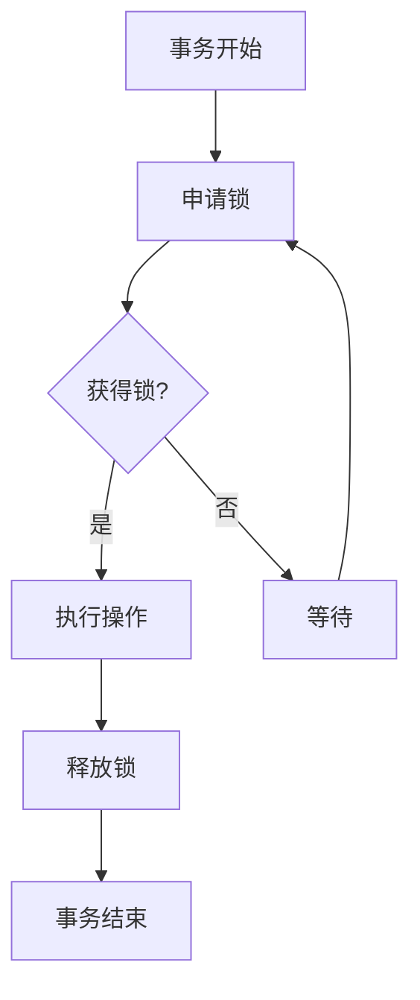
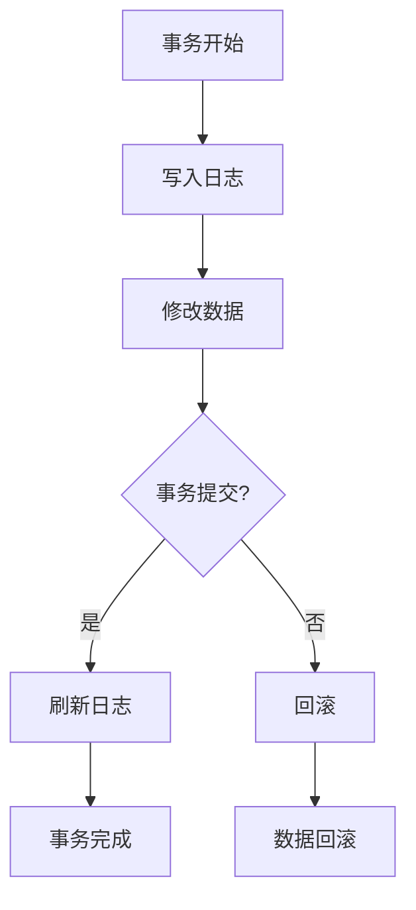
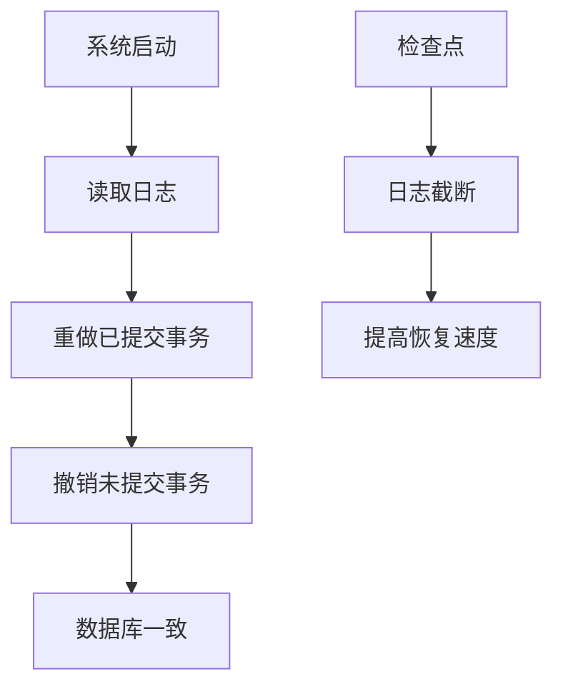

# 《数据库系统原理与开发实践》学习指南

## 📚 课程概述

本学习指南专为大学二年级学生设计，帮助你系统掌握现代数据库系统的核心技术。通过SQLCC开源项目的实战案例，你将从理论学习逐步过渡到实际开发。

### 🎯 学习目标
- 掌握数据库系统核心组件的工作原理
- 理解SQL查询处理的完整流程
- 学会分析和优化数据库性能
- 掌握数据库系统的故障诊断方法

---

## 📖 第一章：数据库系统基础

### 1.1 数据库是什么？

**生活化的理解：**
想象你有一个巨大的Excel表格集合，但比Excel聪明100倍：
- Excel：你手动整理数据
- 数据库：你告诉它"找出年龄>25岁的用户"，它自己找出来

**技术定义：**
数据库是一个有组织的数据集合，通过数据库管理系统(DBMS)进行高效访问和管理。

### 1.2 数据库系统的核心功能



### 1.3 SQLCC项目的学习价值

SQLCC是一个完整的数据库系统实现，包含：
- ✅ 存储引擎：B+树索引、缓冲池管理
- ✅ 查询处理器：SQL解析、查询优化
- ✅ 事务系统：ACID保证、并发控制
- ✅ 网络通信：客户端-服务器架构

---

## 📖 第二章：存储引擎深度剖析

### 2.1 B+树索引：数据库的"快速查找器"

**为什么需要索引？**

```sql
-- 没有索引：全表扫描100万行
SELECT * FROM users WHERE age = 25;

-- 有索引：直接定位到几行数据
SELECT * FROM users WHERE age = 25;
```

**B+树的工作原理：**



**关键特性：**
- 所有数据都在叶子节点
- 叶子节点用双向链表连接
- 支持范围查询：`WHERE age BETWEEN 20 AND 30`

### 2.2 缓冲池：数据库的"内存缓存"

**内存vs磁盘速度对比：**
- 内存访问：100纳秒
- 磁盘访问：10毫秒
- 差距：10万倍！

**缓冲池的作用：**


**置换策略：**
- **LRU**：最近最少使用
- **LFU**：最少频率使用
- **ARC**：自适应缓存算法

---

## 📖 第三章：查询处理流程

### 3.1 SQL解析：把文字变成数据结构

**解析过程：**

```sql
-- 用户输入
SELECT name, age FROM users WHERE age > 25

-- 解析结果
{
  "select": ["name", "age"],
  "from": "users",
  "where": {
    "condition": "age > 25",
    "operator": ">",
    "left": "age",
    "right": 25
  }
}
```

**AST（抽象语法树）结构：**


### 3.2 查询优化：选择最优执行方案

**优化器的思考过程：**



**代价估算因素：**
- 数据页读取数量
- CPU处理时间
- I/O操作次数
- 内存使用量

---

## 📖 第四章：事务与并发控制

### 4.1 ACID属性：数据库的"安全保证"

**A (Atomicity) - 原子性：**
要么全部成功，要么全部失败

```sql
-- 银行转账示例
BEGIN TRANSACTION;
UPDATE accounts SET balance = balance - 100 WHERE id = 1;  -- 从账户1扣钱
UPDATE accounts SET balance = balance + 100 WHERE id = 2;  -- 给账户2加钱
COMMIT;  -- 同时成功或同时失败
```

**C (Consistency) - 一致性：**
数据库始终保持数据一致性

**I (Isolation) - 隔离性：**
并发事务互不干扰

**D (Durability) - 持久性：**
一旦提交，数据永久保存

### 4.2 并发控制：多用户同时访问

**问题场景：**
```sql
-- 用户A查询余额
SELECT balance FROM accounts WHERE id = 1;  -- 看到1000

-- 用户B同时转出
UPDATE accounts SET balance = balance - 100 WHERE id = 1;  -- 余额变成900

-- 用户A再次查询
SELECT balance FROM accounts WHERE id = 1;  -- 应该看到900
```

**解决方案：锁机制**


---

## 📖 第五章：性能优化实践

### 5.1 索引优化策略

**索引使用场景：**
```sql
-- 适合建索引
SELECT * FROM users WHERE age = 25;           -- 等值查询
SELECT * FROM users WHERE age BETWEEN 20 AND 30; -- 范围查询
SELECT * FROM users ORDER BY age;             -- 排序查询

-- 不适合建索引
SELECT * FROM users WHERE age * 2 = 50;       -- 计算列
SELECT * FROM users WHERE name LIKE '%张%';    -- 前缀匹配
```

**复合索引优化：**
```sql
-- 单列索引
CREATE INDEX idx_age ON users(age);
CREATE INDEX idx_name ON users(name);

-- 复合索引
CREATE INDEX idx_age_name ON users(age, name);

-- 查询效果对比
SELECT * FROM users WHERE age = 25 AND name = '张三';  -- 复合索引更快
```

### 5.2 查询优化技巧

**JOIN优化：**
```sql
-- 优化前：笛卡尔积
SELECT * FROM users u, orders o WHERE u.id = o.user_id;

-- 优化后：显式JOIN
SELECT * FROM users u
INNER JOIN orders o ON u.id = o.user_id;
```

**子查询优化：**
```sql
-- 低效子查询
SELECT * FROM users WHERE id IN (
    SELECT user_id FROM orders WHERE amount > 100
);

-- 优化为JOIN
SELECT DISTINCT u.* FROM users u
INNER JOIN orders o ON u.id = o.user_id
WHERE o.amount > 100;
```

---

## 📖 第六章：故障诊断与恢复

### 6.1 日志系统：数据库的"黑匣子"

**WAL (Write-Ahead Logging) 原理：**


**日志内容：**
- 事务ID
- 操作类型（INSERT/UPDATE/DELETE）
- 旧值和新值
- 时间戳

### 6.2 故障恢复流程

**系统崩溃恢复：**


---

## 📖 第七章：实验与实践

### 7.1 源码阅读指南

**阅读SQLCC源码的正确姿势：**

1. **从main函数开始**
   ```cpp
   // src/sqlcc_server/server_main.cpp
   int main(int argc, char* argv[]) {
       // 服务器启动入口
   }
   ```

2. **理解组件关系**
   ```cpp
   // 核心组件调用关系
   SQLParser -> QueryOptimizer -> Executor -> StorageEngine
   ```

3. **跟踪查询执行**
   ```cpp
   // 从客户端接收查询
   // 1. 网络层接收
   // 2. 解析层处理
   // 3. 优化层规划
   // 4. 执行层运行
   // 5. 存储层访问
   ```

### 7.2 修改实验设计

**实验1：添加新的SQL函数**

```cpp
// 任务：在SQL解析器中添加UPPER()函数支持

// 1. 修改词法分析器 (lexer.cpp)
ADD_TOKEN(UPPER, "UPPER");

// 2. 修改语法分析器 (parser.cpp)
function_call : UPPER LPAREN expression RPAREN;

// 3. 实现函数执行逻辑
std::string SqlExecutor::execute_upper(const std::string& input) {
    // 转换为大写
    return to_upper(input);
}
```

**实验2：实现新的索引类型**

```cpp
// 任务：添加哈希索引支持

class HashIndex : public IndexInterface {
public:
    void insert(const Key& key, const Value& value) override {
        size_t hash_value = hash_function(key);
        buckets[hash_value].push_back({key, value});
    }

    Value* search(const Key& key) override {
        size_t hash_value = hash_function(key);
        // 查找对应桶中的数据
    }
};
```

### 7.3 测试编写技巧

**单元测试编写：**
```cpp
TEST(BPlusTreeTest, InsertAndSearch) {
    BPlusTree tree;

    // 插入测试数据
    tree.insert(10, "value10");
    tree.insert(20, "value20");
    tree.insert(5, "value5");

    // 验证搜索结果
    EXPECT_EQ(tree.search(10), "value10");
    EXPECT_EQ(tree.search(20), "value20");
    EXPECT_EQ(tree.search(5), "value5");
}
```

**性能测试编写：**
```cpp
BENCHMARK(BPlusTreeBenchmark) {
    BPlusTree tree;

    // 准备测试数据
    for (int i = 0; i < 100000; ++i) {
        tree.insert(i, "value" + std::to_string(i));
    }

    // 测量搜索性能
    for (int i = 0; i < 10000; ++i) {
        tree.search(rand() % 100000);
    }
}
```

---

## 📖 第八章：项目实践与就业指导

### 8.1 数据库系统开发路线图

**初级开发者：**
- 掌握SQL基础语法
- 理解关系数据库原理
- 学习MySQL/PostgreSQL使用

**中级开发者：**
- 深入数据库内核原理
- 掌握索引和查询优化
- 学习分布式数据库

**高级开发者：**
- 数据库系统架构设计
- 性能调优和故障排查
- 开源数据库贡献

### 8.2 就业建议

**数据库相关岗位：**
- 数据库管理员(DBA)
- 数据库开发工程师
- 数据架构师
- 后端开发工程师

**技能要求：**
- 扎实的数据库理论基础
- 熟练的SQL编写能力
- 性能优化经验
- 系统架构设计能力

### 8.3 学习资源推荐

**在线课程：**
- Database System Concepts (数据库系统概念)
- Database Management Systems (数据库管理系统)

**实践项目：**
- SQLCC数据库系统
- TinyDB实现
- 分布式数据库设计

**社区参与：**
- GitHub开源项目贡献
- 技术博客写作
- 技术分享交流

---

## 🎓 结语

通过本学习指南，你已经掌握了现代数据库系统的核心技术。从基础概念到高级优化，从理论学习到实践开发，希望你能在数据库领域不断深入探索。

**记住：好的数据库设计就像好的建筑结构，既要坚固可靠，又要高效美观。**

**祝你在数据库的世界中探索愉快，前程似锦！🚀**
