# 《数据库系统原理与开发实践》 - 第10章：云端零信任数据库安全与可信计算

**从基础安全到加密勒索防御的完整防护体系**

---

## 🎯 **本章核心目标**

深入理解云端环境下数据库安全的全新挑战与解决方案：
- 掌握零信任安全范式在数据库系统中的工程实现
- 理解可信计算技术如何抵御内存转储、硬盘克隆等物理攻击
- 学习加密勒索攻击的防御机制与数据恢复策略
- 探索AI技术在数据库安全监控、查询优化和人机交互中的应用
- 掌握零信任环境下可信分布式数据库的设计与实现

---

## 10.1 云端数据库安全新挑战：从边界防护到零信任

### 10.1.1 云端环境特有威胁分析：虚拟机逃逸、内存转储与硬盘克隆

云计算的普及带来了前所未有的安全挑战，传统边界防护在动态、多租户的云端环境中逐渐失效：

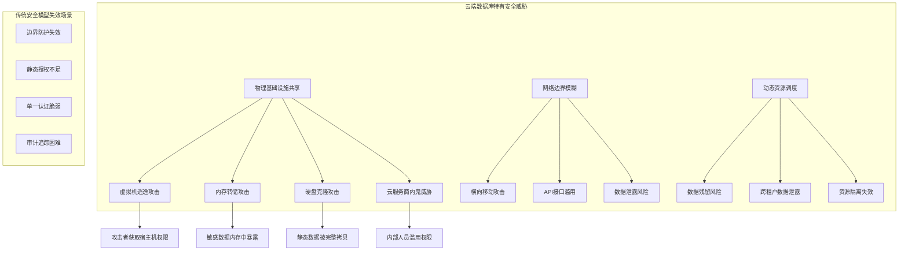
```mermaid
graph TB
    subgraph "云端数据库特有安全威胁"
        A[物理基础设施共享] --> B[虚拟机逃逸攻击]
        A --> C[内存转储攻击]
        A --> D[硬盘克隆攻击]
        A --> E[云服务商内鬼威胁]
        
        F[网络边界模糊] --> G[横向移动攻击]
        F --> H[API接口滥用]
        F --> I[数据泄露风险]
        
        J[动态资源调度] --> K[数据残留风险]
        J --> L[跨租户数据泄露]
        J --> M[资源隔离失效]
    end
    
    subgraph "传统安全模型失效场景"
        N[边界防护失效]
        O[静态授权不足]
        P[单一认证脆弱]
        Q[审计追踪困难]
    end
    
    B --> R[攻击者获取宿主机权限]
    C --> S[敏感数据内存中暴露]
    D --> T[静态数据被完整拷贝]
    E --> U[内部人员滥用权限]
```

**云端数据库面临的物理级攻击**：

1. **虚拟机逃逸（VM Escape）**：攻击者通过虚拟机软件漏洞获取宿主机控制权，进而访问同一物理服务器上的其他客户数据库
2. **内存转储（Memory Dumping）**：通过冷启动攻击或直接内存访问获取数据库进程中的敏感数据，包括加密密钥和未加密的查询结果
3. **硬盘克隆（Disk Cloning）**：云服务商更换故障硬盘时，旧硬盘可能被恶意恢复，获取完整的数据库文件
4. **供应链攻击**：云平台基础设施组件被植入后门，影响所有租户的数据库安全

### 10.1.2 零信任安全范式：永不信任，始终验证

零信任安全模型彻底改变了数据库安全的思维方式，从"信任但验证"转变为"永不信任，始终验证"：

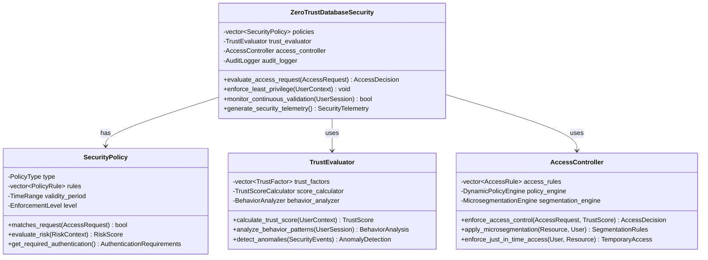
```mermaid
classDiagram
    class ZeroTrustDatabaseSecurity {
        -vector~SecurityPolicy~ policies
        -TrustEvaluator trust_evaluator
        -AccessController access_controller
        -AuditLogger audit_logger
        
        +evaluate_access_request(AccessRequest) AccessDecision
        +enforce_least_privilege(UserContext) void
        +monitor_continuous_validation(UserSession) bool
        +generate_security_telemetry() SecurityTelemetry
    }
    
    class SecurityPolicy {
        -PolicyType type
        -vector~PolicyRule~ rules
        -TimeRange validity_period
        -EnforcementLevel level
        
        +matches_request(AccessRequest) bool
        +evaluate_risk(RiskContext) RiskScore
        +get_required_authentication() AuthenticationRequirements
    }
    
    class TrustEvaluator {
        -vector~TrustFactor~ trust_factors
        -TrustScoreCalculator score_calculator
        -BehaviorAnalyzer behavior_analyzer
        
        +calculate_trust_score(UserContext) TrustScore
        +analyze_behavior_patterns(UserSession) BehaviorAnalysis
        +detect_anomalies(SecurityEvents) AnomalyDetection
    }
    
    class AccessController {
        -vector~AccessRule~ access_rules
        -DynamicPolicyEngine policy_engine
        -MicrosegmentationEngine segmentation_engine
        
        +enforce_access_control(AccessRequest, TrustScore) AccessDecision
        +apply_microsegmentation(Resource, User) SegmentationRules
        +enforce_just_in_time_access(User, Resource) TemporaryAccess
    }
    
    ZeroTrustDatabaseSecurity --> SecurityPolicy : has
    ZeroTrustDatabaseSecurity --> TrustEvaluator : uses
    ZeroTrustDatabaseSecurity --> AccessController : uses
```

**零信任数据库安全的核心原则**：

1. **最小权限访问**：每个用户、设备、应用只能访问完成其任务所必需的最小资源集合
2. **持续验证**：不依赖一次性认证，而是持续验证用户身份、设备健康和访问行为
3. **动态策略执行**：基于风险评分动态调整访问权限，高风险操作需要额外验证
4. **微隔离架构**：在网络层、数据层和应用层实施细粒度的访问控制
5. **全面监控审计**：记录所有访问尝试和安全事件，支持实时威胁检测和事后取证

### 10.1.3 零信任数据库安全架构设计

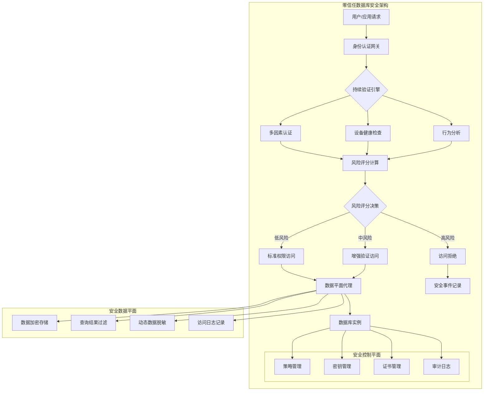
```mermaid
graph TB
    subgraph "零信任数据库安全架构"
        A[用户/应用请求] --> B[身份认证网关]
        
        B --> C{持续验证引擎}
        C --> D[多因素认证]
        C --> E[设备健康检查]
        C --> F[行为分析]
        
        D --> G[风险评分计算]
        E --> G
        F --> G
        
        G --> H{风险评分决策}
        H -->|低风险| I[标准权限访问]
        H -->|中风险| J[增强验证访问]
        H -->|高风险| K[访问拒绝]
        
        I --> L[数据平面代理]
        J --> L
        K --> M[安全事件记录]
        
        L --> N[数据库实例]
        
        subgraph "安全控制平面"
            O[策略管理]
            P[密钥管理]
            Q[证书管理]
            R[审计日志]
        end
        
        N --> O
        N --> P
        N --> Q
        N --> R
    end
    
    subgraph "安全数据平面"
        S[数据加密存储]
        T[查询结果过滤]
        U[动态数据脱敏]
        V[访问日志记录]
    end
    
    L --> S
    L --> T
    L --> U
    L --> V
```

**SQLCC的零信任架构演进路径**：
SQLCC作为教学型数据库，可以从基础安全逐步演进到完整的零信任架构：

```
SQLCC零信任演进路线图:
├── 阶段1: 基础安全加固 (已完成)
│   ├── 用户认证与密码哈希
│   ├── 基于角色的访问控制
│   └── 基本审计日志
├── 阶段2: 网络安全增强 (进行中)
│   ├── TLS加密通信
│   ├── 客户端证书认证
│   └── 网络层访问控制
├── 阶段3: 零信任核心实现 (计划中)
│   ├── 持续验证框架
│   ├── 动态权限管理
│   └── 微隔离支持
└── 阶段4: 高级安全特性 (未来)
    ├── 同态加密查询
    ├── 可信执行环境集成
    └── AI驱动的威胁检测
```

## 10.2 数据库安全设计基础：认证、授权与审计的现代实现

### 10.2.1 多因素认证体系：超越密码的安全边界

单一密码认证在现代攻击面前已显脆弱，多因素认证提供了更强大的身份验证：

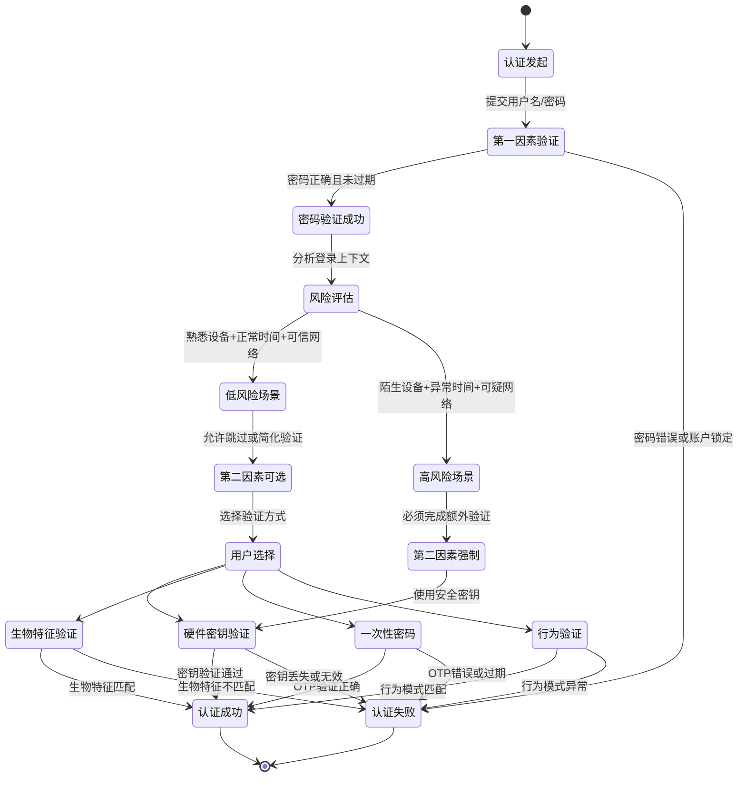
```mermaid
stateDiagram-v2
    [*] --> 认证发起
    认证发起 --> 第一因素验证: 提交用户名/密码
    第一因素验证 --> 密码验证成功: 密码正确且未过期
    第一因素验证 --> 认证失败: 密码错误或账户锁定
    
    密码验证成功 --> 风险评估: 分析登录上下文
    风险评估 --> 低风险场景: 熟悉设备+正常时间+可信网络
    风险评估 --> 高风险场景: 陌生设备+异常时间+可疑网络
    
    低风险场景 --> 第二因素可选: 允许跳过或简化验证
    高风险场景 --> 第二因素强制: 必须完成额外验证
    
    第二因素可选 --> 用户选择: 选择验证方式
    第二因素强制 --> 硬件密钥验证: 使用安全密钥
    
    用户选择 --> 硬件密钥验证
    用户选择 --> 生物特征验证
    用户选择 --> 一次性密码
    用户选择 --> 行为验证
    
    硬件密钥验证 --> 认证成功: 密钥验证通过
    生物特征验证 --> 认证成功: 生物特征匹配
    一次性密码 --> 认证成功: OTP验证正确
    行为验证 --> 认证成功: 行为模式匹配
    
    硬件密钥验证 --> 认证失败: 密钥丢失或无效
    生物特征验证 --> 认证失败: 生物特征不匹配
    一次性密码 --> 认证失败: OTP错误或过期
    行为验证 --> 认证失败: 行为模式异常
    
    认证成功 --> [*]
    认证失败 --> [*]
```

**SQLCC的多因素认证实现策略**：

1. **层次化认证框架**：支持从简单密码到硬件密钥的多级别认证强度
2. **上下文感知认证**：根据登录时间、IP地址、设备指纹等上下文动态调整认证要求
3. **无缝用户体验**：在安全性和便利性之间找到平衡，减少合法用户的不便
4. **防钓鱼保护**：使用WebAuthn等标准防止凭证钓鱼攻击

### 10.2.2 细粒度授权控制：属性基访问控制(ABAC)的实现

传统基于角色的访问控制(RBAC)在复杂场景下显得力不从心，属性基访问控制提供了更灵活的权限管理：

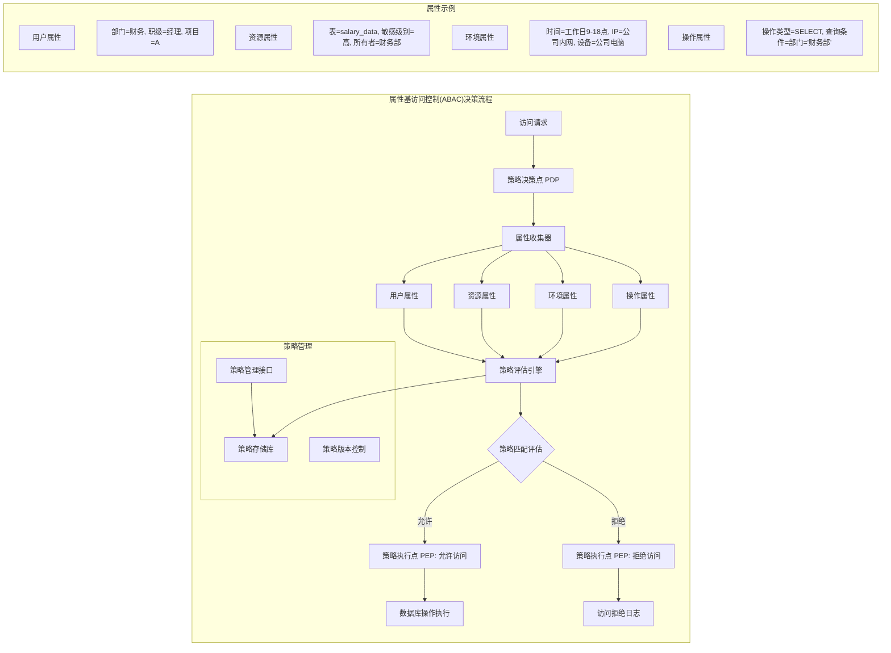
```mermaid
graph LR
    subgraph "属性基访问控制(ABAC)决策流程"
        A[访问请求] --> B[策略决策点 PDP]
        
        B --> C[属性收集器]
        C --> D[用户属性]
        C --> E[资源属性]
        C --> F[环境属性]
        C --> G[操作属性]
        
        D --> H[策略评估引擎]
        E --> H
        F --> H
        G --> H
        
        H --> I{策略匹配评估}
        I -->|允许| J[策略执行点 PEP: 允许访问]
        I -->|拒绝| K[策略执行点 PEP: 拒绝访问]
        
        J --> L[数据库操作执行]
        K --> M[访问拒绝日志]
        
        subgraph "策略管理"
            N[策略存储库]
            O[策略管理接口]
            P[策略版本控制]
        end
        
        H --> N
        O --> N
    end
    
    subgraph "属性示例"
        Q[用户属性]
        R[部门=财务, 职级=经理, 项目=A]
        
        S[资源属性]
        T[表=salary_data, 敏感级别=高, 所有者=财务部]
        
        U[环境属性]
        V[时间=工作日9-18点, IP=公司内网, 设备=公司电脑]
        
        W[操作属性]
        X[操作类型=SELECT, 查询条件=部门='财务部']
    end
```

**ABAC在SQLCC中的具体应用场景**：

1. **动态数据过滤**：根据用户属性自动添加查询条件，实现行级和列级安全
2. **时间限制访问**：限制敏感数据只能在工作时间访问，防止下班后异常访问
3. **位置感知授权**：只允许从公司网络访问生产数据库，VPN访问需要额外验证
4. **操作上下文控制**：批量导出操作需要主管审批，单条查询可以直接执行

### 10.2.3 全链路审计追踪：不可篡改的安全记录

审计追踪是安全事件的"黑匣子"，在发生安全事件时提供关键的调查线索：

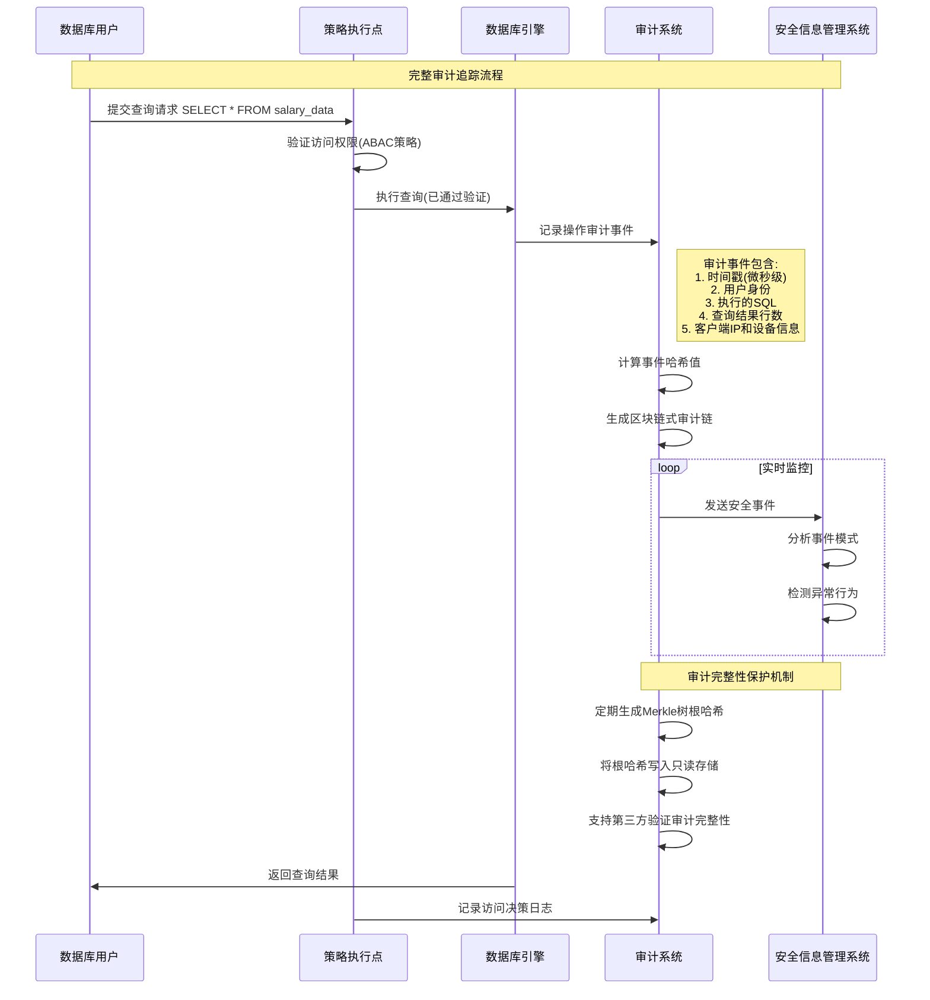
```mermaid
sequenceDiagram
    participant User as 数据库用户
    participant PEP as 策略执行点
    participant DB as 数据库引擎
    participant Audit as 审计系统
    participant SIEM as 安全信息管理系统
    
    Note over User,SIEM: 完整审计追踪流程
    
    User->>PEP: 提交查询请求 SELECT * FROM salary_data
    PEP->>PEP: 验证访问权限(ABAC策略)
    PEP->>DB: 执行查询(已通过验证)
    DB->>Audit: 记录操作审计事件
    
    Note right of Audit: 审计事件包含:<br>1. 时间戳(微秒级)<br>2. 用户身份<br>3. 执行的SQL<br>4. 查询结果行数<br>5. 客户端IP和设备信息
    
    Audit->>Audit: 计算事件哈希值
    Audit->>Audit: 生成区块链式审计链
    
    loop 实时监控
        Audit->>SIEM: 发送安全事件
        SIEM->>SIEM: 分析事件模式
        SIEM->>SIEM: 检测异常行为
    end
    
    Note over Audit,SIEM: 审计完整性保护机制
    Audit->>Audit: 定期生成Merkle树根哈希
    Audit->>Audit: 将根哈希写入只读存储
    Audit->>Audit: 支持第三方验证审计完整性
    
    DB->>User: 返回查询结果
    PEP->>Audit: 记录访问决策日志
```

**SQLCC的审计系统设计特色**：

1. **不可篡改审计日志**：使用密码学哈希链技术确保审计记录一旦写入就无法修改
2. **细粒度审计策略**：支持按用户、操作类型、数据敏感度等多维度配置审计级别
3. **性能影响最小化**：异步审计写入、批量提交、压缩存储等技术减少对数据库性能的影响
4. **实时告警集成**：与SIEM系统集成，支持实时异常检测和自动告警

## 10.3 可信计算与硬件级安全：抵御内存转储与硬盘克隆

### 10.3.1 可信计算基础架构：TPM、TEE与安全启动

可信计算技术提供了硬件级别的安全保障，是防御物理攻击的关键技术：

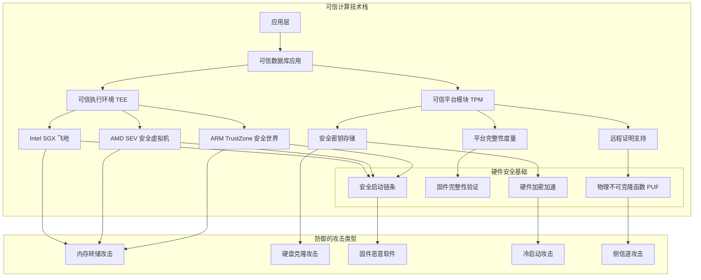
```mermaid
graph TB
    subgraph "可信计算技术栈"
        A[应用层] --> B[可信数据库应用]
        
        B --> C[可信执行环境 TEE]
        C --> D[Intel SGX 飞地]
        C --> E[AMD SEV 安全虚拟机]
        C --> F[ARM TrustZone 安全世界]
        
        B --> G[可信平台模块 TPM]
        G --> H[安全密钥存储]
        G --> I[平台完整性度量]
        G --> J[远程证明支持]
        
        subgraph "硬件安全基础"
            K[安全启动链条]
            L[固件完整性验证]
            M[硬件加密加速]
            N[物理不可克隆函数 PUF]
        end
        
        D --> K
        E --> K
        F --> K
        
        H --> M
        I --> L
        J --> N
    end
    
    subgraph "防御的攻击类型"
        O[内存转储攻击]
        P[硬盘克隆攻击]
        Q[固件恶意软件]
        R[冷启动攻击]
        S[侧信道攻击]
    end
    
    D --> O
    E --> O
    F --> O
    
    H --> P
    K --> Q
    M --> R
    N --> S
```

**可信计算在数据库中的具体应用**：

1. **敏感数据内存保护**：在TEE中处理加密密钥和敏感查询，防止内存转储攻击
2. **全磁盘加密密钥保护**：使用TPM存储全磁盘加密密钥，防止硬盘克隆后的数据泄露
3. **安全启动验证**：确保数据库系统从硬件到应用层的完整启动链都是可信的
4. **远程证明机制**：允许客户端验证数据库服务器的可信状态，建立安全连接

### 10.3.2 内存加密与保护：透明数据加密的内存扩展

传统透明数据加密(TDE)只保护磁盘上的静态数据，内存中的数据仍然是明文的，内存加密技术解决了这一问题：

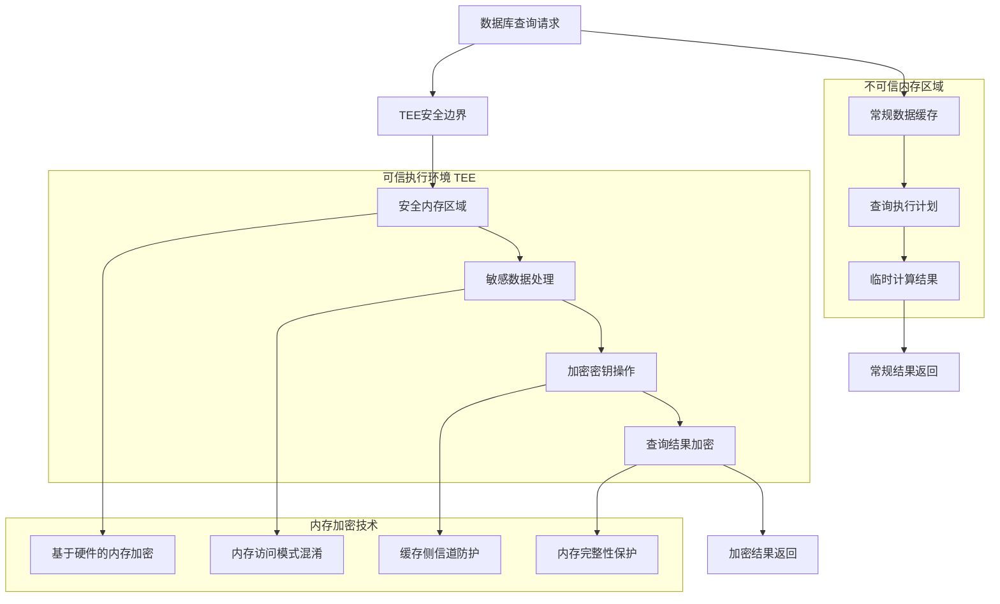
```mermaid
flowchart TD
    A[数据库查询请求] --> B[TEE安全边界]
    
    subgraph "可信执行环境 TEE"
        C[安全内存区域]
        D[敏感数据处理]
        E[加密密钥操作]
        F[查询结果加密]
    end
    
    subgraph "不可信内存区域"
        G[常规数据缓存]
        H[查询执行计划]
        I[临时计算结果]
    end
    
    B --> C
    C --> D
    D --> E
    E --> F
    
    A --> G
    G --> H
    H --> I
    
    F --> J[加密结果返回]
    I --> K[常规结果返回]
    
    subgraph "内存加密技术"
        L[基于硬件的内存加密]
        M[内存访问模式混淆]
        N[缓存侧信道防护]
        O[内存完整性保护]
    end
    
    C --> L
    D --> M
    E --> N
    F --> O
```

**SQLCC的内存安全增强方案**：

1. **选择性内存加密**：只加密包含敏感数据的内存页，平衡安全与性能
2. **密钥轮换策略**：定期更换内存加密密钥，减少密钥泄露的影响范围
3. **安全内存分配**：使用安全内存分配器，防止内存泄漏和越界访问
4. **缓存攻击防护**：实现缓存分区和访问时序随机化，防御缓存侧信道攻击

### 10.3.3 存储层安全增强：全磁盘加密与安全擦除

存储层是数据持久化的地方，也是攻击者获取大量数据的主要目标：

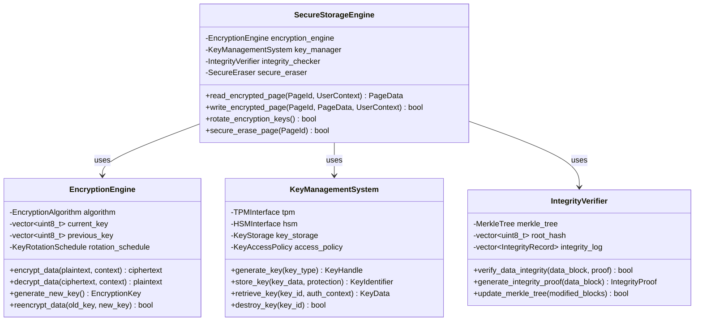
```mermaid
classDiagram
    class SecureStorageEngine {
        -EncryptionEngine encryption_engine
        -KeyManagementSystem key_manager
        -IntegrityVerifier integrity_checker
        -SecureEraser secure_eraser
        
        +read_encrypted_page(PageId, UserContext) PageData
        +write_encrypted_page(PageId, PageData, UserContext) bool
        +rotate_encryption_keys() bool
        +secure_erase_page(PageId) bool
    }
    
    class EncryptionEngine {
        -EncryptionAlgorithm algorithm
        -vector~uint8_t~ current_key
        -vector~uint8_t~ previous_key
        -KeyRotationSchedule rotation_schedule
        
        +encrypt_data(plaintext, context) ciphertext
        +decrypt_data(ciphertext, context) plaintext
        +generate_new_key() EncryptionKey
        +reencrypt_data(old_key, new_key) bool
    }
    
    class KeyManagementSystem {
        -TPMInterface tpm
        -HSMInterface hsm
        -KeyStorage key_storage
        -KeyAccessPolicy access_policy
        
        +generate_key(key_type) KeyHandle
        +store_key(key_data, protection) KeyIdentifier
        +retrieve_key(key_id, auth_context) KeyData
        +destroy_key(key_id) bool
    }
    
    class IntegrityVerifier {
        -MerkleTree merkle_tree
        -vector~uint8_t~ root_hash
        -vector~IntegrityRecord~ integrity_log
        
        +verify_data_integrity(data_block, proof) bool
        +generate_integrity_proof(data_block) IntegrityProof
        +update_merkle_tree(modified_blocks) bool
    }
    
    SecureStorageEngine --> EncryptionEngine : uses
    SecureStorageEngine --> KeyManagementSystem : uses
    SecureStorageEngine --> IntegrityVerifier : uses
```

**防御硬盘克隆的技术组合**：

1. **硬件级全磁盘加密**：使用自加密硬盘(SED)或OPAL兼容硬盘，加密密钥存储在硬件中
2. **密钥与硬件绑定**：将加密密钥与TPM或服务器硬件唯一标识绑定，防止硬盘在其他设备上解密
3. **快速安全擦除**：实现密码学擦除，通过删除加密密钥瞬间使所有数据无法访问
4. **完整性保护**：使用Merkle树等技术验证磁盘数据未被篡改

## 10.4 加密勒索防御：数据备份、恢复与完整性保护

### 10.4.1 勒索软件攻击模式分析：数据库特有威胁

数据库系统是勒索软件攻击的高价值目标，攻击者不仅加密数据文件，还会针对备份系统和日志文件：

```
数据库勒索攻击的完整杀伤链:
├── 初始入侵阶段:
│   ├── 方式1: SQL注入攻击获取数据库访问权限
│   ├── 方式2: 利用未授权访问漏洞直接连接数据库
│   ├── 方式3: 通过应用服务器漏洞横向移动到数据库
│   └── 方式4: 内部人员恶意操作或社会工程学攻击
├── 权限提升阶段:
│   ├── 提权目标: 获取数据库管理员(DBA)权限
│   ├── 技术手段: 利用数据库漏洞、弱密码、配置错误
│   └── 持久化: 创建后门账户、计划任务、存储过程
├── 侦查与扩散阶段:
│   ├── 信息收集: 枚举数据库、表、用户、权限
│   ├── 网络发现: 寻找备份服务器、复制节点
│   └── 横向移动: 利用信任关系攻击关联系统
├── 加密破坏阶段:
│   ├── 主要目标: 加密数据文件、日志文件、备份文件
│   ├── 次要目标: 删除或加密事务日志防止恢复
│   ├── 破坏手段: 使用高强度加密算法，删除原始文件
│   └── 勒索手段: 留下勒索信息，要求支付加密货币
└── 影响最大化阶段:
    ├── 破坏备份: 加密或删除所有备份副本
    ├── 破坏恢复: 删除系统表、破坏数据库一致性
    └── 威胁升级: 威胁公开敏感数据(双重勒索)
```

### 10.4.2 防勒索数据库设计：不可变备份与快速恢复

防御勒索攻击需要多层次的安全措施，核心是确保攻击者无法同时破坏所有数据副本：

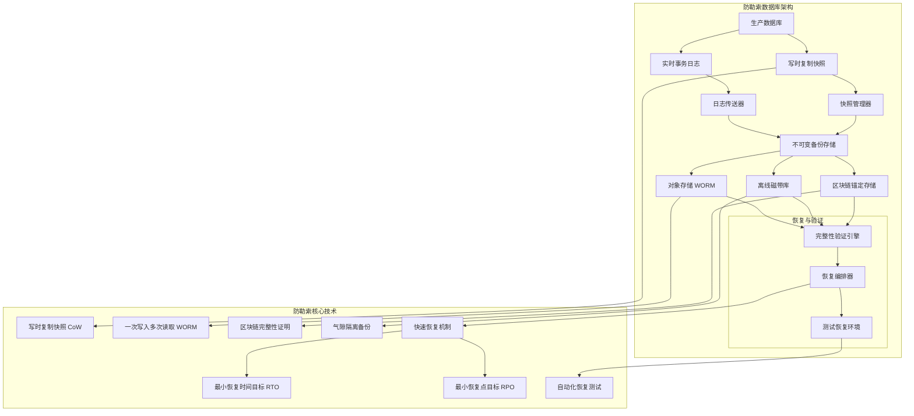
```mermaid
graph TB
    subgraph "防勒索数据库架构"
        A[生产数据库] --> B[实时事务日志]
        A --> C[写时复制快照]
        
        B --> D[日志传送器]
        C --> E[快照管理器]
        
        D --> F[不可变备份存储]
        E --> F
        
        F --> G[对象存储 WORM]
        F --> H[离线磁带库]
        F --> I[区块链锚定存储]
        
        subgraph "恢复与验证"
            J[完整性验证引擎]
            K[恢复编排器]
            L[测试恢复环境]
        end
        
        G --> J
        H --> J
        I --> J
        
        J --> K
        K --> L
    end
    
    subgraph "防勒索核心技术"
        M[写时复制快照 CoW]
        N[一次写入多次读取 WORM]
        O[区块链完整性证明]
        P[气隙隔离备份]
        
        Q[快速恢复机制]
        R[最小恢复时间目标 RTO]
        S[最小恢复点目标 RPO]
        T[自动化恢复测试]
    end
    
    C --> M
    G --> N
    I --> O
    H --> P
    
    K --> Q
    Q --> R
    Q --> S
    L --> T
```

**SQLCC的防勒索备份策略**：

1. **3-2-1备份原则**：
   - 至少保存3份数据副本
   - 使用至少2种不同的存储介质
   - 至少有1份离线或异地备份

2. **不可变备份实现**：
   - 使用WORM(一次写入多次读取)存储
   - 基于时间的保留策略，防止提前删除
   - 基于区块链的备份完整性证明

3. **快速恢复机制**：
   - 预配置的恢复模板和脚本
   - 增量恢复与并行恢复优化
   - 定期恢复演练确保可行性

### 10.4.3 基于AI的异常行为检测与主动防御

传统的基于签名的检测方法对新型勒索攻击效果有限，AI技术可以提供更强大的异常检测能力：

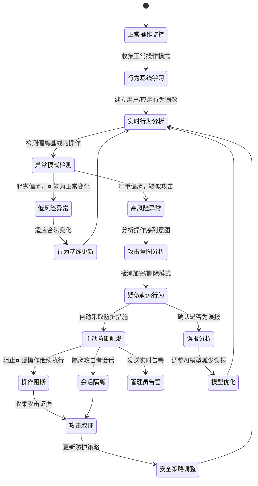
```mermaid
stateDiagram-v2
    [*] --> 正常操作监控
    正常操作监控 --> 行为基线学习: 收集正常操作模式
    
    行为基线学习 --> 实时行为分析: 建立用户/应用行为画像
    
    实时行为分析 --> 异常模式检测: 检测偏离基线的操作
    异常模式检测 --> 低风险异常: 轻微偏离，可能为正常变化
    
    低风险异常 --> 行为基线更新: 适应合法变化
    行为基线更新 --> 实时行为分析
    
    异常模式检测 --> 高风险异常: 严重偏离，疑似攻击
    高风险异常 --> 攻击意图分析: 分析操作序列意图
    
    攻击意图分析 --> 疑似勒索行为: 检测加密/删除模式
    疑似勒索行为 --> 主动防御触发: 自动采取防护措施
    
    主动防御触发 --> 操作阻断: 阻止可疑操作继续执行
    主动防御触发 --> 会话隔离: 隔离攻击者会话
    主动防御触发 --> 管理员告警: 发送实时告警
    
    操作阻断 --> 攻击取证: 收集攻击证据
    会话隔离 --> 攻击取证
    
    攻击取证 --> 安全策略调整: 更新防护策略
    安全策略调整 --> 实时行为分析
    
    疑似勒索行为 --> 误报分析: 确认是否为误报
    误报分析 --> 模型优化: 调整AI模型减少误报
    模型优化 --> 实时行为分析
```

**AI驱动的勒索攻击检测特征**：

1. **操作频率异常**：短时间内大量删除或加密操作
2. **访问模式异常**：访问平时不接触的备份文件或系统表
3. **时间模式异常**：在非工作时间执行高危操作
4. **数据流向异常**：大量数据外传或异常加密
5. **权限使用异常**：普通用户突然使用管理员权限

## 10.5 AI增强的数据库安全：智能威胁检测与自适应防护

### 10.5.1 AI驱动的安全监控：从规则引擎到智能分析

传统基于规则的安全监控难以应对复杂多变的攻击，AI技术提供了更强大的分析能力：

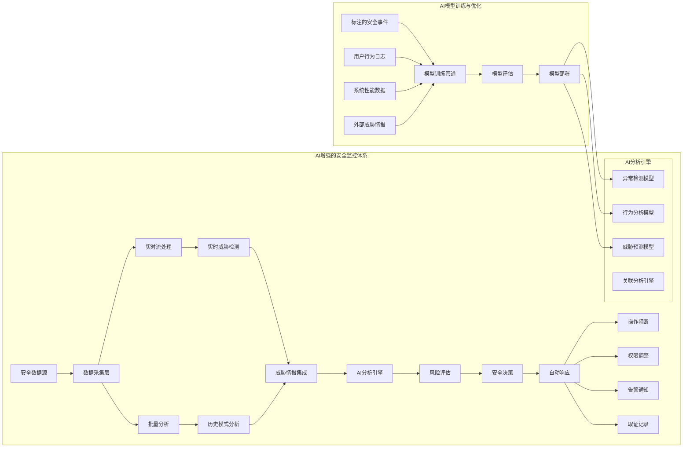
```mermaid
graph LR
    subgraph "AI增强的安全监控体系"
        A[安全数据源] --> B[数据采集层]
        
        B --> C[实时流处理]
        B --> D[批量分析]
        
        C --> E[实时威胁检测]
        D --> F[历史模式分析]
        
        E --> G[威胁情报集成]
        F --> G
        
        G --> H[AI分析引擎]
        
        subgraph "AI分析引擎"
            I[异常检测模型]
            J[行为分析模型]
            K[威胁预测模型]
            L[关联分析引擎]
        end
        
        H --> M[风险评估]
        M --> N[安全决策]
        N --> O[自动响应]
        
        O --> P[操作阻断]
        O --> Q[权限调整]
        O --> R[告警通知]
        O --> S[取证记录]
    end
    
    subgraph "AI模型训练与优化"
        T[标注的安全事件]
        U[用户行为日志]
        V[系统性能数据]
        W[外部威胁情报]
        
        T --> X[模型训练管道]
        U --> X
        V --> X
        W --> X
        
        X --> Y[模型评估]
        Y --> Z[模型部署]
        Z --> I
        Z --> J
        Z --> K
    end
```

**SQLCC的AI安全监控集成**：

1. **轻量级AI引擎**：针对资源受限环境优化的机器学习模型
2. **增量学习能力**：能够从新数据中持续学习，适应环境变化
3. **可解释AI输出**：提供人类可理解的威胁分析和决策依据
4. **隐私保护分析**：使用联邦学习等技术，在不暴露敏感数据的情况下训练模型

### 10.5.2 自适应查询优化：安全感知的查询处理

传统的查询优化只关注性能，现代数据库需要同时考虑安全因素：

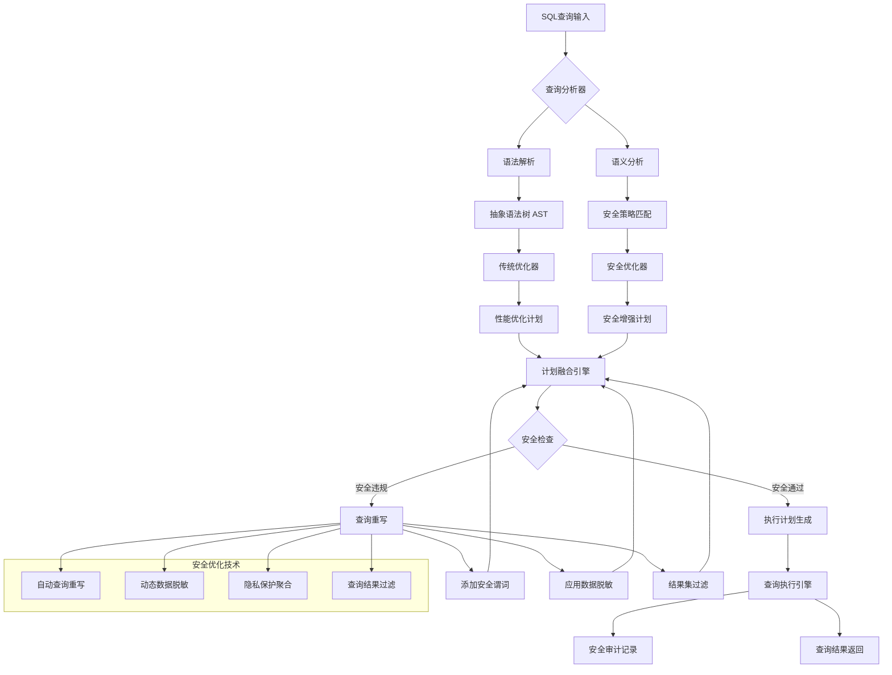
```mermaid
flowchart TD
    A[SQL查询输入] --> B{查询分析器}
    
    B --> C[语法解析]
    B --> D[语义分析]
    
    C --> E[抽象语法树 AST]
    D --> F[安全策略匹配]
    
    E --> G[传统优化器]
    F --> H[安全优化器]
    
    G --> I[性能优化计划]
    H --> J[安全增强计划]
    
    I --> K[计划融合引擎]
    J --> K
    
    K --> L{安全检查}
    L -->|安全违规| M[查询重写]
    L -->|安全通过| N[执行计划生成]
    
    M --> O[添加安全谓词]
    M --> P[应用数据脱敏]
    M --> Q[结果集过滤]
    
    O --> K
    P --> K
    Q --> K
    
    N --> R[查询执行引擎]
    R --> S[安全审计记录]
    R --> T[查询结果返回]
    
    subgraph "安全优化技术"
        U[自动查询重写]
        V[动态数据脱敏]
        W[隐私保护聚合]
        X[查询结果过滤]
    end
    
    M --> U
    M --> V
    M --> W
    M --> X
```

**安全感知的查询优化策略**：

1. **最小数据暴露原则**：自动添加查询条件，只返回用户有权访问的数据
2. **动态数据脱敏**：根据用户权限动态决定显示完整数据还是脱敏数据
3. **隐私保护聚合**：使用差分隐私等技术，在聚合查询中保护个体隐私
4. **查询计划安全性分析**：评估不同执行计划可能带来的安全风险

### 10.5.3 智能人机交互：自然语言查询与可视化安全

AI技术可以显著改善数据库的人机交互体验，同时增强安全性：

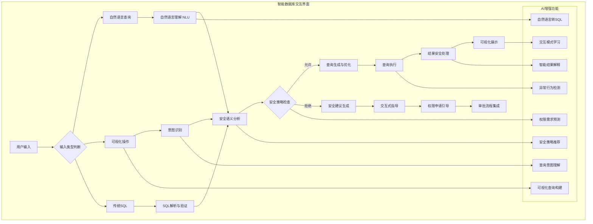
```mermaid
graph TB
    subgraph "智能数据库交互界面"
        A[用户输入] --> B{输入类型判断}
        
        B --> C[自然语言查询]
        B --> D[可视化操作]
        B --> E[传统SQL]
        
        C --> F[自然语言理解 NLU]
        D --> G[意图识别]
        E --> H[SQL解析与验证]
        
        F --> I[安全语义分析]
        G --> I
        H --> I
        
        I --> J{安全策略检查}
        J -->|允许| K[查询生成与优化]
        J -->|拒绝| L[安全建议生成]
        
        K --> M[查询执行]
        L --> N[交互式指导]
        
        M --> O[结果安全处理]
        N --> P[权限申请引导]
        
        O --> Q[可视化展示]
        P --> R[审批流程集成]
        
        subgraph "AI增强功能"
            S[自然语言转SQL]
            T[查询意图理解]
            U[智能结果解释]
            V[可视化查询构建]
            
            W[安全策略推荐]
            X[权限需求预测]
            Y[异常行为检测]
            Z[交互模式学习]
        end
        
        F --> S
        G --> T
        O --> U
        D --> V
        
        I --> W
        J --> X
        M --> Y
        Q --> Z
    end
```

**AI增强的数据库交互特性**：

1. **自然语言查询**：允许非技术用户用自然语言查询数据库，AI负责转换为安全SQL
2. **智能权限推荐**：基于用户角色和历史操作，推荐合适的权限配置
3. **可视化安全态势**：图形化展示数据库安全状态、访问模式和潜在风险
4. **交互式安全指导**：当用户权限不足时，提供具体的权限申请指导和审批流程

## 10.6 零信任环境下的可信分布式数据库：SQLCC的扩展设计

### 10.6.1 SQLCC的零信任架构演进：从单机到分布式

SQLCC作为教学数据库，可以展示从传统架构到零信任分布式架构的完整演进路径：

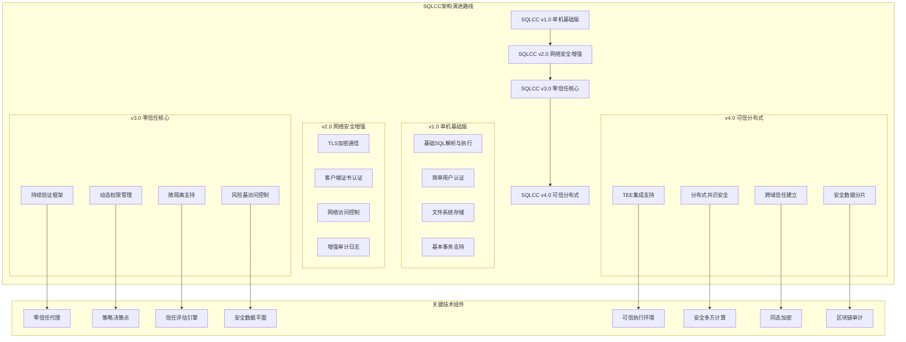
```mermaid
graph TB
    subgraph "SQLCC架构演进路线"
        A[SQLCC v1.0 单机基础版] --> B[SQLCC v2.0 网络安全增强]
        
        B --> C[SQLCC v3.0 零信任核心]
        C --> D[SQLCC v4.0 可信分布式]
        
        subgraph "v1.0 单机基础版"
            E[基础SQL解析与执行]
            F[简单用户认证]
            G[文件系统存储]
            H[基本事务支持]
        end
        
        subgraph "v2.0 网络安全增强"
            I[TLS加密通信]
            J[客户端证书认证]
            K[网络访问控制]
            L[增强审计日志]
        end
        
        subgraph "v3.0 零信任核心"
            M[持续验证框架]
            N[动态权限管理]
            O[微隔离支持]
            P[风险基访问控制]
        end
        
        subgraph "v4.0 可信分布式"
            Q[TEE集成支持]
            R[分布式共识安全]
            S[跨域信任建立]
            T[安全数据分片]
        end
    end
    
    subgraph "关键技术组件"
        U[零信任代理]
        V[策略决策点]
        W[信任评估引擎]
        X[安全数据平面]
        
        Y[可信执行环境]
        Z[安全多方计算]
        AA[同态加密]
        BB[区块链审计]
    end
    
    M --> U
    N --> V
    O --> W
    P --> X
    
    Q --> Y
    R --> Z
    S --> AA
    T --> BB
```

**SQLCC零信任分布式架构的核心组件**：

1. **零信任网关**：所有访问请求的入口点，负责身份验证和授权决策
2. **策略决策引擎**：基于ABAC策略动态决定访问权限，支持实时风险评估
3. **信任评估服务**：持续评估用户、设备和会话的可信度，动态调整访问权限
4. **安全数据平面**：在数据层实施微隔离和加密，确保即使网络被突破也能保护数据

### 10.6.2 可信分布式OLTP设计：基于TEE的分布式事务

分布式环境下的OLTP事务处理面临额外的安全挑战，可信执行环境提供了解决方案：

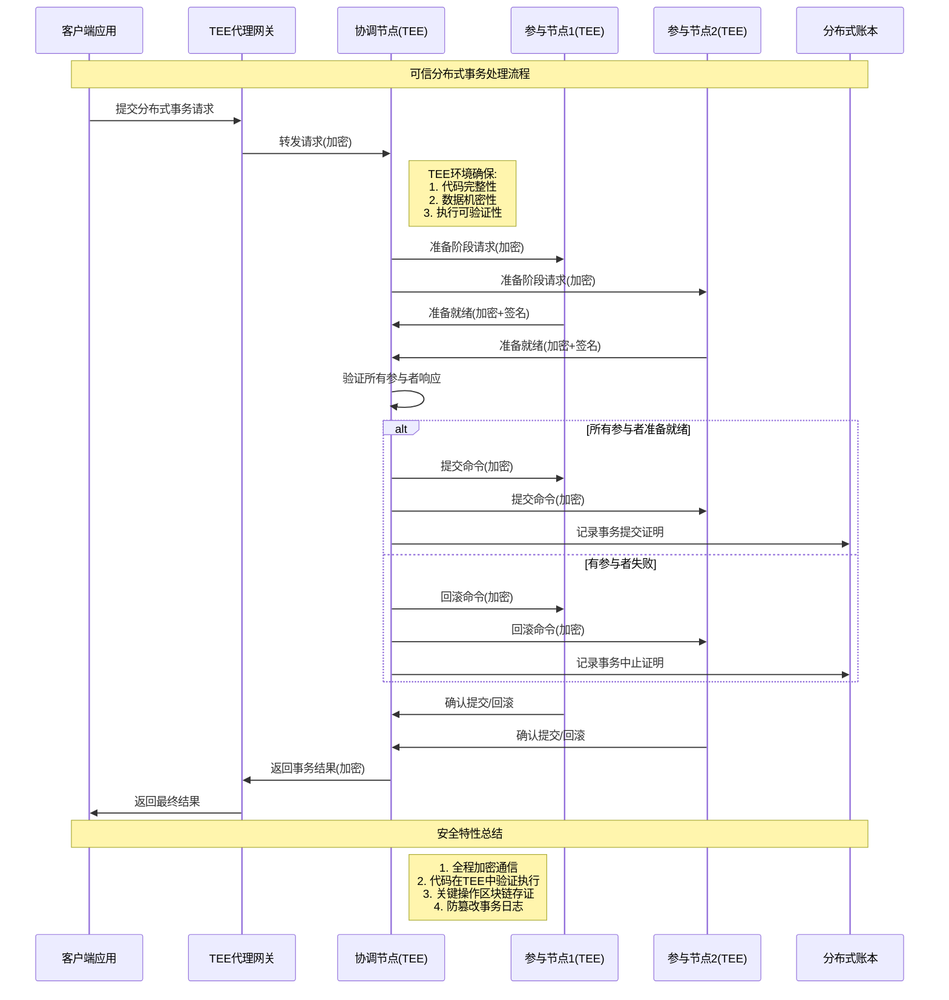
```mermaid
sequenceDiagram
    participant Client as 客户端应用
    participant TEEProxy as TEE代理网关
    participant Coordinator as 协调节点(TEE)
    participant Participant1 as 参与节点1(TEE)
    participant Participant2 as 参与节点2(TEE)
    participant Ledger as 分布式账本
    
    Note over Client,Ledger: 可信分布式事务处理流程
    
    Client->>TEEProxy: 提交分布式事务请求
    TEEProxy->>Coordinator: 转发请求(加密)
    
    Note right of Coordinator: TEE环境确保:<br>1. 代码完整性<br>2. 数据机密性<br>3. 执行可验证性
    
    Coordinator->>Participant1: 准备阶段请求(加密)
    Coordinator->>Participant2: 准备阶段请求(加密)
    
    Participant1->>Coordinator: 准备就绪(加密+签名)
    Participant2->>Coordinator: 准备就绪(加密+签名)
    
    Coordinator->>Coordinator: 验证所有参与者响应
    
    alt 所有参与者准备就绪
        Coordinator->>Participant1: 提交命令(加密)
        Coordinator->>Participant2: 提交命令(加密)
        Coordinator->>Ledger: 记录事务提交证明
    else 有参与者失败
        Coordinator->>Participant1: 回滚命令(加密)
        Coordinator->>Participant2: 回滚命令(加密)
        Coordinator->>Ledger: 记录事务中止证明
    end
    
    Participant1->>Coordinator: 确认提交/回滚
    Participant2->>Coordinator: 确认提交/回滚
    
    Coordinator->>TEEProxy: 返回事务结果(加密)
    TEEProxy->>Client: 返回最终结果
    
    Note over Client,Ledger: 安全特性总结
    Note right of Coordinator: 1. 全程加密通信<br>2. 代码在TEE中验证执行<br>3. 关键操作区块链存证<br>4. 防篡改事务日志
```

**基于TEE的分布式事务安全优势**：

1. **代码完整性保护**：事务协调逻辑在TEE中执行，防止恶意修改
2. **数据机密性**：事务数据和中间状态在TEE内存中加密处理
3. **执行可验证性**：通过远程证明机制验证TEE环境的可信状态
4. **防篡改日志**：关键操作记录到区块链，提供不可否认性证明

### 10.6.3 可信分布式OLAP设计：安全多方计算与隐私保护分析

OLAP分析查询通常涉及大量数据和复杂计算，在分布式环境下需要特别的隐私保护措施：

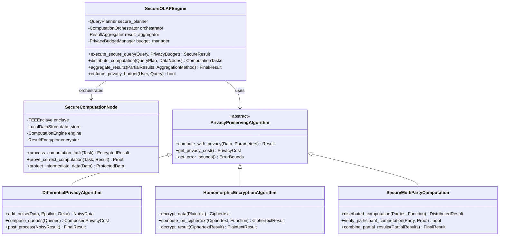
```mermaid
classDiagram
    class SecureOLAPEngine {
        -QueryPlanner secure_planner
        -ComputationOrchestrator orchestrator
        -ResultAggregator result_aggregator
        -PrivacyBudgetManager budget_manager
        
        +execute_secure_query(Query, PrivacyBudget) SecureResult
        +distribute_computation(QueryPlan, DataNodes) ComputationTasks
        +aggregate_results(PartialResults, AggregationMethod) FinalResult
        +enforce_privacy_budget(User, Query) bool
    }
    
    class SecureComputationNode {
        -TEEEnclave enclave
        -LocalDataStore data_store
        -ComputationEngine engine
        -ResultEncryptor encryptor
        
        +process_computation_task(Task) EncryptedResult
        +prove_correct_computation(Task, Result) Proof
        +protect_intermediate_data(Data) ProtectedData
    }
    
    class PrivacyPreservingAlgorithm {
        <<abstract>>
        +compute_with_privacy(Data, Parameters) Result
        +get_privacy_cost() PrivacyCost
        +get_error_bounds() ErrorBounds
    }
    
    class DifferentialPrivacyAlgorithm {
        +add_noise(Data, Epsilon, Delta) NoisyData
        +compose_queries(Queries) ComposedPrivacyCost
        +post_process(NoisyResult) FinalResult
    }
    
    class HomomorphicEncryptionAlgorithm {
        +encrypt_data(Plaintext) Ciphertext
        +compute_on_ciphertext(Ciphertext, Function) CiphertextResult
        +decrypt_result(CiphertextResult) PlaintextResult
    }
    
    class SecureMultiPartyComputation {
        +distributed_computation(Parties, Function) DistributedResult
        +verify_participant_computation(Party, Proof) bool
        +combine_partial_results(PartialResults) FinalResult
    }
    
    SecureOLAPEngine --> SecureComputationNode : orchestrates
    SecureOLAPEngine --> PrivacyPreservingAlgorithm : uses
    PrivacyPreservingAlgorithm <|-- DifferentialPrivacyAlgorithm
    PrivacyPreservingAlgorithm <|-- HomomorphicEncryptionAlgorithm
    PrivacyPreservingAlgorithm <|-- SecureMultiPartyComputation
```

**SQLCC的可信分布式OLAP实现策略**：

1. **分层隐私保护**：根据数据敏感度提供不同级别的隐私保护技术
2. **隐私预算管理**：跟踪每个用户的隐私消耗，防止通过多次查询推断敏感信息
3. **可验证计算**：参与节点提供计算正确性证明，确保分析结果可信
4. **结果效用平衡**：在隐私保护和结果准确性之间找到最佳平衡点

## 10.7 行业实践对比：主流数据库的云端安全实现

### 10.7.1 商业数据库云端安全特性分析

主流云数据库服务商都提供了丰富的安全特性，了解这些实践有助于设计更好的安全方案：

```
三大云数据库安全特性对比:
├── AWS Aurora:
│   ├── 存储加密: 使用AWS KMS管理的密钥进行静态加密
│   ├── 传输加密: TLS 1.2+ for所有客户端连接
│   ├── 网络隔离: VPC私有网络，安全组和网络ACL
│   ├── 身份认证: IAM数据库认证，无需密码
│   ├── 审计日志: CloudTrail集成，活动监控
│   └── 高级特性: 跨区域加密复制，自动密钥轮换
├── Google Cloud Spanner:
│   ├── 全局加密: 默认所有数据在传输和静态时加密
│   ├── 身份识别: IAM细粒度权限，上下文感知访问
│   ├── 数据脱敏: 自动敏感数据识别和脱敏
│   ├── 访问透明: Access Transparency日志记录Google员工访问
│   ├── VPC服务控制: 防止数据外泄到未经授权的网络
│   └── 机密计算: 使用机密VM处理敏感数据
└── Azure SQL Database:
    ├── Always Encrypted: 客户端加密，服务端无法查看明文
    ├── 威胁检测: 内置机器学习威胁检测
    ├── 数据掩码: 动态数据掩码保护敏感列
    ├── 漏洞评估: 自动数据库漏洞扫描
    ├── 高级数据安全: 统一的安全管理仪表板
    └── 私有链接: 私有端点连接，不经过公共互联网
```

### 10.7.2 开源数据库安全增强实践

开源数据库社区也提供了丰富的安全扩展和最佳实践：

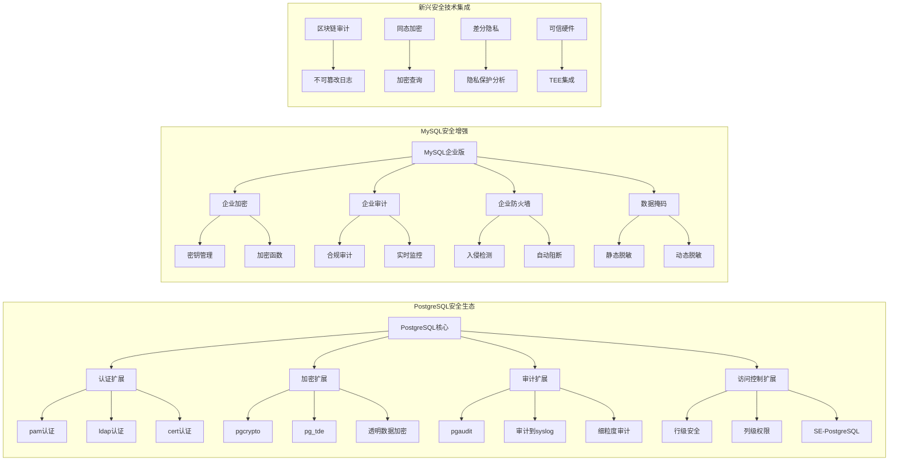
```mermaid
graph LR
    subgraph "PostgreSQL安全生态"
        A[PostgreSQL核心] --> B[认证扩展]
        A --> C[加密扩展]
        A --> D[审计扩展]
        A --> E[访问控制扩展]
        
        B --> F[pam认证]
        B --> G[ldap认证]
        B --> H[cert认证]
        
        C --> I[pgcrypto]
        C --> J[pg_tde]
        C --> K[透明数据加密]
        
        D --> L[pgaudit]
        D --> M[审计到syslog]
        D --> N[细粒度审计]
        
        E --> O[行级安全]
        E --> P[列级权限]
        E --> Q[SE-PostgreSQL]
    end
    
    subgraph "MySQL安全增强"
        R[MySQL企业版] --> S[企业加密]
        R --> T[企业审计]
        R --> U[企业防火墙]
        R --> V[数据掩码]
        
        S --> W[密钥管理]
        S --> X[加密函数]
        
        T --> Y[合规审计]
        T --> Z[实时监控]
        
        U --> AA[入侵检测]
        U --> AB[自动阻断]
        
        V --> AC[静态脱敏]
        V --> AD[动态脱敏]
    end
    
    subgraph "新兴安全技术集成"
        AE[区块链审计] --> AF[不可篡改日志]
        AG[同态加密] --> AH[加密查询]
        AI[差分隐私] --> AJ[隐私保护分析]
        AK[可信硬件] --> AL[TEE集成]
    end
```

**SQLCC从开源社区学习的经验**：

1. **模块化安全架构**：设计可插拔的安全模块，便于社区贡献和定制
2. **标准兼容性**：遵循主流安全标准和协议，确保互操作性
3. **渐进式增强**：从基础安全功能开始，逐步增加高级特性
4. **文档与示例**：提供详细的安全配置指南和最佳实践示例

### 10.7.3 新兴安全技术的前瞻性应用

数据库安全技术正在快速发展，一些前沿技术已经开始在业界应用：

```
新兴数据库安全技术趋势:
├── 后量子密码学:
│   ├── 背景: 量子计算机威胁当前公钥密码体系
│   ├── 标准: NIST后量子密码标准化进程
│   ├── 应用: 数据库TLS连接、数字签名、密钥交换
│   └── 挑战: 性能开销、密钥大小、算法迁移
├── 同态加密实用化:
│   ├── 进展: 部分同态加密性能大幅提升
│   ├── 应用: 加密数据查询、隐私保护机器学习
│   ├── 案例: Microsoft SEAL、IBM HELib
│   └── 限制: 全同态加密仍不实用，部分同态有局限
├── 联邦学习集成:
│   ├── 概念: 分布式机器学习不共享原始数据
│   ├── 应用: 跨组织数据联合分析
│   ├── 架构: 中心协调器+本地模型训练
│   └── 安全: 差分隐私、安全聚合、恶意节点防御
└── 机密计算普及:
    ├── 硬件: Intel SGX、AMD SEV、ARM CCA
    ├── 应用: 敏感数据处理、跨组织数据协作
    ├── 生态: 机密容器、机密Kubernetes、机密数据库
    └── 挑战: 性能开销、开发复杂度、侧信道防御
```

## 10.8 未来趋势与挑战：量子计算、边缘计算与新型威胁

### 10.8.1 量子计算对数据库安全的冲击与应对

量子计算的发展将对当前数据库安全体系产生深远影响：

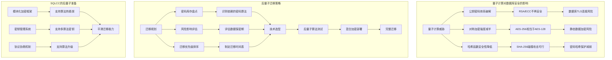
```mermaid
graph TB
    subgraph "量子计算对数据库安全的影响"
        A[量子计算威胁] --> B[公钥密码体系破解]
        A --> C[对称加密强度减半]
        A --> D[哈希函数安全性降低]
        
        B --> E[RSA/ECC不再安全]
        C --> F[AES-256相当于AES-128]
        D --> G[SHA-256碰撞攻击可行]
        
        E --> H[数据库TLS连接风险]
        F --> I[静态数据加密风险]
        G --> J[密码哈希保护减弱]
    end
    
    subgraph "后量子迁移策略"
        K[迁移规划] --> L[密码库存盘点]
        K --> M[风险影响评估]
        K --> N[迁移优先级排序]
        
        L --> O[识别依赖的密码算法]
        M --> P[评估数据保密期]
        N --> Q[制定迁移时间表]
        
        O --> R[技术选型]
        P --> R
        Q --> R
        
        R --> S[后量子算法测试]
        S --> T[混合加密部署]
        T --> U[完整迁移]
    end
    
    subgraph "SQLCC的后量子准备"
        V[模块化加密框架] --> W[支持算法热插拔]
        X[密钥管理系统] --> Y[支持多算法密钥]
        Z[协议协商机制] --> AA[支持算法升级]
        
        W --> AB[平滑迁移能力]
        Y --> AB
        AA --> AB
    end
```

**数据库系统的量子安全迁移策略**：

1. **密码敏捷性设计**：数据库加密系统应设计为支持算法轻松替换
2. **混合加密过渡**：在过渡期同时使用传统和量子安全算法
3. **长期数据保护**：对需要长期保密的数据提前应用后量子加密
4. **密钥生命周期管理**：规划密钥的量子安全轮换和迁移计划

### 10.8.2 边缘计算环境的安全挑战与创新

边缘计算将数据库扩展到网络边缘，带来了新的安全挑战和机遇：

```
边缘数据库安全挑战与解决方案:
├── 资源受限环境:
│   ├── 挑战: 边缘设备计算、存储、电力有限
│   ├── 方案: 轻量级加密算法、安全硬件加速
│   └── 示例: ARM TrustZone、微型TPM模块
├── 物理安全风险:
│   ├── 挑战: 设备可能被物理接触或盗窃
│   ├── 方案: 防篡改外壳、数据自销毁机制
│   └── 示例: 地理围栏、异常移动检测
├── 网络连接不稳定:
│   ├── 挑战: 间歇性连接影响安全同步
│   ├── 方案: 离线安全策略、延迟安全更新
│   └── 示例: 本地策略缓存、增量安全更新
└── 管理与编排复杂:
    ├── 挑战: 大量分散设备的安全管理
    ├── 方案: 零接触配置、集中策略管理
    └── 示例: 安全编排自动化响应(SOAR)
```

### 10.8.3 伦理与合规考量：隐私增强技术与数据治理

随着数据隐私法规的完善，数据库系统需要内置隐私保护能力：

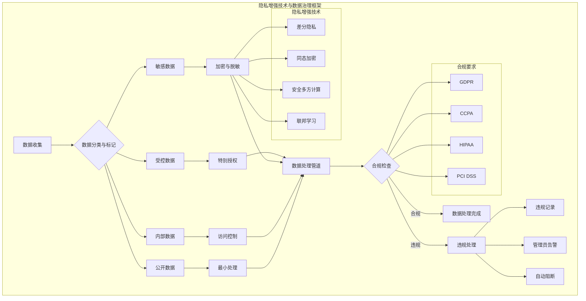
```mermaid
graph TB
    subgraph "隐私增强技术与数据治理框架"
        A[数据收集] --> B{数据分类与标记}
        
        B --> C[公开数据]
        B --> D[内部数据]
        B --> E[敏感数据]
        B --> F[受控数据]
        
        C --> G[最小处理]
        D --> H[访问控制]
        E --> I[加密与脱敏]
        F --> J[特别授权]
        
        G --> K[数据处理管道]
        H --> K
        I --> K
        J --> K
        
        K --> L{合规检查}
        L -->|合规| M[数据处理完成]
        L -->|违规| N[违规处理]
        
        N --> O[违规记录]
        N --> P[管理员告警]
        N --> Q[自动阻断]
        
        subgraph "隐私增强技术"
            R[差分隐私]
            S[同态加密]
            T[安全多方计算]
            U[联邦学习]
        end
        
        subgraph "合规要求"
            V[GDPR]
            W[CCPA]
            X[HIPAA]
            Y[PCI DSS]
        end
        
        I --> R
        I --> S
        I --> T
        I --> U
        
        L --> V
        L --> W
        L --> X
        L --> Y
    end
```

**SQLCC的隐私与合规设计原则**：

1. **隐私设计原则**：将隐私保护融入系统设计的每个阶段
2. **数据最小化**：默认只收集和处理必要的数据
3. **目的限制**：数据只能用于指定的目的
4. **透明性**：向用户清晰说明数据收集和使用情况
5. **用户权利**：支持用户访问、更正、删除个人数据的权利

## 📚 **本章总结：构建面向未来的可信数据库安全体系**

本章深入探讨了云端环境下数据库安全的全方位挑战与解决方案，从基础安全到前沿技术，构建了完整的可信数据库安全知识体系：

### **核心知识体系**：

1. **零信任安全范式**：理解了从传统边界防护到零信任持续验证的演进路径
2. **可信计算技术**：掌握了TPM、TEE等硬件级安全技术如何防御物理攻击
3. **加密勒索防御**：学习了多层次防御机制和快速恢复策略
4. **AI增强安全**：探索了AI在威胁检测、查询优化和人机交互中的应用
5. **分布式可信架构**：理解了零信任环境下可信分布式数据库的设计原理

### **SQLCC实践价值**：

通过SQLCC的架构演进展示，我们看到了教学型数据库如何逐步实现企业级安全特性：
- **渐进式安全增强**：从基础认证到零信任架构的清晰演进路径
- **模块化安全设计**：可插拔的安全组件便于理解和扩展
- **平衡安全与性能**：在不同安全机制间找到性能平衡点
- **前瞻性技术集成**：为量子安全、边缘计算等未来趋势做好准备

### **工程思维培养**：

学习数据库安全不仅是掌握技术，更重要的是培养安全工程思维：
- **威胁建模思维**：从攻击者角度思考，从防御者角度设计
- **深度防御策略**：多层次、多维度的安全防护体系
- **安全开发生命周期**：将安全融入软件开发的每个阶段
- **持续改进文化**：安全是持续的过程，不是一次性的项目

### **未来发展方向**：

数据库安全技术将继续快速发展，未来的数据库系统需要：
- **自适应安全能力**：根据环境和威胁动态调整安全策略
- **隐私计算集成**：在保护隐私的前提下实现数据价值
- **量子安全准备**：为后量子时代提前布局密码体系
- **AI安全协同**：AI既增强安全，也需要防御AI自身的安全风险

---

**思考题**：
1. 零信任安全模型与传统边界防护模型的核心区别是什么？在数据库系统中如何实现？
2. 可信执行环境(TEE)如何防御内存转储攻击？这种防御有什么局限性？
3. 加密勒索攻击通常如何针对数据库系统？设计防勒索数据库需要考虑哪些关键因素？
4. AI技术如何增强数据库安全？同时需要防范哪些AI相关的安全风险？
5. 在分布式数据库环境中，如何建立和维护跨节点的信任关系？

**实践项目**：
1. 基于SQLCC源码，设计并实现一个简单的多因素认证模块
2. 使用Intel SGX SDK或类似工具，实现一个保护敏感查询的TEE应用
3. 设计一个防勒索备份策略，包括不可变备份存储和快速恢复机制
4. 实现一个基于机器学习的异常查询检测原型系统
5. 研究后量子加密算法，设计数据库系统的量子安全迁移方案

通过本章的学习，希望读者不仅掌握了数据库安全的技术细节，更能建立全面的安全思维体系，为设计和实现面向未来的可信数据库系统奠定坚实基础。
