# 第3章 关系数据库理论基础：从数学原理到工程实践

## 3.1 关系数据库的数学基础

### 3.1.1 集合论与关系模型

关系数据库的理论基础建立在严密的数学基础之上，这一基础主要来源于集合论和一阶逻辑。集合论为数据组织提供了基本框架，而关系模型则将这些数学概念具体化为可工程实现的数据库结构。

**数学概念的现实映射**可以通过以下图示理解：

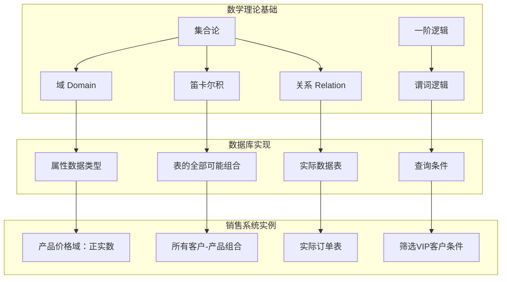

在关系模型中，**域**定义了属性的取值范围，如产品价格必须为正实数，客户状态只能是{'活跃','休眠','注销'}中的值。**元组**表示一个完整的实体实例，如一个客户(客户ID:001, 姓名:张三, 等级:VIP)就是一个元组。**关系**则是具有相同结构的元组集合，对应数据库中的表。

### 3.1.2 关系代数理论体系

关系代数为数据库操作提供了封闭的代数系统，包含八个基本操作符，分为基本运算和扩展运算两类：

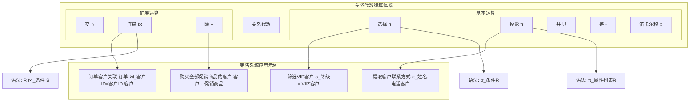

**关系代数的封闭性**是其主要理论特性，意味着任何关系代数运算的结果仍然是关系，这为查询的嵌套和组合提供了理论基础。在工程实践中，这一特性使得复杂的业务查询可以通过基本运算的组合来实现。

### 3.1.3 关系演算与逻辑基础

关系演算基于一阶逻辑，为SQL语言提供了逻辑基础。与关系代数的过程性不同，关系演算是描述性的，它指定要什么而不是如何获取。

```mermaid
graph LR
    subgraph "关系演算体系"
        A[关系演算] --> B[元组关系演算]
        A --> C[域关系演算]
    end
    
    B --> D[表达式: {t | φ(t)}]
    C --> E[表达式: {<x1,x2,...,xn> | φ(x1,x2,...,xn)}]
    
    D --> F[销售系统示例：<br/>查找所有VIP客户]
    E --> G[销售系统示例：<br/>查找北京地区的产品]
    
    F --> H[SQL对应：<br/>SELECT * FROM Customers WHERE category='VIP']
    G --> I[SQL对应：<br/>SELECT product_name FROM Products WHERE warehouse='北京']
```

关系演算中的**谓词逻辑**用于构建查询条件，**量词**用于表达存在性和全称性条件。在销售系统中，如"查找购买了所有促销商品的客户"这样的复杂查询，就可以通过全称量词来表达。

## 3.2 数据建模与规范化理论

### 3.2.1 概念数据模型（CDM）：实体关系建模

概念数据模型从业务视角描述信息结构，不涉及技术实现细节。在销售系统中，我们首先识别核心业务实体和它们之间的关系。

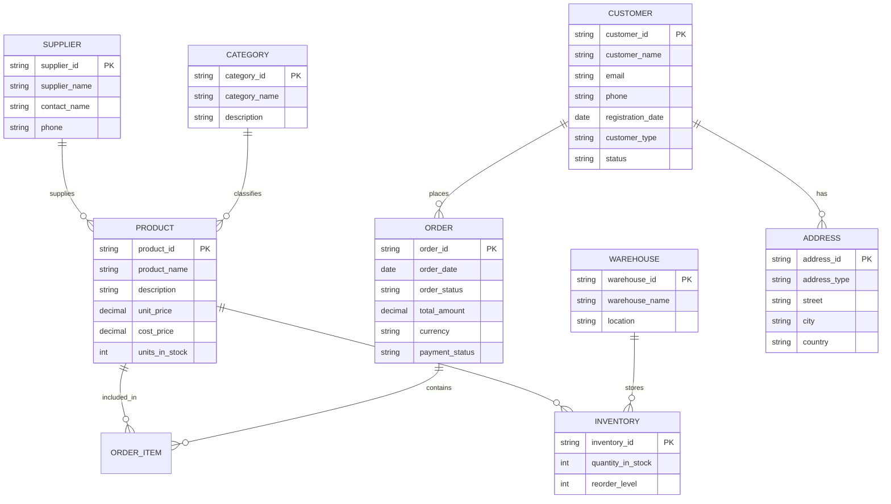

在CDM设计中，我们关注的是**业务语义**而非技术细节。每个实体代表业务中的一个重要概念，每个关系体现业务规则。例如，"客户下订单"关系体现了核心业务活动，"产品属于分类"关系体现了商品组织结构。

### 3.2.2 规范化理论与范式演进

规范化理论通过数学方法消除数据冗余和更新异常，确保数据一致性。规范化过程基于函数依赖理论，遵循严格的数学公理系统。

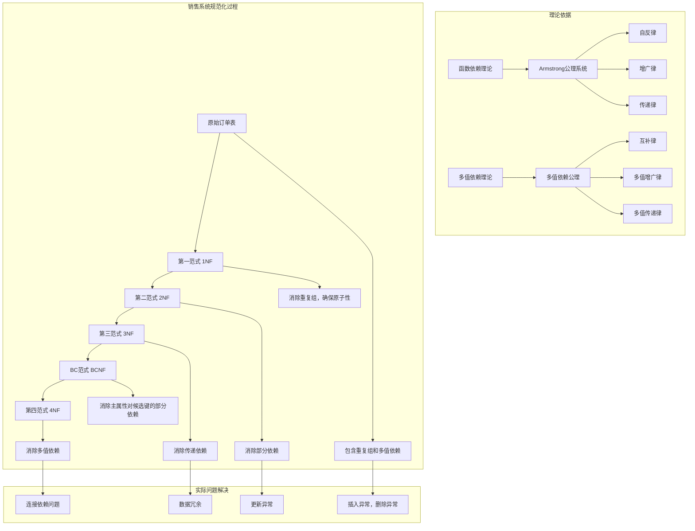

**各范式的形式化定义**：

- **第一范式（1NF）**：关系中每个属性都是原子的，不存在重复组
- **第二范式（2NF）**：满足1NF，且非主属性完全函数依赖于候选键
- **第三范式（3NF）**：满足2NF，且没有非主属性传递依赖于候选键
- **BC范式（BCNF）**：满足3NF，且所有函数依赖的左部都是超键

在销售系统中，规范化过程具体表现为：将包含客户地址的订单表拆分为订单表和客户表，将包含产品信息的订单明细拆分为订单明细表和产品表，以此消除数据冗余和更新异常。

### 3.2.3 函数依赖分析与规范化过程

函数依赖是规范化的核心概念，通过依赖分析可以系统地指导数据库设计。

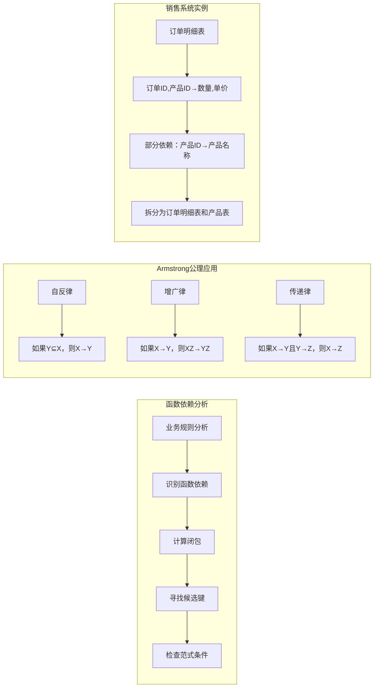

在实际的销售系统设计中，我们通过分析业务规则来识别函数依赖。例如："订单ID确定订单日期"、"产品ID确定产品价格"等。基于这些函数依赖，我们应用规范化理论逐步优化数据模型。

### 3.2.4 逻辑数据模型（LDM）设计

基于规范化理论，我们将概念模型转化为逻辑数据模型，明确表结构、键和关系。

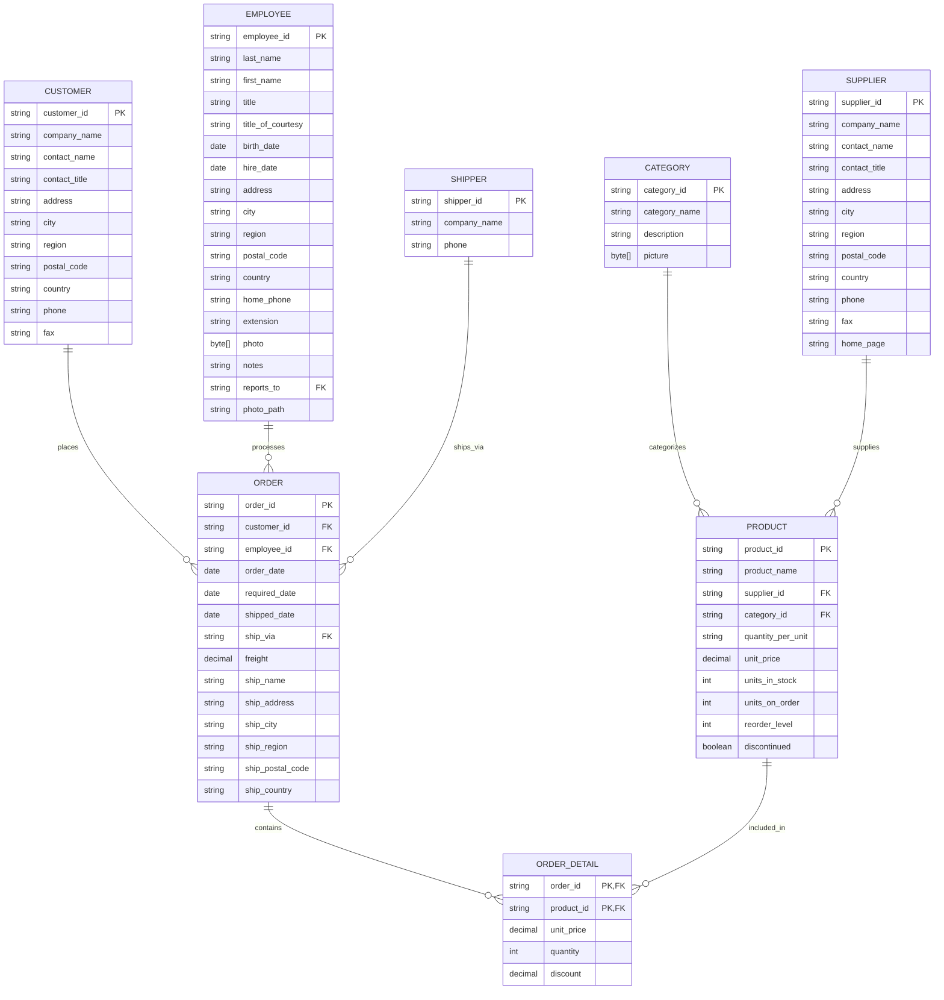

在逻辑数据模型中，我们明确了每个表的主键、外键以及字段的数据类型。这种设计确保了数据的完整性和一致性，为物理实现奠定了基础。

### 3.2.5 物理数据模型（PDM）与性能优化

在规范化基础上，我们需要考虑性能需求进行物理设计，包括索引策略、分区策略和适当的反规范化。

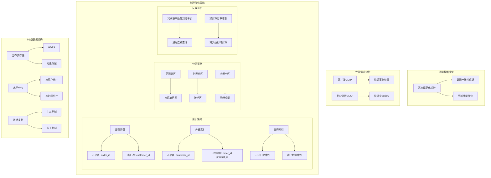

在物理数据模型中，我们需要在规范化和性能之间找到平衡。对于OLTP系统，我们保持较高的规范化程度以确保数据一致性；对于OLAP系统，我们采用适度的反规范化来优化查询性能。

## 3.3 销售系统完整建模实例

### 3.3.1 业务领域分析与概念建模

销售系统的复杂性要求我们首先通过用例图全面分析业务需求和使用场景。

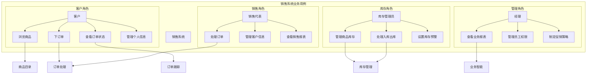

通过用例分析，我们识别出系统的核心功能模块和用户角色，为后续的数据建模提供了业务基础。

### 3.3.2 销售业务流程建模

通过活动图描述从客户浏览商品到完成订单的完整业务流程，帮助我们理解数据在系统中的流动和处理过程。

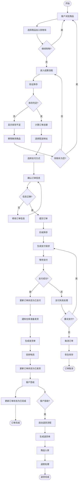

这个详细的业务流程展示了销售系统中数据的完整生命周期，从订单创建到最终完成或取消，每个步骤都涉及特定的数据操作和状态变更。

### 3.3.3 系统架构与组件设计

现代销售系统需要支持高并发访问和海量数据处理，这就要求我们采用分布式的系统架构。

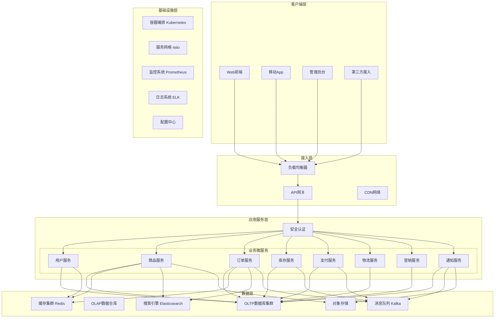

这种微服务架构确保了系统的高可用性和可扩展性，每个服务可以独立开发、部署和扩展，通过API网关统一对外提供服务。

## 3.4 关系代数在销售系统中的应用

### 3.4.1 基本关系运算的实际应用

关系代数的基本运算在销售系统中有着广泛的应用，以下是几个典型示例：

```mermaid
graph TB
    subgraph "选择运算 σ"
        A[筛选特定条件记录] --> B[语法: σ_条件R]
        B --> C[销售系统示例: σ_状态='VIP'客户]
        C --> D[业务含义: 找出所有VIP客户]
        D --> E[SQL对应: SELECT * FROM Customers WHERE status='VIP']
    end
    
    subgraph "投影运算 π"
        F[选择特定属性] --> G[语法: π_属性列表R]
        G --> H[销售系统示例: π_姓名,电话客户]
        H --> I[业务含义: 获取客户联系方式]
        I --> J[SQL对应: SELECT name, phone FROM Customers]
    end
    
    subgraph "连接运算 ⋈"
        K[关联多个表] --> L[语法: R ⋈_条件 S]
        L --> M[销售系统示例: 订单 ⋈_客户ID=客户ID 客户]
        M --> N[业务含义: 获取订单的客户详细信息]
        N --> O[SQL对应: SELECT * FROM Orders JOIN Customers ON Orders.customer_id = Customers.customer_id]
    end
    
    subgraph "除运算 ÷"
        P[包含关系查询] --> Q[语法: R ÷ S]
        Q --> R[销售系统示例: 客户 ÷ 促销商品]
        R --> S[业务含义: 找出购买了所有促销商品的客户]
        S --> T[SQL对应: 使用NOT EXISTS双重否定]
    end
```

这些关系运算可以组合使用，形成复杂的业务查询。例如，要找出北京地区的VIP客户在2023年的订单详情，可以表示为：\
π_订单详情(σ_地区='北京'∧状态='VIP'∧订单日期≥'2023-01-01'(客户 ⋈ 订单))

### 3.4.2 复杂查询的关系代数表示

销售系统中的复杂业务逻辑可以通过关系代数的组合来表达，以下是一些典型复杂查询的关系代数表示：

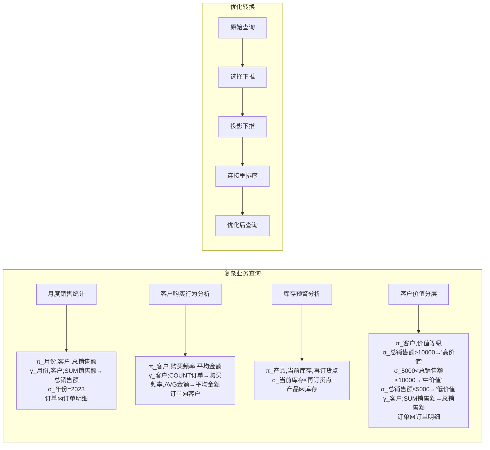

关系代数不仅用于表达查询，还为查询优化提供了理论基础。查询优化器利用关系代数的等价变换规则，将用户查询转换为更高效的执行计划。

## 3.5 范式理论与数据质量保障

### 3.5.1 范式违反的典型问题

不遵守范式理论会导致各种数据异常，影响数据质量和系统可靠性。

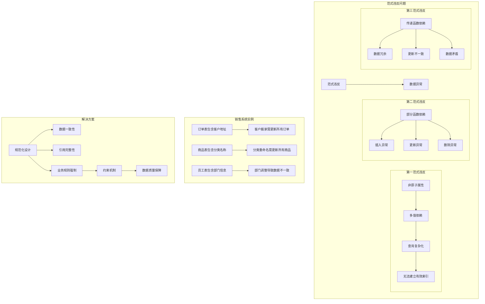

在实际的销售系统中，范式违反会导致严重的业务问题。例如，如果客户地址直接存储在订单表中，当客户搬家时，需要更新所有历史订单中的地址信息，这不仅操作繁琐，还可能导致数据不一致。

### 3.5.2 规范化与性能的平衡

在实际工程实践中，我们需要在规范化程度和系统性能之间找到合适的平衡点。

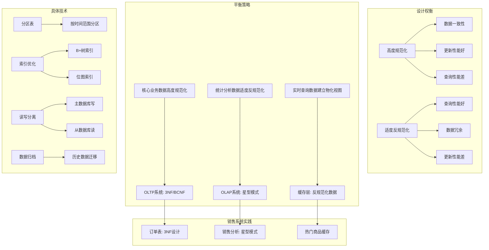

对于OLTP系统，我们通常采用较高的规范化程度（3NF或BCNF）来确保数据一致性；对于OLAP系统，我们采用适度的反规范化（星型模式或雪花模式）来优化查询性能。这种差异化的设计策略能够在保证数据质量的同时满足性能要求。

## 3.6 从理论到实践：完整销售系统设计

### 3.6.1 基于关系代数的查询优化

现代数据库系统的查询优化器大量使用关系代数理论来优化查询性能。

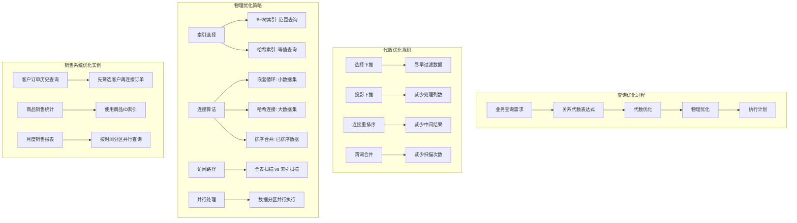

查询优化器将用户的SQL查询转换为关系代数表达式，然后应用各种优化规则生成高效的执行计划。例如，对于"查询VIP客户最近一个月的订单"这样的查询，优化器会选择先按时间筛选订单，再与客户表连接，而不是先连接再筛选。

### 3.6.2 数据模型演进与版本管理

在系统发展过程中，数据模型需要随着业务需求的变化而持续演进。

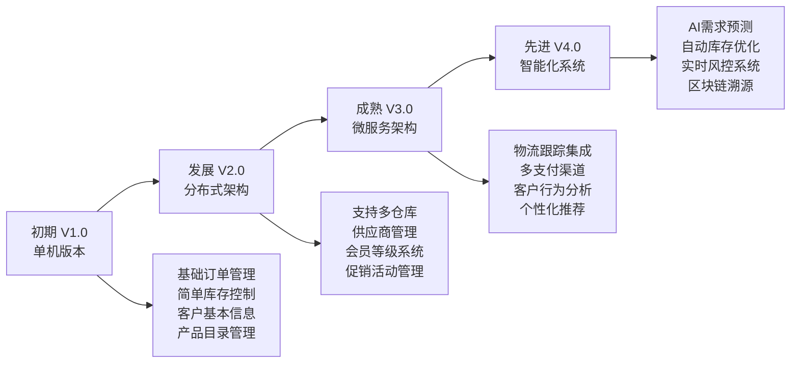

数据模型的演进需要谨慎管理，确保向后兼容和平滑迁移。在销售系统从单机版本向分布式架构演进的过程中，数据模型经历了从简单到复杂、从集中到分布的根本性变化。

## 3.7 从OLTP到OLAP：大规模数据处理架构

### 3.7.1 OLTP系统设计

OLTP（联机事务处理）系统负责处理日常的业务交易，要求高并发、低延迟和强一致性。

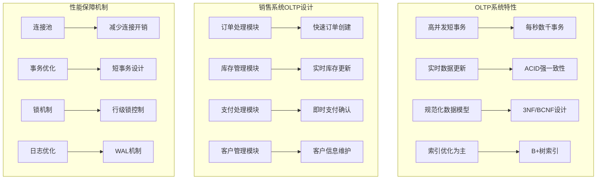

在销售系统的OLTP设计中，我们采用高度规范化的数据模型来确保数据一致性，通过精细的索引设计和事务优化来保证系统性能。

### 3.7.2 OLAP系统设计

OLAP（联机分析处理）系统专注于复杂的数据分析和报表生成，处理的是历史数据而非实时交易。

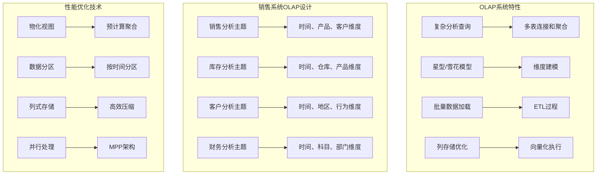

销售系统的OLAP设计采用星型模式，以销售事实表为中心，连接时间、产品、客户、地区等多个维度表。这种设计优化了分析查询的性能，支持复杂的多维度分析。

### 3.7.3 HTAP混合架构

HTAP（混合事务/分析处理）架构将OLTP和OLAP能力整合在同一个系统中，支持实时事务处理和实时数据分析。

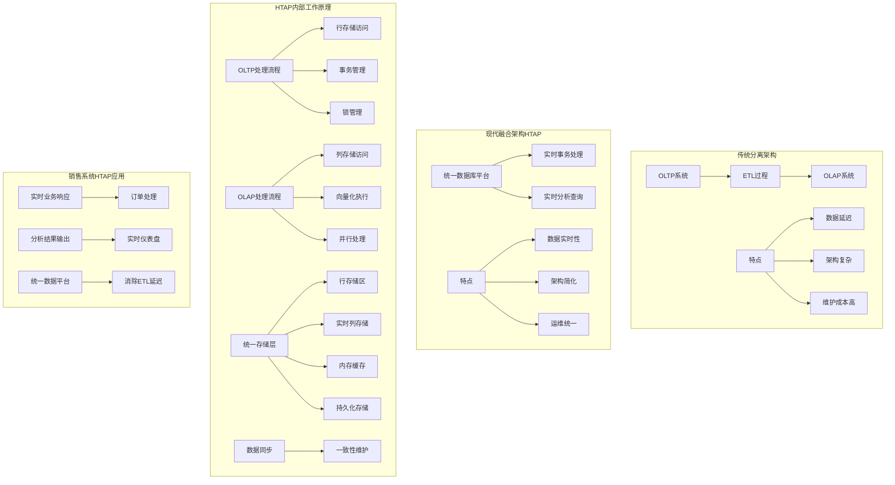

HTAP架构通过行列混合存储技术，在同一系统中同时支持高并发的OLTP事务和复杂的OLAP查询。在销售系统中，这意味着可以在处理订单的同时实时分析销售趋势，为业务决策提供即时 insights。

## 3.8 从银行系统到电商平台：数据库技术的规模化演进

### 3.8.1 系统架构演进图谱

数据库技术经历了从简单到复杂、从集中到分布的演进过程，不断适应着业务规模和技术环境的变化。

```mermaid
graph TB
    subgraph "银行系统时代 1970s-1990s"
        A[集中式架构] --> A1[大型主机]
        B[强一致性要求] --> B1[ACID事务]
        C[固定数据模式] --> C1[预定义结构]
        D[批处理为主] --> D1[夜间处理]
    end
    
    subgraph "企业应用时代 1990s-2000s"
        E[客户端-服务器] --> E1[分布式计算]
        F[中等数据量] --> F1[GB到TB级]
        G[在线事务] --> G1[实时处理]
        H[数据仓库] --> H1[决策支持]
    end
    
    subgraph "互联网时代 2000s-2010s"
        I[Web架构] --> I1[三层结构]
        J[海量数据] --> J1[TB到PB级]
        K[高并发] --> K1[横向扩展]
        L[NoSQL兴起] --> L1[灵活模式]
    end
    
    subgraph "云与大数据时代 2010s-2020s"
        M[云原生] --> M1[微服务]
        N[超大规模] --> N1[PB到EB级]
        O[智能分析] --> O1[AI/ML集成]
        P[多模数据库] --> P1[统一平台]
    end
    
    A --> E
    E --> I
    I --> M
```

从银行系统到现代电商平台，数据库技术在处理规模、架构设计和功能特性方面都发生了根本性的变化。银行系统强调绝对的可靠性和一致性，而电商平台则在保证基本可靠性的前提下，更加注重扩展性和灵活性。

### 3.8.2 亚马逊级别电商的数据架构

现代大型电商平台如亚马逊、淘宝等，需要处理极其海量的数据和超高并发的访问。

```mermaid
graph TB
    subgraph "全球分布式架构"
        subgraph "北美区域"
            A[北美数据中心] --> A1[应用服务器集群]
            A --> A2[数据库分片]
            A --> A3[缓存层]
        end
        
        subgraph "欧洲区域"
            B[欧洲数据中心] --> B1[应用服务器集群]
            B --> B2[数据库分片]
            B --> B3[缓存层]
        end
        
        subgraph "亚太区域"
            C[亚太数据中心] --> C1[应用服务器集群]
            C --> C2[数据库分片]
            C --> C3[缓存层]
        end
    end
    
    subgraph "核心服务层"
        D[全球数据总线] --> D1[数据同步]
        E[实时数据仓库] --> E1[流处理]
        F[大数据平台] --> F1[批处理]
        G[AI分析平台] --> G1[机器学习]
    end
    
    subgraph "用户接入层"
        H[边缘计算节点] --> H1[内容缓存]
        I[区域负载均衡] --> I1[流量分发]
        J[API网关] --> J1[统一入口]
    end
    
    subgraph "业务应用层"
        K[实时仪表盘] --> K1[监控告警]
        L[用户行为分析] --> L1[个性化推荐]
        M[库存预测] --> M1[智能补货]
        N[风险控制] --> N1[欺诈检测]
    end
    
    H --> I
    I --> J
    J --> A1
    J --> B1
    J --> C1
    
    A1 --> A2
    B1 --> B2
    C1 --> C2
    
    A2 --> D
    B2 --> D
    C2 --> D
    
    D --> E
    D --> F
    D --> G
    
    E --> K
    F --> L
    G --> M
    G --> N
```

这种全球分布式架构确保了系统的高可用性和低延迟访问。通过数据分片、多活数据中心和智能路由等技术，大型电商平台能够同时服务全球数亿用户，处理每秒数十万级的交易请求。

## 3.9 本章总结

### 3.9.1 核心知识体系

通过本章的学习，我们建立了从数学理论到工程实践的完整知识体系：

```mermaid
graph TB
    subgraph "关系数据库理论基础"
        A[数学基础] --> A1[集合论]
        A --> A2[关系代数]
        A --> A3[关系演算]
        
        B[数据建模] --> B1[概念模型CDM]
        B --> B2[逻辑模型LDM]
        B --> B3[物理模型PDM]
        
        C[规范化理论] --> C1[函数依赖]
        C --> C2[范式演进]
        C --> C3[数据质量]
        
        D[系统架构] --> D1[OLTP设计]
        D --> D2[OLAP设计]
        D --> D3[HTAP融合]
    end
    
    subgraph "销售系统实践"
        E[业务分析] --> E1[需求建模]
        F[数据设计] --> F1[模型转换]
        G[性能优化] --> G1[架构演进]
        H[规模扩展] --> H1[分布式设计]
    end
    
    subgraph "技术演进"
        I[理论基础] --> I1[1970s关系模型]
        J[技术发展] --> J1[SQL标准演进]
        K[架构变革] --> K1[集中式到分布式]
        L[未来趋势] --> L1[智能化数据库]
    end
    
    A --> E
    B --> F
    C --> G
    D --> H
    
    E --> J
    F --> J
    G --> K
    H --> L
```

### 3.9.2 理论与实践的结合

关系数据库的成功在于其坚实的数学基础和持续的工程创新，这种"理论指导实践，实践推动理论"的良性循环体现在多个方面：

1. **数学指导实践**：关系代数为SQL查询提供了理论基础，确保查询的正确性和完整性；规范化理论为数据库设计提供了科学方法，确保数据的一致性和有效性。

2. **建模方法论**：CDM→LDM→PDM的渐进式设计方法，既考虑了业务需求的完整性，又兼顾了技术实现的可行性，在业务需求和技术约束之间找到了最佳平衡点。

3. **架构演进规律**：从集中式到分布式的演进，不仅是技术发展的必然结果，更是数据处理规模增长的客观要求。这种演进体现了软件工程中 scalability 和 maintainability 的核心理念。

4. **统一架构趋势**：HTAP架构代表了事务处理与分析查询的融合发展方向，反映了现代业务对实时性的更高要求，也体现了数据库技术日趋成熟的现状。

### 3.9.3 学习价值与延伸思考

通过本章的深入学习，读者应该能够：

- 理解关系代数的基本原理和在查询优化中的应用
- 掌握规范化理论和方法，能够设计高质量的数据库模式
- 熟悉从概念模型到物理模型的完整设计过程
- 了解OLTP和OLAP系统的设计差异和优化策略
- 认识数据库架构从集中式到分布式的演进规律

这些知识为数据库系统的设计、优化和开发工作提供了理论基础，帮助读者在工程实践中做出更合理的技术决策和架构设计。关系数据库作为现代信息系统的核心基础设施，其理论基础和工程实践将继续在数据管理领域发挥重要作用。

---

**思考与练习**

1. 关系代数的封闭性特性如何影响数据库查询的设计和优化？请结合销售系统中的复杂查询示例说明。

2. 在规范化理论中，BCNF与3NF的主要区别是什么？在销售系统设计中，什么情况下会选择违反BCNF？这样的设计权衡需要考虑哪些因素？

3. 从数学角度看，关系模型如何保证数据的一致性和完整性？这些理论保证在工程实践中如何转化为具体的约束机制？

4. HTAP架构如何在同一系统中协调OLTP和OLAP的不同需求？这种协调在数据存储、查询处理和事务管理方面面临哪些技术挑战？

5. 在销售系统从单机版本向全球分布式架构演进的过程中，数据模型和系统架构需要经历哪些根本性的变化？这些变化如何体现理论基础与工程实践的有机结合？


# 第3章 关系数据库理论基础：从数学原理到工程实践

## 3.1 关系数据库的数学基础

### 3.1.1 集合论与关系模型

关系数据库的理论基础可以追溯到19世纪数学家乔治·布尔的布尔代数和20世纪数学家格奥尔格·康托尔的集合论。这些数学理论为数据处理提供了严格的逻辑基础，而埃德加·科德（Edgar F. Codd）在1970年发表的论文《大型共享数据库的关系模型》则将这些数学概念系统化地应用于数据库领域，奠定了现代关系数据库的理论基石。

#### 集合论的基本概念

集合论为关系模型提供了最基本的数学语言。在数学上，集合是一组具有某种共同特征的对象的总体。在数据库语境下，这些概念被赋予了具体的含义：

**域（Domain）** 是数据库中某个属性的所有可能取值的集合。例如，在销售系统中：
- 产品价格域：所有正实数的集合 {x ∈ ℝ | x > 0}
- 客户等级域：有限的离散值集合 {'普通', '银牌', '金牌', '钻石'}
- 订单状态域：{'待支付', '已支付', '配送中', '已完成', '已取消'}

域的数学定义确保了数据的类型安全性和取值范围约束，这是数据库完整性的第一道保障。

**笛卡尔积（Cartesian Product）** 是多个域的乘积运算。设有n个域D₁, D₂, ..., Dₙ，它们的笛卡尔积定义为：
D₁ × D₂ × ... × Dₙ = {(d₁, d₂, ..., dₙ) | dᵢ ∈ Dᵢ, i = 1,2,...,n}

在销售系统中，如果考虑客户域（所有客户ID）、产品域（所有产品ID）、时间域（所有有效日期），那么它们的笛卡尔积就代表了所有可能的"客户-产品-时间"组合，无论这种组合在实际业务中是否真实存在。

**关系（Relation）** 是笛卡尔积的一个子集。从数学角度看，关系R是D₁ × D₂ × ... × Dₙ的一个子集，即 R ⊆ D₁ × D₂ × ... × Dₙ。在数据库实践中，这个数学概念对应着我们的数据表，其中只包含那些在现实世界中真实存在的元组。

#### 关系模型的形式化定义

基于集合论的概念，我们可以给出关系模型的严格数学定义：

设D₁, D₂, ..., Dₙ为一组域，这些域中可以有相同的域。关系R是笛卡尔积D₁ × D₂ × ... × Dₙ的一个子集。关系R中的每个元素(t₁, t₂, ..., tₙ)称为一个元组，其中tᵢ称为元组的第i个分量。

关系的度（Degree）是指关系中属性的个数，也就是参与笛卡尔积的域的个数。关系的基数（Cardinality）是指关系中元组的个数。

```mermaid
graph TB
    subgraph “数学理论基础”
        A[集合论] --> D[域 Domain]
        B[一阶逻辑] --> E[谓词逻辑]
        A --> F[笛卡尔积]
        A --> G[关系 Relation]
        C[关系模型] --> H[埃德加·科德 1970]
    end
    
    subgraph “数据库实现”
        D --> I[属性数据类型]
        F --> J[表的全部可能组合]
        G --> K[实际数据表]
        E --> L[查询条件]
        H --> M[关系代数运算]
    end
    
    subgraph “销售系统实例”
        I --> N[产品价格域：正实数]
        I --> O[客户等级域：普通,银牌,金牌,钻石]
        J --> P[所有客户-产品组合]
        K --> Q[实际订单表]
        L --> R[筛选VIP客户条件]
        M --> S[订单与客户连接运算]
    end
    
    N --> T[数据完整性保障]
    O --> T
    P --> U[业务规则约束]
    Q --> V[实际业务数据]
    R --> W[查询优化基础]
    S --> X[复杂业务逻辑实现]
```

#### 关系的性质

关系模型中的关系具有几个重要的数学性质：

1. **元组的无序性**：关系中元组的顺序是无关紧要的，这与数学中集合的元素无序性一致。

2. **分量的原子性**：关系中的每个分量都是不可再分的数据项，满足第一范式的要求。

3. **候选键的唯一性**：每个关系都存在至少一个候选键，其值能唯一标识关系中的每个元组。

4. **属性的命名唯一性**：每个属性都有一个唯一的名称，不同属性可以来自相同的域。

在销售系统的具体实践中，这些数学概念转化为实际的数据结构。例如，客户表是客户ID域、姓名域、电话域等多个域的笛卡尔积的一个子集，只包含那些真实存在的客户记录。

#### 类型系统的数学基础

关系模型中的类型系统也建立在数学基础之上。每个域实际上定义了一个类型，这些类型构成了一个类型系统：

- **基本类型**：整数、实数、字符串、日期等
- **约束类型**：通过检查约束定义的子类型，如"正实数"、"有效邮箱地址"等
- **枚举类型**：有限的离散值集合

这种类型系统不仅提供了数据验证的基础，还为查询优化和索引设计提供了理论指导。

通过集合论的数学基础，关系数据库获得了严谨的理论支撑，使得数据库设计从经验性的艺术转变为科学性的工程 discipline。这种数学基础确保了关系数据库在理论上的完备性和实践中的可靠性，为后续的关系代数运算和规范化理论奠定了坚实的基础。

### 3.1.2 关系代数理论体系

关系代数是关系数据库的理论核心，它为数据库操作提供了一个封闭的代数系统。所谓封闭性，指的是关系代数运算的输入和输出都是关系，这使得我们可以将多个运算组合成复杂的表达式，就像在传统代数中组合算术运算一样。

#### 关系代数的基本运算

关系代数包含五个基本运算，这些运算构成了关系代数的完备集：

**选择（Selection）** 运算表示为σₚ(R)，其中p是一个命题公式，可以使用连接词∧（与）、∨（或）、¬（非）。选择运算从关系R中选取满足条件p的元组，相当于SQL中的WHERE子句。

在销售系统中，选择运算的应用包括：
- σ_{等级='金牌'}(客户) → 选择所有金牌客户
- σ_{订单日期≥'2023-01-01'∧订单日期≤'2023-01-31'}(订单) → 选择2023年1月的所有订单
- σ_{库存数量<再订货点}(产品) → 选择需要补货的产品

**投影（Projection）** 运算表示为πₐ(R)，其中A是R中的属性子集。投影运算从关系R中选择指定的属性列，并去除重复的元组。

销售系统中的投影运算应用：
- π_{客户姓名,电话}(客户) → 获取客户的联系信息
- π_{产品名称,单价}(产品) → 获取产品的基本信息
- π_{订单ID,总金额}(订单) → 获取订单的金额信息

**并（Union）** 运算表示为R ∪ S，要求关系R和S具有相同的属性集（并兼容）。并运算返回属于R或属于S的所有元组。

实际应用示例：
- 获取所有购买过产品A或产品B的客户：π_{客户ID}(σ_{产品ID='A'}(订单明细)) ∪ π_{客户ID}(σ_{产品ID='B'}(订单明细))

**差（Difference）** 运算表示为R - S，返回属于R但不属于S的元组。

业务应用场景：
- 找出上个月有订单但本月没有订单的客户：π_{客户ID}(σ_{本月订单}(订单)) - π_{客户ID}(σ_{上月订单}(订单))

**笛卡尔积（Cartesian Product）** 运算表示为R × S，返回R和S中所有元组的可能组合。在实际应用中，笛卡尔积通常与选择运算结合使用来实现连接操作。

#### 关系代数的扩展运算

除了五个基本运算外，关系代数还定义了几个扩展运算，这些运算可以用基本运算来表示，但为了使用方便而单独定义：

**交（Intersection）** 运算表示为R ∩ S，返回同时属于R和S的元组。

业务应用：
- 找出同时购买产品A和产品B的客户：π_{客户ID}(σ_{产品ID='A'}(订单明细)) ∩ π_{客户ID}(σ_{产品ID='B'}(订单明细))

**连接（Join）** 运算有多种形式，最基本的是θ连接，表示为R ⋈ₚ S，其中p是连接条件。θ连接等价于σₚ(R × S)。

**自然连接（Natural Join）** 是一种特殊的等值连接，它自动根据两个关系中同名同域的属性进行等值比较，并去除重复属性。

**除（Division）** 运算表示为R ÷ S，用于查询"满足所有条件"的场景。设R(X,Y)和S(Y,Z)，其中X、Y、Z为属性组，R ÷ S的结果是满足以下条件的最大关系T(X)：T × S ⊆ R。

除运算的典型应用：
- 找出购买了所有促销产品的客户：π_{客户ID,产品ID}(订单明细) ÷ π_{产品ID}(σ_{是否促销=true}(产品))

```mermaid
graph TB
    subgraph “关系代数运算体系”
        A[关系代数]
        
        subgraph “基本运算”
            B[选择 σ]
            C[投影 π]
            D[并 ∪]
            E[差 -]
            F[笛卡尔积 ×]
        end
        
        subgraph “扩展运算”
            G[交 ∩]
            H[连接 ⋈]
            I[除 ÷]
        end
    end
    
    subgraph “销售系统应用示例”
        B --> J[筛选VIP客户 σ_等级='VIP'客户]
        C --> K[提取客户联系方式 π_姓名,电话客户]
        H --> L[订单客户关联 订单 ⋈_客户ID=客户ID 客户]
        I --> M[购买全部促销商品的客户 客户 ÷ 促销商品]
    end
    
    subgraph “数学性质”
        N[封闭性] --> O[运算结果仍是关系]
        P[结合律] --> Q[R ∪ S ∪ T = R ∪ S ∪ T]
        R[交换律] --> S[R ∪ S = S ∪ R]
        T[分配律] --> U[σₚR ∪ S = σₚR ∪ σₚS]
    end
    
    B --> V[语法: σ_条件R]
    C --> W[语法: π_属性列表R]
    H --> X[语法: R ⋈_条件 S]
    I --> Y[语法: R ÷ S]
    
    J --> Z[业务含义: 找出所有VIP客户]
    K --> AA[业务含义: 获取客户联系方式]
    L --> BB[业务含义: 获取订单的客户详细信息]
    M --> CC[业务含义: 找出购买了所有促销商品的客户]
```

#### 关系代数的代数性质

关系代数具有一些重要的代数性质，这些性质为查询优化提供了理论基础：

**交换律**：并运算和交运算满足交换律
- R ∪ S = S ∪ R
- R ∩ S = S ∩ R

**结合律**：并运算、交运算和连接运算满足结合律
- (R ∪ S) ∪ T = R ∪ (S ∪ T)
- (R ∩ S) ∩ T = R ∩ (S ∩ T)
- (R ⋈ S) ⋈ T = R ⋈ (S ⋈ T)

**分配律**：选择运算对并运算、交运算满足分配律
- σₚ(R ∪ S) = σₚ(R) ∪ σₚ(S)
- σₚ(R ∩ S) = σₚ(R) ∩ σₚ(S)

投影运算对并运算满足分配律：
- πₐ(R ∪ S) = πₐ(R) ∪ πₐ(S)

这些代数性质使得查询优化器可以对关系代数表达式进行等价变换，从而生成更高效的查询执行计划。

#### 关系代数在查询优化中的应用

关系代数的理论为数据库查询优化提供了坚实的基础。查询优化器的工作原理就是将SQL查询转换为关系代数表达式，然后应用代数定律进行优化：

**选择下推**：尽早执行选择运算，减少中间结果的大小
- σₚ(R ⋈ S) ≡ σₚ(R) ⋈ S （如果条件p只涉及R的属性）

**投影下推**：尽早执行投影运算，减少处理的数据量
- πₐ(R ⋈ S) ≡ πₐ(πₐ∩Attr(R)(R) ⋈ πₐ∩Attr(S)(S))

**连接重排序**：利用连接运算的结合律和交换律，选择连接顺序以最小化中间结果

在销售系统的实际应用中，这些优化技术可以显著提升查询性能。例如，对于"查询北京地区VIP客户在2023年的订单详情"这样的复杂查询，优化器会将其转换为关系代数表达式，然后应用优化规则生成高效的执行计划。

关系代数不仅是数据库查询的理论基础，也是数据库教育的重要组成部分。通过理解关系代数，开发人员可以更好地理解SQL查询的语义，编写出更高效的查询语句，并为数据库性能调优奠定坚实的理论基础。

### 3.1.3 关系演算与逻辑基础

关系演算是关系数据库理论的另一个重要支柱，它基于数理逻辑的一阶谓词逻辑，为关系数据库提供了声明式的查询语言基础。与关系代数的过程性特征不同，关系演算是描述性的，它指定要什么而不是如何获取。

#### 关系演算的基本概念

关系演算分为两种主要形式：元组关系演算和域关系演算。

**元组关系演算** 使用元组变量作为基本操作单元，其基本形式为：
{t | φ(t)}
其中t是元组变量，φ(t)是包含t的公式。

在销售系统中的元组关系演算示例：
- 查询所有VIP客户：{t | 客户(t) ∧ t.等级 = 'VIP'}
- 查询2023年1月的订单：{t | 订单(t) ∧ t.订单日期 ≥ '2023-01-01' ∧ t.订单日期 ≤ '2023-01-31'}

**域关系演算** 使用域变量作为基本操作单元，其基本形式为：
{<x₁, x₂, ..., xₙ> | φ(x₁, x₂, ..., xₙ)}
其中x₁, x₂, ..., xₙ是域变量，φ是包含这些域变量的公式。

销售系统中的域关系演算示例：
- 查询产品名称和价格：{<pn, p> | ∃pᵢ(产品(pᵢ) ∧ pᵢ.产品名称 = pn ∧ pᵢ.单价 = p)}
- 查询客户及其订单数量：{<cname, cnt> | ∃cᵢ(客户(cᵢ) ∧ cᵢ.客户姓名 = cname ∧ cnt = COUNT({o | 订单(o) ∧ o.客户ID = cᵢ.客户ID}))}

#### 谓词逻辑在关系演算中的应用

关系演算基于一阶谓词逻辑，使用以下逻辑构件：

**原子公式**：
- R(t)：元组t在关系R中
- t[i] θ s[j]：元组t的第i个分量与元组s的第j个分量满足θ关系
- t[i] θ c：元组t的第i个分量与常量c满足θ关系

**逻辑连接词**：
- ∧（合取，与）
- ∨（析取，或）
- ¬（否定，非）

**量词**：
- ∃（存在量词）：存在满足条件的元组
- ∀（全称量词）：所有元组都满足条件

```mermaid
graph TB
    subgraph “关系演算体系”
        A[关系演算] --> B[元组关系演算]
        A --> C[域关系演算]
    end
    
    subgraph “逻辑基础”
        D[一阶谓词逻辑] --> E[原子公式]
        D --> F[逻辑连接词]
        D --> G[量词]
        
        E --> E1[R(t): t在关系R中]
        E --> E2[t[i] θ s[j]: 分量比较]
        E --> E3[t[i] θ c: 分量与常量比较]
        
        F --> F1[∧: 合取/与]
        F --> F2[∨: 析取/或]
        F --> F3[¬: 否定/非]
        
        G --> G1[∃: 存在量词]
        G --> G2[∀: 全称量词]
    end
    
    subgraph “销售系统示例”
        B --> H[表达式: {t | φ(t)}]
        C --> I[表达式: {&lt;x1,x2,...,xn&gt; | φ(x1,x2,...,xn)}]
        
        H --> J[查找所有VIP客户<br/>{t | 客户(t) ∧ t.等级='VIP'}]
        I --> K[查找北京地区的产品<br/>{&lt;pn&gt; | ∃pᵢ(产品(pᵢ) ∧ pᵢ.产品名称=pn ∧ pᵢ.仓库='北京')}]
        
        J --> L[SQL对应:<br/>SELECT * FROM Customers WHERE category='VIP']
        K --> M[SQL对应:<br/>SELECT product_name FROM Products WHERE warehouse='北京']
    end
    
    subgraph “复杂查询示例”
        N[全称量词查询] --> O[购买了所有产品的客户]
        P[存在量词查询] --> Q[至少购买过一次A产品的客户]
        R[否定查询] --> S[从未下过订单的客户]
    end
    
    O --> T[关系演算:<br/>{t | 客户(t) ∧ ∀p(产品(p) → ∃o(订单(o) ∧ o.客户ID=t.客户ID ∧ o.产品ID=p.产品ID))}]
    Q --> U[关系演算:<br/>{t | 客户(t) ∧ ∃o∃d(订单(o) ∧ 订单明细(d) ∧ o.客户ID=t.客户ID ∧ d.订单ID=o.订单ID ∧ d.产品ID='A')}]
    S --> V[关系演算:<br/>{t | 客户(t) ∧ ¬∃o(订单(o) ∧ o.客户ID=t.客户ID)}]
```

#### 量词的使用技巧

量词的使用是关系演算中最具挑战性的部分，特别是在处理全称量词时：

**存在量词（∃）** 相对直观，用于表示"至少存在一个"的情况：
- 查询至少购买过一次A产品的客户：
  {t | 客户(t) ∧ ∃o∃d(订单(o) ∧ 订单明细(d) ∧ o.客户ID = t.客户ID ∧ d.订单ID = o.订单ID ∧ d.产品ID = 'A')}

**全称量词（∀）** 的使用需要特别注意，通常需要转换为存在量词的否定形式：
- 查询购买了所有产品的客户（这是一个经典的"除"运算场景）：
  {t | 客户(t) ∧ ∀p(产品(p) → ∃o∃d(订单(o) ∧ 订单明细(d) ∧ o.客户ID = t.客户ID ∧ d.订单ID = o.订单ID ∧ d.产品ID = p.产品ID))}

在实际应用中，全称量词通常通过双重否定来理解：购买了所有产品的客户等价于不存在该客户没有购买的产品。

#### 关系演算的安全性问题

关系演算表达式可能是无限的，这导致了安全性的问题。例如，表达式{t | ¬客户(t)}会返回所有不在客户表中的元组，这在实际数据库中可能是无限的。

为了确保关系演算表达式的安全性，需要满足以下条件：
1. 结果关系中的每个元组分量都来自已知域的值
2. 对于每个公式，存在一个有限的方法来验证元组是否满足该公式

在实际的数据库系统中，通过**域独立性**来保证关系演算表达式的安全性：表达式的值只能依赖于给定数据库中的值，而不能依赖于某个未知的、可能无限的域。

#### 关系演算与SQL的对应关系

关系演算为SQL语言提供了理论基础，特别是SQL的SELECT语句直接对应于关系演算：

- SELECT子句对应投影运算
- FROM子句引入元组变量
- WHERE子句对应选择条件
- EXISTS和NOT EXISTS子查询对应存在量词
- 全称量词通常通过NOT EXISTS双重否定来实现

例如，关系演算表达式：
{t | 客户(t) ∧ t.等级 = 'VIP' ∧ ∃o(订单(o) ∧ o.客户ID = t.客户ID ∧ o.总金额 > 1000)}

对应的SQL语句为：
```sql
SELECT * FROM Customers c 
WHERE c.category = 'VIP' 
AND EXISTS (
    SELECT 1 FROM Orders o 
    WHERE o.customer_id = c.customer_id 
    AND o.total_amount > 1000
)
```

#### 关系演算的实际应用价值

关系演算虽然在日常数据库开发中不直接使用，但它具有重要的理论价值和实践意义：

1. **查询理解的深度**：理解关系演算有助于深入理解SQL查询的语义，特别是复杂的嵌套查询和存在性查询。

2. **查询优化的基础**：查询优化器内部使用关系演算的等价变换来优化查询计划。

3. **声明式编程的体现**：关系演算体现了声明式编程的思想，用户只需要指定想要什么，而不需要指定如何获取。

4. **理论完备性**：关系演算与关系代数的等价性证明了关系查询语言的数学完备性。

在销售系统的复杂业务场景中，关系演算的概念帮助开发人员理解如何表达复杂的业务规则。例如，"查找那些购买了所有促销产品且从未退货的VIP客户"这样的复杂需求，可以通过关系演算清晰地表达，然后转换为高效的SQL语句。

通过理解关系演算，数据库开发人员可以超越具体的SQL语法，从更高的逻辑层面来思考和设计数据查询，这对于处理复杂业务逻辑和进行数据库性能优化都具有重要意义。


# 3.2 数据建模与规范化理论

## 3.2.1 概念数据模型（CDM）：实体关系建模

概念数据模型是数据库设计的起点，它从业务视角描述信息结构，完全独立于任何技术实现细节。CDM的核心目标是准确捕捉业务领域的本质特征，为不同背景的利益相关者（业务人员、开发人员、管理人员）提供统一的沟通语言。

### 实体关系建模的基本概念

**实体（Entity）** 表示业务中具有独立存在意义的事物或概念。在销售系统中，客户、产品、订单等都是典型的实体。每个实体都具有一组**属性（Attribute）** 来描述其特征，如客户实体具有客户ID、姓名、联系方式等属性。

**关系（Relationship）** 描述实体之间的业务联系。关系具有**基数（Cardinality）** 和**可选性（Optionality）** 两个重要特性。基数表示参与关系的实体实例数量，如一对一（1:1）、一对多（1:N）、多对多（M:N）。可选性表示关系是强制的还是可选的，用最小基数0或1表示。

### 销售系统的概念数据模型设计

在销售系统的CDM设计中，我们首先识别核心业务实体及其关系：

```mermaid
erDiagram
    CUSTOMER ||--o{ ORDER : places
    CUSTOMER {
        string customer_id PK
        string customer_name
        string email
        string phone
        date registration_date
        string customer_type
        string status
    }
    
    ORDER ||--o{ ORDER_ITEM : contains
    ORDER {
        string order_id PK
        date order_date
        string order_status
        decimal total_amount
        string currency
        string payment_status
        date required_date
        date shipped_date
    }
    
    ORDER_ITEM {
        string order_id PK,FK
        string product_id PK,FK
        int quantity
        decimal unit_price
        decimal discount
        decimal line_total
    }
    
    PRODUCT ||--o{ ORDER_ITEM : included_in
    PRODUCT {
        string product_id PK
        string product_name
        string description
        decimal unit_price
        decimal cost_price
        string category_id FK
        string supplier_id FK
        int units_in_stock
        int reorder_level
        boolean discontinued
    }
    
    CATEGORY ||--o{ PRODUCT : classifies
    CATEGORY {
        string category_id PK
        string category_name
        string description
        string parent_category_id FK
    }
    
    SUPPLIER ||--o{ PRODUCT : supplies
    SUPPLIER {
        string supplier_id PK
        string supplier_name
        string contact_name
        string contact_title
        string phone
        string address
        string city
        string country
    }
    
    EMPLOYEE ||--o{ ORDER : processes
    EMPLOYEE {
        string employee_id PK
        string last_name
        string first_name
        string title
        date birth_date
        date hire_date
        string address
        string city
        string country
        string reports_to FK
    }
    
    SHIPPER ||--o{ ORDER : ships_via
    SHIPPER {
        string shipper_id PK
        string company_name
        string phone
    }
    
    WAREHOUSE ||--o{ INVENTORY : stores
    WAREHOUSE {
        string warehouse_id PK
        string warehouse_name
        string location
    }
    
    PRODUCT ||--o{ INVENTORY : has_stock
    INVENTORY {
        string inventory_id PK
        int quantity_in_stock
        int reorder_level
    }
    
    CUSTOMER ||--o{ ADDRESS : has
    ADDRESS {
        string address_id PK
        string address_type
        string street
        string city
        string country
        string zip_code
    }
```

### 业务规则在CDM中的表达

概念数据模型不仅描述数据结构，还承载着重要的业务规则：

**基数约束**：
- 一个客户可以下多个订单，但每个订单必须属于一个客户（1:N）
- 一个订单包含多个订单明细，每个订单明细必须属于一个订单（1:N）
- 一个产品可以出现在多个订单明细中，每个订单明细必须对应一个产品（1:N）

**业务逻辑约束**：
- 订单状态必须遵循预定义的状态流转：待支付 → 已支付 → 配送中 → 已完成
- 产品价格必须大于成本价格
- 订单数量必须为正整数

**时间相关约束**：
- 发货日期不能早于订单日期
- 要求送达日期必须晚于订单日期
- 客户注册日期不能晚于第一次下单日期

### CDM的设计方法论

**自顶向下设计**：从高层业务概念开始，逐步细化为具体的实体和关系。这种方法确保模型与业务战略保持一致。

**自底向上设计**：从具体的业务单据和操作流程开始，归纳出实体和关系。这种方法更贴近实际操作，易于验证。

**混合方法**：在实际项目中，通常结合两种方法。先通过自顶向下确定核心业务实体，再通过自底向上补充操作细节。

在销售系统的CDM设计中，我们采用混合方法：
1. 首先识别核心业务实体：客户、产品、订单
2. 然后分析业务流程：下单、支付、发货、退货
3. 最后补充支撑实体：库存、地址、分类、供应商

### CDM的验证与确认

概念数据模型完成后，需要通过以下方式进行验证：

**业务场景测试**：使用典型的业务场景验证模型是否支持所有业务操作。例如：
- 新客户注册并下单
- 库存不足时的订单处理
- 客户退货流程

**规范化检查**：虽然CDM不涉及技术细节，但需要进行初步的规范化思考，避免明显的冗余和不一致。

**利益相关者评审**：与业务人员、系统用户、管理人员共同评审模型，确保模型准确反映业务现实。

通过概念数据模型，我们建立了对销售系统的统一理解，为后续的逻辑设计和物理设计奠定了坚实的基础。CDM作为业务需求与技术实现之间的桥梁，确保数据库设计始终围绕业务价值展开。

## 3.2.2 规范化理论与范式演进

规范化理论是关系数据库设计的核心理论基础，由埃德加·科德在1970年代提出，旨在通过数学方法消除数据冗余和更新异常，确保数据的一致性。规范化过程基于函数依赖理论，通过一系列范式来指导数据库设计。

### 函数依赖理论

函数依赖是规范化理论的基石，它描述了属性之间的确定性关系。

**函数依赖定义**：设R是一个关系模式，X和Y是R的属性子集。如果对于R的任意两个元组t₁和t₂，只要t₁[X] = t₂[X]，就有t₁[Y] = t₂[Y]，则称Y函数依赖于X，记作X → Y。

**完全函数依赖**：如果X → Y，且对于X的任何真子集X'，都有X' ↛ Y，则称Y完全函数依赖于X。

**部分函数依赖**：如果X → Y，但存在X的真子集X'使得X' → Y，则称Y部分函数依赖于X。

**传递函数依赖**：如果X → Y，Y → Z，且Y ↛ X，Z ⊈ Y，则称Z传递函数依赖于X。

### Armstrong公理系统

Armstrong公理是函数依赖推理的基础，包含三条基本公理：

**自反律（Reflexivity）**：如果Y ⊆ X，则X → Y
**增广律（Augmentation）**：如果X → Y，则XZ → YZ
**传递律（Transitivity）**：如果X → Y且Y → Z，则X → Z

基于这三条公理，可以推导出以下有用的推理规则：
- **合并律**：如果X → Y且X → Z，则X → YZ
- **分解律**：如果X → YZ，则X → Y且X → Z
- **伪传递律**：如果X → Y且WY → Z，则WX → Z

### 范式演进理论

规范化理论定义了一系列范式，每个范式都有特定的约束条件：

```mermaid
graph TB
    subgraph “范式演进过程”
        A[未规范化数据] --> B[第一范式 1NF]
        B --> C[第二范式 2NF]
        C --> D[第三范式 3NF]
        D --> E[BC范式 BCNF]
        E --> F[第四范式 4NF]
        F --> G[第五范式 5NF]
    end
    
    subgraph “各范式核心要求”
        B --> H[消除重复组，确保原子性]
        C --> I[消除部分函数依赖]
        D --> J[消除传递函数依赖]
        E --> K[消除主属性对候选键的部分依赖]
        F --> L[消除多值依赖]
        G --> M[消除连接依赖]
    end
    
    subgraph “销售系统应用”
        N[订单表包含客户地址] --> O[1NF: 拆分地址字段]
        P[订单明细依赖订单ID和产品ID] --> Q[2NF: 分离产品信息]
        R[客户地址依赖邮政编码] --> S[3NF: 分离地理信息]
        T[员工管辖区域] --> U[BCNF: 分离管辖关系]
        V[产品多属性值] --> W[4NF: 分离多值属性]
    end
```

### 第一范式（1NF）

**定义**：关系模式R的所有属性都是原子属性，即每个属性都是不可再分的数据项。

**违反1NF的典型情况**：
- 复合属性：地址包含省、市、街道
- 多值属性：一个客户有多个电话号码
- 重复组：订单中包含多个产品信息

**销售系统1NF规范化示例**：

假设初始的订单表设计：
```
订单(订单ID, 客户ID, 订单日期, [产品ID, 产品名称, 数量, 单价], 总金额)
```

这里的产品信息是重复组，违反1NF。规范化后：
```
订单(订单ID, 客户ID, 订单日期, 总金额)
订单明细(订单ID, 产品ID, 数量, 单价)
产品(产品ID, 产品名称, ...)
```

### 第二范式（2NF）

**定义**：关系模式R满足1NF，且每个非主属性都完全函数依赖于候选键。

**违反2NF的典型情况**：存在部分函数依赖，通常出现在复合主键的情况下。

**销售系统2NF规范化示例**：

假设订单明细表设计：
```
订单明细(订单ID, 产品ID, 产品名称, 数量, 单价)
```

候选键是(订单ID, 产品ID)，但产品名称只依赖于产品ID，存在部分函数依赖。规范化后：
```
订单明细(订单ID, 产品ID, 数量, 单价)
产品(产品ID, 产品名称, ...)
```

### 第三范式（3NF）

**定义**：关系模式R满足2NF，且没有非主属性传递函数依赖于候选键。

**违反3NF的典型情况**：存在传递函数依赖链。

**销售系统3NF规范化示例**：

假设客户表设计：
```
客户(客户ID, 客户姓名, 城市, 省份, 国家)
```

如果城市 → 省份 → 国家，则存在传递函数依赖。规范化后：
```
客户(客户ID, 客户姓名, 城市ID)
城市(城市ID, 城市名称, 省份ID)
省份(省份ID, 省份名称, 国家ID)
国家(国家ID, 国家名称)
```

### BC范式（BCNF）

**定义**：关系模式R满足3NF，且对于每个函数依赖X → Y，X都是超键。

**违反BCNF的典型情况**：主属性部分依赖于候选键。

**销售系统BCNF规范化示例**：

假设员工管辖表设计：
```
员工管辖(员工ID, 产品类别ID, 管辖区域)
```

函数依赖：员工ID, 产品类别ID → 管辖区域，同时员工ID → 管辖区域。这里员工ID不是超键，违反BCNF。规范化后：
```
员工能力(员工ID, 产品类别ID)
员工管辖(员工ID, 管辖区域)
```

### 第四范式（4NF）

**定义**：关系模式R满足BCNF，且没有多值依赖。

**多值依赖定义**：设R是关系模式，X、Y是R的属性子集。如果对于R的任意关系r，任意两个元组t₁、t₂，当t₁[X] = t₂[X]时，存在元组t₃、t₄，使得：
- t₃[X] = t₄[X] = t₁[X] = t₂[X]
- t₃[Y] = t₁[Y]且t₃[Z] = t₂[Z]
- t₄[Y] = t₂[Y]且t₄[Z] = t₁[Z]
其中Z = R - X - Y，则称Y多值依赖于X，记作X →→ Y。

**销售系统4NF规范化示例**：

假设产品表设计：
```
产品(产品ID, 产品名称, 颜色, 尺寸)
```

一个产品可能有多种颜色和尺寸组合，存在多值依赖：产品ID →→ 颜色，产品ID →→ 尺寸。规范化后：
```
产品(产品ID, 产品名称)
产品颜色(产品ID, 颜色)
产品尺寸(产品ID, 尺寸)
```

### 规范化理论的实际应用

在实际的数据库设计中，规范化程度需要根据具体应用场景进行权衡：

**OLTP系统**：通常规范化到BCNF或3NF，强调数据一致性和更新性能。

**OLAP系统**：通常反规范化，采用星型模式或雪花模式，强调查询性能。

**销售系统的规范化策略**：
- 核心事务数据：客户、产品、订单等规范化到BCNF
- 分析查询数据：销售汇总、客户行为等采用适度反规范化
- 历史数据：归档数据可以降低规范化程度以优化存储

规范化理论不仅提供了数据库设计的科学方法，还为数据库优化和重构提供了理论指导。通过理解规范化理论，数据库设计人员可以在数据一致性、操作性能和存储效率之间找到最佳平衡点。

## 3.2.3 函数依赖分析与规范化过程

函数依赖分析是规范化理论的核心实践环节，它通过系统化的方法识别属性之间的依赖关系，为数据库设计提供科学依据。本节将深入探讨函数依赖的分析方法和规范化的实际操作过程。

### 函数依赖的识别方法

**业务规则分析法**：通过分析业务规则来识别函数依赖。在销售系统中：
- 每个客户有唯一的客户ID → 客户ID → 客户姓名，客户地址
- 每个产品有唯一的产品ID → 产品ID → 产品名称，产品价格
- 每个订单有唯一的订单ID → 订单ID → 订单日期，客户ID

**数据样本分析法**：通过分析实际数据样本发现函数依赖。例如，检查订单数据发现：
- 相同的订单ID总是对应相同的订单日期和客户ID
- 相同的产品ID总是对应相同的产品名称和价格

**函数依赖闭包计算**：给定函数依赖集F，F的闭包F⁺是所有被F逻辑蕴含的函数依赖的集合。计算闭包使用Armstrong公理：

```mermaid
graph LR
    subgraph “函数依赖闭包计算”
        A[初始函数依赖集F] --> B[应用自反律]
        B --> C[应用增广律]
        C --> D[应用传递律]
        D --> E[闭包F⁺]
    end
    
    subgraph “属性闭包计算”
        F[输入X和F] --> G[X⁺ = X]
        G --> H[遍历F中所有Y→Z]
        H --> I{Y ⊆ X⁺?}
        I -->|是| J[X⁺ = X⁺ ∪ Z]
        I -->|否| K[继续下一个依赖]
        J --> L{所有依赖遍历完成?}
        K --> L
        L -->|否| H
        L -->|是| M[输出X⁺]
    end
```

### 候选键的求解方法

候选键是能够唯一标识关系中每个元组的最小属性集。求解候选键的系统方法：

**输入**：关系模式R(U)，函数依赖集F
**输出**：R的所有候选键

**求解步骤**：
1. 将属性分为四类：
   - L类：只出现在函数依赖左部的属性
   - R类：只出现在函数依赖右部的属性
   - LR类：在函数依赖左右部都出现的属性
   - N类：在函数依赖中未出现的属性

2. 令X代表L类和N类属性
3. 计算X⁺（X的闭包）
4. 如果X⁺ = U，则X是候选键
5. 否则，从LR类属性中依次添加属性到X，计算闭包直到X⁺ = U

**销售系统示例**：
考虑关系模式：订单明细(订单ID, 产品ID, 数量, 单价, 产品名称)
函数依赖：
- 订单ID, 产品ID → 数量, 单价
- 产品ID → 产品名称

属性分类：
- L类：订单ID, 产品ID
- R类：数量, 单价, 产品名称
- LR类：无
- N类：无

候选键：{订单ID, 产品ID}

### 规范化过程的系统方法

规范化过程是一个逐步分解关系模式的过程，每一步都消除特定类型的函数依赖。

#### 1NF规范化过程

**目标**：消除重复组和非原子值

**步骤**：
1. 识别重复组和非原子属性
2. 为每个重复组创建新的关系
3. 将原关系的主键复制到新关系中
4. 在新关系中添加序列号或其他属性以区分重复组中的不同项

**销售系统实例**：
原始订单表包含重复的产品信息：
```
订单(订单ID, 客户ID, 订单日期, 产品1_ID, 产品1_数量, 产品1_单价, 产品2_ID, 产品2_数量, 产品2_单价, ...)
```

1NF规范化后：
```
订单(订单ID, 客户ID, 订单日期)
订单明细(订单ID, 明细序号, 产品ID, 数量, 单价)
```

#### 2NF规范化过程

**目标**：消除部分函数依赖

**步骤**：
1. 找出所有部分函数依赖
2. 为每个部分函数依赖创建新的关系
3. 新关系包含决定因素和依赖属性
4. 从原关系中移除依赖属性

**销售系统实例**：
订单明细(订单ID, 产品ID, 数量, 单价, 产品名称, 产品分类)
函数依赖：
- 订单ID, 产品ID → 数量, 单价  （完全依赖）
- 产品ID → 产品名称, 产品分类  （部分依赖）

2NF规范化后：
```
订单明细(订单ID, 产品ID, 数量, 单价)
产品(产品ID, 产品名称, 产品分类)
```

#### 3NF规范化过程

**目标**：消除传递函数依赖

**步骤**：
1. 找出所有传递函数依赖
2. 为每个传递函数依赖创建新的关系
3. 新关系包含决定因素和依赖属性
4. 从原关系中移除依赖属性

**销售系统实例**：
客户(客户ID, 客户姓名, 城市, 省份, 国家)
函数依赖：
- 客户ID → 客户姓名, 城市
- 城市 → 省份, 国家  （传递依赖）

3NF规范化后：
```
客户(客户ID, 客户姓名, 城市ID)
城市(城市ID, 城市名称, 省份ID)
省份(省份ID, 省份名称, 国家ID)
国家(国家ID, 国家名称)
```

### 规范化过程的数学基础

规范化过程基于无损连接分解和依赖保持的性质。

**无损连接分解**：将关系模式R分解为R₁, R₂, ..., Rₙ，如果对于R的每个合法关系实例r，都有：
r = π_{R₁}(r) ⋈ π_{R₂}(r) ⋈ ... ⋈ π_{Rₙ}(r)
则称该分解是无损连接分解。

**依赖保持**：如果函数依赖集F在分解后的各个关系模式上的投影的逻辑蕴含等于F，则称该分解是依赖保持的。

**检验无损连接的chase算法**：
1. 构造初始表，每行对应一个子模式，每列对应一个属性
2. 对于函数依赖X → Y，如果两行在X上相等，则使它们在Y上也相等
3. 重复步骤2直到表不再变化或出现全a行
4. 如果出现全a行，则分解是无损的

### 规范化理论的高级话题

#### 多值依赖与4NF

多值依赖描述了属性集之间的独立关系，是4NF的基础。

**多值依赖定义**：设R是关系模式，X、Y是属性子集，Z = R - X - Y。如果对于R的任意关系r，任意两个元组t₁、t₂满足t₁[X] = t₂[X]，则存在元组t₃、t₄满足：
- t₃[X] = t₄[X] = t₁[X] = t₂[X]
- t₃[Y] = t₁[Y]，t₃[Z] = t₂[Z]
- t₄[Y] = t₂[Y]，t₄[Z] = t₁[Z]

则称Y多值依赖于X，记作X →→ Y。

**4NF分解算法**：
1. 找出违反4NF的多值依赖X →→ Y
2. 将R分解为R₁(X ∪ Y)和R₂(X ∪ Z)，其中Z = R - X - Y
3. 在R₁和R₂上递归应用4NF分解

#### 连接依赖与5NF

5NF处理更一般的连接依赖情况，确保关系可以被无损地分解为多个投影，并能通过自然连接恢复。

**投影-连接范式**：关系模式R满足5NF，当且仅当R的每个连接依赖都被R的候选键所蕴含。

### 规范化过程的实际考虑

在实际数据库设计中，完全规范化并不总是最优选择，需要考虑以下因素：

**查询性能**：过度规范化可能导致查询需要多个连接操作，影响性能

**更新频率**：高频更新的系统可能受益于更高的规范化程度

**数据稳定性**：稳定的参考数据可以接受较低的规范化程度

**开发复杂度**：高度规范化的模式可能增加应用开发的复杂度

在销售系统的设计中，我们采用差异化的规范化策略：
- 核心事务表（订单、客户、产品）规范化到BCNF
- 统计分析表适度反规范化
- 历史数据表降低规范化程度

通过系统化的函数依赖分析和规范化过程，我们能够设计出既保证数据一致性又满足性能需求的数据库模式。

## 3.2.4 逻辑数据模型（LDM）设计

逻辑数据模型是概念数据模型到物理数据模型的桥梁，它将业务导向的概念模型转换为技术导向的关系模式。LDM设计基于规范化理论，明确表结构、键约束和关系定义，同时保持技术中立性，不涉及具体的数据库管理系统实现细节。

### LDM设计方法论

#### 实体到表的转换

将CDM中的实体转换为LDM中的表，遵循以下规则：

**强实体转换**：每个强实体转换为一个独立的表，实体属性转换为表的列，实体标识符转换为主键。

**弱实体转换**：弱实体转换为独立的表，但需要包含所依赖的强实体的主键作为外键，弱实体的主键通常是部分键与依赖实体主键的组合。

**销售系统实体转换示例**：

```mermaid
erDiagram
    CUSTOMER ||--o{ ORDER : places
    CUSTOMER {
        string customer_id PK
        string company_name
        string contact_name
        string contact_title
        string address
        string city
        string region
        string postal_code
        string country
        string phone
        string fax
    }
    
    ORDER ||--o{ ORDER_DETAIL : contains
    ORDER {
        string order_id PK
        string customer_id FK
        string employee_id FK
        date order_date
        date required_date
        date shipped_date
        string ship_via FK
        decimal freight
        string ship_name
        string ship_address
        string ship_city
        string ship_region
        string ship_postal_code
        string ship_country
    }
    
    ORDER_DETAIL {
        string order_id PK,FK
        string product_id PK,FK
        decimal unit_price
        int quantity
        decimal discount
    }
    
    PRODUCT ||--o{ ORDER_DETAIL : included_in
    PRODUCT {
        string product_id PK
        string product_name
        string supplier_id FK
        string category_id FK
        string quantity_per_unit
        decimal unit_price
        int units_in_stock
        int units_on_order
        int reorder_level
        boolean discontinued
    }
    
    CATEGORY ||--o{ PRODUCT : categorizes
    CATEGORY {
        string category_id PK
        string category_name
        string description
        byte[] picture
    }
    
    SUPPLIER ||--o{ PRODUCT : supplies
    SUPPLIER {
        string supplier_id PK
        string company_name
        string contact_name
        string contact_title
        string address
        string city
        string region
        string postal_code
        string country
        string phone
        string fax
        string home_page
    }
```

#### 关系转换规则

**一对一关系**：可以将关系合并到任意一端，或者创建新的关系表。选择依据是参与约束和业务语义。

**一对多关系**：在"多"端表中添加外键引用"一"端的主键。

**多对多关系**：创建新的关联表，包含两端实体的主键作为复合主键，并可能包含关系自身的属性。

**自反关系**：在表中添加指向自身主键的外键。

### 键的设计策略

#### 主键设计

**自然键**：使用业务中自然存在的标识符，如产品SKU、客户编号等。
- 优点：业务意义明确，易于理解
- 缺点：可能变化，长度可能不固定

**代理键**：使用系统生成的唯一标识符，如自增整数、GUID等。
- 优点：稳定不变，性能良好
- 缺点：无业务意义，需要额外维护

**销售系统主键策略**：
- 客户表：使用自然键客户编号
- 产品表：使用自然键产品SKU
- 订单表：使用代理键自增订单ID
- 订单明细：使用复合主键(订单ID, 产品ID)

#### 外键设计

外键维护引用完整性，设计时需要考虑：

**删除规则**：
- NO ACTION：默认，阻止删除被引用的行
- CASCADE：级联删除相关行
- SET NULL：将外键设置为NULL
- SET DEFAULT：将外键设置为默认值

**更新规则**：类似删除规则，处理主键更新情况

**销售系统外键设计示例**：
```sql
-- 订单表的外键约束
ALTER TABLE Orders ADD CONSTRAINT FK_Orders_Customers
FOREIGN KEY (customer_id) REFERENCES Customers(customer_id)
ON DELETE NO ACTION ON UPDATE CASCADE;

ALTER TABLE Orders ADD CONSTRAINT FK_Orders_Employees  
FOREIGN KEY (employee_id) REFERENCES Employees(employee_id)
ON DELETE SET NULL ON UPDATE CASCADE;
```

### 属性设计与数据类型选择

#### 数据类型规范

**字符类型**：
- 定长字符串：用于长度固定的代码、标识符
- 变长字符串：用于名称、描述等长度变化的数据
- 大文本类型：用于产品描述、客户备注等长文本

**数值类型**：
- 整数类型：用于数量、年龄、状态代码等
- 小数类型：用于金额、价格、百分比等
- 精确小数：用于财务数据，避免浮点误差

**时态类型**：
- 日期类型：存储年月日
- 时间类型：存储时分秒
- 时间戳类型：存储完整的时间信息

#### 约束设计

**非空约束**：强制字段必须包含值
**唯一约束**：确保字段值在表中唯一
**检查约束**：验证字段值满足特定条件
**默认值**：为字段指定默认值

**销售系统约束示例**：
```sql
-- 产品表约束
CREATE TABLE Products (
    product_id VARCHAR(20) PRIMARY KEY,
    product_name VARCHAR(100) NOT NULL,
    unit_price DECIMAL(10,2) NOT NULL CHECK (unit_price > 0),
    cost_price DECIMAL(10,2) NOT NULL CHECK (cost_price > 0),
    units_in_stock INT NOT NULL CHECK (units_in_stock >= 0),
    reorder_level INT NOT NULL CHECK (reorder_level >= 0),
    discontinued BOOLEAN NOT NULL DEFAULT FALSE,
    CONSTRAINT CHK_Price CHECK (unit_price >= cost_price)
);

-- 订单明细表约束
CREATE TABLE Order_Details (
    order_id INT,
    product_id VARCHAR(20),
    unit_price DECIMAL(10,2) NOT NULL,
    quantity INT NOT NULL CHECK (quantity > 0),
    discount DECIMAL(4,3) NOT NULL CHECK (discount >= 0 AND discount <= 1),
    PRIMARY KEY (order_id, product_id),
    FOREIGN KEY (order_id) REFERENCES Orders(order_id),
    FOREIGN KEY (product_id) REFERENCES Products(product_id)
);
```

### 规范化在LDM中的应用

在LDM设计中，我们应用规范化理论来优化数据结构：

#### 函数依赖分析

对每个关系模式进行函数依赖分析，确保满足适当的范式：

**客户表的函数依赖**：
- customer_id → company_name, contact_name, address, city, region, postal_code, country, phone, fax
- 满足BCNF，所有函数依赖的左部都是超键

**订单明细表的函数依赖**：
- order_id, product_id → unit_price, quantity, discount
- 满足BCNF，复合主键完全决定所有属性

#### 范式选择策略

根据数据特性和访问模式选择合适的范式级别：

**OLTP事务表**：通常规范化到BCNF，减少冗余，保证一致性
- 订单表、订单明细表、产品表等

**参考数据表**：可以适度反规范化，提高查询性能
- 地区表、分类表等

**历史数据表**：可以接受一定的冗余，优化分析查询
- 销售汇总表、库存快照表等

### 数据完整性设计

#### 实体完整性

通过主键约束保证每个实体都有唯一标识：
- 每个表必须定义主键
- 主键值不能为NULL
- 主键值必须唯一

#### 参照完整性

通过外键约束维护表之间的关系：
- 外键值必须存在于被引用表的主键中
- 或者外键值为NULL（如果允许）

#### 用户定义完整性

通过检查约束、触发器等方式实现业务规则：

**业务规则示例**：
- 订单金额必须大于0
- 发货日期不能早于订单日期
- 折扣率必须在0到1之间
- 库存数量不能为负数

#### 销售系统完整性约束实现：

```sql
-- 复杂的业务规则通过触发器实现
CREATE TRIGGER TR_OrderDates
BEFORE INSERT OR UPDATE ON Orders
FOR EACH ROW
BEGIN
    -- 要求送达日期必须晚于订单日期
    IF NEW.required_date <= NEW.order_date THEN
        SIGNAL SQLSTATE '45000' SET MESSAGE_TEXT = '要求送达日期必须晚于订单日期';
    END IF;
    
    -- 发货日期不能早于订单日期
    IF NEW.shipped_date IS NOT NULL AND NEW.shipped_date < NEW.order_date THEN
        SIGNAL SQLSTATE '45000' SET MESSAGE_TEXT = '发货日期不能早于订单日期';
    END IF;
END;

-- 库存检查约束
CREATE TRIGGER TR_InventoryCheck
BEFORE INSERT OR UPDATE ON Order_Details
FOR EACH ROW
BEGIN
    DECLARE current_stock INT;
    
    SELECT units_in_stock INTO current_stock 
    FROM Products 
    WHERE product_id = NEW.product_id;
    
    IF current_stock < NEW.quantity THEN
        SIGNAL SQLSTATE '45000' SET MESSAGE_TEXT = '库存不足';
    END IF;
END;
```

### 数据模型的可扩展性设计

#### 通用设计模式

**类型代码表**：使用代码表管理可扩展的类型信息
```sql
CREATE TABLE Address_Types (
    address_type_code VARCHAR(10) PRIMARY KEY,
    description VARCHAR(50) NOT NULL
);

CREATE TABLE Order_Status_Codes (
    status_code VARCHAR(10) PRIMARY KEY,
    description VARCHAR(50) NOT NULL,
    is_active BOOLEAN NOT NULL DEFAULT TRUE
);
```

**审计字段**：为重要表添加审计信息
```sql
CREATE TABLE Products (
    product_id VARCHAR(20) PRIMARY KEY,
    -- 业务字段...
    created_by VARCHAR(50) NOT NULL,
    created_date TIMESTAMP NOT NULL DEFAULT CURRENT_TIMESTAMP,
    updated_by VARCHAR(50),
    updated_date TIMESTAMP,
    version INT NOT NULL DEFAULT 1
);
```

#### 国际化支持

**多语言设计**：支持多语言数据存储
```sql
CREATE TABLE Product_Translations (
    product_id VARCHAR(20),
    language_code VARCHAR(5),
    product_name VARCHAR(100),
    description TEXT,
    PRIMARY KEY (product_id, language_code),
    FOREIGN KEY (product_id) REFERENCES Products(product_id)
);

CREATE TABLE Category_Translations (
    category_id INT,
    language_code VARCHAR(5),
    category_name VARCHAR(50),
    description VARCHAR(255),
    PRIMARY KEY (category_id, language_code),
    FOREIGN KEY (category_id) REFERENCES Categories(category_id)
);
```

通过系统的逻辑数据模型设计，我们建立了技术中立但完整详细的数据结构，为物理数据模型设计和数据库实现提供了坚实的基础。LDM不仅确保了数据结构的合理性和一致性，还为系统的可扩展性和维护性提供了保障。

## 3.2.5 物理数据模型（PDM）与性能优化

物理数据模型是数据库设计的具体实现方案，它将逻辑数据模型映射到特定的数据库管理系统，并针对性能、存储、安全等非功能性需求进行优化。PDM设计需要在数据一致性、操作性能和存储效率之间找到最佳平衡点。

### 存储结构设计

#### 表空间规划

表空间是数据库的物理存储单元，合理的表空间规划对性能和管理至关重要。

**销售系统表空间设计**：

```mermaid
graph TB
    subgraph “表空间架构”
        A[系统表空间] --> A1[数据字典]
        A --> A2[系统对象]
        
        B[用户数据表空间] --> B1[事务数据]
        B --> B2[参考数据]
        B --> B3[历史数据]
        
        C[索引表空间] --> C1[主键索引]
        C --> C2[外键索引]
        C --> C3[查询索引]
        
        D[临时表空间] --> D1[排序操作]
        D --> D2[哈希连接]
        D --> D3[临时表]
        
        E[回滚表空间] --> E1[事务回滚]
        E --> E2[读一致性]
    end
    
    subgraph “存储策略”
        F[数据文件分布] --> F1[RAID配置]
        F --> F2[IO均衡]
        
        G[存储参数] --> G1[块大小]
        G --> G2[扩展大小]
        G --> G3[缓存设置]
    end
```

**表空间配置示例**：
```sql
-- 创建用户数据表空间
CREATE TABLESPACE sales_data
DATAFILE '/u01/oradata/sales/sales_data01.dbf' SIZE 1G
AUTOEXTEND ON NEXT 100M MAXSIZE 10G
EXTENT MANAGEMENT LOCAL
SEGMENT SPACE MANAGEMENT AUTO;

-- 创建索引表空间  
CREATE TABLESPACE sales_index
DATAFILE '/u01/oradata/sales/sales_index01.dbf' SIZE 500M
AUTOEXTEND ON NEXT 50M MAXSIZE 5G
EXTENT MANAGEMENT LOCAL
SEGMENT SPACE MANAGEMENT AUTO;

-- 创建历史数据表空间
CREATE TABLESPACE sales_archive
DATAFILE '/u02/oradata/sales/sales_archive01.dbf' SIZE 2G
AUTOEXTEND ON NEXT 200M MAXSIZE 20G
EXTENT MANAGEMENT LOCAL
SEGMENT SPACE MANAGEMENT AUTO;
```

#### 数据类型优化

在物理模型中，需要根据具体DBMS的特性优化数据类型选择：

**数值类型优化**：
- 订单金额：`DECIMAL(12,2)` - 精确小数，避免浮点误差
- 产品数量：`INT` - 整数类型，节省存储空间
- 折扣率：`DECIMAL(4,3)` - 固定精度，确保计算准确

**字符类型优化**：
- 产品SKU：`VARCHAR(20)` - 变长字符串，节省空间
- 客户姓名：`NVARCHAR(50)` - Unicode支持，国际化
- 产品描述：`TEXT` - 大文本类型，支持长内容

**时态类型优化**：
- 订单日期：`DATE` - 日期类型，节省存储
- 创建时间：`TIMESTAMP` - 时间戳，精确到毫秒
- 时间段：`INTERVAL` - 时间间隔，便于计算

### 索引设计策略

索引是提升查询性能的关键技术，但需要权衡查询性能和更新开销。

#### 索引类型选择

**B+树索引**：适用于范围查询和等值查询
- 订单日期索引
- 客户姓名索引
- 产品价格索引

**哈希索引**：适用于精确等值查询
- 客户邮箱索引
- 产品SKU索引

**位图索引**：适用于低基数列
- 订单状态索引
- 产品分类索引

**全文索引**：适用于文本搜索
- 产品描述索引
- 客户备注索引

#### 销售系统索引设计

```sql
-- 主键索引（自动创建）
CREATE TABLE Orders (
    order_id INT PRIMARY KEY,
    customer_id INT NOT NULL,
    order_date DATE NOT NULL,
    total_amount DECIMAL(12,2) NOT NULL
);

-- 外键索引（提升连接性能）
CREATE INDEX IX_Orders_CustomerID ON Orders(customer_id);
CREATE INDEX IX_Orders_EmployeeID ON Orders(employee_id);
CREATE INDEX IX_OrderDetails_ProductID ON Order_Details(product_id);

-- 查询条件索引
CREATE INDEX IX_Orders_OrderDate ON Orders(order_date);
CREATE INDEX IX_Orders_Status ON Orders(order_status);
CREATE INDEX IX_Products_CategoryID ON Products(category_id);
CREATE INDEX IX_Products_SupplierID ON Products(supplier_id);

-- 复合索引
CREATE INDEX IX_Orders_CustomerDate ON Orders(customer_id, order_date);
CREATE INDEX IX_Products_CategoryPrice ON Products(category_id, unit_price);
CREATE INDEX IX_OrderDetails_OrderProduct ON Order_Details(order_id, product_id);

-- 覆盖索引
CREATE INDEX IX_Orders_Covering ON Orders(order_date, customer_id, total_amount)
INCLUDE (order_status, shipped_date);

-- 函数索引
CREATE INDEX IX_Customers_UpperCaseName ON Customers(UPPER(customer_name));
CREATE INDEX IX_Products_PriceRange ON Products(
    CASE 
        WHEN unit_price < 10 THEN 'LOW'
        WHEN unit_price < 50 THEN 'MEDIUM' 
        ELSE 'HIGH'
    END
);
```

#### 索引维护策略

**索引重建**：定期重建碎片化严重的索引
```sql
-- 重建索引
ALTER INDEX IX_Orders_OrderDate REBUILD;

-- 在线重建，不影响业务
ALTER INDEX IX_Orders_CustomerDate REBUILD ONLINE;
```

**索引统计信息**：保持统计信息最新
```sql
-- 更新统计信息
ANALYZE TABLE Orders UPDATE STATISTICS;

-- 采样更新
ANALYZE TABLE Orders UPDATE STATISTICS SAMPLE 20 PERCENT;
```

### 分区设计

分区将大表分割为更小的、更易管理的部分，提升查询性能和管理效率。

#### 分区策略选择

**范围分区**：按时间或数值范围分区
```sql
-- 按订单日期范围分区
CREATE TABLE Orders (
    order_id INT,
    order_date DATE,
    customer_id INT,
    total_amount DECIMAL(12,2)
)
PARTITION BY RANGE (YEAR(order_date)) (
    PARTITION p2020 VALUES LESS THAN (2021),
    PARTITION p2021 VALUES LESS THAN (2022),
    PARTITION p2022 VALUES LESS THAN (2023),
    PARTITION p2023 VALUES LESS THAN (2024),
    PARTITION p2024 VALUES LESS THAN (2025),
    PARTITION p_max VALUES LESS THAN MAXVALUE
);
```

**列表分区**：按离散值分区
```sql
-- 按地区分区
CREATE TABLE Customers (
    customer_id INT,
    customer_name VARCHAR(100),
    region VARCHAR(20)
)
PARTITION BY LIST (region) (
    PARTITION p_north VALUES IN ('北京', '天津', '河北'),
    PARTITION p_east VALUES IN ('上海', '江苏', '浙江'),
    PARTITION p_south VALUES IN ('广东', '福建', '海南'),
    PARTITION p_west VALUES IN ('四川', '重庆', '云南'),
    PARTITION p_other VALUES IN (DEFAULT)
);
```

**哈希分区**：均匀分布数据
```sql
-- 按客户ID哈希分区
CREATE TABLE Orders (
    order_id INT,
    customer_id INT,
    order_date DATE
)
PARTITION BY HASH (customer_id)
PARTITIONS 8;
```

#### 复合分区策略

**范围-哈希复合分区**：
```sql
-- 先按时间范围分区，再按客户ID哈希分区
CREATE TABLE Orders (
    order_id INT,
    order_date DATE,
    customer_id INT
)
PARTITION BY RANGE (YEAR(order_date))
SUBPARTITION BY HASH (customer_id)
SUBPARTITIONS 4
(
    PARTITION p2020 VALUES LESS THAN (2021),
    PARTITION p2021 VALUES LESS THAN (2022),
    PARTITION p2022 VALUES LESS THAN (2023)
);
```

### 反规范化设计

在物理模型中，为了提升查询性能，可以有策略地违反规范化原则。

#### 反规范化技术

**冗余列**：在频繁查询的表中添加冗余列，避免连接操作
```sql
-- 在订单表中冗余客户姓名
CREATE TABLE Orders (
    order_id INT PRIMARY KEY,
    customer_id INT NOT NULL,
    customer_name VARCHAR(100),  -- 冗余列
    order_date DATE NOT NULL,
    total_amount DECIMAL(12,2)
);

-- 在订单明细中冗余产品名称
CREATE TABLE Order_Details (
    order_id INT,
    product_id INT,
    product_name VARCHAR(100),  -- 冗余列
    quantity INT,
    unit_price DECIMAL(10,2)
);
```

**派生列**：存储计算结果，避免运行时计算
```sql
-- 存储订单明细行总额
CREATE TABLE Order_Details (
    order_id INT,
    product_id INT,
    quantity INT,
    unit_price DECIMAL(10,2),
    discount DECIMAL(4,3),
    line_total DECIMAL(12,2) AS (quantity * unit_price * (1 - discount)) STORED
);

-- 存储订单总金额
CREATE TABLE Orders (
    order_id INT PRIMARY KEY,
    customer_id INT NOT NULL,
    order_date DATE NOT NULL,
    total_amount DECIMAL(12,2)  -- 派生列，通过触发器维护
);
```

**预聚合表**：存储汇总数据，加速统计查询
```sql
-- 日销售汇总表
CREATE TABLE Daily_Sales_Summary (
    sales_date DATE PRIMARY KEY,
    product_count INT NOT NULL,
    total_quantity INT NOT NULL,
    total_amount DECIMAL(15,2) NOT NULL,
    customer_count INT NOT NULL
);

-- 月产品销售统计
CREATE TABLE Monthly_Product_Sales (
    year_month CHAR(7),
    product_id INT,
    product_name VARCHAR(100),
    total_quantity INT,
    total_amount DECIMAL(15,2),
    PRIMARY KEY (year_month, product_id)
);
```

#### 反规范化维护机制

**触发器维护**：自动维护冗余数据的一致性
```sql
-- 维护订单总金额
CREATE TRIGGER TR_OrderDetails_Total
AFTER INSERT OR UPDATE OR DELETE ON Order_Details
FOR EACH ROW
BEGIN
    IF INSERTING THEN
        UPDATE Orders 
        SET total_amount = total_amount + NEW.quantity * NEW.unit_price * (1 - NEW.discount)
        WHERE order_id = NEW.order_id;
    ELSIF UPDATING THEN
        UPDATE Orders 
        SET total_amount = total_amount - OLD.quantity * OLD.unit_price * (1 - OLD.discount)
                             + NEW.quantity * NEW.unit_price * (1 - NEW.discount)
        WHERE order_id = NEW.order_id;
    ELSIF DELETING THEN
        UPDATE Orders 
        SET total_amount = total_amount - OLD.quantity * OLD.unit_price * (1 - OLD.discount)
        WHERE order_id = OLD.order_id;
    END IF;
END;
```

**批处理维护**：定期更新预聚合表
```sql
-- 更新日销售汇总
CREATE PROCEDURE Refresh_Daily_Sales_Summary()
BEGIN
    INSERT INTO Daily_Sales_Summary (sales_date, product_count, total_quantity, total_amount, customer_count)
    SELECT 
        DATE(o.order_date) as sales_date,
        COUNT(DISTINCT od.product_id) as product_count,
        SUM(od.quantity) as total_quantity,
        SUM(od.quantity * od.unit_price * (1 - od.discount)) as total_amount,
        COUNT(DISTINCT o.customer_id) as customer_count
    FROM Orders o
    JOIN Order_Details od ON o.order_id = od.order_id
    WHERE o.order_date >= CURDATE() - INTERVAL 1 DAY
    GROUP BY DATE(o.order_date)
    ON DUPLICATE KEY UPDATE
        product_count = VALUES(product_count),
        total_quantity = VALUES(total_quantity),
        total_amount = VALUES(total_amount),
        customer_count = VALUES(customer_count);
END;
```

### 性能优化策略

#### 查询优化

**执行计划分析**：使用EXPLAIN分析查询执行计划
```sql
EXPLAIN SELECT 
    c.customer_name,
    SUM(od.quantity * od.unit_price) as total_spent
FROM Customers c
JOIN Orders o ON c.customer_id = o.customer_id
JOIN Order_Details od ON o.order_id = od.order_id
WHERE o.order_date >= '2023-01-01'
GROUP BY c.customer_id, c.customer_name
HAVING total_spent > 1000
ORDER BY total_spent DESC;
```

**查询重写优化**：
```sql
-- 原始查询（性能较差）
SELECT * FROM Orders 
WHERE YEAR(order_date) = 2023 AND MONTH(order_date) = 1;

-- 优化后查询（使用索引）
SELECT * FROM Orders 
WHERE order_date >= '2023-01-01' AND order_date < '2023-02-01';
```

#### 连接优化

**连接顺序优化**：小表驱动大表
```sql
-- 优化连接顺序
SELECT /*+ ORDERED */ 
    c.customer_name,
    p.product_name,
    od.quantity
FROM Customers c  -- 小表
JOIN Orders o ON c.customer_id = o.customer_id  -- 中表  
JOIN Order_Details od ON o.order_id = od.order_id  -- 大表
JOIN Products p ON od.product_id = p.product_id;
```

**连接算法选择**：
- 嵌套循环连接：小数据集连接
- 哈希连接：大数据集等值连接
- 排序合并连接：已排序数据集连接

### 存储优化

#### 数据压缩

**表压缩**：减少存储空间，提升IO效率
```sql
-- 启用表压缩
CREATE TABLE Order_Archive (
    order_id INT,
    order_data JSON
) COMPRESSION='ZLIB';

-- 压缩历史数据
ALTER TABLE Orders COMPRESSION='ZLIB';
```

**索引压缩**：压缩索引存储
```sql
-- 压缩索引
CREATE INDEX IX_Orders_CustomerDate ON Orders(customer_id, order_date) COMPRESS;
```

#### 存储格式优化

**列式存储**：适用于分析查询
```sql
-- 列式存储表
CREATE TABLE Sales_Analysis (
    sales_date DATE,
    product_id INT,
    customer_id INT,
    quantity INT,
    amount DECIMAL(12,2)
) STORED AS COLUMNSTORE;
```

**内存表**：适用于高频访问的小表
```sql
-- 内存表
CREATE TABLE Product_Categories (
    category_id INT PRIMARY KEY,
    category_name VARCHAR(50)
) ENGINE=MEMORY;
```

### 监控与维护

#### 性能监控

**关键指标监控**：
- 查询响应时间
- IO等待时间
- 锁等待时间
- 缓存命中率

**监控SQL**：
```sql
-- 查看慢查询
SELECT * FROM information_schema.processlist 
WHERE time > 10 AND command = 'Query';

-- 查看锁等待
SELECT * FROM information_schema.innodb_locks 
WHERE lock_trx_id IN (
    SELECT blocking_trx_id FROM information_schema.innodb_lock_waits
);
```

#### 维护任务

**定期维护**：
```sql
-- 更新统计信息
ANALYZE TABLE Orders, Order_Details, Customers, Products;

-- 碎片整理
OPTIMIZE TABLE Orders, Order_Details;

-- 清理历史数据
DELETE FROM Order_Archive 
WHERE order_date < DATE_SUB(NOW(), INTERVAL 5 YEAR);
```

通过系统的物理数据模型设计和性能优化，我们能够在保证数据一致性的前提下，显著提升数据库的操作性能，满足销售系统在高并发环境下的业务需求。


# 3.4 关系数据库理论与SQL标准的演进

## 3.4.1 关系数据库理论的发展历程

关系数据库理论的发展是一个从数学基础到工程实践的完整演进过程，这一过程不仅改变了数据管理的方式，也深刻影响了整个计算机科学领域。

### 理论奠基时期（1970-1979）

关系数据库理论的起源可以追溯到1970年，当时IBM的研究员埃德加·科德（Edgar F. Codd）发表了开创性论文《A Relational Model of Data for Large Shared Data Banks》。这篇论文奠定了关系模型的数学基础，提出了用二维表结构表示数据的革命性思想。

```mermaid
timeline
    title 关系数据库理论发展时间线
    1970 : 科德发表关系模型论文
    1974 : System R项目启动
    1976 : 实体关系模型提出
    1979 : Oracle发布首个商用RDBMS
    1983 : IBM发布DB2
    1985 : SQL成为ANSI标准
    1988 : SQL-89标准发布
    1992 : SQL-92标准发布
    1999 : SQL:1999标准发布
    2003 : SQL:2003标准发布
    2008 : SQL:2008标准发布
    2011 : SQL:2011标准发布
    2016 : SQL:2016标准发布
    2019 : SQL:2019标准发布
```

#### 科德关系模型的核心理念

科德提出的关系模型基于两个坚实的数学基础：集合论和谓词逻辑。其核心创新包括：

**数据独立性**：物理存储与逻辑表示分离，应用程序不需要了解数据的物理存储细节。

**声明式查询**：用户只需指定要什么数据，而不需要指定如何获取数据。

**关系完整性**：通过实体完整性和参照完整性保证数据的一致性。

科德还提出了**规范化理论**，通过一系列范式来指导数据库设计，消除数据冗余和更新异常。他最初定义了第一范式、第二范式和第三范式，为后续的BCNF、4NF、5NF奠定了基础。

### 系统实现与商业化（1970-1985）

理论提出后，学术界和工业界开始着手实现关系数据库管理系统。

#### System R项目

IBM的System R项目是第一个实现关系模型的大型研究项目，其重要贡献包括：

**SEQUEL语言**：后来发展为SQL，成为关系数据库的标准查询语言。

**事务处理**：实现了ACID特性，确保数据的一致性。

**查询优化**：开发了基于成本的查询优化器。

**系统架构**：提出了关系数据库的系统架构，包括解析器、优化器、执行引擎等组件。

#### Ingres项目

加州大学伯克利分校的Ingres项目同样对关系数据库发展产生了深远影响：

**QUEL语言**：提供了另一种关系查询语言的选择。

**查询优化技术**：发展了基于规则的优化方法。

**并发控制**：实现了多版本并发控制机制。

#### 商业化进程

1979年，Oracle发布了第一个商用关系数据库，标志着关系数据库技术的商业化开端。随后涌现出一系列商业产品：

- IBM DB2（1983）
- Microsoft SQL Server（1989）
- Sybase ASE（1987）
- Informix（1985）

### 理论完善与标准化（1986-1999）

这一时期，关系数据库理论不断成熟，SQL语言逐渐成为国际标准。

#### SQL标准化进程

**SQL-86**：第一个SQL标准，定义了基本的SQL语法和数据操作功能。

**SQL-89**：增加了完整性约束，完善了语言规范。

**SQL-92**：重大更新，标准化了连接语法、事务控制等高级特性。

**SQL:1999**：引入了面向对象特性、递归查询、触发器等功能。

#### 理论突破

**事务理论**：Jim Gray等人完善了事务处理理论，提出了ACID属性和两阶段提交协议。

**并发控制**：发展了多种并发控制技术，包括锁机制、时间戳排序、多版本并发控制等。

**查询处理与优化**：建立了完整的查询处理理论，包括代数优化、物理优化、代价估计等。

### 现代发展时期（2000至今）

进入21世纪，关系数据库理论在保持核心不变的同时，不断适应新的技术环境。

#### 新挑战与新发展

**互联网规模**：面对Web 2.0和海量数据的需求，发展了分布式关系数据库。

**混合负载**：为同时支持OLTP和OLAP，提出了HTAP架构。

**云原生**：适应云计算环境，发展了云原生数据库架构。

**智能化**：集成机器学习技术，实现自适应优化和智能管理。

## 3.4.2 SQL标准的演进与特性增强

SQL语言的标准化过程反映了关系数据库技术的发展和成熟。从最初的简单查询语言发展到今天功能丰富的数据库编程语言，SQL标准经历了多个重要版本的演进。

### SQL-86/SQL-87：基础奠定

第一个SQL标准为关系数据库查询语言奠定了基础：

**核心特性**：
- 基本的数据定义语言（DDL）
- 数据操作语言（DML）
- 简单的查询功能
- 基本的数据类型

**语法示例**：
```sql
-- 创建表
CREATE TABLE Employees (
    emp_id INT,
    emp_name CHAR(50),
    salary DECIMAL(10,2)
);

-- 基本查询
SELECT emp_name, salary 
FROM Employees 
WHERE salary > 50000;
```

**局限性**：
- 缺乏完整性约束
- 有限的连接语法
- 没有事务控制
- 标准化程度有限

### SQL-89：完整性增强

第二个版本主要增强了数据完整性特性：

**重要新增**：
- 完整性约束（主键、外键）
- 模块化支持
- 错误处理改进

**语法增强**：
```sql
-- 完整性约束
CREATE TABLE Departments (
    dept_id INT PRIMARY KEY,
    dept_name CHAR(50) NOT NULL
);

CREATE TABLE Employees (
    emp_id INT PRIMARY KEY,
    emp_name CHAR(50) NOT NULL,
    dept_id INT REFERENCES Departments(dept_id),
    salary DECIMAL(10,2) CHECK (salary > 0)
);
```

### SQL-92：重大飞跃

SQL-92是SQL标准发展中的重要里程碑，大幅扩展了语言能力：

```mermaid
graph TB
    A[SQL-92 重大增强] --> B[连接语法标准化]
    A --> C[高级查询功能]
    A --> D[完整性约束扩展]
    A --> E[事务控制完善]
    
    B --> B1[内连接 INNER JOIN]
    B --> B2[外连接 OUTER JOIN]
    B --> B3[交叉连接 CROSS JOIN]
    
    C --> C1[子查询增强]
    C --> C2[集合操作]
    C --> C3[数据类型扩展]
    
    D --> D1[断言 ASSERTION]
    D --> D2[域约束 DOMAIN]
    D --> D3[触发器 TRIGGER]
    
    E --> E1[保存点 SAVEPOINT]
    E --> E2[隔离级别]
    
    F[销售系统应用] --> F1[复杂业务查询]
    F --> F2[多表关联分析]
    F --> F3[数据完整性保障]
```

**连接语法标准化**：
```sql
-- SQL-92 标准连接语法
SELECT 
    c.customer_name,
    o.order_date,
    p.product_name,
    od.quantity
FROM Customers c
INNER JOIN Orders o ON c.customer_id = o.customer_id
INNER JOIN Order_Details od ON o.order_id = od.order_id
INNER JOIN Products p ON od.product_id = p.product_id
WHERE o.order_date >= '2023-01-01';
```

**高级查询功能**：
```sql
-- 集合操作
SELECT product_id FROM Current_Products
UNION
SELECT product_id FROM Discontinued_Products;

-- 子查询增强
SELECT customer_name
FROM Customers
WHERE customer_id IN (
    SELECT customer_id 
    FROM Orders 
    WHERE order_date >= '2023-01-01'
);

-- case表达式
SELECT 
    product_name,
    CASE 
        WHEN unit_price > 100 THEN '高价'
        WHEN unit_price > 50 THEN '中价'
        ELSE '低价'
    END as price_category
FROM Products;
```

### SQL:1999：面向对象与高级特性

SQL:1999引入了革命性的新特性，使SQL成为更完整的编程语言：

**核心增强**：

**递归查询**：
```sql
-- 组织层级递归查询
WITH RECURSIVE OrgHierarchy AS (
    -- 基础情况：最高层管理者
    SELECT 
        employee_id,
        manager_id,
        employee_name,
        1 as level
    FROM Employees 
    WHERE manager_id IS NULL
    
    UNION ALL
    
    -- 递归情况：下属员工
    SELECT 
        e.employee_id,
        e.manager_id,
        e.employee_name,
        oh.level + 1
    FROM Employees e
    INNER JOIN OrgHierarchy oh ON e.manager_id = oh.employee_id
)
SELECT * FROM OrgHierarchy;
```

**窗口函数**：
```sql
-- 销售排名分析
SELECT 
    product_id,
    product_name,
    unit_price,
    -- 价格在同类产品中的排名
    RANK() OVER (PARTITION BY category_id ORDER BY unit_price DESC) as price_rank,
    -- 累计销售额
    SUM(quantity * unit_price) OVER (
        PARTITION BY product_id 
        ORDER BY order_date 
        ROWS UNBOUNDED PRECEDING
    ) as cumulative_sales,
    -- 移动平均销售额
    AVG(quantity * unit_price) OVER (
        PARTITION BY product_id
        ORDER BY order_date
        ROWS BETWEEN 2 PRECEDING AND CURRENT ROW
    ) as moving_avg_sales
FROM Order_Details od
JOIN Products p ON od.product_id = p.product_id
JOIN Orders o ON od.order_id = o.order_id;
```

**触发器**：
```sql
-- 库存自动更新触发器
CREATE TRIGGER UpdateInventoryOnOrder
AFTER INSERT ON Order_Details
FOR EACH ROW
BEGIN
    UPDATE Inventory 
    SET quantity_in_stock = quantity_in_stock - NEW.quantity,
        last_updated = CURRENT_TIMESTAMP
    WHERE product_id = NEW.product_id 
      AND warehouse_id = NEW.warehouse_id;
    
    -- 库存预警检查
    IF (SELECT quantity_in_stock FROM Inventory 
        WHERE product_id = NEW.product_id) < 
       (SELECT reorder_level FROM Products 
        WHERE product_id = NEW.product_id) THEN
        INSERT INTO InventoryAlerts (product_id, alert_type, created_at)
        VALUES (NEW.product_id, 'LOW_STOCK', CURRENT_TIMESTAMP);
    END IF;
END;
```

### SQL:2003/SQL:2008：分析功能增强

这两个版本重点增强了数据分析能力：

**SQL:2003 重要特性**：

**OLAP功能**：
```sql
-- 分级聚合
SELECT 
    EXTRACT(YEAR FROM order_date) as order_year,
    EXTRACT(MONTH FROM order_date) as order_month,
    product_category,
    SUM(order_amount) as total_sales,
    -- 分级小计
    GROUPING(order_year, order_month, product_category) as grouping_level,
    -- 窗口聚合
    AVG(SUM(order_amount)) OVER (
        PARTITION BY product_category 
        ORDER BY order_year, order_month 
        ROWS BETWEEN 2 PRECEDING AND CURRENT ROW
    ) as moving_avg_category_sales
FROM Sales_Data
GROUP BY ROLLUP(order_year, order_month, product_category)
ORDER BY order_year, order_month, product_category;
```

**XML支持**：
```sql
-- XML数据操作
SELECT 
    customer_id,
    customer_name,
    XMLELEMENT(
        NAME "Customer",
        XMLATTRIBUTES(customer_id as "id"),
        XMLELEMENT(NAME "Name", customer_name),
        XMLELEMENT(NAME "Orders",
            (SELECT XMLAGG(
                XMLELEMENT(NAME "Order",
                    XMLATTRIBUTES(order_id as "id"),
                    XMLELEMENT(NAME "Date", order_date),
                    XMLELEMENT(NAME "Amount", total_amount)
                )
            )
            FROM Orders o
            WHERE o.customer_id = c.customer_id)
        )
    ) as customer_xml
FROM Customers c;
```

**SQL:2008 增强**：

**MERGE语句**：
```sql
-- 库存同步
MERGE INTO Inventory AS target
USING (
    SELECT 
        product_id,
        warehouse_id,
        SUM(CASE WHEN transaction_type = 'IN' THEN quantity 
                ELSE -quantity END) as net_quantity
    FROM Inventory_Transactions
    WHERE transaction_date >= '2023-01-01'
    GROUP BY product_id, warehouse_id
) AS source
ON target.product_id = source.product_id 
   AND target.warehouse_id = source.warehouse_id
WHEN MATCHED THEN
    UPDATE SET 
        quantity_in_stock = target.quantity_in_stock + source.net_quantity,
        last_updated = CURRENT_TIMESTAMP
WHEN NOT MATCHED THEN
    INSERT (product_id, warehouse_id, quantity_in_stock, last_updated)
    VALUES (source.product_id, source.warehouse_id, source.net_quantity, CURRENT_TIMESTAMP);
```

**时态表支持**：
```sql
-- 时态表定义
CREATE TABLE Product_Prices (
    product_id INT,
    price DECIMAL(10,2),
    effective_date DATE,
    expiration_date DATE,
    PERIOD FOR validity(effective_date, expiration_date)
);

-- 时态查询
SELECT 
    product_id,
    price,
    effective_date
FROM Product_Prices
FOR VALID_TIME AS OF '2023-06-01'
WHERE product_id = 123;
```

### SQL:2011/SQL:2016：现代化扩展

现代SQL标准继续扩展语言能力，适应新的应用场景：

**SQL:2011 增强**：

**改进的时态支持**：
```sql
-- 系统版本时态表
CREATE TABLE Customers (
    customer_id INT PRIMARY KEY,
    customer_name VARCHAR(100),
    address VARCHAR(200),
    system_start TIMESTAMP(6) GENERATED ALWAYS AS ROW START,
    system_end TIMESTAMP(6) GENERATED ALWAYS AS ROW END,
    PERIOD FOR SYSTEM_TIME (system_start, system_end)
) WITH SYSTEM VERSIONING;

-- 时态查询
SELECT *
FROM Customers
FOR SYSTEM_TIME AS OF '2023-06-01 10:00:00'
WHERE customer_id = 123;
```

**SQL:2016 重要特性**：

**JSON支持**：
```sql
-- JSON数据操作
SELECT 
    customer_id,
    customer_name,
    JSON_OBJECT(
        'id': customer_id,
        'name': customer_name,
        'contact': JSON_OBJECT(
            'email': email,
            'phone': phone
        ),
        'orders': (
            SELECT JSON_ARRAYAGG(
                JSON_OBJECT(
                    'order_id': order_id,
                    'date': order_date,
                    'amount': total_amount
                )
            )
            FROM Orders o
            WHERE o.customer_id = c.customer_id
        )
    ) as customer_profile
FROM Customers c;

-- JSON路径查询
SELECT 
    customer_id,
    JSON_VALUE(customer_profile, '$.contact.email') as email,
    JSON_QUERY(customer_profile, '$.orders[0]') as first_order
FROM Customer_Profiles
WHERE JSON_EXISTS(customer_profile, '$.orders[*]?(@.amount > 1000)');
```

**多态表函数**：
```sql
-- 表函数定义
CREATE FUNCTION Sales_Summary(
    period_start DATE,
    period_end DATE,
    group_by_columns VARCHAR(100)
) RETURNS TABLE(
    group_key VARCHAR(100),
    total_sales DECIMAL(15,2),
    order_count INT
)
BEGIN
    -- 动态分组实现
    RETURN 
    SELECT 
        CASE group_by_columns
            WHEN 'category' THEN p.category_name
            WHEN 'region' THEN c.region
            ELSE 'Unknown'
        END as group_key,
        SUM(od.quantity * od.unit_price) as total_sales,
        COUNT(DISTINCT o.order_id) as order_count
    FROM Order_Details od
    JOIN Orders o ON od.order_id = o.order_id
    JOIN Products p ON od.product_id = p.product_id
    JOIN Customers c ON o.customer_id = c.customer_id
    WHERE o.order_date BETWEEN period_start AND period_end
    GROUP BY 
        CASE group_by_columns
            WHEN 'category' THEN p.category_name
            WHEN 'region' THEN c.region
            ELSE 'Unknown'
        END;
END;
```

### SQL:2019：最新发展

最新的SQL标准继续推动语言的现代化：

**属性图查询**：
```sql
-- 图查询语法
SELECT 
    c.customer_name as person_name,
    'PURCHASED' as relationship,
    p.product_name as item_name
FROM Customers c
JOIN Orders o ON c.customer_id = o.customer_id
JOIN Order_Details od ON o.order_id = od.order_id
JOIN Products p ON od.product_id = p.product_id
WHERE c.customer_id = 123
GRAPH PATHS (
    (c:Customer) -[:PURCHASED]-> (p:Product)
);
```

**机器学习集成**：
```sql
-- 内置机器学习函数
SELECT 
    customer_id,
    PREDICT_LINEAR_REGRESSION(
        total_order_amount USING 
        order_count, 
        avg_order_value,
        days_since_first_order
    ) as predicted_lifetime_value,
    ML_CLUSTER(
        customer_features USING 
        KMEANS WITH K=5
    ) as customer_segment
FROM Customer_Analytics;
```

## 3.4.3 理论发展支撑的技术演进

关系数据库理论的持续发展为数据库技术的演进提供了坚实的理论基础。从最初的关系模型到现代的分布式智能数据库，理论创新始终引领着技术发展的方向。

### 查询处理理论的突破

查询处理是数据库系统的核心，其理论发展经历了多个重要阶段：

```mermaid
graph TB
    A[查询处理理论发展] --> B[早期：语法分析]
    A --> C[中期：逻辑优化]
    A --> D[现代：代价优化]
    A --> E[当代：智能优化]
    
    B --> B1[词法分析]
    B --> B2[语法分析]
    B --> B3[语义检查]
    
    C --> C1[关系代数优化]
    C --> C2[查询重写]
    C --> C3[等价变换]
    
    D --> D1[统计信息收集]
    D --> D2[代价模型建立]
    D --> D3[执行计划选择]
    
    E --> E1[机器学习优化]
    E --> E2[自适应执行]
    E --> E3[实时调优]
    
    F[销售系统受益] --> F1[复杂查询性能提升]
    F --> F2[执行计划稳定性]
    F --> F3[资源利用优化]
```

#### 查询优化理论

**基于规则的优化**：
早期查询优化主要基于启发式规则：
- 选择操作尽早执行
- 投影操作尽早执行
- 连接操作重新排序

**基于代价的优化**：
现代优化器使用统计信息和代价模型：
```python
# 代价模型简化示例
def calculate_query_cost(query_plan, statistics):
    total_cost = 0
    
    for operation in query_plan.operations:
        if operation.type == 'TABLE_SCAN':
            # 表扫描代价
            cost = statistics.table_size * SCAN_COST_PER_ROW
        elif operation.type == 'INDEX_SCAN':
            # 索引扫描代价
            cost = statistics.index_height * INDEX_ACCESS_COST
            cost += statistics.estimated_rows * INDEX_SCAN_COST_PER_ROW
        elif operation.type == 'NESTED_LOOP_JOIN':
            # 嵌套循环连接代价
            outer_cost = calculate_cost(operation.outer)
            inner_cost = calculate_cost(operation.inner)
            cost = outer_cost + outer_cardinality * inner_cost
        elif operation.type == 'HASH_JOIN':
            # 哈希连接代价
            cost = build_cost + probe_cost
            
        total_cost += cost
    
    return total_cost
```

**遗传算法优化**：
对于复杂的多表连接查询，使用遗传算法寻找近似最优解：
```python
class GeneticQueryOptimizer:
    def __init__(self, query, statistics):
        self.query = query
        self.statistics = statistics
        self.population_size = 100
        self.generations = 50
    
    def evolve_plan(self):
        population = self.initialize_population()
        
        for generation in range(self.generations):
            # 评估适应度
            fitness_scores = [self.evaluate_fitness(plan) 
                            for plan in population]
            
            # 选择
            selected = self.selection(population, fitness_scores)
            
            # 交叉和变异
            new_population = self.crossover_and_mutate(selected)
            
            population = new_population
        
        return self.get_best_plan(population)
```

### 事务处理理论的完善

事务理论的发展确保了数据库系统在并发环境下的数据一致性：

#### ACID特性理论

**原子性（Atomicity）**：
基于预写式日志（WAL）实现：
```python
class WriteAheadLog:
    def begin_transaction(self, transaction_id):
        self.write_log(LogRecord(
            type='BEGIN',
            transaction_id=transaction_id,
            timestamp=current_time()
        ))
    
    def commit_transaction(self, transaction_id):
        # 写入提交记录
        self.write_log(LogRecord(
            type='COMMIT',
            transaction_id=transaction_id,
            timestamp=current_time()
        ))
        
        # 强制刷盘
        self.flush_log()
    
    def rollback_transaction(self, transaction_id):
        # 根据日志回滚
        records = self.get_transaction_records(transaction_id)
        for record in reversed(records):
            if record.type == 'UPDATE':
                self.undo_update(record)
```

**隔离性（Isolation）**：
通过并发控制机制实现：

```mermaid
graph TB
    A[并发控制机制] --> B[悲观并发控制]
    A --> C[乐观并发控制]
    A --> D[多版本并发控制]
    
    B --> B1[锁机制]
    B --> B2[两阶段锁]
    B --> B3[死锁检测]
    
    C --> C1[版本验证]
    C --> C2[冲突检测]
    C --> C3[回滚重试]
    
    D --> D1[版本链管理]
    D --> D2[快照隔离]
    D --> D3[垃圾回收]
    
    E[隔离级别] --> E1[读未提交]
    E --> E2[读已提交]
    E --> E3[可重复读]
    E --> E4[序列化]
```

**多版本并发控制（MVCC）理论**：
```python
class MVCCManager:
    def __init__(self):
        self.version_chains = {}
        self.active_snapshots = set()
    
    def create_snapshot(self, transaction_id):
        snapshot = Snapshot(
            transaction_id=transaction_id,
            start_timestamp=current_time(),
            active_transactions=self.get_active_transactions()
        )
        self.active_snapshots.add(snapshot)
        return snapshot
    
    def is_visible(self, version, snapshot):
        # 版本可见性判断
        if version.created_tx_id in snapshot.active_transactions:
            return version.created_tx_id == snapshot.transaction_id
        
        return (version.created_tx_id < snapshot.start_timestamp and
                (version.expired_tx_id is None or
                 version.expired_tx_id >= snapshot.start_timestamp))
```

### 分布式数据库理论

随着数据规模的扩大，分布式数据库理论成为研究热点：

#### CAP理论

Brewer的CAP理论指出分布式系统最多只能同时满足一致性（Consistency）、可用性（Availability）、分区容错性（Partition Tolerance）中的两个。

**理论应用**：
- **CA系统**：传统关系数据库，强调一致性和可用性
- **AP系统**：NoSQL数据库，强调可用性和分区容错性  
- **CP系统**：强调一致性和分区容错性

#### 分布式事务理论

**两阶段提交（2PC）**：
```python
class TwoPhaseCommitCoordinator:
    def commit_transaction(self, participants, transaction_data):
        # 阶段一：准备阶段
        prepared = []
        for participant in participants:
            try:
                if participant.prepare(transaction_data):
                    prepared.append(participant)
                else:
                    # 有参与者准备失败，中止事务
                    self.abort_transaction(prepared)
                    return False
            except Exception:
                self.abort_transaction(prepared)
                return False
        
        # 阶段二：提交阶段
        for participant in prepared:
            participant.commit()
        
        return True
```

**Paxos共识算法**：
```python
class PaxosNode:
    def prepare_phase(self, proposal_id):
        # 准备阶段：获取承诺
        promises = []
        for acceptor in self.acceptors:
            promise = acceptor.prepare(proposal_id)
            if promise:
                promises.append(promise)
        
        # 如果获得多数派承诺，进入接受阶段
        if len(promises) >= self.quorum_size:
            value = self.choose_value(promises)
            self.accept_phase(proposal_id, value)
```

### 现代数据库理论发展

#### 云原生数据库理论

**计算存储分离**：
```python
class CloudNativeDatabase:
    def __init__(self):
        self.compute_nodes = []  # 无状态计算节点
        self.storage_layer = DistributedStorage()
        self.metadata_service = MetadataService()
    
    def execute_query(self, query):
        # 路由到合适的计算节点
        compute_node = self.load_balancer.select_node()
        
        # 计算节点从存储层获取数据
        data_locations = self.metadata_service.locate_data(query)
        data = self.storage_layer.read_data(data_locations)
        
        # 在计算节点执行查询
        return compute_node.execute(query, data)
```

#### 智能数据库理论

**学习型数据库**：
```python
class LearningOptimizer:
    def __init__(self):
        self.plan_cache = PlanCache()
        self.feature_extractor = QueryFeatureExtractor()
        self.model = self.load_ml_model()
    
    def optimize_query(self, query):
        # 提取查询特征
        features = self.feature_extractor.extract(query)
        
        # 使用机器学习模型预测最优计划
        predicted_plan = self.model.predict(features)
        
        # 验证计划性能，持续学习
        actual_performance = self.execute_and_measure(predicted_plan)
        self.model.learn(features, actual_performance)
        
        return predicted_plan
```

#### 多模型数据库理论

**统一数据模型**：
```python
class MultiModelDatabase:
    def __init__(self):
        self.relational_engine = RelationalEngine()
        self.document_engine = DocumentEngine()
        self.graph_engine = GraphEngine()
        self.unified_query_processor = UnifiedQueryProcessor()
    
    def execute_unified_query(self, query):
        # 解析多模型查询
        parsed_query = self.unified_query_processor.parse(query)
        
        # 分发给对应的引擎执行
        results = {}
        if parsed_query.has_relational_parts:
            results['relational'] = self.relational_engine.execute(
                parsed_query.relational_part)
        
        if parsed_query.has_document_parts:
            results['document'] = self.document_engine.execute(
                parsed_query.document_part)
        
        if parsed_query.has_graph_parts:
            results['graph'] = self.graph_engine.execute(
                parsed_query.graph_part)
        
        # 合并结果
        return self.unified_query_processor.merge_results(results)
```

### 理论对销售系统的影响

关系数据库理论的持续发展直接提升了销售系统的能力：

**性能提升**：
- 查询优化理论使复杂业务查询响应时间从分钟级降到秒级
- 事务理论支持了高并发订单处理
- 分布式理论支撑了全球电商平台的扩展

**功能增强**：
- SQL标准演进支持了复杂的业务分析
- 时态查询支持了销售趋势分析
- JSON支持实现了灵活的客户画像

**可靠性保证**：
- ACID理论确保了交易数据的一致性
- 容错理论支撑了系统的高可用性
- 备份恢复理论保证了业务连续性

关系数据库理论的发展是一个持续的过程，从最初的关系模型到现代的智能分布式数据库，理论创新始终是技术进步的源泉。随着人工智能、云计算等新技术的发展，关系数据库理论将继续演进，为未来的数据管理需求提供理论指导。


# 3.5 从银行系统到电商平台：数据库技术的规模化演进

## 3.5.1 银行系统时代的数据库特征

银行系统作为早期数据库技术的主要应用场景，对数据库技术的发展产生了深远影响。银行系统的特殊需求塑造了传统关系数据库的基本特性，这些特性至今仍然是数据库设计的核心原则。

### 银行系统的业务特征与技术需求

#### 业务特征分析

银行系统的核心业务具有以下显著特征：

**高价值交易**：单笔交易涉及金额巨大，数据准确性至关重要
**强一致性要求**：账户余额必须实时准确，不允许任何不一致
**严格合规性**：受金融监管机构严格监管，需要完整的审计追踪
**高可靠性**：系统必须保证7×24小时可用，故障恢复时间极短

#### 技术需求驱动

基于业务特征，银行系统对数据库技术提出了明确需求：

```mermaid
graph TB
    A[银行系统技术需求] --> B[ACID强一致性]
    A --> C[高可用性]
    A --> D[安全性与审计]
    A --> E[批处理能力]
    
    B --> B1[原子性保证]
    B --> B2[一致性维护]
    B --> B3[隔离性控制]
    B --> B4[持久性保障]
    
    C --> C1[故障自动恢复]
    C --> C2[数据备份策略]
    C --> C3[容灾备份中心]
    
    D --> D1[访问控制]
    D --> D2[数据加密]
    D --> D3[操作审计]
    
    E --> E1[夜间批处理]
    E --> E2[报表生成]
    E --> E3[数据归档]
```

### 传统银行系统架构

#### 集中式架构设计

早期银行系统普遍采用集中式架构，这种架构体现了明显的层级特征：

```mermaid
graph TB
    subgraph “银行集中式架构”
        A[终端层] --> B[应用服务器层]
        B --> C[数据库层]
        C --> D[存储层]
        
        A --> A1[柜员终端]
        A --> A2[ATM设备]
        A --> A3[批处理终端]
        
        B --> B1[交易处理程序]
        B --> B2[业务逻辑模块]
        B --> B3[接口服务]
        
        C --> C1[主数据库]
        C --> C2[备份数据库]
        C --> C3[日志服务器]
        
        D --> D1[磁盘阵列]
        D --> D2[磁带库]
        D --> D3[备份存储]
    end
    
    subgraph “数据处理流程”
        E[交易请求] --> F[身份验证]
        F --> G[业务校验]
        G --> H[数据库操作]
        H --> I[日志记录]
        I --> J[响应返回]
    end
```

#### COBOL时代的数据库操作

在关系数据库普及之前，银行系统主要使用COBOL语言配合文件系统或层次/网状数据库：

**COBOL数据操作示例**：
```cobol
IDENTIFICATION DIVISION.
PROGRAM-ID. BANKING-TRANSACTION.
DATA DIVISION.
WORKING-STORAGE SECTION.
01 CUSTOMER-RECORD.
   05 CUST-ACCOUNT-NO    PIC 9(10).
   05 CUST-NAME          PIC X(30).
   05 ACCOUNT-BALANCE    PIC 9(8)V99.
   05 LAST-TRANS-DATE    PIC 9(8).
   
PROCEDURE DIVISION.
MAIN-LOGIC.
   READ CUSTOMER-FILE
   MOVE 1000.50 TO ACCOUNT-BALANCE
   COMPUTE ACCOUNT-BALANCE = ACCOUNT-BALANCE - 100.00
   WRITE CUSTOMER-RECORD
   CLOSE CUSTOMER-FILE.
```

**技术局限性**：
- 程序与数据紧密耦合
- 缺乏数据独立性
- 并发控制困难
- 数据冗余严重

### 银行系统的数据模型特征

#### 账户核心模型

银行系统的核心数据模型围绕账户体系构建：

```mermaid
erDiagram
    CUSTOMER ||--o{ ACCOUNT : "owns"
    CUSTOMER {
        string customer_id PK
        string customer_name
        string id_number
        string phone
        string address
        date register_date
    }
    
    ACCOUNT ||--o{ TRANSACTION : "has"
    ACCOUNT {
        string account_no PK
        string customer_id FK
        string account_type
        decimal current_balance
        decimal available_balance
        date open_date
        string account_status
    }
    
    TRANSACTION {
        string transaction_id PK
        string account_no FK
        date transaction_date
        decimal amount
        string transaction_type
        string counterparty_account
        string description
    }
    
    LOAN ||--o{ ACCOUNT : "associated_with"
    LOAN {
        string loan_id PK
        string customer_id FK
        decimal loan_amount
        decimal interest_rate
        date start_date
        date end_date
        string loan_status
    }
```

#### 数据完整性设计

银行系统对数据完整性有着极其严格的要求：

**实体完整性**：
- 每个账户必须有唯一账户号
- 客户身份信息必须唯一
- 交易流水号全局唯一

**参照完整性**：
- 交易必须关联有效账户
- 贷款必须关联有效客户
- 转账交易必须关联对方账户

**业务规则完整性**：
```sql
-- 账户余额约束
ALTER TABLE ACCOUNTS 
ADD CONSTRAINT CHK_Balance_Non_Negative 
CHECK (current_balance >= 0);

-- 交易类型约束
ALTER TABLE TRANSACTIONS
ADD CONSTRAINT CHK_Transaction_Type 
CHECK (transaction_type IN ('DEPOSIT', 'WITHDRAWAL', 'TRANSFER'));

-- 贷款利率约束
ALTER TABLE LOANS
ADD CONSTRAINT CHK_Interest_Rate
CHECK (interest_rate > 0 AND interest_rate <= 0.2);
```

### 事务处理模式

#### ACID事务的严格实现

银行系统对ACID特性的要求达到了极致：

**原子性实现**：
```python
class BankTransaction:
    def transfer_funds(self, from_account, to_account, amount):
        try:
            # 开始事务
            self.begin_transaction()
            
            # 扣减转出账户
            self.update_account_balance(from_account, -amount)
            
            # 增加转入账户
            self.update_account_balance(to_account, amount)
            
            # 记录交易流水
            self.record_transaction(from_account, to_account, amount)
            
            # 提交事务
            self.commit_transaction()
            
        except Exception as e:
            # 回滚事务
            self.rollback_transaction()
            raise e
```

**隔离级别要求**：
银行系统通常要求最高的隔离级别（Serializable）来防止各种并发问题：

- 脏读：绝对不允许
- 不可重复读：严格禁止
- 幻读：必须防止

#### 批处理作业

银行系统存在大量的批处理作业，这些作业通常在夜间执行：

**日终批处理流程**：
```mermaid
graph TB
    A[开始日终处理] --> B[停止在线交易]
    B --> C[数据备份]
    C --> D[利息计算]
    D --> E[费用扣除]
    E --> F[报表生成]
    F --> G[数据归档]
    G --> H[系统检查]
    H --> I[开始新交易日]
```

### 安全与审计机制

#### 多层次安全控制

银行系统实施严格的安全控制措施：

**访问控制**：
- 基于角色的权限管理
- 最小权限原则
- 操作双人复核

**数据加密**：
- 传输数据SSL加密
- 存储数据字段级加密
- 密码哈希存储

**审计追踪**：
```sql
-- 审计表设计
CREATE TABLE AUDIT_TRAIL (
    audit_id BIGINT PRIMARY KEY,
    user_id VARCHAR(20) NOT NULL,
    action_type VARCHAR(50) NOT NULL,
    table_name VARCHAR(50) NOT NULL,
    record_id VARCHAR(100),
    old_values JSON,
    new_values JSON,
    ip_address VARCHAR(45),
    timestamp TIMESTAMP DEFAULT CURRENT_TIMESTAMP
);

-- 审计触发器
CREATE TRIGGER AUDIT_ACCOUNT_CHANGES
AFTER UPDATE ON ACCOUNTS
FOR EACH ROW
BEGIN
    INSERT INTO AUDIT_TRAIL (user_id, action_type, table_name, record_id, old_values, new_values)
    VALUES (CURRENT_USER, 'UPDATE', 'ACCOUNTS', NEW.account_no,
           JSON_OBJECT('balance', OLD.current_balance),
           JSON_OBJECT('balance', NEW.current_balance));
END;
```

### 性能与扩展性考量

#### 性能优化策略

银行系统虽然交易量相对稳定，但对响应时间要求极高：

**索引策略**：
- 账户号主键索引
- 客户身份证号唯一索引
- 交易日期范围索引

**查询优化**：
- 关键交易路径优化
- 热点账户特殊处理
- 连接查询避免

#### 扩展性限制

传统银行系统架构在扩展性方面存在明显限制：

**垂直扩展**：通过升级硬件提升性能
- 增加CPU和内存
- 使用更快的存储设备
- 升级网络设备

**水平扩展困难**：
- 数据强一致性要求限制分片
- 复杂的跨节点事务难以实现
- 传统架构对分布式支持有限

### 对现代数据库技术的影响

银行系统的需求深刻影响了现代数据库技术的发展：

**事务理论的完善**：银行需求推动了ACID理论的成熟
**恢复机制的建立**：基于日志的恢复技术源自银行需求
**安全标准的确立**：银行安全要求成为行业标准
**可靠性工程**：高可用架构首先在金融领域应用

银行系统时代建立的数据库设计原则和技术标准，为后续的电子商务和大数据时代奠定了坚实基础。虽然技术架构发生了巨大变化，但银行系统所确立的数据一致性、安全性和可靠性原则仍然是现代数据库设计的核心指导思想。

## 3.5.2 企业应用时代的数据库演进

随着计算机技术从大型机向客户端-服务器架构演进，数据库技术进入了企业应用时代。这一时期见证了关系数据库的成熟和普及，数据库从专门的金融应用扩展到各类企业管理系统中。

### 客户端-服务器架构革命

#### 架构范式转变

企业应用时代最显著的技术变革是从集中式架构向客户端-服务器架构的转变：

```mermaid
graph TB
    subgraph “客户端-服务器架构”
        A[客户端层] --> B[网络层]
        B --> C[服务器层]
        C --> D[数据层]
        
        A --> A1[胖客户端]
        A --> A2[业务逻辑]
        A --> A3[用户界面]
        
        B --> B1[局域网]
        B --> B2[网络协议]
        B --> B3[安全通道]
        
        C --> C1[应用服务器]
        C --> C2[数据库连接池]
        C --> C3[事务管理]
        
        D --> D1[数据库服务器]
        D --> D2[存储管理]
        D --> D3[备份系统]
    end
    
    subgraph “架构优势”
        E[成本降低] --> E1[PC替代大型机]
        F[灵活性提升] --> F1[分布式部署]
        G[开发效率] --> G1[可视化工具]
        H[标准化] --> H1[SQL标准普及]
    end
```

#### 技术栈演进

**数据库服务器**：
- Oracle Database
- Microsoft SQL Server
- IBM DB2
- Sybase ASE

**客户端开发工具**：
- PowerBuilder
- Delphi
- Visual Basic
- Developer/2000

**中间件技术**：
- ODBC（开放数据库连接）
- JDBC（Java数据库连接）
- CORBA（公共对象请求代理架构）

### 企业资源规划（ERP）系统的数据挑战

#### ERP系统的数据复杂性

ERP系统整合了企业各个部门的数据，带来了新的数据管理挑战：

```mermaid
erDiagram
    MODULE ||--o{ TABLE : "contains"
    MODULE {
        string module_id PK
        string module_name
        string description
    }
    
    TABLE ||--o{ BUSINESS_RULE : "has"
    TABLE {
        string table_id PK
        string module_id FK
        string table_name
        string business_entity
    }
    
    BUSINESS_RULE ||--o{ VALIDATION : "enforces"
    BUSINESS_RULE {
        string rule_id PK
        string table_id FK
        string rule_type
        string rule_condition
        string error_message
    }
    
    TRANSACTION ||--o{ TABLE : "updates"
    TRANSACTION {
        string transaction_id PK
        string table_id FK
        string transaction_type
        timestamp execution_time
    }
```

#### 数据一致性问题

ERP系统需要维护跨模块的数据一致性：

**财务与物流集成**：
```sql
-- 销售订单完成触发财务过账
CREATE TRIGGER SalesOrder_Complete
AFTER UPDATE ON Sales_Orders
FOR EACH ROW
WHEN (NEW.order_status = 'COMPLETED' AND OLD.order_status != 'COMPLETED')
BEGIN
    -- 生成应收账款
    INSERT INTO Accounts_Receivable (order_id, customer_id, amount, due_date)
    VALUES (NEW.order_id, NEW.customer_id, NEW.total_amount, NEW.delivery_date + 30);
    
    -- 更新库存成本
    UPDATE Inventory_Cost 
    SET cost_of_goods_sold = cost_of_goods_sold + NEW.cost_amount
    WHERE period = EXTRACT(MONTH FROM NEW.delivery_date);
END;
```

### 数据仓库与商业智能的兴起

#### 从OLTP到OLAP

企业应用时代见证了操作型处理与分析型处理的分离：

```mermaid
graph TB
    subgraph “企业数据架构”
        A[操作型系统] --> B[ETL过程]
        B --> C[分析型系统]
        
        A --> A1[ERP系统]
        A --> A2[CRM系统]
        A --> A3[SCM系统]
        
        B --> B1[数据抽取]
        B --> B2[数据转换]
        B --> B3[数据加载]
        
        C --> C1[数据仓库]
        C --> C2[数据集市]
        C --> C3[OLAP立方体]
    end
    
    subgraph “技术特点对比”
        D[OLTP系统] --> D1[高并发短事务]
        D --> D2[规范化设计]
        D --> D3[实时更新]
        
        E[OLAP系统] --> E1[复杂分析查询]
        E --> E2[星型模式设计]
        E --> E3[批量加载]
    end
```

#### 数据仓库建模技术

**星型模式**：
```sql
-- 销售事实表
CREATE TABLE Fact_Sales (
    sale_id BIGINT PRIMARY KEY,
    date_key INT,
    product_key INT,
    customer_key INT,
    store_key INT,
    quantity_sold INT,
    sales_amount DECIMAL(15,2),
    cost_amount DECIMAL(15,2),
    profit_amount DECIMAL(15,2)
);

-- 时间维度表
CREATE TABLE Dim_Date (
    date_key INT PRIMARY KEY,
    full_date DATE,
    day_of_week INT,
    day_name VARCHAR(10),
    month INT,
    month_name VARCHAR(10),
    quarter INT,
    year INT,
    is_weekend BOOLEAN
);
```

**雪花模式**：
```sql
-- 产品维度表（雪花模式）
CREATE TABLE Dim_Product (
    product_key INT PRIMARY KEY,
    product_name VARCHAR(100),
    brand_key INT,
    category_key INT
);

CREATE TABLE Dim_Brand (
    brand_key INT PRIMARY KEY,
    brand_name VARCHAR(50),
    manufacturer_key INT
);

CREATE TABLE Dim_Manufacturer (
    manufacturer_key INT PRIMARY KEY,
    manufacturer_name VARCHAR(100),
    country VARCHAR(50)
);
```

### 数据库中间件的发展

#### ODBC与JDBC标准化

数据库连接标准的建立极大地促进了企业应用开发：

**ODBC架构**：
```mermaid
graph TB
    A[应用程序] --> B[ODBC API]
    B --> C[驱动程序管理器]
    C --> D[Oracle驱动程序]
    C --> E[SQL Server驱动程序]
    C --> F[DB2驱动程序]
    D --> G[Oracle数据库]
    E --> H[SQL Server数据库]
    F --> I[DB2数据库]
```

**JDBC编程模型**：
```java
public class DatabaseService {
    public List<Customer> getCustomers() throws SQLException {
        List<Customer> customers = new ArrayList<>();
        
        // 加载驱动程序
        Class.forName("com.mysql.cj.jdbc.Driver");
        
        // 建立连接
        try (Connection conn = DriverManager.getConnection(
                "jdbc:mysql://localhost:3306/sales", "user", "password");
             PreparedStatement stmt = conn.prepareStatement(
                "SELECT customer_id, customer_name FROM Customers");
             ResultSet rs = stmt.executeQuery()) {
            
            while (rs.next()) {
                Customer customer = new Customer();
                customer.setId(rs.getInt("customer_id"));
                customer.setName(rs.getString("customer_name"));
                customers.add(customer);
            }
        }
        
        return customers;
    }
}
```

#### 对象-关系映射（ORM）兴起

随着面向对象编程的普及，ORM技术开始流行：

**早期ORM模式**：
```java
// 实体类映射
@Entity
@Table(name = "CUSTOMERS")
public class Customer {
    @Id
    @Column(name = "CUSTOMER_ID")
    private Long id;
    
    @Column(name = "CUSTOMER_NAME")
    private String name;
    
    @OneToMany(mappedBy = "customer")
    private List<Order> orders;
    
    // getter和setter方法
}

// 数据访问对象模式
public class CustomerDAO {
    public Customer findById(Long id) {
        // ORM框架自动生成SQL并执行
        return session.get(Customer.class, id);
    }
    
    public void save(Customer customer) {
        session.saveOrUpdate(customer);
    }
}
```

### 企业级数据库特性

#### 高级事务处理

企业应用对事务处理提出了更高要求：

**分布式事务**：
```java
// JTA分布式事务示例
@Transactional
public void processOrder(Order order, Payment payment) {
    // 更新订单数据库
    orderRepository.updateStatus(order.getId(), "PAID");
    
    // 更新库存数据库
    inventoryService.reserveStock(order.getItems());
    
    // 记录财务流水
    accountingService.recordTransaction(payment);
    // 所有操作在同一个分布式事务中
}
```

**保存点机制**：
```sql
BEGIN TRANSACTION;

-- 执行一些操作
UPDATE Accounts SET balance = balance - 100 WHERE account_id = 123;
SAVEPOINT after_withdrawal;

-- 执行可能失败的操作
UPDATE Accounts SET balance = balance + 100 WHERE account_id = 456;

-- 如果出现问题，回滚到保存点
IF @@ERROR <> 0 BEGIN
    ROLLBACK TRANSACTION TO after_withdrawal;
END

COMMIT TRANSACTION;
```

#### 高级优化特性

企业级数据库引入了复杂的优化功能：

**物化视图**：
```sql
-- 创建物化视图预聚合数据
CREATE MATERIALIZED VIEW Sales_Summary
BUILD IMMEDIATE
REFRESH COMPLETE ON DEMAND
AS
SELECT 
    EXTRACT(YEAR FROM order_date) as year,
    EXTRACT(MONTH FROM order_date) as month,
    product_category,
    COUNT(*) as order_count,
    SUM(total_amount) as total_sales,
    AVG(total_amount) as avg_order_value
FROM Orders o
JOIN Products p ON o.product_id = p.product_id
GROUP BY 
    EXTRACT(YEAR FROM order_date),
    EXTRACT(MONTH FROM order_date),
    product_category;
```

**查询重写优化**：
```sql
-- 数据库自动重写查询以使用物化视图
SELECT 
    product_category,
    SUM(total_amount) as category_sales
FROM Orders o
JOIN Products p ON o.product_id = p.product_id
WHERE EXTRACT(YEAR FROM order_date) = 2023
GROUP BY product_category;

-- 优化器自动重写为使用Sales_Summary物化视图
```

### 数据管理实践成熟

#### 数据库管理专业化

企业应用时代催生了专业的数据库管理员角色：

**日常维护任务**：
- 性能监控与调优
- 容量规划与管理
- 备份与恢复策略
- 安全权限管理

**管理工具发展**：
- Oracle Enterprise Manager
- SQL Server Management Studio
- Toad for Oracle
- Spotlight on SQL Server

#### 开发方法论演进

企业数据库开发形成了系统化的方法论：

**数据建模工具**：
- ERwin Data Modeler
- PowerDesigner
- Oracle Designer

**版本控制实践**：
```sql
-- 数据库版本管理
CREATE TABLE Database_Version (
    version_id INT PRIMARY KEY,
    version_number VARCHAR(20) NOT NULL,
    applied_date TIMESTAMP DEFAULT CURRENT_TIMESTAMP,
    script_name VARCHAR(100),
    checksum VARCHAR(32)
);

-- 变更脚本模板
-- Version: 2.1.0
-- Description: 添加客户等级字段
ALTER TABLE Customers ADD customer_grade VARCHAR(10) DEFAULT 'STANDARD';
```

### 对企业信息化的影响

企业应用时代的数据库技术发展对企业信息化产生了深远影响：

**业务流程标准化**：数据库技术支撑了标准业务流程的实施
**决策支持系统**：数据仓库为管理决策提供了数据基础
**系统集成能力**：统一的数据库平台促进了系统间集成
**IT治理成熟**：专业的数据库管理促进了IT治理体系的建立

企业应用时代确立了关系数据库在企业信息系统中的核心地位，建立了完整的数据库设计、开发和管理方法论，为后续的互联网时代奠定了坚实的技术基础。这一时期形成的许多最佳实践至今仍然指导着企业级数据库系统的建设和运维。

## 3.5.3 互联网时代的数据库挑战

互联网的兴起彻底改变了数据库技术的应用场景和需求特征。从企业内部系统到面向全球用户的在线服务，数据库技术面临着前所未有的挑战和机遇。

### 互联网规模的数据特征

#### 数据量爆炸性增长

互联网应用带来了数据量的指数级增长：

```mermaid
graph TB
    A[互联网数据特征] --> B[数据规模]
    A --> C[数据类型]
    A --> D[数据速度]
    A --> E[数据价值]
    
    B --> B1[TB到PB级数据]
    B --> B2[海量用户数据]
    B --> B3[日志数据积累]
    
    C --> C1[结构化数据]
    C --> C2[半结构化数据]
    C --> C3[非结构化数据]
    
    D --> D1[实时数据流]
    D --> D2[高并发访问]
    D --> D3[快速数据增长]
    
    E --> E1[用户行为数据]
    E --> E2[社交关系数据]
    E --> E3[内容数据价值]
```

#### 用户行为数据挑战

互联网应用产生了大量用户行为数据：

**用户行为数据模型**：
```sql
-- 用户行为日志表
CREATE TABLE User_Behavior_Logs (
    log_id BIGINT PRIMARY KEY AUTO_INCREMENT,
    user_id BIGINT,
    session_id VARCHAR(100),
    page_url VARCHAR(500),
    action_type VARCHAR(50),
    action_target VARCHAR(200),
    timestamp TIMESTAMP(3),
    user_agent TEXT,
    ip_address VARCHAR(45),
    referrer_url VARCHAR(500),
    -- 支持灵活的事件属性
    event_properties JSON,
    INDEX idx_user_action (user_id, action_type, timestamp),
    INDEX idx_timestamp (timestamp),
    INDEX idx_session (session_id)
) PARTITION BY RANGE (UNIX_TIMESTAMP(timestamp)) (
    PARTITION p202301 VALUES LESS THAN (UNIX_TIMESTAMP('2023-02-01')),
    PARTITION p202302 VALUES LESS THAN (UNIX_TIMESTAMP('2023-03-01')),
    PARTITION p202303 VALUES LESS THAN (UNIX_TIMESTAMP('2023-04-01'))
);
```

### 高并发访问挑战

#### 并发访问特征

互联网应用面临极高的并发访问压力：

**访问模式分析**：
- 读多写少：大部分操作是数据读取
- 热点数据：少数数据被频繁访问
- 突发流量：促销活动导致流量激增
- 全球访问：用户分布在不同时区

**并发性能要求**：
```python
class PerformanceRequirements:
    def __init__(self):
        # 响应时间要求
        self.response_time = {
            'simple_query': '＜100ms',
            'complex_query': '＜1s',
            'transaction': '＜200ms'
        }
        
        # 吞吐量要求
        self.throughput = {
            'read_operations': '＞10,000 QPS',
            'write_operations': '＞1,000 TPS',
            'concurrent_users': '＞100,000'
        }
        
        # 可用性要求
        self.availability = '99.99%'
```

#### 并发控制优化

传统锁机制无法满足互联网并发需求：

**乐观并发控制**：
```java
public class OptimisticInventoryService {
    @Transactional
    public boolean reserveInventory(Long productId, Integer quantity) {
        // 读取当前库存和版本号
        Inventory inventory = inventoryRepo.findById(productId);
        int currentVersion = inventory.getVersion();
        
        // 检查库存充足性
        if (inventory.getAvailableQuantity() < quantity) {
            return false;
        }
        
        // 乐观更新：基于版本号检查
        int updatedRows = inventoryRepo.updateWithVersion(
            productId, quantity, currentVersion, currentVersion + 1);
        
        // 如果更新行数为0，说明版本冲突
        return updatedRows > 0;
    }
}
```

**分布式锁服务**：
```java
public class DistributedLockService {
    public boolean tryLock(String lockKey, String clientId, long expireTime) {
        // 使用Redis实现分布式锁
        String result = redisTemplate.opsForValue()
            .setIfAbsent(lockKey, clientId, expireTime, TimeUnit.MILLISECONDS);
        return "OK".equals(result);
    }
    
    public void releaseLock(String lockKey, String clientId) {
        // 使用Lua脚本保证原子性
        String script = 
            "if redis.call('get', KEYS[1]) == ARGV[1] then " +
            "return redis.call('del', KEYS[1]) " +
            "else return 0 end";
        
        redisTemplate.execute(script, 
            Collections.singletonList(lockKey), clientId);
    }
}
```

### 可扩展性架构革命

#### 水平扩展需求

互联网应用必须支持水平扩展以应对用户增长：

```mermaid
graph TB
    subgraph “数据库水平扩展架构”
        A[应用层] --> B[分片代理层]
        B --> C[分片1]
        B --> D[分片2]
        B --> E[分片N]
        
        C --> C1[主库]
        C --> C2[从库]
        
        D --> D1[主库]
        D --> D2[从库]
        
        E --> E1[主库]
        E --> E2[从库]
    end
    
    subgraph “分片策略”
        F[分片键选择] --> F1[用户ID]
        F --> F2[地理位置]
        F --> F3[时间范围]
        
        G[分片算法] --> G1[范围分片]
        G --> G2[哈希分片]
        G --> G3[一致性哈希]
    end
```

#### 分片架构实现

**基于用户ID分片**：
```sql
-- 分片路由表
CREATE TABLE Shard_Routing (
    shard_id INT PRIMARY KEY,
    shard_key_start BIGINT,
    shard_key_end BIGINT,
    database_host VARCHAR(100),
    database_name VARCHAR(50),
    status VARCHAR(20) DEFAULT 'ACTIVE'
);

-- 分片查询路由
public class ShardRouter {
    public DataSource routeToShard(Long userId) {
        // 计算分片ID：userId % 分片数量
        int shardId = (int) (userId % totalShards);
        
        // 根据分片ID选择数据源
        return dataSourceMap.get(shardId);
    }
}
```

**跨分片查询处理**：
```java
public class CrossShardQueryService {
    public List<Order> getRecentOrders(Long userId, int days) {
        // 确定用户所在分片
        DataSource userShard = shardRouter.routeToShard(userId);
        
        // 在用户分片中查询订单
        List<Order> orders = orderRepo.findByUserId(userId, days, userShard);
        
        // 如果需要跨分片查询（如好友订单），使用合并查询
        List<Long> friendIds = friendService.getFriendIds(userId);
        Map<DataSource, List<Long>> shardedFriends = 
            shardRouter.routeUsersToShards(friendIds);
        
        for (Map.Entry<DataSource, List<Long>> entry : shardedFriends.entrySet()) {
            List<Order> friendOrders = orderRepo.findByUserIds(
                entry.getValue(), days, entry.getKey());
            orders.addAll(friendOrders);
        }
        
        return orders;
    }
}
```

### NoSQL运动与技术多元化

#### NoSQL数据库兴起

关系数据库无法满足所有互联网场景，NoSQL数据库应运而生：

**技术选型矩阵**：
```mermaid
graph TB
    subgraph “NoSQL数据库分类”
        A[键值存储] --> A1[Redis]
        A --> A2[Memcached]
        A --> A3[DynamoDB]
        
        B[文档数据库] --> B1[MongoDB]
        B --> B2[Couchbase]
        B --> B3[Firestore]
        
        C[列族数据库] --> C1[Cassandra]
        C --> C2[HBase]
        C --> C3[Bigtable]
        
        D[图数据库] --> D1[Neo4j]
        D --> D2[JanusGraph]
        D --> D3[TigerGraph]
    end
    
    subgraph “应用场景”
        E[缓存会话] --> A
        F[内容管理] --> B
        G[时序数据] --> C
        H[社交网络] --> D
    end
```

#### 多数据存储架构

互联网应用普遍采用多数据存储策略：

**混合存储架构**：
```yaml
# 数据存储策略配置
data_storage:
  # 关系数据库：核心业务数据
  relational:
    primary: mysql
    replicas: 
      - mysql-replica1
      - mysql-replica2
    shards: 16
  
  # 缓存层：热点数据
  cache:
    redis:
      clusters:
        - redis-cluster1
        - redis-cluster2
      use_cases:
        - user_sessions
        - product_catalog
        - shopping_carts
  
  # 搜索引擎：复杂查询
  search:
    elasticsearch:
      clusters:
        - es-cluster1
      indices:
        products:
          shards: 5
          replicas: 2
        orders:
          shards: 10
          replicas: 2
  
  # 文档存储：用户生成内容
  document:
    mongodb:
      clusters:
        - mongo-cluster1
      collections:
        user_profiles
        product_reviews
```

### 数据一致性新思路

#### CAP理论实践

互联网分布式系统必须面对CAP理论的权衡：

**最终一致性模式**：
```java
public class EventuallyConsistentService {
    private final MessageQueue messageQueue;
    private final CassandraRepository repository;
    
    public void updateUserProfile(Long userId, UserProfile profile) {
        // 立即更新主存储
        repository.updateUserProfile(userId, profile);
        
        // 异步更新其他系统
        messageQueue.publish("user.profile.updated", 
            new UserProfileEvent(userId, profile));
    }
    
    @EventListener
    public void handleUserProfileEvent(UserProfileEvent event) {
        // 搜索服务更新
        searchService.updateUserIndex(event.getUserId(), event.getProfile());
        
        // 推荐服务更新
        recommendationService.updateUserPreferences(
            event.getUserId(), event.getProfile());
        
        // 缓存更新
        cacheService.evictUserCache(event.getUserId());
    }
}
```

#### 冲突解决策略

分布式环境下的数据冲突需要专门处理：

**向量时钟冲突检测**：
```java
public class VectorClock {
    private final Map<String, Long> clocks = new HashMap<>();
    
    public void increment(String nodeId) {
        clocks.put(nodeId, clocks.getOrDefault(nodeId, 0L) + 1);
    }
    
    public boolean happensBefore(VectorClock other) {
        for (Map.Entry<String, Long> entry : clocks.entrySet()) {
            String nodeId = entry.getKey();
            Long ourTime = entry.getValue();
            Long theirTime = other.clocks.get(nodeId);
            
            if (theirTime == null || ourTime > theirTime) {
                return false;
            }
        }
        return !clocks.equals(other.clocks);
    }
}
```

**业务规则冲突解决**：
```java
public class ConflictResolver {
    public ShoppingCart resolveCartConflict(ShoppingCart local, ShoppingCart remote) {
        ShoppingCart merged = new ShoppingCart();
        
        // 合并商品数量
        Map<Long, Integer> mergedItems = new HashMap<>();
        mergedItems.putAll(local.getItems());
        
        for (Map.Entry<Long, Integer> entry : remote.getItems().entrySet()) {
            Long productId = entry.getKey();
            Integer remoteQuantity = entry.getValue();
            Integer localQuantity = mergedItems.get(productId);
            
            if (localQuantity == null) {
                mergedItems.put(productId, remoteQuantity);
            } else {
                // 冲突解决：取最大值
                mergedItems.put(productId, Math.max(localQuantity, remoteQuantity));
            }
        }
        
        merged.setItems(mergedItems);
        return merged;
    }
}
```

### 实时数据处理需求

#### 流式计算架构

互联网应用需要实时处理数据流：

```mermaid
graph TB
    subgraph “流式处理架构”
        A[数据源] --> B[消息队列]
        B --> C[流处理引擎]
        C --> D[结果存储]
        
        A --> A1[用户行为日志]
        A --> A2[业务系统事件]
        A --> A3[设备传感器数据]
        
        B --> B1[Kafka]
        B --> B2[Pulsar]
        B --> B3[RocketMQ]
        
        C --> C1[Flink]
        C --> C2[Spark Streaming]
        C --> C3[Storm]
        
        D --> D1[实时仪表盘]
        D --> D2[特征存储]
        D --> D3[预警系统]
    end
```

#### 实时分析实现

**用户行为实时分析**：
```java
public class UserBehaviorStreamProcessor {
    public void processUserBehaviorStream() {
        StreamExecutionEnvironment env = StreamExecutionEnvironment.getExecutionEnvironment();
        
        DataStream<UserBehaviorEvent> events = env
            .addSource(new KafkaSource<>("user-behavior-topic"))
            .keyBy(UserBehaviorEvent::getUserId);
        
        // 实时计算用户活跃度
        DataStream<UserActivity> userActivity = events
            .window(TumblingProcessingTimeWindows.of(Time.minutes(5)))
            .process(new UserActivityCalculator());
        
        // 实时检测异常行为
        DataStream<Alert> alerts = events
            .keyBy(UserBehaviorEvent::getSessionId)
            .process(new AnomalyDetectionProcessFunction());
        
        userActivity.addSink(new RedisSink<>());
        alerts.addSink(new AlertSink());
        
        env.execute("User Behavior Analysis");
    }
}
```

### 运维监控复杂性

#### 分布式系统监控

互联网规模的数据库系统需要完善的监控体系：

**监控指标体系**：
```yaml
database_monitoring:
  # 性能指标
  performance:
    - query_response_time
    - transactions_per_second
    - active_connections
    - cache_hit_ratio
  
  # 资源指标
  resources:
    - cpu_utilization
    - memory_usage
    - disk_iops
    - network_throughput
  
  # 业务指标
  business:
    - order_creation_rate
    - payment_success_rate
    - user_registration_rate
    - inventory_turnover
  
  # 可用性指标
  availability:
    - uptime_percentage
    - error_rate
    - replication_lag
    - backup_success_rate
```

#### 自动化运维

**数据库自动化运维平台**：
```python
class DatabaseAutomationPlatform:
    def auto_scale_read_replicas(self, current_load, predicted_load):
        """自动扩展读副本"""
        if current_load > self.scale_out_threshold:
            self.add_read_replica()
        elif current_load < self.scale_in_threshold:
            self.remove_read_replica()
    
    def auto_optimize_indexes(self, query_patterns):
        """自动优化索引"""
        for pattern in query_patterns:
            if pattern.usage_frequency > self.optimization_threshold:
                suggested_index = self.suggest_index(pattern)
                if self.validate_index(suggested_index):
                    self.create_index(suggested_index)
    
    def predictive_maintenance(self, health_metrics):
        """预测性维护"""
        for metric, value in health_metrics.items():
            if self.is_degrading_trend(value):
                self.alert_maintenance_team(metric, value)
```

互联网时代对数据库技术提出了前所未有的挑战，推动了数据库架构、一致性模型、扩展策略等方面的根本性创新。这些挑战和解决方案为现代电商平台的数据库架构奠定了技术基础，也催生了新一代的数据库技术和架构模式。

## 3.5.4 现代电商平台的数据库架构实践

现代电商平台如亚马逊、淘宝等面临着极端的 scalability 要求，需要处理每秒数十万次的请求、PB级别的数据存储，同时保证高可用性和强一致性。这些需求催生了高度复杂和精密的数据库架构。

### 全球分布式架构

#### 多活数据中心设计

现代电商平台采用多活数据中心架构确保全球用户的低延迟访问：

```mermaid
graph TB
    subgraph “全球多活架构”
        A[用户请求] --> B[全局负载均衡]
        B --> C[北美区域]
        B --> D[欧洲区域] 
        B --> E[亚太区域]
        
        C --> C1[应用集群]
        C1 --> C2[数据分片]
        C2 --> C3[缓存层]
        
        D --> D1[应用集群]
        D1 --> D2[数据分片]
        D2 --> D3[缓存层]
        
        E --> E1[应用集群]
        E1 --> E2[数据分片]
        E2 --> E3[缓存层]
    end
    
    subgraph “数据同步机制”
        F[双向数据同步] --> F1[冲突检测]
        F --> F2[冲突解决]
        F --> F3[最终一致性]
        
        G[元数据全局一致] --> G1[商品目录]
        G --> G2[用户信息]
        G --> G3[价格信息]
    end
```

#### 区域化数据分布

**用户数据区域化**：
```sql
-- 用户区域路由表
CREATE TABLE User_Region_Mapping (
    user_id BIGINT PRIMARY KEY,
    home_region VARCHAR(20) NOT NULL,
    preferred_regions JSON,
    last_accessed_region VARCHAR(20),
    created_at TIMESTAMP DEFAULT CURRENT_TIMESTAMP,
    updated_at TIMESTAMP DEFAULT CURRENT_TIMESTAMP ON UPDATE CURRENT_TIMESTAMP,
    INDEX idx_region (home_region),
    INDEX idx_last_access (last_accessed_region)
);

-- 区域化数据访问策略
public class RegionalDataRouter {
    private static final Map<String, DataSource> REGIONAL_DATA_SOURCES = 
        loadRegionalDataSources();
    
    public DataSource routeForUser(Long userId, String operationType) {
        UserRegion region = userRegionService.getUserRegion(userId);
        
        // 读操作：优先访问本地区域
        if ("READ".equals(operationType)) {
            return REGIONAL_DATA_SOURCES.get(region.getHomeRegion());
        }
        
        // 写操作：根据数据类型路由
        if (requiresGlobalWrite(operationType)) {
            return globalWriteDataSource;
        } else {
            return REGIONAL_DATA_SOURCES.get(region.getHomeRegion());
        }
    }
}
```

### 微服务数据治理

#### 数据所有权划分

现代电商平台将数据按业务域划分给不同的微服务：

```mermaid
graph TB
    subgraph “微服务数据域”
        A[用户服务] --> A1[用户基本信息]
        A --> A2[用户偏好]
        A --> A3[身份验证]
        
        B[商品服务] --> B1[商品目录]
        B --> B2[库存信息]
        B --> B3[价格管理]
        
        C[订单服务] --> C1[订单数据]
        C --> C2[订单状态]
        C --> C3[配送信息]
        
        D[支付服务] --> D1[支付记录]
        D --> D2[交易流水]
        D --> D3[对账数据]
        
        E[搜索服务] --> E1[搜索索引]
        E --> E2[商品标签]
        E --> E3[排序权重]
    end
    
    subgraph “数据同步模式”
        F[领域事件] --> F1[订单创建事件]
        F --> F2[库存更新事件]
        F --> F3[价格变更事件]
        
        G[数据副本] --> G1[搜索索引副本]
        G --> G2[缓存数据副本]
        G --> G3[分析数据副本]
    end
```

#### 事件驱动数据同步

**领域事件发布**：
```java
// 订单创建事件
public class OrderCreatedEvent {
    private String eventId;
    private Long orderId;
    private Long customerId;
    private List<OrderItem> items;
    private BigDecimal totalAmount;
    private Instant createdAt;
    
    // 获取器方法...
}

// 事件发布服务
@Service
@Transactional
public class OrderEventPublisher {
    private final ApplicationEventPublisher eventPublisher;
    
    public Order createOrder(CreateOrderCommand command) {
        Order order = orderRepository.save(command.toOrder());
        
        // 发布领域事件
        OrderCreatedEvent event = OrderCreatedEvent.from(order);
        eventPublisher.publishEvent(event);
        
        return order;
    }
}
```

**事件处理与数据同步**：
```java
// 库存服务事件处理
@Service
@Transactional
public class InventoryEventHandler {
    @EventListener
    public void handleOrderCreated(OrderCreatedEvent event) {
        for (OrderItem item : event.getItems()) {
            // 预留库存
            inventoryService.reserveStock(
                item.getProductId(), 
                item.getQuantity(), 
                event.getOrderId()
            );
        }
    }
}

// 搜索服务事件处理
@Service
public class SearchIndexEventHandler {
    @EventListener
    public void handleProductUpdated(ProductUpdatedEvent event) {
        // 异步更新搜索索引
        searchIndexService.updateProductIndex(event.getProduct());
    }
}
```

### 分片策略与数据路由

#### 多层次分片设计

现代电商平台采用复杂的多层次分片策略：

```mermaid
graph TB
    subgraph “多层次分片架构”
        A[全局分片层] --> A1[按业务域分片]
        A --> A2[按地理位置分片]
        A --> A3[按时间维度分片]
        
        B[业务域分片] --> B1[用户数据分片]
        B --> B2[商品数据分片]
        B --> B3[订单数据分片]
        
        C[用户数据分片] --> C1[按用户ID范围]
        C --> C2[按用户注册时间]
        C --> C3[按用户活跃度]
        
        D[订单数据分片] --> D1[按订单创建时间]
        D --> D2[按订单状态]
        D --> D3[按订单金额]
    end
```

#### 智能分片路由

**动态分片路由服务**：
```java
public class SmartShardRouter {
    private final ShardMappingService shardMapping;
    private final LoadBalancer loadBalancer;
    
    public RoutingResult routeQuery(String queryType, Object parameters) {
        ShardKey shardKey = extractShardKey(queryType, parameters);
        
        // 基础分片路由
        List<Shard> targetShards = shardMapping.locateShards(shardKey);
        
        // 负载均衡
        Shard selectedShard = loadBalancer.selectShard(targetShards);
        
        // 路由策略调整
        if (isReadQuery(queryType)) {
            // 读查询可以路由到从库
            selectedShard = selectedShard.getReadReplica();
        }
        
        return new RoutingResult(selectedShard, shardKey);
    }
    
    private ShardKey extractShardKey(String queryType, Object parameters) {
        switch (queryType) {
            case "USER_QUERY":
                Long userId = (Long) parameters.get("userId");
                return ShardKey.forUser(userId);
                
            case "ORDER_QUERY":
                Long orderId = (Long) parameters.get("orderId");
                return ShardKey.forOrder(orderId);
                
            case "PRODUCT_QUERY":
                String productId = (String) parameters.get("productId");
                return ShardKey.forProduct(productId);
                
            default:
                return ShardKey.forGlobal();
        }
    }
}
```

### 缓存架构优化

#### 多层次缓存策略

现代电商平台采用精细化的多层次缓存策略：

```yaml
# 缓存策略配置
caching_strategy:
  # L1缓存：本地缓存
  l1_cache:
    implementation: caffeine
    config:
      maximum_size: 10000
      expire_after_write: 5m
    use_cases:
      - user_session_data
      - product_basic_info
      - geo_location_data

  # L2缓存：分布式缓存
  l2_cache:
    implementation: redis_cluster
    config:
      cluster_nodes:
        - redis-node1:6379
        - redis-node2:6379
        - redis-node3:6379
      expire_after_write: 30m
    use_cases:
      - product_catalog
      - pricing_data
      - inventory_status

  # L3缓存：CDN缓存
  l3_cache:
    implementation: cdn
    config:
      edge_locations: global
      ttl: 24h
    use_cases:
      - product_images
      - static_resources
      - product_description
```

#### 缓存模式实现

**缓存旁路模式**：
```java
public class CacheAsideService {
    private final ProductRepository repository;
    private final CacheService cache;
    
    public Product getProduct(String productId) {
        // 首先尝试从缓存获取
        Product product = cache.get("product:" + productId, Product.class);
        if (product != null) {
            return product;
        }
        
        // 缓存未命中，从数据库加载
        product = repository.findById(productId);
        if (product != null) {
            // 异步更新缓存
            cache.setAsync("product:" + productId, product, Duration.ofMinutes(30));
        }
        
        return product;
    }
    
    public void updateProduct(Product product) {
        // 先更新数据库
        repository.update(product);
        
        // 然后使缓存失效
        cache.delete("product:" + product.getId());
        
        // 发布产品更新事件
        eventPublisher.publish(new ProductUpdatedEvent(product));
    }
}
```

**写穿透缓存**：
```java
public class WriteThroughCache {
    private final InventoryRepository repository;
    private final CacheService cache;
    
    @Transactional
    public void updateInventory(String productId, int quantity) {
        // 同时更新缓存和数据库
        cache.set("inventory:" + productId, quantity, Duration.ofHours(1));
        repository.updateInventory(productId, quantity);
    }
    
    public Integer getInventory(String productId) {
        return cache.get("inventory:" + productId, Integer.class);
    }
}
```

### 实时数据处理架构

#### 流式库存管理

电商平台需要实时准确的库存信息：

```java
public class RealTimeInventoryService {
    private final KafkaTemplate<String, InventoryEvent> kafkaTemplate;
    private final InventoryRepository repository;
    
    public void reserveInventory(Order order) {
        for (OrderItem item : order.getItems()) {
            InventoryEvent event = InventoryEvent.reserve(
                item.getProductId(), 
                item.getQuantity(),
                order.getId()
            );
            
            // 发布库存预留事件
            kafkaTemplate.send("inventory-events", event);
        }
    }
    
    @KafkaListener(topics = "inventory-events")
    public void processInventoryEvent(InventoryEvent event) {
        switch (event.getType()) {
            case RESERVE:
                inventoryRepository.reserveStock(
                    event.getProductId(), 
                    event.getQuantity(),
                    event.getOrderId()
                );
                break;
                
            case RELEASE:
                inventoryRepository.releaseStock(
                    event.getProductId(),
                    event.getQuantity(),
                    event.getOrderId()
                );
                break;
                
            case UPDATE:
                inventoryRepository.updatePhysicalStock(
                    event.getProductId(),
                    event.getQuantity()
                );
                break;
        }
        
        // 更新缓存
        updateInventoryCache(event.getProductId());
    }
}
```

#### 实时推荐引擎

**用户行为实时处理**：
```java
public class RealTimeRecommendation {
    private final FlinkStreamProcessor streamProcessor;
    
    public void setupRealTimeProcessing() {
        DataStream<UserBehavior> behaviorStream = streamProcessor
            .getUserBehaviorStream();
        
        // 实时用户画像更新
        behaviorStream
            .keyBy(UserBehavior::getUserId)
            .window(TumblingEventTimeWindows.of(Time.minutes(10)))
            .process(new UserProfileUpdater());
        
        // 实时商品热度计算
        behaviorStream
            .keyBy(UserBehavior::getProductId)
            .window(SlidingEventTimeWindows.of(Time.minutes(30), Time.minutes(5)))
            .aggregate(new ProductPopularityAggregator());
        
        // 实时关联规则挖掘
        behaviorStream
            .keyBy(UserBehavior::getSessionId)
            .window(SessionWindows.withGap(Time.minutes(30)))
            .process(new AssociationRuleMiner());
    }
}
```

### 数据一致性保障

#### 分布式事务解决方案

**Saga模式实现**：
```java
public class OrderSaga {
    private final SagaExecutionCoordinator coordinator;
    
    public void createOrder(CreateOrderCommand command) {
        SagaDefinition saga = SagaDefinition
            .withStep("validate_customer")
                .withCompensation("compensate_customer_validation")
            .withStep("reserve_inventory")
                .withCompensation("compensate_inventory")
            .withStep("process_payment")
                .withCompensation("compensate_payment")
            .withStep("confirm_order")
            .build();
        
        coordinator.execute(saga, command);
    }
    
    @SagaStep
    public void reserveInventory(OrderCreatedEvent event) {
        inventoryService.reserveStock(event.getOrderItems());
    }
    
    @SagaCompensation
    public void compensateInventory(OrderCreatedEvent event) {
        inventoryService.releaseStock(event.getOrderItems());
    }
}
```

#### 最终一致性监控

**数据一致性检查**：
```java
public class ConsistencyChecker {
    private final AuditService auditService;
    
    @Scheduled(fixedRate = 300000) // 每5分钟执行
    public void checkDataConsistency() {
        // 检查订单与库存一致性
        checkOrderInventoryConsistency();
        
        // 检查支付与订单一致性
        checkPaymentOrderConsistency();
        
        // 检查用户积分一致性
        checkUserPointsConsistency();
    }
    
    private void checkOrderInventoryConsistency() {
        List<Order> recentOrders = orderService.getRecentOrders(30);
        
        for (Order order : recentOrders) {
            for (OrderItem item : order.getItems()) {
                int reserved = inventoryService.getReservedStock(item.getProductId());
                int actual = inventoryService.getPhysicalStock(item.getProductId());
                
                if (reserved != actual) {
                    auditService.recordInconsistency(
                        "INVENTORY_MISMATCH", 
                        item.getProductId(), 
                        reserved, 
                        actual
                    );
                    
                    // 自动修复
                    inventoryService.adjustStock(item.getProductId(), reserved - actual);
                }
            }
        }
    }
}
```

### 性能与监控体系

#### 全链路监控

**分布式追踪**：
```java
@Aspect
@Component
public class DatabasePerformanceMonitor {
    @Around("execution(* com.example..repository.*.*(..))")
    public Object monitorDatabaseOperations(ProceedingJoinPoint joinPoint) throws Throwable {
        String operation = joinPoint.getSignature().getName();
        Span span = tracer.buildSpan("database." + operation).start();
        
        try (Scope scope = tracer.activateSpan(span)) {
            span.setTag("db.operation", operation);
            span.setTag("db.statement", extractSql(joinPoint));
            
            long startTime = System.currentTimeMillis();
            Object result = joinPoint.proceed();
            long duration = System.currentTimeMillis() - startTime;
            
            span.setTag("db.duration_ms", duration);
            metrics.recordTimer("database.operation.duration", duration);
            
            return result;
        } catch (Exception e) {
            span.setTag("error", true);
            span.log(e.getMessage());
            throw e;
        } finally {
            span.finish();
        }
    }
}
```

#### 容量规划与自动扩展

**智能容量规划**：
```python
class CapacityPlanner:
    def predict_peak_traffic(self, historical_data, upcoming_events):
        """预测峰值流量"""
        base_prediction = self.time_series_forecast(historical_data)
        
        # 考虑营销活动影响
        for event in upcoming_events:
            impact_factor = self.calculate_event_impact(event)
            base_prediction = base_prediction * impact_factor
        
        return base_prediction
    
    def plan_capacity(self, predicted_traffic):
        """容量规划"""
        required_shards = math.ceil(predicted_traffic / self.shard_capacity)
        required_cache_nodes = math.ceil(predicted_traffic / self.cache_node_capacity)
        
        current_capacity = self.get_current_capacity()
        
        # 自动扩展决策
        if required_shards > current_capacity['shards']:
            self.scale_shards(required_shards - current_capacity['shards'])
        
        if required_cache_nodes > current_capacity['cache_nodes']:
            self.scale_cache_nodes(required_cache_nodes - current_capacity['cache_nodes'])
```

现代电商平台的数据库架构体现了分布式系统工程的最高水平，通过精密的架构设计、智能的路由策略、多层次缓存和实时数据处理，成功支撑了全球数亿用户的购物体验。这些架构实践不仅解决了电商平台的具体问题，也为其他大规模分布式系统提供了宝贵的设计参考。

## 3.5.5 从OLTP到OLAP：数据架构的分离与统一

现代电商平台需要同时支持高并发的在线事务处理（OLTP）和复杂的分析查询（OLAP），这两种工作负载对数据库的要求存在根本性差异。从架构分离到技术统一的发展历程，体现了数据库技术适应多样化业务需求的演进路径。

### OLTP与OLAP工作负载特征对比

#### 根本性差异分析

OLTP和OLAP系统在多个维度上存在显著差异：

```mermaid
graph TB
    subgraph “OLTP vs OLAP 对比”
        A[工作负载特征] --> B[OLTP：在线事务处理]
        A --> C[OLAP：在线分析处理]
        
        B --> B1[高并发短事务]
        B --> B2[随机读写操作]
        B --> B3[规范化数据模型]
        B --> B4[实时响应要求]
        
        C --> C1[复杂分析查询]
        C --> C2[批量读操作]
        C --> C3[星型数据模型]
        C --> C4[查询性能优先]
    end
    
    subgraph “技术需求差异”
        D[OLTP需求] --> D1[ACID强一致性]
        D --> D2[高可用性]
        D --> D3[事务吞吐量]
        
        E[OLAP需求] --> E1[查询性能]
        E --> E2[数据完整性]
        E --> E3[计算能力]
    end
```

#### 性能特征量化对比

通过具体指标展示两种工作负载的差异：

**OLTP性能特征**：
```python
class OLTPPerformance:
    def __init__(self):
        self.transaction_throughput = "1,000 - 10,000 TPS"
        self.response_time = "< 100ms"
        self.availability = "99.99%"
        self.data_freshness = "实时"
        self.concurrency_level = "10,000+ 并发用户"
        
    def typical_operations(self):
        return {
            'point_queries': '高频',
            'index_scans': '常见',
            'small_writes': '主要操作',
            'table_joins': '简单连接'
        }

```

**OLAP性能特征**：
```python
class OLAPPerformance:
    def __init__(self):
        self.query_complexity = "高复杂度"
        self.data_volume = "TB - PB级别"
        self.response_time = "秒 - 分钟级"
        self.refresh_frequency = "小时/天级"
        self.concurrency_level = "10-100 并发查询"
        
    def typical_operations(self):
        return {
            'full_table_scans': '常见',
            'complex_aggregations': '主要操作',
            'multi_table_joins': '复杂连接',
            'window_functions': '频繁使用'
        }
```

### 传统分离架构：ETL数据管道

#### ETL架构模式

传统的OLTP-OLAP分离架构通过ETL过程实现数据同步：

```mermaid
graph TB
    subgraph “传统ETL架构”
        A[OLTP源系统] --> B[数据抽取]
        B --> C[数据转换]
        C --> D[数据加载]
        D --> E[OLAP数据仓库]
        
        A --> A1[业务数据库]
        A --> A2[事务日志]
        A --> A3[应用数据]
        
        B --> B1[全量抽取]
        B --> B2[增量抽取]
        B --> B3[变更捕获]
        
        C --> C1[数据清洗]
        C --> C2[格式转换]
        C --> C3[业务规则]
        
        D --> D1[批量加载]
        D --> D2[索引构建]
        D --> D3[聚合预计算]
        
        E --> E1[数据仓库]
        E --> E2[数据集市]
        E --> E3[OLAP立方体]
    end
```

#### ETL技术实现

**批量ETL流程**：
```python
class TraditionalETLPipeline:
    def __init__(self):
        self.source_conn = create_oltp_connection()
        self.target_conn = create_olap_connection()
        
    def run_daily_etl(self):
        """每日ETL作业"""
        try:
            # 阶段1: 数据抽取
            extract_data = self.extract_changed_data()
            
            # 阶段2: 数据转换
            transformed_data = self.transform_data(extract_data)
            
            # 阶段3: 数据加载
            self.load_to_warehouse(transformed_data)
            
            # 阶段4: 后处理
            self.post_processing()
            
        except Exception as e:
            self.handle_etl_error(e)
    
    def extract_changed_data(self):
        """增量数据抽取"""
        # 基于时间戳的增量抽取
        last_run = self.get_last_run_time()
        query = f"""
        SELECT * FROM orders 
        WHERE last_updated > '{last_run}'
        """
        return self.source_conn.execute(query)
    
    def transform_data(self, raw_data):
        """数据转换"""
        transformed = []
        
        for record in raw_data:
            # 数据清洗
            cleaned = self.clean_record(record)
            
            # 业务规则转换
            transformed_record = self.apply_business_rules(cleaned)
            
            # 维度代理键查找
            dimension_keys = self.lookup_dimension_keys(transformed_record)
            
            transformed.append({
                **transformed_record,
                **dimension_keys
            })
        
        return transformed
```

### 现代数据架构：Lambda与Kappa架构

#### Lambda架构

Lambda架构通过批处理和流处理两条路径处理数据：

```mermaid
graph TB
    subgraph “Lambda架构”
        A[数据源] --> B[流处理层]
        A --> C[批处理层]
        
        B --> D[速度层]
        D --> E[实时视图]
        
        C --> F[批处理层]
        F --> G[批处理视图]
        
        E --> H[服务层]
        G --> H
        H --> I[合并查询结果]
    end
    
    subgraph “技术栈”
        J[流处理] --> J1[Apache Kafka]
        J --> J2[Apache Flink]
        J --> J3[Apache Storm]
        
        K[批处理] --> K1[Apache Hadoop]
        K --> K2[Apache Spark]
        K --> K3[Apache Hive]
        
        L[存储] --> L1[HDFS]
        L --> L2[Apache HBase]
        L --> L3[Apache Druid]
    end
```

#### Kappa架构

Kappa架构简化了数据处理流程，完全基于流处理：

```java
public class KappaArchitecture {
    private final StreamProcessingEngine streamEngine;
    private final MessageQueue messageQueue;
    
    public void setupKappaPipeline() {
        // 定义数据流处理拓扑
        DataStream<RawEvent> sourceStream = streamEngine
            .createSource("business-events");
        
        // 实时数据处理
        DataStream<ProcessedEvent> processedStream = sourceStream
            .keyBy(RawEvent::getBusinessKey)
            .process(new BusinessLogicProcessor());
        
        // 实时聚合计算
        DataStream<AggregationResult> aggregatedStream = processedStream
            .window(TumblingEventTimeWindows.of(Time.hours(1)))
            .aggregate(new BusinessAggregator());
        
        // 输出到OLAP存储
        aggregatedStream.addSink(new OLAPSink());
        
        // 历史数据重处理支持
        setupReprocessingCapability();
    }
    
    private void setupReprocessingCapability() {
        // 支持从消息队列重放历史数据
        messageQueue.createConsumerGroup("olap-reprocessing");
    }
}
```

### HTAP：混合事务/分析处理

#### HTAP架构理念

HTAP（Hybrid Transactional/Analytical Processing）旨在统一OLTP和OLAP能力：

```mermaid
graph TB
    subgraph “HTAP统一架构”
        A[应用层] --> B[统一SQL接口]
        B --> C[HTAP数据库引擎]
        
        C --> D[事务处理引擎]
        C --> E[分析处理引擎]
        
        D --> F[行式存储]
        E --> G[列式存储]
        
        F --> H[统一存储层]
        G --> H
        
        H --> I[实时数据同步]
        I --> D
        I --> E
    end
    
    subgraph “架构优势”
        J[数据实时性] --> J1[消除ETL延迟]
        K[架构简化] --> K1[减少数据冗余]
        L[运维统一] --> L1[降低运维成本]
        M[资源利用] --> M1[动态负载均衡]
    end
```

#### HTAP技术实现

**行列混合存储**：
```sql
-- HTAP表定义：同时支持行式和列式存储
CREATE TABLE orders_htap (
    order_id BIGINT PRIMARY KEY,
    customer_id BIGINT,
    order_date TIMESTAMP,
    total_amount DECIMAL(12,2),
    status VARCHAR(20),
    -- 行存储属性（OLTP优化）
    INDEX idx_orders_customer (customer_id),
    -- 列存储属性（OLAP优化）
    COLUMNSTORE INDEX idx_orders_analytics (
        order_date, total_amount, status
    )
) 
WITH (
    STORAGE_FORMAT = 'HYBRID',
    TRANSACTIONAL_CONSISTENCY = 'STRONG'
);

-- OLTP事务操作（使用行存储）
BEGIN TRANSACTION;
UPDATE orders_htap 
SET total_amount = total_amount + 100 
WHERE order_id = 123456;
COMMIT;

-- OLAP分析查询（使用列存储）
SELECT 
    DATE(order_date) as order_day,
    AVG(total_amount) as avg_order_value,
    COUNT(*) as order_count
FROM orders_htap 
WHERE order_date >= '2023-01-01'
GROUP BY DATE(order_date)
ORDER BY order_day;
```

**实时数据同步机制**：
```java
public class HTAPDataSync {
    private final RowStore rowStore;
    private final ColumnStore columnStore;
    private final ChangeDataCapture cdc;
    
    @PostConstruct
    public void setupRealtimeSync() {
        // 监听行存储的数据变更
        cdc.subscribe(rowStore, change -> {
            // 实时同步到列存储
            switch (change.getType()) {
                case INSERT:
                    columnStore.insert(change.getNewRow());
                    break;
                case UPDATE:
                    columnStore.update(change.getOldRow(), change.getNewRow());
                    break;
                case DELETE:
                    columnStore.delete(change.getOldRow());
                    break;
            }
        });
    }
    
    public QueryResult executeHybridQuery(String sql) {
        // 查询优化器决定执行路径
        ExecutionPlan plan = queryOptimizer.choosePlan(sql);
        
        if (plan.isTransactional()) {
            return rowStore.execute(sql);
        } else {
            return columnStore.execute(sql);
        }
    }
}
```

### 数据湖与数据网格架构

#### 数据湖架构

数据湖提供了统一的数据存储和处理平台：

```mermaid
graph TB
    subgraph “数据湖架构”
        A[数据源] --> B[数据采集层]
        B --> C[原始数据区]
        C --> D[加工数据区]
        D --> E[服务数据区]
        
        B --> B1[批量数据接入]
        B --> B2[实时数据接入]
        B --> B3[外部数据接入]
        
        C --> C1[原始数据存储]
        C --> C2[数据目录]
        C --> C3[元数据管理]
        
        D --> D1[数据清洗]
        D --> D2[数据转换]
        D --> D3[数据集成]
        
        E --> E1[数据服务]
        E --> E2[分析工具]
        E --> E3[机器学习]
    end
```

#### 数据网格架构

数据网格采用分布式的数据所有权模式：

```java
public class DataMeshArchitecture {
    private final DomainDataProductCatalog catalog;
    private final DataProductPlatform platform;
    
    public void registerDataProduct(Domain domain, DataProduct product) {
        // 注册领域数据产品
        catalog.registerProduct(domain, product);
        
        // 配置数据产品基础设施
        platform.provisionDataProduct(product);
    }
    
    public QueryResult federatedQuery(FederatedQueryRequest request) {
        // 联邦查询执行
        List<DataProduct> relevantProducts = 
            catalog.findRelevantProducts(request);
        
        // 并行执行子查询
        List<CompletableFuture<QueryResult>> futures = 
            relevantProducts.stream()
                .map(product -> executeOnProduct(product, request))
                .collect(Collectors.toList());
        
        // 合并结果
        return combineResults(futures);
    }
}
```

### 统一查询引擎

#### 联邦查询能力

现代数据平台支持跨多个数据源的统一查询：

```sql
-- 跨数据源联邦查询示例
SELECT 
    o.order_id,
    o.order_date,
    c.customer_name,
    p.product_name,
    s.sentiment_score
FROM 
    -- OLTP数据库：订单数据
    mysql.orders o
JOIN 
    -- 数据仓库：客户维度
    clickhouse.customers c ON o.customer_id = c.customer_id
JOIN 
    -- 文档数据库：产品信息
    mongodb.products p ON o.product_id = p.product_id
LEFT JOIN 
    -- 数据湖：用户评论情感分析
    s3_reviews r ON o.order_id = r.order_id
WHERE 
    o.order_date >= '2023-01-01'
    AND r.sentiment_score > 0.8;
```

#### 智能查询优化

**代价优化器增强**：
```python
class UnifiedQueryOptimizer:
    def __init__(self):
        self.data_source_stats = DataSourceStatistics()
        self.cost_models = CostModelRepository()
        
    def optimize_unified_query(self, logical_plan):
        """统一查询优化"""
        physical_plans = self.generate_physical_plans(logical_plan)
        
        best_plan = None
        lowest_cost = float('inf')
        
        for plan in physical_plans:
            cost = self.estimate_total_cost(plan)
            if cost < lowest_cost:
                lowest_cost = cost
                best_plan = plan
        
        return best_plan
    
    def estimate_total_cost(self, physical_plan):
        """估计跨数据源查询代价"""
        total_cost = 0
        
        for node in physical_plan.nodes:
            if node.data_source.type == 'OLTP':
                cost = self.estimate_oltp_cost(node)
            elif node.data_source.type == 'OLAP':
                cost = self.estimate_olap_cost(node)
            elif node.data_source.type == 'DATA_LAKE':
                cost = self.estimate_data_lake_cost(node)
            else:
                cost = self.estimate_default_cost(node)
            
            total_cost += cost
        
        # 考虑网络传输代价
        network_cost = self.estimate_network_cost(physical_plan)
        total_cost += network_cost
        
        return total_cost
```

### 实时分析能力

#### 流式OLAP

现代数据架构支持实时分析能力：

```java
public class StreamingOLAP {
    private final StreamProcessingEngine streamEngine;
    
    public void setupRealTimeAnalytics() {
        // 实时订单分析流
        DataStream<OrderEvent> orderStream = streamEngine
            .createOrderStream();
        
        // 实时销售看板
        orderStream
            .keyBy(OrderEvent::getProductCategory)
            .window(TumblingProcessingTimeWindows.of(Time.minutes(1)))
            .aggregate(new SalesAggregator())
            .addSink(new DashboardSink());
        
        // 实时库存预警
        orderStream
            .keyBy(OrderEvent::getProductId)
            .process(new InventoryAlertProcessFunction())
            .addSink(new AlertSink());
        
        // 实时用户行为分析
        orderStream
            .keyBy(OrderEvent::getCustomerId)
            .window(SlidingProcessingTimeWindows.of(Time.minutes(30), Time.minutes(1)))
            .process(new CustomerBehaviorAnalyzer())
            .addSink(new RecommendationSink());
    }
}
```

#### 物化视图自动维护

**实时物化视图**：
```sql
-- 创建实时物化视图
CREATE MATERIALIZED VIEW realtime_sales_dashboard
REFRESH FAST ON COMMIT
AS
SELECT 
    product_category,
    COUNT(*) as order_count,
    SUM(total_amount) as total_sales,
    AVG(total_amount) as avg_order_value,
    COUNT(DISTINCT customer_id) as unique_customers,
    -- 时间窗口聚合
    WINDOW(order_timestamp, INTERVAL '1' HOUR) as sales_hour
FROM orders
GROUP BY 
    product_category,
    WINDOW(order_timestamp, INTERVAL '1' HOUR);

-- 自动查询重写
-- 用户查询：
SELECT product_category, SUM(total_amount)
FROM orders 
WHERE order_timestamp >= NOW() - INTERVAL '1' HOUR
GROUP BY product_category;

-- 优化器自动重写为使用物化视图
SELECT product_category, total_sales
FROM realtime_sales_dashboard
WHERE sales_hour = CURRENT_HOUR;
```

从OLTP与OLAP的严格分离到HTAP的统一架构，数据架构的发展体现了对业务需求变化的持续适应。现代数据平台通过统一查询引擎、实时处理能力和智能优化技术，为业务提供了更加灵活和强大的数据支持。这种架构演进不仅提升了数据处理效率，也降低了系统复杂度和运维成本，为数字化转型提供了坚实的技术基础。
