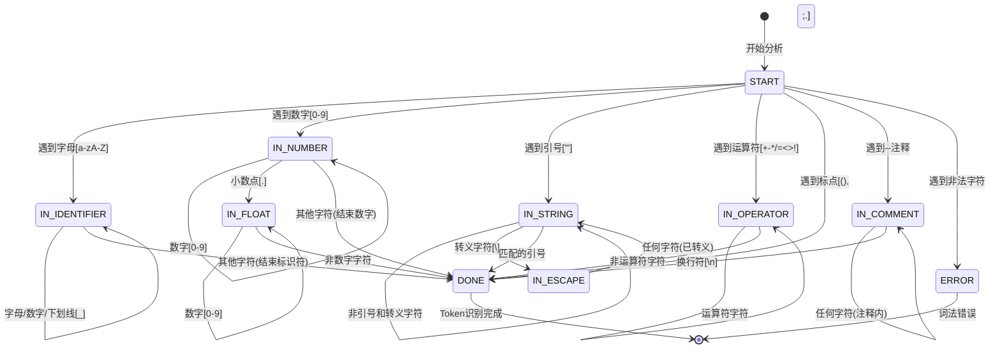
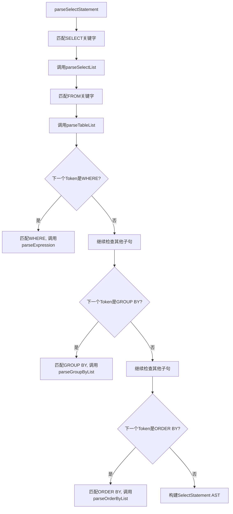
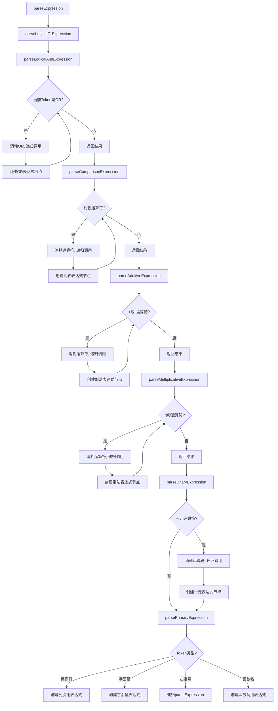
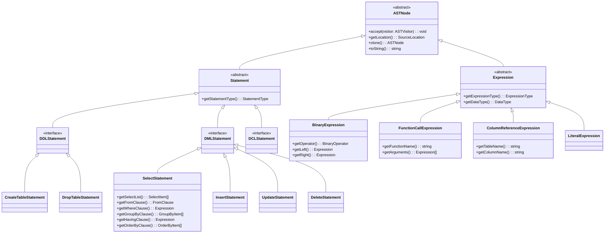
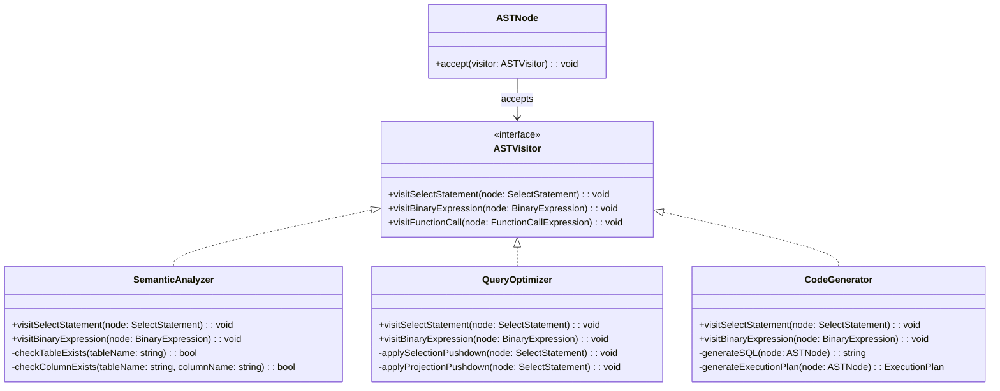
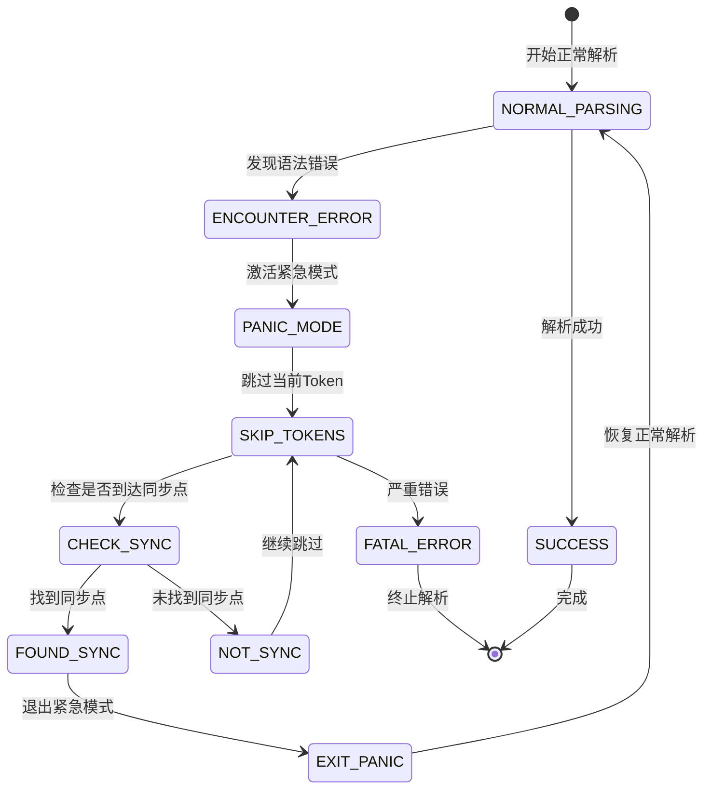
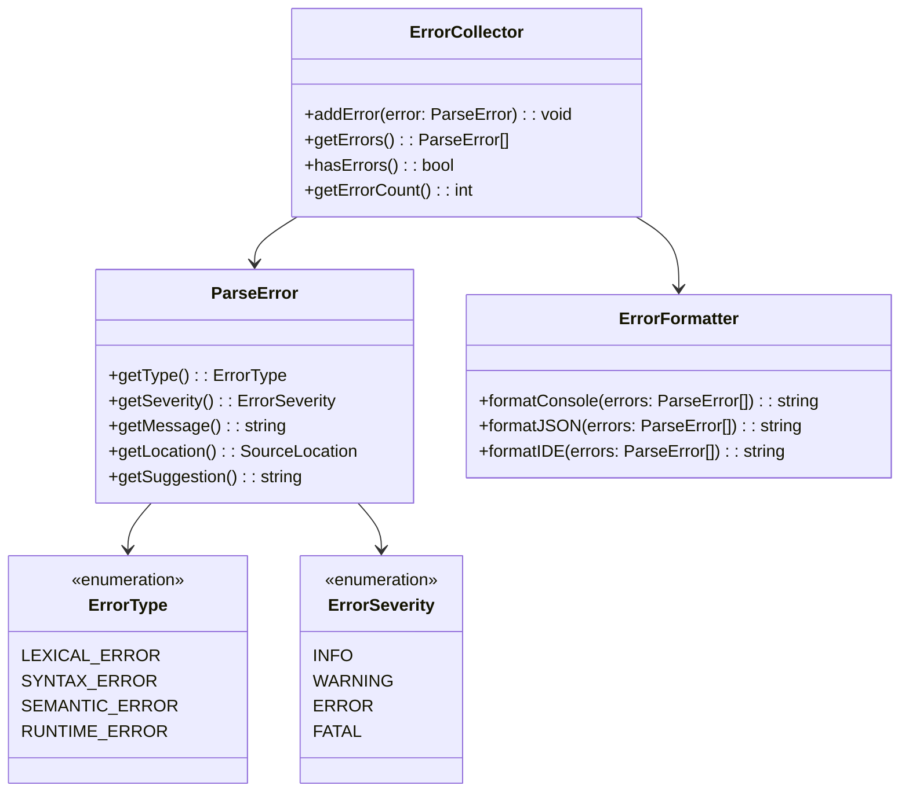
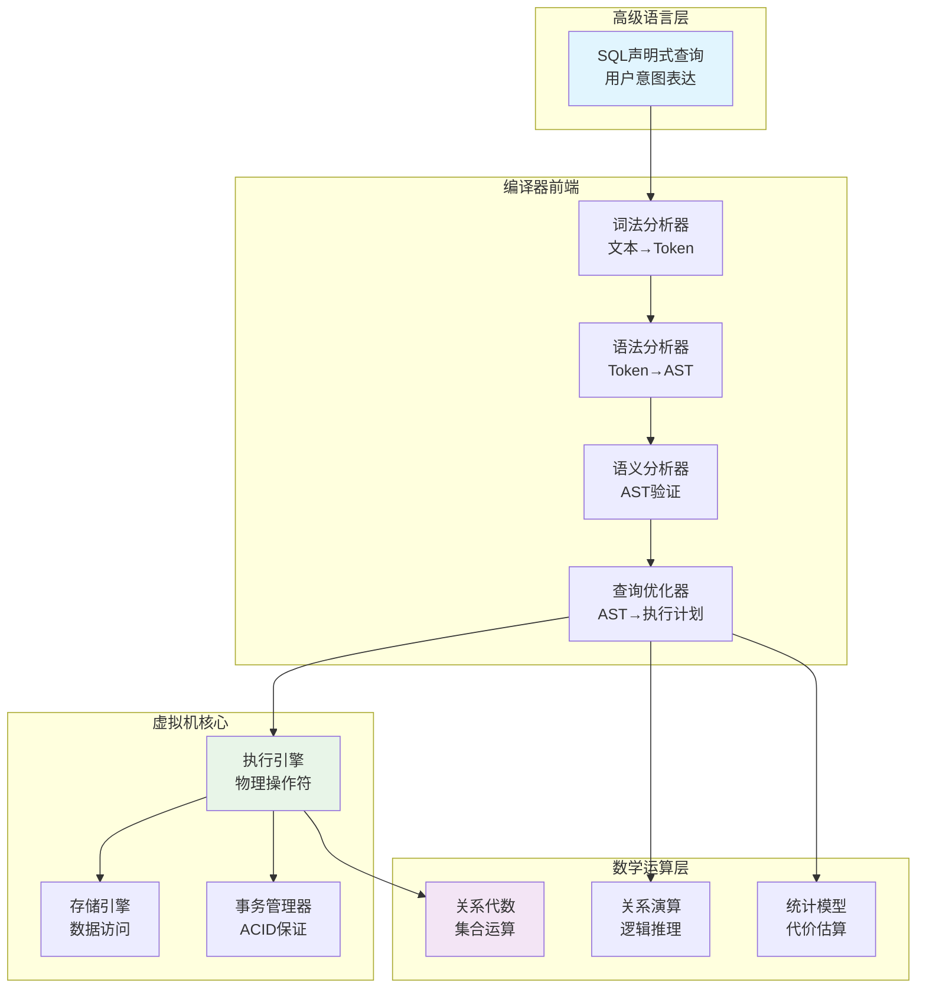
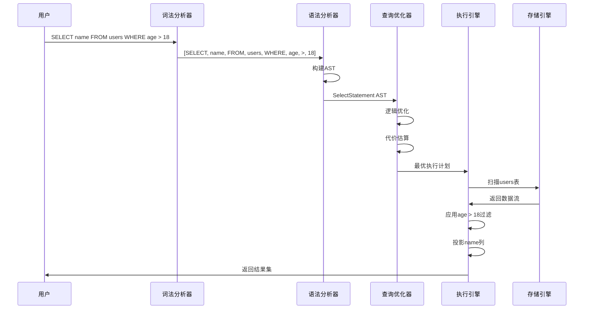
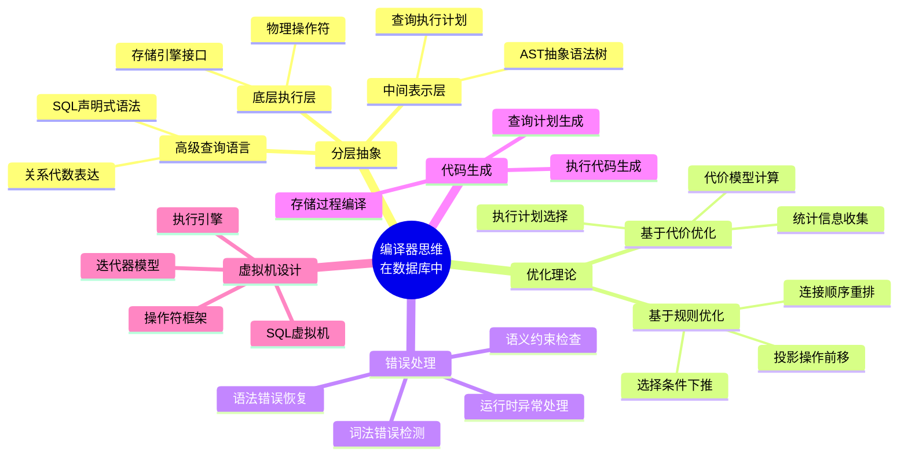

# 《数据库系统原理与开发实践》 - 第5章：SQL解析器：编译原理在数据库中的工程实践

**从理论到实现：词法分析、语法分析、AST节点体系与访问者模式**

---

## 🎯 **本章核心目标**

通过SQLCC项目的SQL解析器实现，深入理解编译原理的工程应用：
- **SQLCC词法分析器**：DFA状态机与状态转换表的实现
- **递归下降解析器**：模块化解析架构与错误恢复机制
- **AST节点层次体系**：Statement、Expression、Constraint的完整节点设计
- **访问者模式(Visitor Pattern)**：AST遍历与语义分析的实现
- **高级SQL特性**：Set Operation、Window Function、Recursive Query的AST表示
- **错误处理机制**：Panic Mode错误恢复与结构化错误信息

---

## 5.1 编译原理基础：程序语言的翻译机制

### 5.1.1 什么是编译器？

编译器是一种将高级程序设计语言转换为低级机器语言或中间代码的程序。想象一下，你用中文写了一封信，但收信人只会英文，这时你需要一个"翻译官"把中文翻译成英文。这个翻译官就是编译器，而SQL解析器就是数据库世界的"翻译官"。

**编译器的基本任务**：
1. **理解源程序**：识别程序的语法结构和语义含义
2. **生成目标代码**：将高级语言转换为可执行的低级代码
3. **优化代码性能**：生成更高效的目标代码
4. **提供错误信息**：帮助程序员发现和修复错误

### 5.1.2 SQL解析器与传统编译器的对比

SQL解析器虽然不是传统意义上的编译器，但它采用了编译器的核心技术栈：

| 传统编译器 | SQL解析器 | 共同点 |
|-----------|-----------|--------|
| C++/Java源代码 | SQL语句文本 | 都是高级语言 |
| 词法分析器(Lexer) | 词法分析器(Lexer) | 将文本分解为基本单元 |
| 语法分析器(Parser) | 语法分析器(Parser) | 构建语法结构 |
| 语义分析器 | 语义分析器 | 验证语义正确性 |
| 代码优化器 | 查询优化器 | 优化执行效率 |
| 代码生成器 | 执行计划生成器 | 生成可执行代码 |

**为什么SQL解析器像编译器？**

SQL语句虽然是声明式的（告诉数据库"要什么"而不是"怎么做"），但数据库需要将其转换为具体的执行步骤。这就像你对服务员说"我要一份宫保鸡丁"，服务员需要理解你的需求，然后按照菜谱一步步制作。

### 5.1.3 编译器的分层架构

编译器通常分为前端和后端两个部分：

**前端（Frontend）**：与源语言相关
- 词法分析器：处理字符流
- 语法分析器：处理语法结构
- 语义分析器：处理语义含义
- 中间代码生成器：生成中间表示

**后端（Backend）**：与目标机器相关
- 代码优化器：优化中间代码
- 代码生成器：生成目标代码

在SQL解析器中，前端对应词法分析、语法分析、语义分析，后端对应查询优化和执行计划生成。

## 5.2 词法分析：文本到Token的转换

**SQLCC的词法分析器实现**：

**源码位置**: `/home/liying/sqlcc/src/sql_parser/lexer.h`

```cpp
// SQLCC Lexer核心设计

词法分析是编译器的第一个阶段，它将源程序的字符流分解成一个个有意义的词法单元（Token）。

**Token的组成**：
- **类型（Type）**：标识符、关键字、运算符等
- **词素（Lexeme）**：实际的字符序列
- **位置信息**：行号、列号，用于错误报告

**举例**：对于SQL语句 `SELECT name FROM users WHERE age > 18`

词法分析的结果可能是：
- `SELECT` (关键字)
- `name` (标识符)
- `FROM` (关键字)
- `users` (标识符)
- `WHERE` (关键字)
- `age` (标识符)
- `>` (运算符)
- `18` (数字字面量)

### 5.2.2 确定有限自动机(DFA)在词法分析中的应用

词法分析器通常使用确定有限自动机(DFA)来识别Token。DFA是一种数学模型，由以下部分组成：

**DFA的组成部分**：
- **状态集合**：词法分析的不同阶段
- **字母表**：输入字符的集合
- **转换函数**：从一个状态到另一个状态的规则
- **起始状态**：分析开始时的状态
- **接受状态集合**：识别到完整Token时的状态

#### 📊 UML状态图：SQL词法分析器的DFA


```mermaid
stateDiagram-v2
    [*] --> START: 开始分析

    START --> IN_IDENTIFIER: 遇到字母[a-zA-Z]
    START --> IN_NUMBER: 遇到数字[0-9]
    START --> IN_STRING: 遇到引号['"]
    START --> IN_OPERATOR: 遇到运算符[+-*/=<>!]
    START --> DONE: 遇到标点[(),;.]
    START --> IN_COMMENT: 遇到--注释
    START --> ERROR: 遇到非法字符

    IN_IDENTIFIER --> IN_IDENTIFIER: 字母/数字/下划线[_]
    IN_IDENTIFIER --> DONE: 其他字符(结束标识符)

    IN_NUMBER --> IN_NUMBER: 数字[0-9]
    IN_NUMBER --> IN_FLOAT: 小数点[.]
    IN_NUMBER --> DONE: 其他字符(结束数字)

    IN_FLOAT --> IN_FLOAT: 数字[0-9]
    IN_FLOAT --> DONE: 非数字字符

    IN_STRING --> IN_STRING: 非引号和转义字符
    IN_STRING --> IN_ESCAPE: 转义字符[\\]
    IN_STRING --> DONE: 匹配的引号

    IN_ESCAPE --> IN_STRING: 任何字符(已转义)

    IN_OPERATOR --> IN_OPERATOR: 运算符字符
    IN_OPERATOR --> DONE: 非运算符字符

    IN_COMMENT --> IN_COMMENT: 任何字符(注释内)
    IN_COMMENT --> DONE: 换行符[\\n]

    DONE --> [*]: Token识别完成
    ERROR --> [*]: 词法错误
```

### 5.2.3 SQLCC中的词法分析器实现

在SQLCC项目中，词法分析器通过状态转换表实现了高效的Token识别：

**核心设计思路**：
1. **状态驱动**：每个字符触发状态转换
2. **表驱动实现**：使用二维数组存储转换规则
3. **字符分类**：将字符分为字母、数字、运算符等类别

**性能优势**：
- **O(1)查询**：状态转换表查询时间复杂度为常数
- **无条件判断**：避免了if-elseif-else的复杂条件链
- **易于扩展**：新增Token类型只需修改转换表

## 5.3 语法分析：Token序列到语法树的构建

### 5.3.1 语法分析的基本概念

语法分析是编译器的第二个阶段，它根据语言的语法规则将Token序列组织成语法结构树。

**语法规则的表达**：
编译原理中使用**上下文无关文法**（CFG）来描述编程语言的语法。最常用的表示法是**巴科斯范式（BNF）**。

**BNF的基本符号**：
- `::=` 表示"定义为"
- `|` 表示"或"
- `<>` 包围非终结符
- 其他符号是终结符

### 5.3.2 SQL的BNF语法规则示例

```ebnf
# SQL SELECT语句的语法规则
<select_statement> ::= SELECT <select_list> FROM <table_list>
                       [WHERE <expression>]
                       [GROUP BY <group_by_list>]
                       [HAVING <expression>]
                       [ORDER BY <order_by_list>]

<select_list> ::= <select_item> (',' <select_item>)* | '*'

<select_item> ::= <expression> [AS <identifier>]

<table_list> ::= <table_reference> (',' <table_reference>)*

<table_reference> ::= <identifier> | (<select_statement>)

<expression> ::= <logical_or_expression>
```

### 5.3.3 递归下降解析器的工作原理

递归下降解析器是一种自顶向下的语法分析方法，每个BNF规则对应一个递归函数。

**基本工作流程**：
1. **为每个非终结符编写函数**：`parseSelectStatement()`, `parseExpression()`等
2. **预测选择**：根据当前Token选择合适的产生式
3. **递归调用**：遇到子规则时递归调用相应函数
4. **匹配Token**：遇到终结符时匹配并消耗Token

#### 🔄 UML活动图：递归下降解析流程


```mermaid
flowchart TD
    A[parseSelectStatement] --> B[匹配SELECT关键字]
    B --> C[调用parseSelectList]
    C --> D[匹配FROM关键字]
    D --> E[调用parseTableList]

    E --> F{下一个Token是WHERE?}
    F -->|是| G[匹配WHERE, 调用parseExpression]
    F -->|否| H[继续检查其他子句]

    H --> I{下一个Token是GROUP BY?}
    I -->|是| J[匹配GROUP BY, 调用parseGroupByList]
    I -->|否| K[继续检查其他子句]

    K --> L{下一个Token是ORDER BY?}
    L -->|是| M[匹配ORDER BY, 调用parseOrderByList]
    L -->|否| N[构建SelectStatement AST]
```

### 5.3.4 表达式解析的优先级处理

表达式解析是语法分析中最复杂的部分，需要正确处理运算符的优先级和结合性。

**运算符优先级**（从高到低）：
1. 一元运算符：`NOT`, `+`, `-`
2. 算术运算符：`*`, `/`, `%`
3. 算术运算符：`+`, `-`
4. 比较运算符：`=`, `!=`, `<`, `<=`, `>`, `>=`, `LIKE`, `IN`
5. 逻辑运算符：`AND`
6. 逻辑运算符：`OR`

#### 📈 UML活动图：表达式优先级解析


```mermaid
flowchart TD
    A[parseExpression] --> B[parseLogicalOrExpression]

    B --> C[parseLogicalAndExpression]
    C --> D{当前Token是OR?}
    D -->|是| E[消耗OR, 递归调用]
    D -->|否| F[返回结果]

    E --> G[创建OR表达式节点]
    G --> D

    F --> H[parseComparisonExpression]

    H --> I{比较运算符?}
    I -->|是| J[消耗运算符, 递归调用]
    I -->|否| K[返回结果]

    J --> L[创建比较表达式节点]
    L --> I

    K --> M[parseAdditiveExpression]

    M --> N{+或-运算符?}
    N -->|是| O[消耗运算符, 递归调用]
    N -->|否| P[返回结果]

    O --> Q[创建加法表达式节点]
    Q --> N

    P --> R[parseMultiplicativeExpression]

    R --> S{*或/运算符?}
    S -->|是| T[消耗运算符, 递归调用]
    S -->|否| U[返回结果]

    T --> V[创建乘法表达式节点]
    V --> S

    U --> W[parseUnaryExpression]

    W --> X{一元运算符?}
    X -->|是| Y[消耗运算符, 递归调用]
    X -->|否| Z[parsePrimaryExpression]

    Y --> AA[创建一元表达式节点]
    AA --> Z

    Z --> BB{Token类型?}
    BB -->|标识符| CC[创建列引用表达式]
    BB -->|字面量| DD[创建字面量表达式]
    BB -->|左括号| EE[递归parseExpression]
    BB -->|函数名| FF[创建函数调用表达式]
```

### 5.3.5 SQLCC中的语法分析器实现

在SQLCC项目中，语法分析器采用了模块化的设计：

**核心组件**：
- **Parser类**：主解析器，协调各个子解析器
- **ExpressionParser类**：专门处理表达式解析
- **StatementParser类**：处理各种SQL语句
- **ASTBuilder类**：构建抽象语法树节点

**设计优势**：
- **职责分离**：不同类型的语法结构由专门的解析器处理
- **错误恢复**：采用Panic Mode策略处理语法错误
- **扩展性**：新的SQL语法可以通过继承现有解析器实现

## 5.4 抽象语法树(AST)：语义结构的层次化表示

### 5.4.1 AST的基本概念

抽象语法树（Abstract Syntax Tree）是源程序语法结构的树状表示。与具体语法树不同，AST抽象掉了语法细节，保留了语义结构。

**AST的特点**：
- **树状结构**：根节点代表整个程序，子节点代表组件
- **类型层次**：不同类型的节点表示不同的语法元素
- **位置信息**：每个节点包含源代码位置，便于错误报告
- **语义完整**：包含所有必要的语义信息

### 5.4.2 AST节点的层次化设计

AST采用面向对象的层次结构设计，便于扩展和维护。

#### 🌳 UML类图：AST节点层次结构


```mermaid
classDiagram
    class ASTNode {
        <<abstract>>
        +accept(visitor: ASTVisitor): void
        +getLocation(): SourceLocation
        +clone(): ASTNode
        +toString(): string
    }

    class Statement {
        <<abstract>>
        +getStatementType(): StatementType
    }

    class Expression {
        <<abstract>>
        +getExpressionType(): ExpressionType
        +getDataType(): DataType
    }

    class DDLStatement {
        <<interface>>
    }

    class DMLStatement {
        <<interface>>
    }

    class DCLStatement {
        <<interface>>
    }

    class SelectStatement {
        +getSelectList(): SelectItem[]
        +getFromClause(): FromClause
        +getWhereClause(): Expression
        +getGroupByClause(): GroupByItem[]
        +getHavingClause(): Expression
        +getOrderByClause(): OrderByItem[]
    }

    class BinaryExpression {
        +getOperator(): BinaryOperator
        +getLeft(): Expression
        +getRight(): Expression
    }

    class FunctionCallExpression {
        +getFunctionName(): string
        +getArguments(): Expression[]
    }

    class ColumnReferenceExpression {
        +getTableName(): string
        +getColumnName(): string
    }

    ASTNode <|-- Statement
    ASTNode <|-- Expression

    Statement <|-- DDLStatement
    Statement <|-- DMLStatement
    Statement <|-- DCLStatement

    DDLStatement <|-- CreateTableStatement
    DDLStatement <|-- DropTableStatement

    DMLStatement <|-- SelectStatement
    DMLStatement <|-- InsertStatement
    DMLStatement <|-- UpdateStatement
    DMLStatement <|-- DeleteStatement

    Expression <|-- BinaryExpression
    Expression <|-- FunctionCallExpression
    Expression <|-- ColumnReferenceExpression
    Expression <|-- LiteralExpression
```

### 5.4.3 访问者模式：AST的统一处理框架

访问者模式为AST提供了统一的处理接口，支持语义分析、代码生成等多种操作。

#### 🎭 UML类图：访问者模式设计


```mermaid
classDiagram
    class ASTVisitor {
        <<interface>>
        +visitSelectStatement(node: SelectStatement): void
        +visitBinaryExpression(node: BinaryExpression): void
        +visitFunctionCall(node: FunctionCallExpression): void
    }

    class SemanticAnalyzer {
        +visitSelectStatement(node: SelectStatement): void
        +visitBinaryExpression(node: BinaryExpression): void
        -checkTableExists(tableName: string): bool
        -checkColumnExists(tableName: string, columnName: string): bool
    }

    class QueryOptimizer {
        +visitSelectStatement(node: SelectStatement): void
        +visitBinaryExpression(node: BinaryExpression): void
        -applySelectionPushdown(node: SelectStatement): void
        -applyProjectionPushdown(node: SelectStatement): void
    }

    class CodeGenerator {
        +visitSelectStatement(node: SelectStatement): void
        +visitBinaryExpression(node: BinaryExpression): void
        -generateSQL(node: ASTNode): string
        -generateExecutionPlan(node: ASTNode): ExecutionPlan
    }

    class ASTNode {
        +accept(visitor: ASTVisitor): void
    }

    ASTVisitor <|.. SemanticAnalyzer
    ASTVisitor <|.. QueryOptimizer
    ASTVisitor <|.. CodeGenerator

    ASTNode --> ASTVisitor : accepts
```

### 5.4.4 SQLCC中的AST实现特点

**内存管理**：
- 使用智能指针（`std::unique_ptr`）管理AST节点生命周期
- 避免内存泄漏，提高代码安全性

**位置追踪**：
- 每个AST节点包含`SourceLocation`信息
- 支持精确的错误定位和调试

**类型系统**：
- 强类型设计，每个节点有明确的类型标识
- 支持类型检查和推导

## 5.5 错误处理：编译器的容错机制

### 5.5.1 编译器错误处理的层次

编译器需要处理多种类型的错误，每种错误有不同的严重程度和处理策略。

**错误类型层次**：
1. **词法错误**：非法字符、未终止字符串等
2. **语法错误**：不符合语法规则的结构
3. **语义错误**：类型不匹配、未定义标识符等
4. **运行时错误**：执行过程中的错误

### 5.5.2 Panic Mode错误恢复策略

Panic Mode是编译器错误恢复的经典技术，能够在遇到错误时继续解析后续代码。

#### 🚨 UML状态图：Panic Mode错误恢复


```mermaid
stateDiagram-v2
    [*] --> NORMAL_PARSING: 开始正常解析

    NORMAL_PARSING --> ENCOUNTER_ERROR: 发现语法错误
    ENCOUNTER_ERROR --> PANIC_MODE: 激活紧急模式

    PANIC_MODE --> SKIP_TOKENS: 跳过当前Token
    SKIP_TOKENS --> CHECK_SYNC: 检查是否到达同步点

    CHECK_SYNC --> FOUND_SYNC: 找到同步点
    CHECK_SYNC --> NOT_SYNC: 未找到同步点

    FOUND_SYNC --> EXIT_PANIC: 退出紧急模式
    NOT_SYNC --> SKIP_TOKENS: 继续跳过

    EXIT_PANIC --> NORMAL_PARSING: 恢复正常解析
    SKIP_TOKENS --> FATAL_ERROR: 严重错误
    FATAL_ERROR --> [*]: 终止解析

    NORMAL_PARSING --> SUCCESS: 解析成功
    SUCCESS --> [*]: 完成
```

### 5.5.3 结构化错误信息设计

良好的错误信息应该包含所有必要的调试信息。

#### 📋 UML类图：错误处理体系


```mermaid
classDiagram
    class ParseError {
        +getType(): ErrorType
        +getSeverity(): ErrorSeverity
        +getMessage(): string
        +getLocation(): SourceLocation
        +getSuggestion(): string
    }

    class ErrorCollector {
        +addError(error: ParseError): void
        +getErrors(): ParseError[]
        +hasErrors(): bool
        +getErrorCount(): int
    }

    class ErrorFormatter {
        +formatConsole(errors: ParseError[]): string
        +formatJSON(errors: ParseError[]): string
        +formatIDE(errors: ParseError[]): string
    }

    class ErrorType {
        <<enumeration>>
        LEXICAL_ERROR
        SYNTAX_ERROR
        SEMANTIC_ERROR
        RUNTIME_ERROR
    }

    class ErrorSeverity {
        <<enumeration>>
        INFO
        WARNING
        ERROR
        FATAL
    }

    ErrorCollector --> ParseError
    ParseError --> ErrorType
    ParseError --> ErrorSeverity
    ErrorCollector --> ErrorFormatter
```

### 5.5.4 SQLCC的错误处理实践

**错误信息丰富性**：
- 包含确切的位置信息（行号、列号）
- 提供具体的错误描述
- 给出修复建议

**错误恢复策略**：
- 词法错误：跳过非法字符，继续分析
- 语法错误：使用Panic Mode跳到语句边界
- 语义错误：收集所有错误，不中断解析

## 5.6 SQL解析器：高级数据操作虚拟机

### 5.6.1 超越传统虚拟机的SQL解析器

SQL解析器可以被视为一种高级虚拟机，它将声明式查询语言转换为底层的数学运算序列。

#### 🏛️ UML组件图：SQL解析器作为虚拟机


```mermaid
graph TB
    subgraph "高级语言层"
        SQL[SQL声明式查询<br/>用户意图表达]
    end

    subgraph "编译器前端"
        Lexer[词法分析器<br/>文本→Token]
        Parser[语法分析器<br/>Token→AST]
        Semantic[语义分析器<br/>AST验证]
        Optimizer[查询优化器<br/>AST→执行计划]
    end

    subgraph "虚拟机核心"
        Engine[执行引擎<br/>物理操作符]
        Storage[存储引擎<br/>数据访问]
        Transaction[事务管理器<br/>ACID保证]
    end

    subgraph "数学运算层"
        Algebra[关系代数<br/>集合运算]
        Calculus[关系演算<br/>逻辑推理]
        Statistics[统计模型<br/>代价估算]
    end

    SQL --> Lexer
    Lexer --> Parser
    Parser --> Semantic
    Semantic --> Optimizer
    Optimizer --> Engine
    Engine --> Storage
    Engine --> Transaction

    Engine --> Algebra
    Optimizer --> Calculus
    Optimizer --> Statistics

    style SQL fill:#e1f5fe
    style Algebra fill:#f3e5f5
    style Engine fill:#e8f5e8
```

### 5.6.2 从SQL到关系代数的翻译

SQL解析器将高级SQL操作映射为底层的数学运算。

#### 🔄 UML序列图：SQL执行的完整流程


```mermaid
sequenceDiagram
    participant User as 用户
    participant Lexer as 词法分析器
    participant Parser as 语法分析器
    participant Optimizer as 查询优化器
    participant Engine as 执行引擎
    participant Storage as 存储引擎

    User->>Lexer: SELECT name FROM users WHERE age > 18
    Lexer->>Parser: [SELECT, name, FROM, users, WHERE, age, >, 18]

    Parser->>Parser: 构建AST
    Parser->>Optimizer: SelectStatement AST

    Optimizer->>Optimizer: 逻辑优化
    Optimizer->>Optimizer: 代价估算
    Optimizer->>Engine: 最优执行计划

    Engine->>Storage: 扫描users表
    Storage->>Engine: 返回数据流

    Engine->>Engine: 应用age > 18过滤
    Engine->>Engine: 投影name列

    Engine->>User: 返回结果集
```

---

## 5.7 SQLCC AST节点体系：组合模式与类型安全

SQLCC的AST节点体系是整个解析器的核心，它采用组合模式(Composite Pattern)构建了完整的SQL语法树，提供了类型安全的节点表示和灵活的遍历机制。

### 5.7.1 AST节点体系的层次结构

SQLCC的AST节点体系分为三个主要层次：

```
mermaid
classDiagram
    class ASTNode {
        <<abstract>>
        +getTypeName() string
    }
    
    class Statement {
        <<abstract>>
        Type type_
        +accept(visitor) void
        +getType() Type
    }
    
    class Expression {
        <<abstract>>
        +accept(visitor) void
        +evaluate() Value
    }
    
    class NodeVisitor {
        <<abstract>>
        +visit(stmt) void
        +visit(expr) void
    }
    
    class SelectStatement {
        selectList
        fromTables
        whereClause
        joinClauses
        groupBy
        having
        orderBy
        +accept(visitor) void
    }
    
    class InsertStatement {
        tableName
        columnNames
        values
        selectStatement
        +accept(visitor) void
    }
    
    class CreateStatement {
        objectType
        objectName
        columns
        constraints
        +accept(visitor) void
    }
    
    class BinaryExpression {
        left
        right
        operator
        +accept(visitor) void
    }
    
    class FunctionCallExpression {
        functionName
        arguments
        +accept(visitor) void
    }
    
    class WindowFunction {
        functionName
        partitionBy
        orderBy
        frame
        +accept(visitor) void
    }
    
    class SetOperation {
        operationType
        leftOperand
        rightOperand
        allFlag
        orderByColumns
        limit
        +accept(visitor) void
    }
    
    ASTNode <|-- Statement
    ASTNode <|-- Expression
    
    Statement <|-- SelectStatement
    Statement <|-- InsertStatement
    Statement <|-- CreateStatement
    
    Expression <|-- BinaryExpression
    Expression <|-- FunctionCallExpression
    Expression <|-- WindowFunction
    
    Statement <|-- SetOperation
    
    NodeVisitor ..> Statement
    NodeVisitor ..> Expression
```

### 5.7.2 Statement节点类型体系

SQLCC通过`Statement`基类定义了所有SQL语句的统一接口，支持多种语句类型：

**源码位置**: `/home/liying/sqlcc/src/sql_parser/ast/statement.h`

```cpp
// SQLCC Statement基类定义
class Statement : public ASTNode {
public:
    enum Type {
        SELECT,              // SELECT查询语句
        INSERT,              // INSERT插入语句
        UPDATE,              // UPDATE更新语句
        DELETE,              // DELETE删除语句
        CREATE_TABLE,        // CREATE TABLE语句
        DROP_TABLE,          // DROP TABLE语句
        ALTER_TABLE,         // ALTER TABLE语句
        CREATE_INDEX,        // CREATE INDEX语句
        DROP_INDEX,          // DROP INDEX语句
        GRANT,               // GRANT权限语句
        REVOKE,              // REVOKE权限语句
        COMPOSITE_SELECT,    // 复合SELECT语句
        WITH_RECURSIVE,      // WITH RECURSIVE递归查询
        // ... 更多语句类型
    };
    
    explicit Statement(Type type) : type_(type) {}
    virtual ~Statement() = default;
    
    // 访问者模式接口
    virtual void accept(NodeVisitor& visitor) = 0;
    
    Type getType() const { return type_; }
    
private:
    Type type_;
};
```

#### SelectStatement的完整实现

`SelectStatement`是SQLCC中最复杂的语句节点，支持完整的SQL92语法：

```cpp
// SQLCC SelectStatement完整实现
class SelectStatement : public Statement {
public:
    SelectStatement() : Statement(Statement::SELECT), 
                       distinct_(false), 
                       selectAll_(false) {}
    
    ~SelectStatement() override = default;
    
    void accept(NodeVisitor& visitor) override {
        visitor.visit(*this);
    }
    
    // Getters
    const std::vector<std::unique_ptr<Expression>>& getSelectList() const { 
        return selectList_; 
    }
    const std::vector<std::string>& getFromTables() const { 
        return fromTables_; 
    }
    const std::unique_ptr<WhereClause>& getWhereClause() const { 
        return whereClause_; 
    }
    const std::vector<std::unique_ptr<JoinClause>>& getJoinClauses() const { 
        return joinClauses_; 
    }
    const std::vector<std::unique_ptr<Expression>>& getGroupBy() const { 
        return groupBy_; 
    }
    const std::unique_ptr<Expression>& getHaving() const { 
        return having_; 
    }
    const std::vector<std::unique_ptr<Expression>>& getOrderBy() const { 
        return orderBy_; 
    }
    bool isDistinct() const { return distinct_; }
    bool isSelectAll() const { return selectAll_; }
    
    // Setters
    void setSelectList(std::vector<std::unique_ptr<Expression>> selectList);
    void setFromTables(const std::vector<std::string>& tables) { 
        fromTables_ = tables; 
    }
    void setWhereClause(std::unique_ptr<WhereClause> where);
    void setJoinClauses(std::vector<std::unique_ptr<JoinClause>> joins);
    void setGroupBy(std::vector<std::unique_ptr<Expression>> groupBy);
    void setHaving(std::unique_ptr<Expression> having);
    void setOrderBy(std::vector<std::unique_ptr<Expression>> orderBy);
    void setDistinct(bool distinct) { distinct_ = distinct; }
    void setSelectAll(bool selectAll) { selectAll_ = selectAll; }
    
    // 辅助方法
    void addFromTable(const std::string& table) { 
        fromTables_.push_back(table); 
    }
    void addJoinClause(std::unique_ptr<JoinClause> join) { 
        joinClauses_.push_back(std::move(join)); 
    }
    void addSelectColumn(std::unique_ptr<Expression> column) { 
        selectList_.push_back(std::move(column)); 
    }
    
private:
    std::string tableName_;
    std::vector<std::unique_ptr<Expression>> selectList_;
    std::vector<std::string> fromTables_;
    std::unique_ptr<WhereClause> whereClause_;
    std::vector<std::unique_ptr<JoinClause>> joinClauses_;
    std::vector<std::unique_ptr<Expression>> groupBy_;
    std::unique_ptr<Expression> having_;
    std::vector<std::unique_ptr<Expression>> orderBy_;
    std::string orderDirection_;
    bool distinct_;
    bool selectAll_;
};
```

### 5.7.3 Expression节点类型体系

SQLCC的Expression节点体系支持丰富的表达式类型，包括字面量、标识符、运算符、函数调用等：

```cpp
// SQLCC Expression基类定义
class Expression : public ASTNode {
public:
    enum Type {
        LITERAL,           // 字面量表达式
        IDENTIFIER,        // 标识符表达式
        BINARY,            // 二元运算表达式
        UNARY,             // 一元运算表达式
        FUNCTION_CALL,     // 函数调用表达式
        WINDOW_FUNCTION,   // 窗口函数表达式
        SUBQUERY,          // 子查询表达式
        CASE,              // CASE表达式
        // ... 更多表达式类型
    };
    
    explicit Expression(Type type) : type_(type) {}
    virtual ~Expression() = default;
    
    virtual void accept(NodeVisitor& visitor) = 0;
    Type getType() const { return type_; }
    
private:
    Type type_;
};

// 字面量表达式
class NumericLiteralExpression : public Expression {
public:
    explicit NumericLiteralExpression(double value) 
        : Expression(LITERAL), value_(value) {}
    
    void accept(NodeVisitor& visitor) override {
        visitor.visit(*this);
    }
    
    double getValue() const { return value_; }
    
private:
    double value_;
};

// 标识符表达式
class IdentifierExpression : public Expression {
public:
    explicit IdentifierExpression(const std::string& name) 
        : Expression(IDENTIFIER), name_(name) {}
    
    void accept(NodeVisitor& visitor) override {
        visitor.visit(*this);
    }
    
    const std::string& getName() const { return name_; }
    
private:
    std::string name_;
};

// 二元运算表达式
class BinaryExpression : public Expression {
public:
    BinaryExpression(std::unique_ptr<Expression> left,
                    std::unique_ptr<Expression> right,
                    const std::string& op)
        : Expression(BINARY), left_(std::move(left)), 
          right_(std::move(right)), operator_(op) {}
    
    void accept(NodeVisitor& visitor) override {
        visitor.visit(*this);
    }
    
    Expression* getLeft() const { return left_.get(); }
    Expression* getRight() const { return right_.get(); }
    const std::string& getOperator() const { return operator_; }
    
private:
    std::unique_ptr<Expression> left_;
    std::unique_ptr<Expression> right_;
    std::string operator_;
};
```

### 5.7.4 访问者模式(Visitor Pattern)在AST遍历中的应用

访问者模式是SQLCC AST遍历的核心机制，它将遍历逻辑与节点结构分离，实现了灵活的语义分析和代码生成。

#### 访问者模式的经典定义

访问者模式表示一个作用于某对象结构中的各元素的操作。它使你可以在不改变各元素的类的前提下定义作用于这些元素的新操作。

#### SQLCC NodeVisitor的完整实现

```cpp
// SQLCC NodeVisitor抽象基类
class NodeVisitor {
public:
    virtual ~NodeVisitor() = default;
    
    // Expression visitor methods
    virtual void visit(Expression& expr) {}
    virtual void visit(NumericLiteralExpression& expr) {}
    virtual void visit(StringLiteralExpression& expr) {}
    virtual void visit(BooleanLiteralExpression& expr) {}
    virtual void visit(NullLiteralExpression& expr) {}
    virtual void visit(IdentifierExpression& expr) {}
    virtual void visit(FunctionCallExpression& expr) {}
    virtual void visit(BinaryExpression& expr) {}
    virtual void visit(WindowFunction& expr) {}
    
    // Statement visitor methods
    virtual void visit(SelectStatement& stmt) {}
    virtual void visit(InsertStatement& stmt) {}
    virtual void visit(UpdateStatement& stmt) {}
    virtual void visit(DeleteStatement& stmt) {}
    virtual void visit(CreateStatement& stmt) {}
    virtual void visit(DropStatement& stmt) {}
    virtual void visit(WithRecursiveClause& clause) {}
    virtual void visit(WindowSpecification& spec) {}
};
```

#### 访问者模式的应用实例：语义分析器

```cpp
// SQLCC语义分析器实现
class SemanticAnalyzer : public NodeVisitor {
public:
    SemanticAnalyzer(DatabaseManager* db_manager) 
        : db_manager_(db_manager) {}
    
    // 分析SELECT语句
    void visit(SelectStatement& stmt) override {
        // 1. 验证表是否存在
        for (const auto& table : stmt.getFromTables()) {
            if (!db_manager_->tableExists(table)) {
                errors_.push_back("Table '" + table + "' does not exist");
            }
        }
        
        // 2. 验证列是否存在
        for (const auto& expr : stmt.getSelectList()) {
            expr->accept(*this);
        }
        
        // 3. 验证WHERE条件
        if (stmt.getWhereClause()) {
            stmt.getWhereClause()->getCondition()->accept(*this);
        }
    }
    
    // 分析标识符表达式
    void visit(IdentifierExpression& expr) override {
        // 验证列是否存在
        if (!db_manager_->columnExists(expr.getName())) {
            errors_.push_back("Column '" + expr.getName() + "' does not exist");
        }
    }
    
    // 分析函数调用表达式
    void visit(FunctionCallExpression& expr) override {
        // 验证函数是否存在
        if (!db_manager_->functionExists(expr.getFunctionName())) {
            errors_.push_back("Function '" + expr.getFunctionName() + "' does not exist");
        }
        
        // 验证参数数量
        if (expr.getArguments().size() != 
            db_manager_->getFunctionParamCount(expr.getFunctionName())) {
            errors_.push_back("Invalid number of arguments for function '" + 
                             expr.getFunctionName() + "'");
        }
    }
    
    const std::vector<std::string>& getErrors() const { 
        return errors_; 
    }
    
    bool hasErrors() const { return !errors_.empty(); }
    
private:
    DatabaseManager* db_manager_;
    std::vector<std::string> errors_;
};
```

#### 访问者模式的应用实例：代码生成器

```cpp
// SQLCC执行计划生成器
class PlanGenerator : public NodeVisitor {
public:
    void visit(SelectStatement& stmt) override {
        // 生成SELECT执行计划
        plan_ = std::make_unique<SelectPlan>();
        
        // 生成FROM子句计划
        for (const auto& table : stmt.getFromTables()) {
            plan_->addScanPlan(table);
        }
        
        // 生成WHERE条件计划
        if (stmt.getWhereClause()) {
            stmt.getWhereClause()->getCondition()->accept(*this);
        }
        
        // 生成JOIN计划
        for (const auto& join : stmt.getJoinClauses()) {
            plan_->addJoinPlan(join->getTableName(), join->getCondition());
        }
    }
    
    void visit(BinaryExpression& expr) override {
        // 生成二元运算计划
        expr.getLeft()->accept(*this);
        expr.getRight()->accept(*this);
        plan_->addFilterPlan(expr.getOperator());
    }
    
    std::unique_ptr<QueryPlan> getPlan() { return std::move(plan_); }
    
private:
    std::unique_ptr<QueryPlan> plan_;
};
```

### 5.7.5 高级SQL特性的AST表示

SQLCC支持多种高级SQL特性，这些特性在AST中有专门的节点表示。

#### Set Operation（集合操作）的AST表示

```cpp
// SQLCC Set Operation节点
enum class SetOperationType {
    NONE,       // 无操作
    UNION,      // UNION操作
    INTERSECT,  // INTERSECT操作
    EXCEPT      // EXCEPT操作
};

class SetOperation : public Statement {
public:
    SetOperation(SetOperationType operationType, 
                 std::unique_ptr<SelectStatement> leftOperand,
                 std::unique_ptr<SelectStatement> rightOperand,
                 bool allFlag = false)
        : Statement(Statement::COMPOSITE_SELECT),
          operationType_(operationType),
          leftOperand_(std::move(leftOperand)),
          rightOperand_(std::move(rightOperand)),
          allFlag_(allFlag) {}
    
    ~SetOperation() override = default;
    
    void accept(NodeVisitor& visitor) override {
        visitor.visit(*this);
    }
    
    SetOperationType getOperationType() const { return operationType_; }
    SelectStatement* getLeftOperand() const { return leftOperand_.get(); }
    SelectStatement* getRightOperand() const { return rightOperand_.get(); }
    bool isAll() const { return allFlag_; }
    
    // ORDER BY支持
    void setOrderBy(std::vector<std::string> columns, 
                   std::vector<bool> ascending) {
        orderByColumns_ = columns;
        orderByAscending_ = ascending;
    }
    
    const std::vector<std::string>& getOrderByColumns() const {
        return orderByColumns_;
    }
    
    // LIMIT支持
    void setLimit(size_t limit) {
        limit_ = limit;
        hasLimit_ = true;
    }
    
    size_t getLimit() const { return limit_; }
    bool hasLimit() const { return hasLimit_; }
    
private:
    SetOperationType operationType_;
    std::unique_ptr<SelectStatement> leftOperand_;
    std::unique_ptr<SelectStatement> rightOperand_;
    bool allFlag_;
    
    // ORDER BY支持
    std::vector<std::string> orderByColumns_;
    std::vector<bool> orderByAscending_;
    
    // LIMIT支持
    size_t limit_;
    bool hasLimit_;
};
```

#### Window Function（窗口函数）的AST表示

```cpp
// SQLCC Window Function节点
class WindowFunction : public Expression {
public:
    WindowFunction(const std::string& functionName,
                  std::vector<std::unique_ptr<Expression>> arguments,
                  std::unique_ptr<WindowSpecification> windowSpec)
        : Expression(WINDOW_FUNCTION),
          functionName_(functionName),
          arguments_(std::move(arguments)),
          windowSpec_(std::move(windowSpec)) {}
    
    void accept(NodeVisitor& visitor) override {
        visitor.visit(*this);
    }
    
    const std::string& getFunctionName() const { return functionName_; }
    const std::vector<std::unique_ptr<Expression>>& getArguments() const {
        return arguments_;
    }
    WindowSpecification* getWindowSpec() const { 
        return windowSpec_.get(); 
    }
    
private:
    std::string functionName_;
    std::vector<std::unique_ptr<Expression>> arguments_;
    std::unique_ptr<WindowSpecification> windowSpec_;
};

// Window Specification节点
class WindowSpecification {
public:
    const std::vector<std::unique_ptr<Expression>>& getPartitionBy() const {
        return partitionBy_;
    }
    
    const std::vector<std::unique_ptr<Expression>>& getOrderBy() const {
        return orderBy_;
    }
    
    const std::string& getFrameStart() const { return frameStart_; }
    const std::string& getFrameEnd() const { return frameEnd_; }
    
    void setPartitionBy(std::vector<std::unique_ptr<Expression>> partitionBy) {
        partitionBy_ = std::move(partitionBy);
    }
    
    void setOrderBy(std::vector<std::unique_ptr<Expression>> orderBy) {
        orderBy_ = std::move(orderBy);
    }
    
    void setFrame(const std::string& start, const std::string& end) {
        frameStart_ = start;
        frameEnd_ = end;
    }
    
private:
    std::vector<std::unique_ptr<Expression>> partitionBy_;
    std::vector<std::unique_ptr<Expression>> orderBy_;
    std::string frameStart_;
    std::string frameEnd_;
};
```

### 5.7.6 AST节点体系的设计哲学

SQLCC的AST节点体系体现了深刻的软件工程设计哲学：

#### 组合模式(Composite Pattern)的完美应用

**组合模式的经典定义**：
组合模式将对象组合成树形结构以表示"部分-整体"的层次结构，使得用户对单个对象和组合对象的使用具有一致性。

**SQLCC中的组合模式应用**：
- `Statement`作为组合对象，可以包含多个`Expression`子节点
- `Expression`作为组合对象，可以包含嵌套的`Expression`子节点
- 递归结构支持无限嵌套的复杂SQL语句

```cpp
// 组合模式的递归结构示例
// SELECT SUM(price * quantity) FROM orders WHERE order_date > '2023-01-01'
// 
// SelectStatement (Statement)
//   ├── selectList[0] (FunctionCallExpression)
//   │   ├── functionName: "SUM"
//   │   └── arguments[0] (BinaryExpression)
//   │       ├── left: price (IdentifierExpression)
//   │       ├── operator: "*"
//   │       └── right: quantity (IdentifierExpression)
//   ├── fromTables: ["orders"]
//   └── whereClause (WhereClause)
//       └── condition (BinaryExpression)
//           ├── left: order_date (IdentifierExpression)
//           ├── operator: ">"
//           └── right: '2023-01-01' (StringLiteralExpression)
```

#### 双分派(Double Dispatch)机制的实现

访问者模式实现了双分派机制：
- 第一次分派：节点调用访问者的visit方法
- 第二次分派：访问者根据节点类型调用相应的处理逻辑

```cpp
// 双分派机制示例
void analyzeStatement(Statement* stmt, NodeVisitor* visitor) {
    // 第一次分派：节点调用访问者
    stmt->accept(*visitor);
}

void NodeVisitor::visit(SelectStatement& stmt) {
    // 第二次分派：访问者根据节点类型处理
    // 处理SELECT语句的特定逻辑
}
```

#### 类型安全的内存管理

SQLCC使用C++智能指针实现类型安全的内存管理：

```cpp
// 使用unique_ptr管理所有权
std::vector<std::unique_ptr<Expression>> selectList_;

// 自动内存管理，避免内存泄漏
void addSelectColumn(std::unique_ptr<Expression> column) {
    selectList_.push_back(std::move(column));
}
```

### 5.7.7 AST节点体系的工程价值

**1. 可扩展性**
- 新增SQL语句类型只需添加新的Statement子类
- 新增表达式类型只需添加新的Expression子类
- 新增访问者逻辑只需实现新的NodeVisitor子类

**2. 可维护性**
- 清晰的节点层次结构便于理解和维护
- 访问者模式将遍历逻辑与节点结构分离
- 单一职责原则：每个节点类只负责自身的表示

**3. 可测试性**
- 每个节点类可以独立测试
- 访问者可以单独测试遍历逻辑
- AST构建和遍历逻辑分离，便于单元测试

**4. 性能优化**
- 智能指针避免内存泄漏和悬空指针
- 节点对象池减少内存分配开销
- 延迟求值支持表达式按需计算

通过深入理解SQLCC的AST节点体系，我们可以看到现代数据库系统是如何通过精心的设计和模式应用，将复杂的SQL语法转换为清晰、可维护、可扩展的内部表示。这种AST节点体系不仅满足了当前的功能需求，也为未来的SQL特性扩展和性能优化奠定了坚实的基础。

---

## 5.8 错误处理与恢复机制

SQL解析器需要能够处理各种语法错误和语义错误，并提供有用的错误信息帮助用户定位和修复问题。

## 5.7 RDBMS：编译器思维驱动的分布式系统

### 5.7.1 从编译原理到数据库系统的思维转变

编译器思维深刻影响了数据库系统的设计哲学。

#### 🧠 UML思维导图：编译器思维在数据库中的体现


```mermaid
mindmap
  root((编译器思维<br/>在数据库中))
    分层抽象
      高级查询语言
        SQL声明式语法
        关系代数表达
      中间表示层
        AST抽象语法树
        查询执行计划
      底层执行层
        物理操作符
        存储引擎接口
    优化理论
      基于规则优化
        选择条件下推
        投影操作前移
        连接顺序重排
      基于代价优化
        统计信息收集
        代价模型计算
        执行计划选择
    错误处理
      词法错误检测
      语法错误恢复
      语义约束检查
      运行时异常处理
    代码生成
      查询计划生成
      执行代码生成
      存储过程编译
    虚拟机设计
      SQL虚拟机
      执行引擎
      操作符框架
      迭代器模型
```

### 5.7.2 SQLCC：编译原理的工程实践

SQLCC项目是编译原理在数据库系统中的完整实践。

**技术栈映射**：
- **词法分析**：手工实现的DFA状态机
- **语法分析**：递归下降解析器 + BNF规则
- **语义分析**：AST访问者模式的类型检查
- **代码优化**：基于代价的查询优化器
- **代码生成**：物理执行计划生成器

**工程特色**：
- **模块化设计**：清晰的组件分工和接口定义
- **错误处理完善**：多层次的错误检测和恢复
- **性能优化**：状态机驱动的高效词法分析
- **扩展性良好**：插件式的解析器架构

## 📚 **本章总结：编译原理在SQL解析中的完美实践**

SQL解析器是编译原理理论在数据库系统中的精彩应用。它不仅解决了将高级SQL语言转换为底层数据操作的技术问题，更体现了软件工程的分层抽象思想。

**核心启示**：

1. **编译器思维的普适性**：从程序语言编译到数据查询处理，编译器的工作流程具有普遍适用性

2. **理论与实践的桥梁**：有限自动机、上下文无关文法等理论工具在实际系统中发挥着关键作用

3. **分层抽象的重要性**：从字符流到Token、从Token到AST、从AST到执行计划，每一层抽象都降低了复杂性

4. **错误处理的艺术**：编译器的错误恢复技术为健壮的软件系统提供了宝贵经验

5. **虚拟机设计的精髓**：SQL解析器作为数据操作虚拟机，为理解现代计算系统提供了新视角

通过SQLCC项目的实践，我们不仅掌握了编译原理的核心概念，更深刻理解了如何将理论知识应用于实际的软件开发。编译器思维将成为你软件工程职业生涯中的重要思维工具。

---

**思考题**：

1. 编译器的工作流程是怎样的？SQL解析器采用了哪些编译器技术？

2. 为什么词法分析器使用确定有限自动机(DFA)而不是if-elseif-else条件判断？

3. 递归下降解析器如何处理运算符的优先级？请以算术表达式为例说明。

4. 抽象语法树(AST)为什么采用层次化设计？不同层次的节点有什么特点？

5. Panic Mode错误恢复策略是如何工作的？它对用户体验有什么影响？

6. 为什么说SQL解析器是比Java虚拟机更高级的虚拟机？

7. 编译器思维如何影响数据库系统的整体架构设计？

**实践练习**：

1. 尝试为一个简单的算术表达式语言设计词法分析器和语法分析器。

2. 分析一个真实的SQL查询语句的AST结构，理解其层次化组织方式。

3. 实现一个简单的表达式计算器，支持基本的算术运算和括号。

4. 设计一个错误恢复机制，为语法错误的输入提供有用的修复建议。

这些练习将帮助你将本章的理论知识转化为实际的编程技能，为深入理解编译原理和数据库系统设计打下坚实基础。
