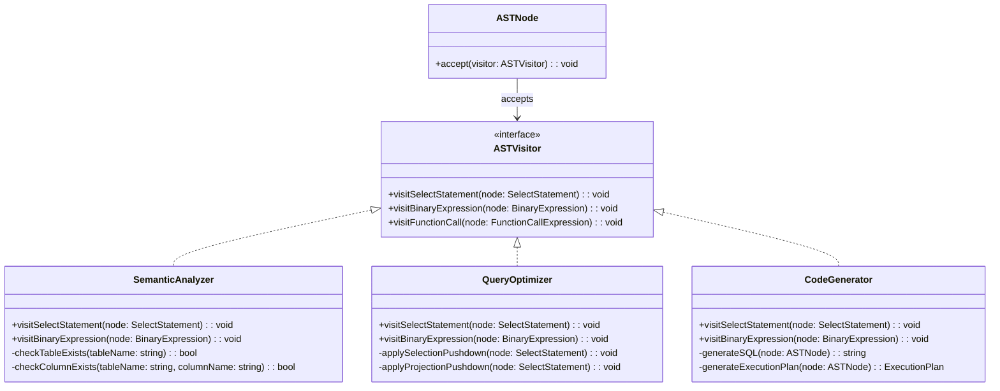

# 《数据库系统原理与开发实践》 - 第5章：SQL解析器：编译原理在数据库中的应用

**从程序设计语言到数据查询语言的编译技术**

---

## 🎯 **本章核心目标**

通过SQL解析器的设计与实现，理解编译原理的核心概念：
- 编译器的工作流程：词法分析、语法分析、语义分析、代码生成
- 有限自动机在词法分析中的应用
- 递归下降解析器在语法分析中的实现
- 抽象语法树(AST)的设计与遍历
- 错误处理与恢复机制
- SQL解析器作为高级数据操作虚拟机

---

## 5.1 编译原理基础：程序语言的翻译机制

### 5.1.1 什么是编译器？

编译器是一种将高级程序设计语言转换为低级机器语言或中间代码的程序。想象一下，你用中文写了一封信，但收信人只会英文，这时你需要一个"翻译官"把中文翻译成英文。这个翻译官就是编译器，而SQL解析器就是数据库世界的"翻译官"。

**编译器的基本任务**：
1. **理解源程序**：识别程序的语法结构和语义含义
2. **生成目标代码**：将高级语言转换为可执行的低级代码
3. **优化代码性能**：生成更高效的目标代码
4. **提供错误信息**：帮助程序员发现和修复错误

### 5.1.2 SQL解析器与传统编译器的对比

SQL解析器虽然不是传统意义上的编译器，但它采用了编译器的核心技术栈：

| 传统编译器 | SQL解析器 | 共同点 |
|-----------|-----------|--------|
| C++/Java源代码 | SQL语句文本 | 都是高级语言 |
| 词法分析器(Lexer) | 词法分析器(Lexer) | 将文本分解为基本单元 |
| 语法分析器(Parser) | 语法分析器(Parser) | 构建语法结构 |
| 语义分析器 | 语义分析器 | 验证语义正确性 |
| 代码优化器 | 查询优化器 | 优化执行效率 |
| 代码生成器 | 执行计划生成器 | 生成可执行代码 |

**为什么SQL解析器像编译器？**

SQL语句虽然是声明式的（告诉数据库"要什么"而不是"怎么做"），但数据库需要将其转换为具体的执行步骤。这就像你对服务员说"我要一份宫保鸡丁"，服务员需要理解你的需求，然后按照菜谱一步步制作。

### 5.1.3 编译器的分层架构

编译器通常分为前端和后端两个部分：

**前端（Frontend）**：与源语言相关
- 词法分析器：处理字符流
- 语法分析器：处理语法结构
- 语义分析器：处理语义含义
- 中间代码生成器：生成中间表示

**后端（Backend）**：与目标机器相关
- 代码优化器：优化中间代码
- 代码生成器：生成目标代码

在SQL解析器中，前端对应词法分析、语法分析、语义分析，后端对应查询优化和执行计划生成。

## 5.2 词法分析：文本到Token的转换

### 5.2.1 词法分析的基本概念

词法分析是编译器的第一个阶段，它将源程序的字符流分解成一个个有意义的词法单元（Token）。

**Token的组成**：
- **类型（Type）**：标识符、关键字、运算符等
- **词素（Lexeme）**：实际的字符序列
- **位置信息**：行号、列号，用于错误报告

**举例**：对于SQL语句 `SELECT name FROM users WHERE age > 18`

词法分析的结果可能是：
- `SELECT` (关键字)
- `name` (标识符)
- `FROM` (关键字)
- `users` (标识符)
- `WHERE` (关键字)
- `age` (标识符)
- `>` (运算符)
- `18` (数字字面量)

### 5.2.2 确定有限自动机(DFA)在词法分析中的应用

词法分析器通常使用确定有限自动机(DFA)来识别Token。DFA是一种数学模型，由以下部分组成：

**DFA的组成部分**：
- **状态集合**：词法分析的不同阶段
- **字母表**：输入字符的集合
- **转换函数**：从一个状态到另一个状态的规则
- **起始状态**：分析开始时的状态
- **接受状态集合**：识别到完整Token时的状态

#### 📊 UML状态图：SQL词法分析器的DFA


### 5.2.3 SQLCC中的词法分析器实现

在SQLCC项目中，词法分析器通过状态转换表实现了高效的Token识别：

**核心设计思路**：
1. **状态驱动**：每个字符触发状态转换
2. **表驱动实现**：使用二维数组存储转换规则
3. **字符分类**：将字符分为字母、数字、运算符等类别

**性能优势**：
- **O(1)查询**：状态转换表查询时间复杂度为常数
- **无条件判断**：避免了if-elseif-else的复杂条件链
- **易于扩展**：新增Token类型只需修改转换表

## 5.3 语法分析：Token序列到语法树的构建

### 5.3.1 语法分析的基本概念

语法分析是编译器的第二个阶段，它根据语言的语法规则将Token序列组织成语法结构树。

**语法规则的表达**：
编译原理中使用**上下文无关文法**（CFG）来描述编程语言的语法。最常用的表示法是**巴科斯范式（BNF）**。

**BNF的基本符号**：
- `::=` 表示"定义为"
- `|` 表示"或"
- `<>` 包围非终结符
- 其他符号是终结符

### 5.3.2 SQL的BNF语法规则示例

```ebnf
# SQL SELECT语句的语法规则
<select_statement> ::= SELECT <select_list> FROM <table_list>
                       [WHERE <expression>]
                       [GROUP BY <group_by_list>]
                       [HAVING <expression>]
                       [ORDER BY <order_by_list>]

<select_list> ::= <select_item> (',' <select_item>)* | '*'

<select_item> ::= <expression> [AS <identifier>]

<table_list> ::= <table_reference> (',' <table_reference>)*

<table_reference> ::= <identifier> | (<select_statement>)

<expression> ::= <logical_or_expression>
```

### 5.3.3 递归下降解析器的工作原理

递归下降解析器是一种自顶向下的语法分析方法，每个BNF规则对应一个递归函数。

**基本工作流程**：
1. **为每个非终结符编写函数**：`parseSelectStatement()`, `parseExpression()`等
2. **预测选择**：根据当前Token选择合适的产生式
3. **递归调用**：遇到子规则时递归调用相应函数
4. **匹配Token**：遇到终结符时匹配并消耗Token

#### 🔄 UML活动图：递归下降解析流程


### 5.3.4 表达式解析的优先级处理

表达式解析是语法分析中最复杂的部分，需要正确处理运算符的优先级和结合性。

**运算符优先级**（从高到低）：
1. 一元运算符：`NOT`, `+`, `-`
2. 算术运算符：`*`, `/`, `%`
3. 算术运算符：`+`, `-`
4. 比较运算符：`=`, `!=`, `<`, `<=`, `>`, `>=`, `LIKE`, `IN`
5. 逻辑运算符：`AND`
6. 逻辑运算符：`OR`

#### 📈 UML活动图：表达式优先级解析


### 5.3.5 SQLCC中的语法分析器实现

在SQLCC项目中，语法分析器采用了模块化的设计：

**核心组件**：
- **Parser类**：主解析器，协调各个子解析器
- **ExpressionParser类**：专门处理表达式解析
- **StatementParser类**：处理各种SQL语句
- **ASTBuilder类**：构建抽象语法树节点

**设计优势**：
- **职责分离**：不同类型的语法结构由专门的解析器处理
- **错误恢复**：采用Panic Mode策略处理语法错误
- **扩展性**：新的SQL语法可以通过继承现有解析器实现

## 5.4 抽象语法树(AST)：语义结构的层次化表示

### 5.4.1 AST的基本概念

抽象语法树（Abstract Syntax Tree）是源程序语法结构的树状表示。与具体语法树不同，AST抽象掉了语法细节，保留了语义结构。

**AST的特点**：
- **树状结构**：根节点代表整个程序，子节点代表组件
- **类型层次**：不同类型的节点表示不同的语法元素
- **位置信息**：每个节点包含源代码位置，便于错误报告
- **语义完整**：包含所有必要的语义信息

### 5.4.2 AST节点的层次化设计

AST采用面向对象的层次结构设计，便于扩展和维护。

#### 🌳 UML类图：AST节点层次结构


### 5.4.3 访问者模式：AST的统一处理框架

访问者模式为AST提供了统一的处理接口，支持语义分析、代码生成等多种操作。

#### 🎭 UML类图：访问者模式设计



### 5.4.4 SQLCC中的AST实现特点

**内存管理**：
- 使用智能指针（`std::unique_ptr`）管理AST节点生命周期
- 避免内存泄漏，提高代码安全性

**位置追踪**：
- 每个AST节点包含`SourceLocation`信息
- 支持精确的错误定位和调试

**类型系统**：
- 强类型设计，每个节点有明确的类型标识
- 支持类型检查和推导

## 5.5 错误处理：编译器的容错机制

### 5.5.1 编译器错误处理的层次

编译器需要处理多种类型的错误，每种错误有不同的严重程度和处理策略。

**错误类型层次**：
1. **词法错误**：非法字符、未终止字符串等
2. **语法错误**：不符合语法规则的结构
3. **语义错误**：类型不匹配、未定义标识符等
4. **运行时错误**：执行过程中的错误

### 5.5.2 Panic Mode错误恢复策略

Panic Mode是编译器错误恢复的经典技术，能够在遇到错误时继续解析后续代码。

#### 🚨 UML状态图：Panic Mode错误恢复


### 5.5.3 结构化错误信息设计

良好的错误信息应该包含所有必要的调试信息。

#### 📋 UML类图：错误处理体系


### 5.5.4 SQLCC的错误处理实践

**错误信息丰富性**：
- 包含确切的位置信息（行号、列号）
- 提供具体的错误描述
- 给出修复建议

**错误恢复策略**：
- 词法错误：跳过非法字符，继续分析
- 语法错误：使用Panic Mode跳到语句边界
- 语义错误：收集所有错误，不中断解析

## 5.6 SQL解析器：高级数据操作虚拟机

### 5.6.1 超越传统虚拟机的SQL解析器

SQL解析器可以被视为一种高级虚拟机，它将声明式查询语言转换为底层的数学运算序列。

#### 🏛️ UML组件图：SQL解析器作为虚拟机


### 5.6.2 从SQL到关系代数的翻译

SQL解析器将高级SQL操作映射为底层的数学运算。

#### 🔄 UML序列图：SQL执行的完整流程


## 5.7 RDBMS：编译器思维驱动的分布式系统

### 5.7.1 从编译原理到数据库系统的思维转变

编译器思维深刻影响了数据库系统的设计哲学。

#### 🧠 UML思维导图：编译器思维在数据库中的体现


### 5.7.2 SQLCC：编译原理的工程实践

SQLCC项目是编译原理在数据库系统中的完整实践。

**技术栈映射**：
- **词法分析**：手工实现的DFA状态机
- **语法分析**：递归下降解析器 + BNF规则
- **语义分析**：AST访问者模式的类型检查
- **代码优化**：基于代价的查询优化器
- **代码生成**：物理执行计划生成器

**工程特色**：
- **模块化设计**：清晰的组件分工和接口定义
- **错误处理完善**：多层次的错误检测和恢复
- **性能优化**：状态机驱动的高效词法分析
- **扩展性良好**：插件式的解析器架构

## 📚 **本章总结：编译原理在SQL解析中的完美实践**

SQL解析器是编译原理理论在数据库系统中的精彩应用。它不仅解决了将高级SQL语言转换为底层数据操作的技术问题，更体现了软件工程的分层抽象思想。

**核心启示**：

1. **编译器思维的普适性**：从程序语言编译到数据查询处理，编译器的工作流程具有普遍适用性

2. **理论与实践的桥梁**：有限自动机、上下文无关文法等理论工具在实际系统中发挥着关键作用

3. **分层抽象的重要性**：从字符流到Token、从Token到AST、从AST到执行计划，每一层抽象都降低了复杂性

4. **错误处理的艺术**：编译器的错误恢复技术为健壮的软件系统提供了宝贵经验

5. **虚拟机设计的精髓**：SQL解析器作为数据操作虚拟机，为理解现代计算系统提供了新视角

通过SQLCC项目的实践，我们不仅掌握了编译原理的核心概念，更深刻理解了如何将理论知识应用于实际的软件开发。编译器思维将成为你软件工程职业生涯中的重要思维工具。

---

**思考题**：

1. 编译器的工作流程是怎样的？SQL解析器采用了哪些编译器技术？

2. 为什么词法分析器使用确定有限自动机(DFA)而不是if-elseif-else条件判断？

3. 递归下降解析器如何处理运算符的优先级？请以算术表达式为例说明。

4. 抽象语法树(AST)为什么采用层次化设计？不同层次的节点有什么特点？

5. Panic Mode错误恢复策略是如何工作的？它对用户体验有什么影响？

6. 为什么说SQL解析器是比Java虚拟机更高级的虚拟机？

7. 编译器思维如何影响数据库系统的整体架构设计？

**实践练习**：

1. 尝试为一个简单的算术表达式语言设计词法分析器和语法分析器。

2. 分析一个真实的SQL查询语句的AST结构，理解其层次化组织方式。

3. 实现一个简单的表达式计算器，支持基本的算术运算和括号。

4. 设计一个错误恢复机制，为语法错误的输入提供有用的修复建议。

这些练习将帮助你将本章的理论知识转化为实际的编程技能，为深入理解编译原理和数据库系统设计打下坚实基础。
