# 《数据库系统原理与开发实践》 - 第6章：存储引擎与执行器：从逻辑表到物理文件的系统工程

**SQL解析器与存储引擎的集成：ACID事务的工程实现**

---

## 🎯 **本章核心目标**

理解SQL解析器如何与存储引擎集成，实现完整的SQL语句执行：
- 逻辑数据库与物理文件的映射机制
- 元数据管理的内存与持久化实现
- 执行器的设计与操作系统要求
- ACID特性在存储引擎中的工程实现
- CAP原则在RDBMS中的取舍
- TB/PB级数据处理下的存储引擎设计挑战

---

## 6.1 存储引擎的体系架构：逻辑与物理的桥梁

### 6.1.1 从逻辑模型到物理存储的映射

数据库系统最核心的设计挑战是将高级的逻辑概念（数据库、表、行、列）映射到底层的物理存储（文件、页面、字节）。这种映射需要平衡抽象性、性能和可靠性。

#### 🏗️ **数据库存储体系的三层架构**

```
逻辑层 (用户视角)
├── 数据库 (Database)
│   ├── 表 (Table)
│   │   ├── 行 (Row/Tuple)
│   │   └── 列 (Column)
│   └── 索引 (Index)
└── 视图 (View)

映射层 (系统视角)
├── 元数据管理 (Metadata)
│   ├── 系统表 (System Tables)
│   ├── 模式信息 (Schema Info)
│   └── 统计信息 (Statistics)
├── 查询优化器 (Query Optimizer)
└── 执行计划生成器 (Execution Plan Generator)

物理层 (存储视角)
├── 文件系统 (File System)
│   ├── 数据文件 (Data Files)
│   ├── 索引文件 (Index Files)
│   └── 日志文件 (Log Files)
├── 页面管理器 (Page Manager)
└── 缓冲池 (Buffer Pool)
```

#### 📐 **逻辑到物理的映射关系**

| 逻辑概念 | 物理实现 | 映射策略 |
|---------|---------|---------|
| 数据库 | 文件目录 | 每个数据库对应一个目录 |
| 表 | 数据文件 + 元数据 | 表数据存储在专用文件中 |
| 行 | 页面中的记录 | 变长记录，支持NULL值 |
| 列 | 记录中的字段 | 紧凑存储，类型化数据 |
| 索引 | 索引文件 | B+树结构，快速查找 |

### 6.1.2 SQLCC中的存储架构设计

SQLCC采用分层架构，将存储引擎分解为多个职责明确的组件。

#### 🏛️ **存储引擎组件架构**

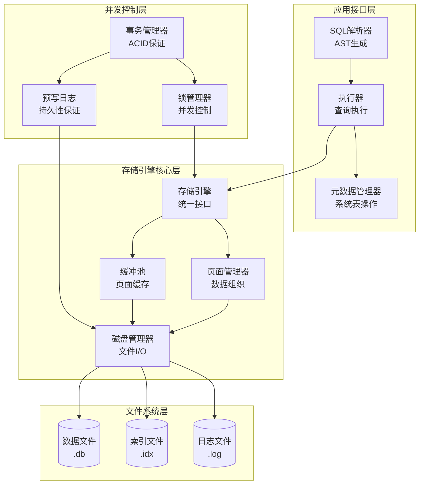
```mermaid
graph TB
    subgraph "应用接口层"
        SQL[SQL解析器<br/>AST生成]
        Executor[执行器<br/>查询执行]
        Metadata[元数据管理器<br/>系统表操作]
    end

    subgraph "存储引擎核心层"
        StorageEngine[存储引擎<br/>统一接口]
        BufferPool[缓冲池<br/>页面缓存]
        PageManager[页面管理器<br/>数据组织]
        DiskManager[磁盘管理器<br/>文件I/O]
    end

    subgraph "并发控制层"
        Transaction[事务管理器<br/>ACID保证]
        LockManager[锁管理器<br/>并发控制]
        WAL[预写日志<br/>持久性保证]
    end

    subgraph "文件系统层"
        DataFiles[(数据文件<br/>.db)]
        IndexFiles[(索引文件<br/>.idx)]
        LogFiles[(日志文件<br/>.log)]
    end

    SQL --> Executor
    Executor --> StorageEngine
    Executor --> Metadata
    StorageEngine --> BufferPool
    StorageEngine --> PageManager
    PageManager --> DiskManager
    BufferPool --> DiskManager

    Transaction --> LockManager
    Transaction --> WAL
    LockManager --> StorageEngine
    WAL --> DiskManager

    DiskManager --> DataFiles
    DiskManager --> IndexFiles
    DiskManager --> LogFiles
```

## 6.2 页面管理：磁盘与内存的数据桥梁

### 6.2.1 数据库页面的设计哲学

页面（Page）是数据库存储的基本单位，通常为4KB或8KB。页面设计的核心原则是平衡磁盘I/O效率、内存利用率和并发控制。

#### 📄 **页面结构的分层设计**

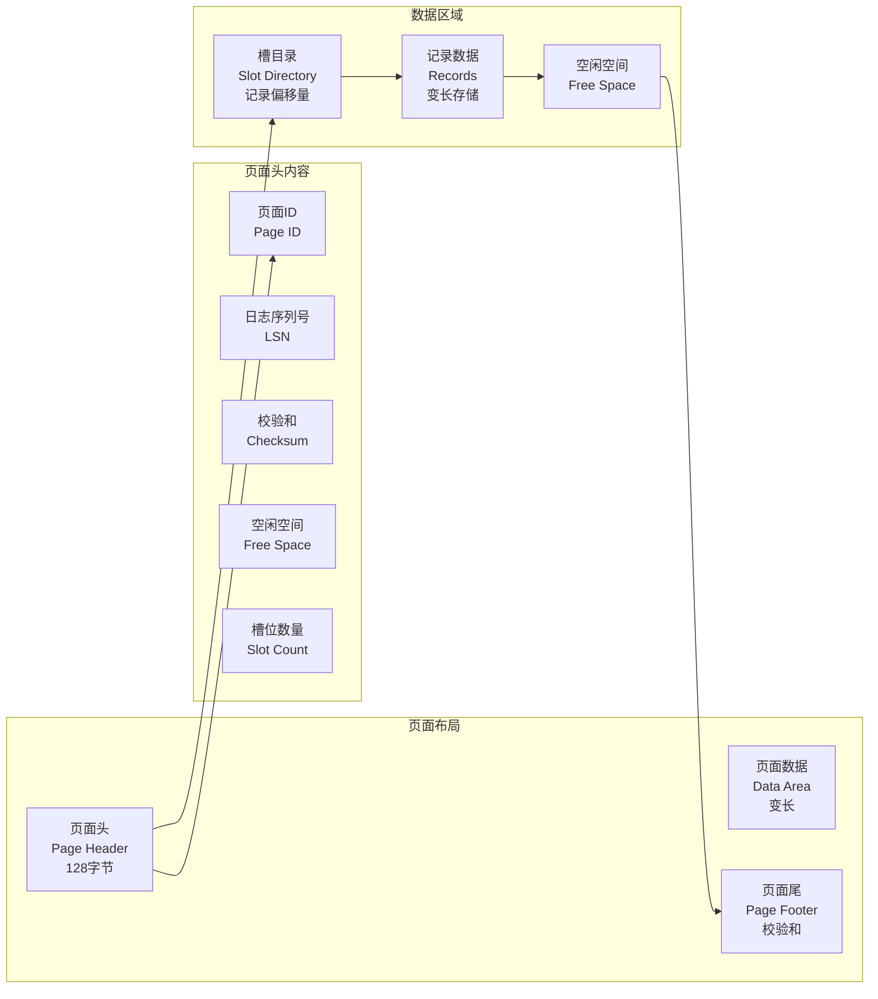
```mermaid
graph LR
    subgraph "页面布局"
        PH[页面头<br/>Page Header<br/>128字节]
        PD[页面数据<br/>Data Area<br/>变长]
        PF[页面尾<br/>Page Footer<br/>校验和]
    end

    subgraph "页面头内容"
        PID[页面ID<br/>Page ID]
        LSN[日志序列号<br/>LSN]
        Checksum[校验和<br/>Checksum]
        FreeSpace[空闲空间<br/>Free Space]
        SlotCount[槽位数量<br/>Slot Count]
    end

    subgraph "数据区域"
        SlotDir[槽目录<br/>Slot Directory<br/>记录偏移量]
        Records[记录数据<br/>Records<br/>变长存储]
        FreeSpace2[空闲空间<br/>Free Space]
    end

    PH --> PID
    PH --> SlotDir
    SlotDir --> Records
    Records --> FreeSpace2
    FreeSpace2 --> PF
```

### 6.2.2 页面分配与回收策略

#### 🗂️ **页面分配算法的选择**

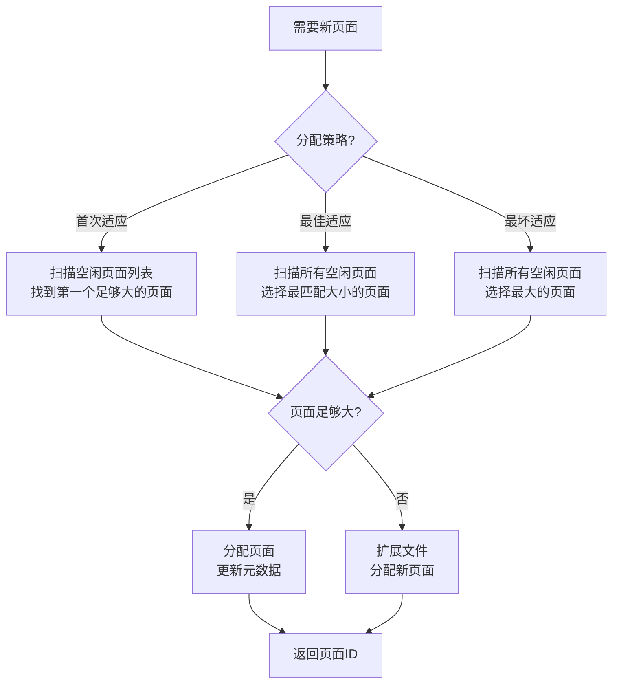
```mermaid
flowchart TD
    A[需要新页面] --> B{分配策略?}
    B -->|首次适应| C[扫描空闲页面列表<br/>找到第一个足够大的页面]
    B -->|最佳适应| D[扫描所有空闲页面<br/>选择最匹配大小的页面]
    B -->|最坏适应| E[扫描所有空闲页面<br/>选择最大的页面]

    C --> F{页面足够大?}
    D --> F
    E --> F

    F -->|是| G[分配页面<br/>更新元数据]
    F -->|否| H[扩展文件<br/>分配新页面]

    G --> I[返回页面ID]
    H --> I
```

### 6.2.3 缓冲池：性能与持久性的平衡艺术

缓冲池是存储引擎性能的核心，通过内存缓存减少磁盘I/O。

#### 🔄 **LRU缓存策略的工作原理**

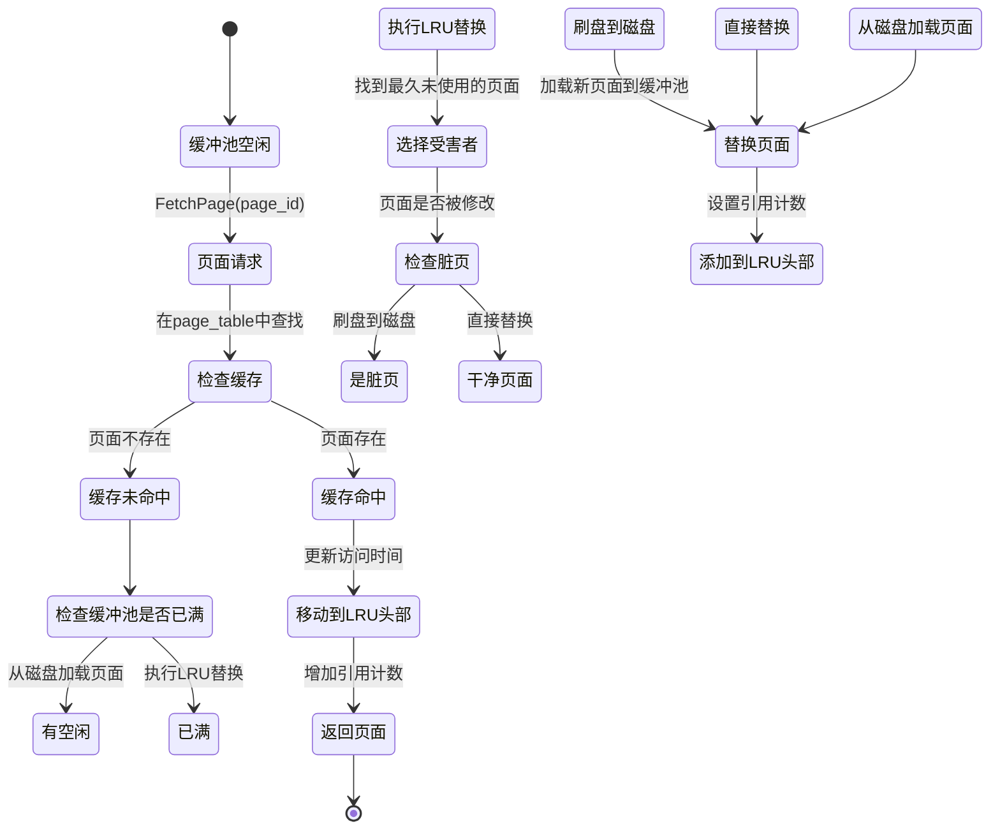
```mermaid
stateDiagram-v2
    [*] --> 缓冲池空闲

    缓冲池空闲 --> 页面请求: FetchPage(page_id)
    页面请求 --> 检查缓存: 在page_table中查找

    检查缓存 --> 缓存命中: 页面存在
    检查缓存 --> 缓存未命中: 页面不存在

    缓存命中 --> 移动到LRU头部: 更新访问时间
    缓存未命中 --> 检查缓冲池是否已满

    检查缓冲池是否已满 --> 有空闲: 从磁盘加载页面
    检查缓冲池是否已满 --> 已满: 执行LRU替换

    执行LRU替换 --> 选择受害者: 找到最久未使用的页面
    选择受害者 --> 检查脏页: 页面是否被修改

    检查脏页 --> 是脏页: 刷盘到磁盘
    检查脏页 --> 干净页面: 直接替换

    刷盘到磁盘 --> 替换页面: 加载新页面到缓冲池
    直接替换 --> 替换页面

    从磁盘加载页面 --> 替换页面

    替换页面 --> 添加到LRU头部: 设置引用计数
    移动到LRU头部 --> 返回页面: 增加引用计数

    返回页面 --> [*]
```

## 6.3 元数据管理：系统自描述的核心

### 6.3.1 元数据的层次化组织

元数据是数据库系统的"自描述"信息，让数据库能够理解自己的结构。

#### 📋 **元数据分类体系**

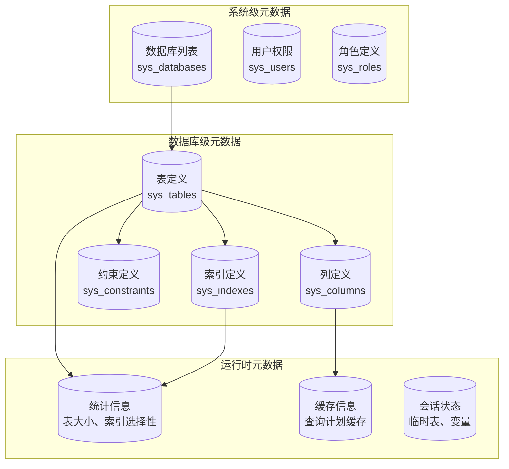
```mermaid
graph TD
    subgraph "系统级元数据"
        Databases[(数据库列表<br/>sys_databases)]
        Users[(用户权限<br/>sys_users)]
        Roles[(角色定义<br/>sys_roles)]
    end

    subgraph "数据库级元数据"
        Tables[(表定义<br/>sys_tables)]
        Columns[(列定义<br/>sys_columns)]
        Constraints[(约束定义<br/>sys_constraints)]
        Indexes[(索引定义<br/>sys_indexes)]
    end

    subgraph "运行时元数据"
        Statistics[(统计信息<br/>表大小、索引选择性)]
        Cache[(缓存信息<br/>查询计划缓存)]
        Sessions[(会话状态<br/>临时表、变量)]
    end

    Databases --> Tables
    Tables --> Columns
    Tables --> Constraints
    Tables --> Indexes

    Tables --> Statistics
    Indexes --> Statistics
    Columns --> Cache
```

### 6.3.2 系统数据库的设计模式

系统数据库采用"数据库管理数据库"的设计模式。

#### 🗃️ **系统数据库架构**

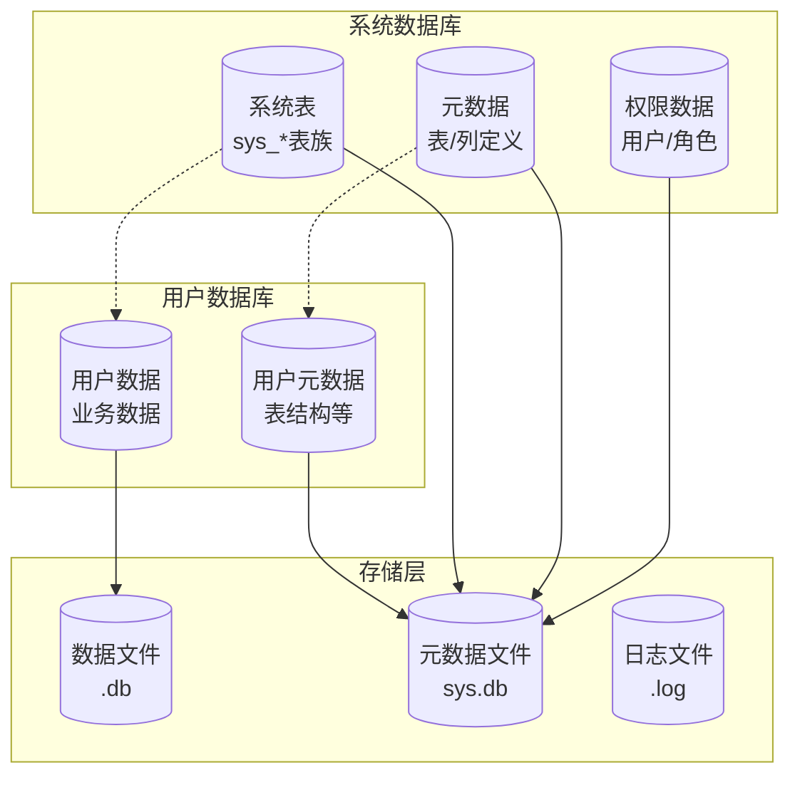
```mermaid
graph TB
    subgraph "用户数据库"
        UserDB[(用户数据<br/>业务数据)]
        UserMeta[(用户元数据<br/>表结构等)]
    end

    subgraph "系统数据库"
        SysTables[(系统表<br/>sys_*表族)]
        MetaData[(元数据<br/>表/列定义)]
        Permissions[(权限数据<br/>用户/角色)]
    end

    subgraph "存储层"
        DataFiles[(数据文件<br/>.db)]
        MetaFiles[(元数据文件<br/>sys.db)]
        LogFiles[(日志文件<br/>.log)]
    end

    UserDB --> DataFiles
    UserMeta --> MetaFiles
    SysTables --> MetaFiles
    MetaData --> MetaFiles
    Permissions --> MetaFiles

    SysTables -.-> UserDB
    MetaData -.-> UserMeta
```

### 6.3.3 元数据的内存缓存与持久化

#### 🧠 **元数据缓存策略**

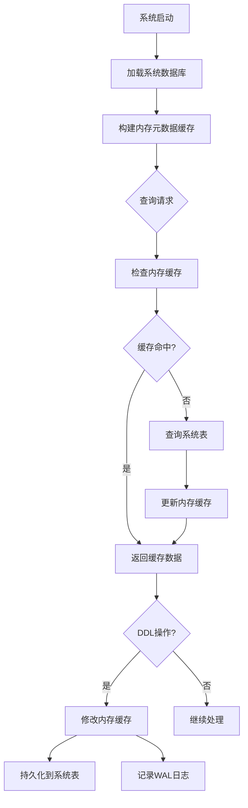
```mermaid
flowchart TD
    A[系统启动] --> B[加载系统数据库]
    B --> C[构建内存元数据缓存]

    C --> D{查询请求}
    D --> E[检查内存缓存]
    E --> F{缓存命中?}
    F -->|是| G[返回缓存数据]
    F -->|否| H[查询系统表]

    H --> I[更新内存缓存]
    I --> G

    G --> J{DDL操作?}
    J -->|是| K[修改内存缓存]
    K --> L[持久化到系统表]
    K --> M[记录WAL日志]

    J -->|否| N[继续处理]
```

## 6.4 执行器：查询计划到物理操作的翻译器

### 6.4.1 执行器的架构设计

执行器是SQL解析器与存储引擎之间的桥梁，将抽象的查询计划转换为具体的物理操作。

#### ⚙️ **执行器组件架构**

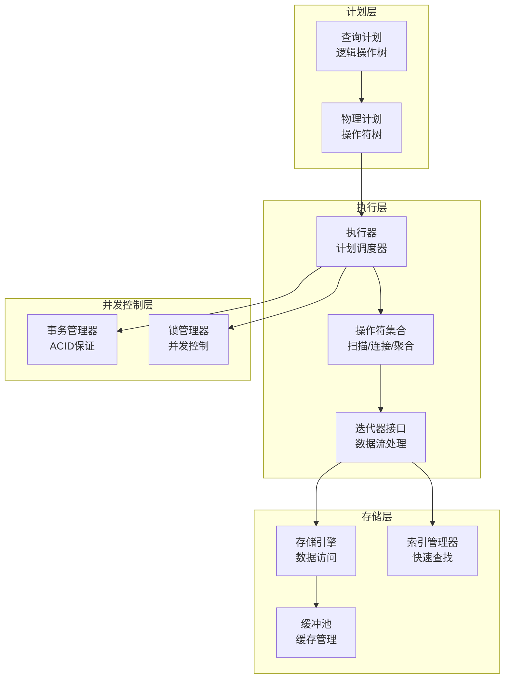
```mermaid
graph TB
    subgraph "计划层"
        QueryPlan[查询计划<br/>逻辑操作树]
        PhysicalPlan[物理计划<br/>操作符树]
    end

    subgraph "执行层"
        Executor[执行器<br/>计划调度器]
        Operators[操作符集合<br/>扫描/连接/聚合]
        Iterator[迭代器接口<br/>数据流处理]
    end

    subgraph "存储层"
        StorageEngine[存储引擎<br/>数据访问]
        BufferPool[缓冲池<br/>缓存管理]
        IndexManager[索引管理器<br/>快速查找]
    end

    subgraph "并发控制层"
        Transaction[事务管理器<br/>ACID保证]
        LockManager[锁管理器<br/>并发控制]
    end

    QueryPlan --> PhysicalPlan
    PhysicalPlan --> Executor
    Executor --> Operators
    Operators --> Iterator
    Iterator --> StorageEngine
    Iterator --> IndexManager
    StorageEngine --> BufferPool

    Executor --> Transaction
    Executor --> LockManager
```

### 6.4.2 操作符的流水线执行模式

现代数据库采用操作符流水线（Pipeline）模式，提高查询执行效率。

#### 🔄 **操作符流水线的工作流程**

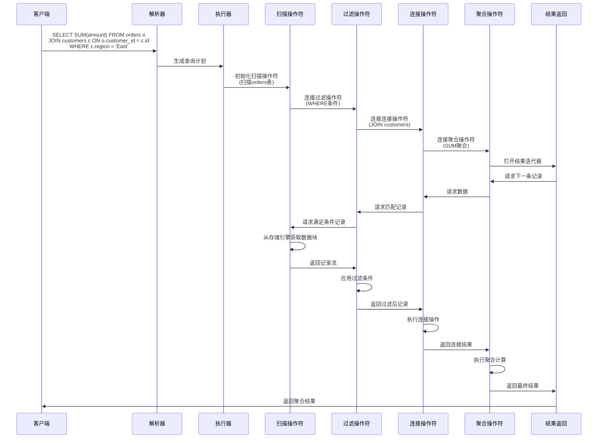
```mermaid
sequenceDiagram
    participant C as 客户端
    participant P as 解析器
    participant O as 执行器
    participant S as 扫描操作符
    participant F as 过滤操作符
    participant J as 连接操作符
    participant A as 聚合操作符
    participant R as 结果返回

    C->>P: SELECT SUM(amount) FROM orders o<br/>JOIN customers c ON o.customer_id = c.id<br/>WHERE c.region = 'East'
    P->>O: 生成查询计划

    O->>S: 初始化扫描操作符<br/>(扫描orders表)
    S->>F: 连接过滤操作符<br/>(WHERE条件)
    F->>J: 连接连接操作符<br/>(JOIN customers)
    J->>A: 连接聚合操作符<br/>(SUM聚合)

    A->>R: 打开结果迭代器
    R->>A: 请求下一条记录

    A->>J: 请求数据
    J->>F: 请求匹配记录
    F->>S: 请求满足条件记录

    S->>S: 从存储引擎获取数据块
    S->>F: 返回记录流
    F->>F: 应用过滤条件
    F->>J: 返回过滤后记录
    J->>J: 执行连接操作
    J->>A: 返回连接结果
    A->>A: 执行聚合计算
    A->>R: 返回最终结果

    R->>C: 返回聚合结果
```

### 6.4.3 执行器对操作系统的要求

#### 💻 **操作系统资源需求分析**

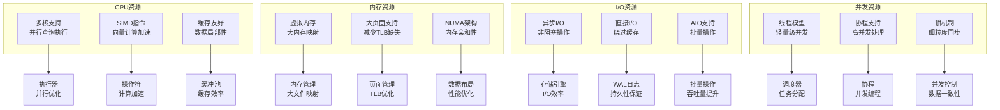
```mermaid
graph TD
    subgraph "CPU资源"
        MultiCore[多核支持<br/>并行查询执行]
        SIMD[SIMD指令<br/>向量计算加速]
        Cache[缓存友好<br/>数据局部性]
    end

    subgraph "内存资源"
        VirtualMemory[虚拟内存<br/>大内存映射]
        HugePages[大页面支持<br/>减少TLB缺失]
        NUMA[NUMA架构<br/>内存亲和性]
    end

    subgraph "I/O资源"
        AsyncIO[异步I/O<br/>非阻塞操作]
        DirectIO[直接I/O<br/>绕过缓存]
        AIO[AIO支持<br/>批量操作]
    end

    subgraph "并发资源"
        Threads[线程模型<br/>轻量级并发]
        Fibers[协程支持<br/>高并发处理]
        Locks[锁机制<br/>细粒度同步]
    end

    MultiCore --> Executor[执行器<br/>并行优化]
    SIMD --> Operators[操作符<br/>计算加速]
    Cache --> BufferPool[缓冲池<br/>缓存效率]

    VirtualMemory --> Memory[内存管理<br/>大文件映射]
    HugePages --> PageManager[页面管理<br/>TLB优化]
    NUMA --> DataPlacement[数据布局<br/>性能优化]

    AsyncIO --> StorageEngine[存储引擎<br/>I/O效率]
    DirectIO --> WAL[WAL日志<br/>持久性保证]
    AIO --> BatchOps[批量操作<br/>吞吐量提升]

    Threads --> Scheduler[调度器<br/>任务分配]
    Fibers --> Coroutines[协程<br/>并发编程]
    Locks --> Concurrency[并发控制<br/>数据一致性]
```

## 6.5 SQL语句的全链路执行：解析器到存储引擎的完整流程

### 6.5.1 DDL命令的执行流程：CREATE TABLE

CREATE TABLE是最典型的DDL命令，涉及元数据创建和物理存储初始化。

#### 📋 **CREATE TABLE的完整执行流程**

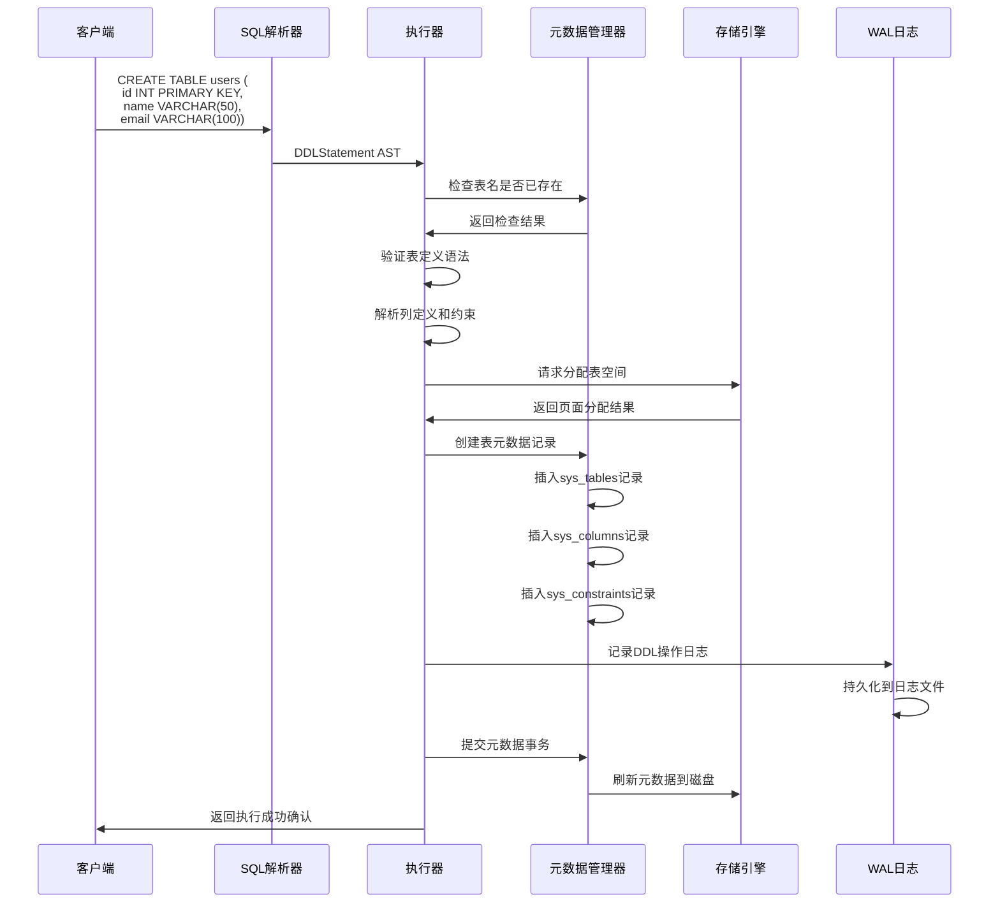
```mermaid
sequenceDiagram
    participant Client as 客户端
    participant Parser as SQL解析器
    participant Executor as 执行器
    participant Metadata as 元数据管理器
    participant Storage as 存储引擎
    participant WAL as WAL日志

    Client->>Parser: CREATE TABLE users (<br/>id INT PRIMARY KEY,<br/>name VARCHAR(50),<br/>email VARCHAR(100))
    Parser->>Executor: DDLStatement AST

    Executor->>Metadata: 检查表名是否已存在
    Metadata->>Executor: 返回检查结果

    Executor->>Executor: 验证表定义语法
    Executor->>Executor: 解析列定义和约束

    Executor->>Storage: 请求分配表空间
    Storage->>Executor: 返回页面分配结果

    Executor->>Metadata: 创建表元数据记录
    Metadata->>Metadata: 插入sys_tables记录
    Metadata->>Metadata: 插入sys_columns记录
    Metadata->>Metadata: 插入sys_constraints记录

    Executor->>WAL: 记录DDL操作日志
    WAL->>WAL: 持久化到日志文件

    Executor->>Metadata: 提交元数据事务
    Metadata->>Storage: 刷新元数据到磁盘

    Executor->>Client: 返回执行成功确认
```

### 6.5.2 DML命令的执行流程：INSERT语句

INSERT涉及数据插入和索引维护，是典型的DML操作。

#### ✏️ **INSERT语句的执行流程**

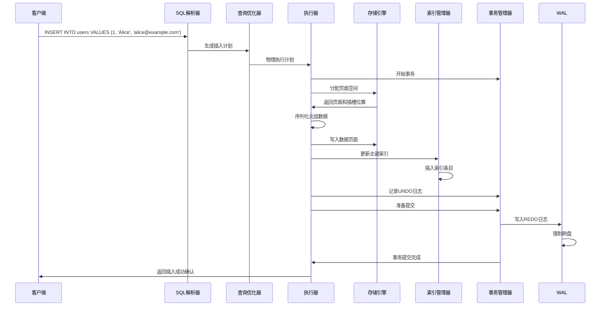
```mermaid
sequenceDiagram
    participant Client as 客户端
    participant Parser as SQL解析器
    participant Optimizer as 查询优化器
    participant Executor as 执行器
    participant Storage as 存储引擎
    participant Index as 索引管理器
    participant Transaction as 事务管理器

    Client->>Parser: INSERT INTO users VALUES (1, 'Alice', 'alice@example.com')
    Parser->>Optimizer: 生成插入计划

    Optimizer->>Executor: 物理执行计划
    Executor->>Transaction: 开始事务

    Executor->>Storage: 分配页面空间
    Storage->>Executor: 返回页面和插槽位置

    Executor->>Executor: 序列化元组数据
    Executor->>Storage: 写入数据页面

    Executor->>Index: 更新主键索引
    Index->>Index: 插入索引条目

    Executor->>Transaction: 记录UNDO日志
    Executor->>Transaction: 准备提交

    Transaction->>WAL: 写入REDO日志
    WAL->>WAL: 强制刷盘

    Transaction->>Executor: 事务提交完成
    Executor->>Client: 返回插入成功确认
```

### 6.5.3 DQL命令的执行流程：SELECT查询

SELECT是最复杂的查询操作，涉及多表连接、过滤、排序等。

#### 🔍 **SELECT查询的执行流程**

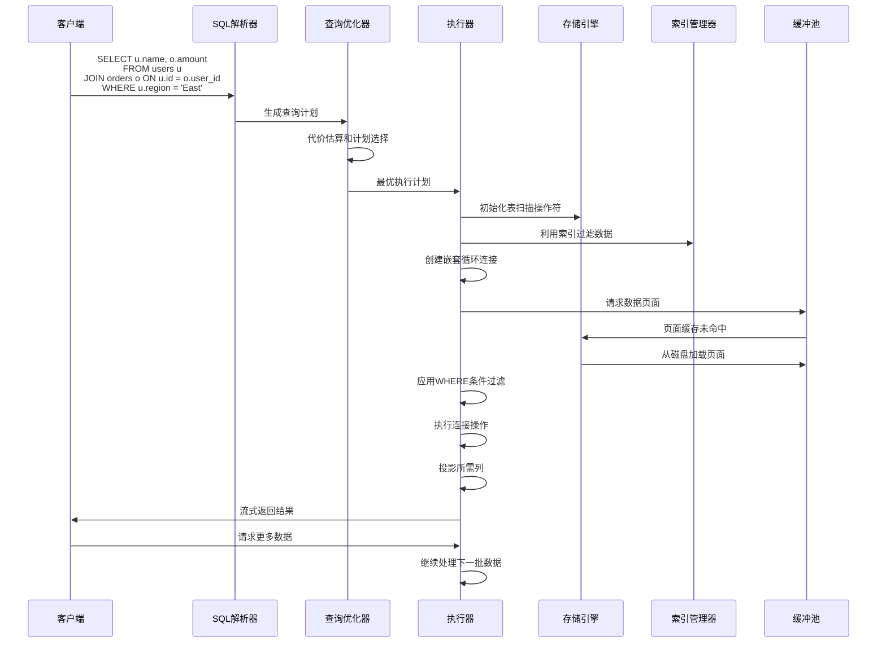
```mermaid
sequenceDiagram
    participant Client as 客户端
    participant Parser as SQL解析器
    participant Optimizer as 查询优化器
    participant Executor as 执行器
    participant Storage as 存储引擎
    participant Index as 索引管理器
    participant Buffer as 缓冲池

    Client->>Parser: SELECT u.name, o.amount<br/>FROM users u<br/>JOIN orders o ON u.id = o.user_id<br/>WHERE u.region = 'East'
    Parser->>Optimizer: 生成查询计划

    Optimizer->>Optimizer: 代价估算和计划选择
    Optimizer->>Executor: 最优执行计划

    Executor->>Storage: 初始化表扫描操作符
    Executor->>Index: 利用索引过滤数据

    Executor->>Executor: 创建嵌套循环连接
    Executor->>Buffer: 请求数据页面

    Buffer->>Storage: 页面缓存未命中
    Storage->>Buffer: 从磁盘加载页面

    Executor->>Executor: 应用WHERE条件过滤
    Executor->>Executor: 执行连接操作

    Executor->>Executor: 投影所需列
    Executor->>Client: 流式返回结果

    Client->>Executor: 请求更多数据
    Executor->>Executor: 继续处理下一批数据
```

## 6.6 ACID特性：数学理论到工程实现的转化

### 6.6.1 ACID的数学基础与工程实现

ACID是数据库事务的核心特性，将抽象的数学概念转化为具体的工程实现。

#### 🔬 **ACID特性的数学定义与工程映射**

| ACID特性 | 数学定义 | 工程实现 |
|---------|---------|---------|
| **原子性 (Atomicity)** | 要么全部发生，要么全部不发生 | UNDO日志 + 回滚机制 |
| **一致性 (Consistency)** | 从一个一致状态到另一个一致状态 | 约束检查 + 触发器 |
| **隔离性 (Isolation)** | 并发事务互不干扰 | 锁协议 + MVCC |
| **持久性 (Durability)** | 提交的数据永久保存 | REDO日志 + 刷盘策略 |

### 6.6.2 原子性：UNDO日志与回滚机制

#### ↩️ **事务回滚的实现机制**

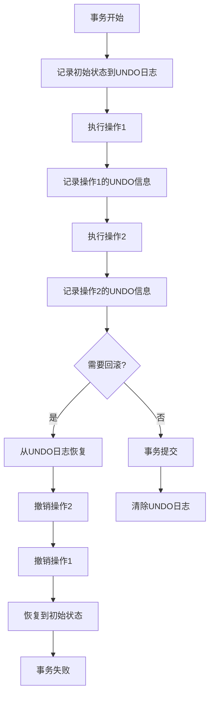
```mermaid
flowchart TD
    A[事务开始] --> B[记录初始状态到UNDO日志]
    B --> C[执行操作1]
    C --> D[记录操作1的UNDO信息]
    D --> E[执行操作2]
    E --> F[记录操作2的UNDO信息]

    F --> G{需要回滚?}
    G -->|否| H[事务提交]
    G -->|是| I[从UNDO日志恢复]

    I --> J[撤销操作2]
    J --> K[撤销操作1]
    K --> L[恢复到初始状态]

    H --> M[清除UNDO日志]
    L --> N[事务失败]
```

### 6.6.3 持久性：REDO日志与WAL机制

#### 📝 **预写日志的工作原理**

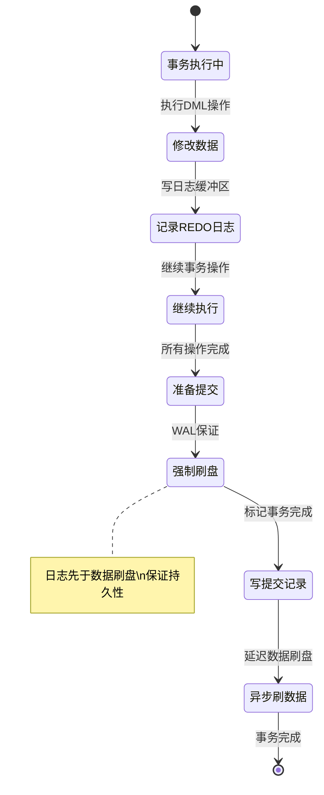
```mermaid
stateDiagram-v2
    [*] --> 事务执行中

    事务执行中 --> 修改数据: 执行DML操作
    修改数据 --> 记录REDO日志: 写日志缓冲区
    记录REDO日志 --> 继续执行: 继续事务操作

    继续执行 --> 准备提交: 所有操作完成
    准备提交 --> 强制刷盘: WAL保证
    强制刷盘 --> 写提交记录: 标记事务完成

    写提交记录 --> 异步刷数据: 延迟数据刷盘
    异步刷数据 --> [*]: 事务完成

    note right of 强制刷盘 : 日志先于数据刷盘\n保证持久性
```

### 6.6.4 隔离性：锁协议与MVCC

#### 🔒 **两阶段锁协议(2PL)**

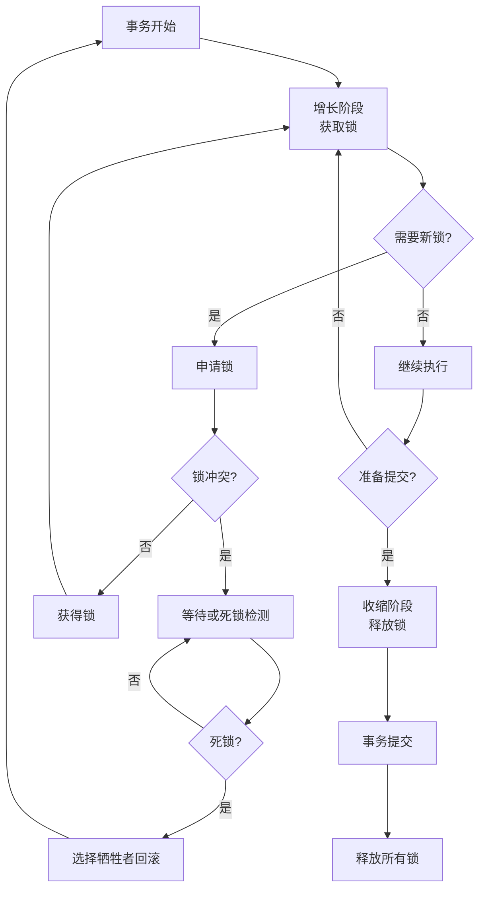
```mermaid
flowchart TD
    A[事务开始] --> B[增长阶段<br/>获取锁]
    B --> C{需要新锁?}
    C -->|是| D[申请锁]
    C -->|否| E[继续执行]

    D --> F{锁冲突?}
    F -->|是| G[等待或死锁检测]
    F -->|否| H[获得锁]

    G --> I{死锁?}
    I -->|是| J[选择牺牲者回滚]
    I -->|否| G

    J --> A
    H --> B

    E --> K{准备提交?}
    K -->|否| B
    K -->|是| L[收缩阶段<br/>释放锁]

    L --> M[事务提交]
    M --> N[释放所有锁]
```

## 6.7 CAP原则在RDBMS中的实现取舍

### 6.7.1 CAP原则的分布式系统权衡

CAP原则揭示了分布式系统无法同时保证三个特性的根本原因。

#### ⚖️ **CAP三元悖论的工程实践**

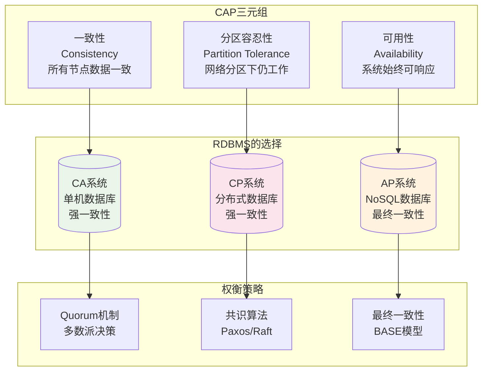
```mermaid
graph TD
    subgraph "CAP三元组"
        C[一致性<br/>Consistency<br/>所有节点数据一致]
        A[可用性<br/>Availability<br/>系统始终可响应]
        P[分区容忍性<br/>Partition Tolerance<br/>网络分区下仍工作]
    end

    subgraph "RDBMS的选择"
        CA[(CA系统<br/>单机数据库<br/>强一致性)]
        AP[(AP系统<br/>NoSQL数据库<br/>最终一致性)]
        CP[(CP系统<br/>分布式数据库<br/>强一致性)]
    end

    subgraph "权衡策略"
        Quorum[Quorum机制<br/>多数派决策]
        Paxos[共识算法<br/>Paxos/Raft]
        Eventual[最终一致性<br/>BASE模型]
    end

    C --> CA
    A --> AP
    P --> CP

    CA --> Quorum
    CP --> Paxos
    AP --> Eventual

    style CA fill:#e8f5e8
    style AP fill:#fff3e0
    style CP fill:#fce4ec
```

### 6.7.2 RDBMS的CA选择：强一致性优先

RDBMS选择牺牲一定的可用性，保证强一致性和分区容忍性。

#### 🏗️ **RDBMS的CAP实现策略**

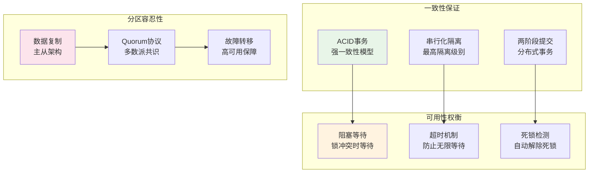
```mermaid
graph TB
    subgraph "一致性保证"
        ACID[ACID事务<br/>强一致性模型]
        Serial[串行化隔离<br/>最高隔离级别]
        2PC[两阶段提交<br/>分布式事务]
    end

    subgraph "可用性权衡"
        Blocking[阻塞等待<br/>锁冲突时等待]
        Timeout[超时机制<br/>防止无限等待]
        Deadlock[死锁检测<br/>自动解除死锁]
    end

    subgraph "分区容忍性"
        Replication[数据复制<br/>主从架构]
        Quorum[Quorum协议<br/>多数派共识]
        Failover[故障转移<br/>高可用保障]
    end

    ACID --> Blocking
    Serial --> Timeout
    2PC --> Deadlock

    Replication --> Quorum
    Quorum --> Failover

    style ACID fill:#e8f5e8
    style Blocking fill:#fff3e0
    style Replication fill:#fce4ec
```

## 6.8 TB/PB级数据处理：存储引擎的扩展性挑战

### 6.8.1 大数据量下的存储引擎设计挑战

现代企业数据规模已达TB甚至PB级别，对存储引擎提出了严峻挑战。

#### 📊 **大数据处理的核心挑战**

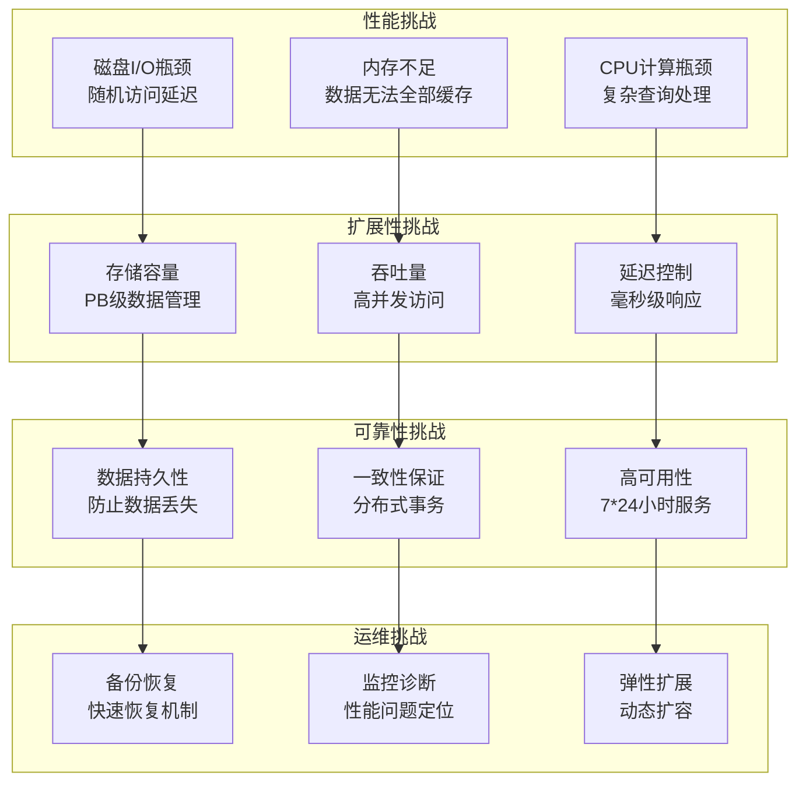
```mermaid
graph TD
    subgraph "性能挑战"
        IO[磁盘I/O瓶颈<br/>随机访问延迟]
        Memory[内存不足<br/>数据无法全部缓存]
        CPU[CPU计算瓶颈<br/>复杂查询处理]
    end

    subgraph "扩展性挑战"
        Storage[存储容量<br/>PB级数据管理]
        Throughput[吞吐量<br/>高并发访问]
        Latency[延迟控制<br/>毫秒级响应]
    end

    subgraph "可靠性挑战"
        Durability[数据持久性<br/>防止数据丢失]
        Consistency[一致性保证<br/>分布式事务]
        Availability[高可用性<br/>7*24小时服务]
    end

    subgraph "运维挑战"
        Backup[备份恢复<br/>快速恢复机制]
        Monitor[监控诊断<br/>性能问题定位]
        Scale[弹性扩展<br/>动态扩容]
    end

    IO --> Storage
    Memory --> Throughput
    CPU --> Latency

    Storage --> Durability
    Throughput --> Consistency
    Latency --> Availability

    Durability --> Backup
    Consistency --> Monitor
    Availability --> Scale
```

### 6.8.2 分层存储架构：热数据与冷数据的分离

#### 🏢 **分层存储的实现策略**

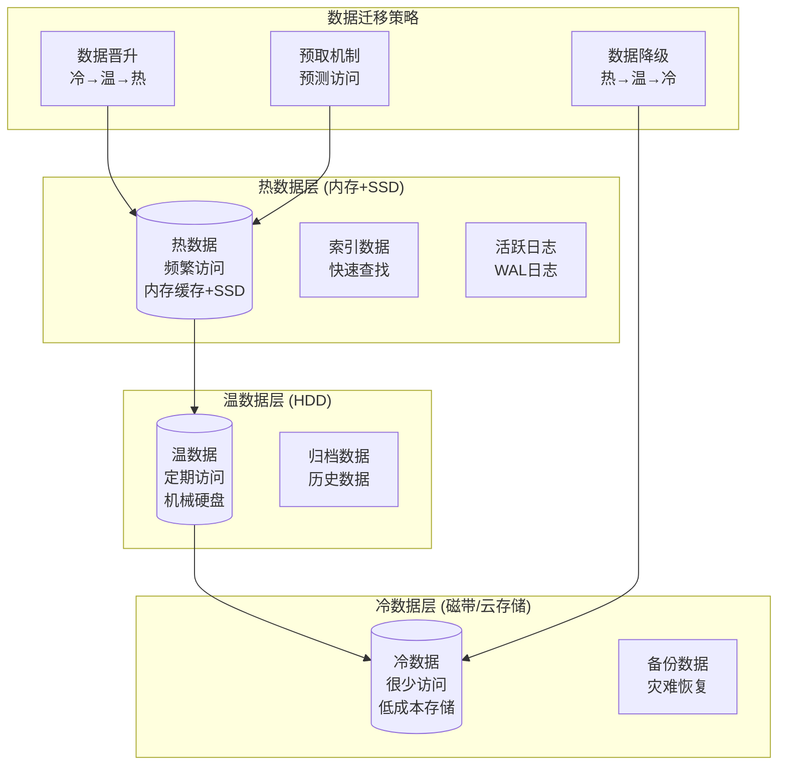
```mermaid
graph TB
    subgraph "热数据层 (内存+SSD)"
        HotData[(热数据<br/>频繁访问<br/>内存缓存+SSD)]
        Index[索引数据<br/>快速查找]
        Log[活跃日志<br/>WAL日志]
    end

    subgraph "温数据层 (HDD)"
        WarmData[(温数据<br/>定期访问<br/>机械硬盘)]
        Archive[归档数据<br/>历史数据]
    end

    subgraph "冷数据层 (磁带/云存储)"
        ColdData[(冷数据<br/>很少访问<br/>低成本存储)]
        Backup[备份数据<br/>灾难恢复]
    end

    subgraph "数据迁移策略"
        Promotion[数据晋升<br/>冷→温→热]
        Demotion[数据降级<br/>热→温→冷]
        Prefetch[预取机制<br/>预测访问]
    end

    HotData --> WarmData
    WarmData --> ColdData

    Promotion --> HotData
    Demotion --> ColdData
    Prefetch --> HotData
```

### 6.8.3 分布式存储：分片与复制策略

#### 🌐 **分布式存储架构设计**

```mermaid
graph TB
    subgraph "客户端层"
        App[应用程序]
        Proxy[代理层<br/>路由分发]
    end

    subgraph "计算节点层"
        CN1[计算节点1<br/>查询处理]
        CN2[计算节点2<br/>查询处理]
        CN3[计算节点3<br/>查询处理]
    end

    subgraph "存储节点层"
        SN1[(存储节点1<br/>分片A<br/>主副本)]
        SN2[(存储节点2<br/>分片B<br/>主副本)]
        SN3[(存储节点3<br/>分片C<br/>主副本)]
        SN4[(存储节点4<br/>分片A<br/>副本)]
        SN5[(存储节点5<br/>分片B<br/>副本)]
        SN6[(存储节点6<br/>分片C<br/>副本)]
    end

    subgraph "协调服务"
        Coord[协调器<br/>元数据管理]
        ZK[ZooKeeper<br/>配置管理]
    end

    App --> Proxy
    Proxy --> CN1
    Proxy --> CN2
    Proxy --> CN3

    CN1 --> SN1
    CN1 --> SN2
    CN1 --> SN4

    CN2 --> SN2
    CN2 --> SN3
    CN2 --> SN5

    CN3 --> SN3
    CN3 --> SN1
    CN3 --> SN6

    CN1 --> Coord
    CN2 --> Coord
    CN3 --> Coord

    Coord --> ZK
    SN1 --> ZK
    SN2 --> ZK
    SN3 --> ZK
```

## 6.9 DCL/DDL/DML/DQL/TCL的协同工作机制

### 6.9.1 四类SQL语句的协作框架

#### 🔄 **SQL语句在系统各组件间的协作**

```mermaid
graph TB
    subgraph "DQL - 数据查询"
        SELECT[SELECT语句<br/>查询数据]
        Parser[SQL解析器<br/>语法分析]
        Optimizer[查询优化器<br/>计划生成]
        Executor[执行器<br/>物理执行]
    end

    subgraph "DML - 数据操作"
        INSERT[INSERT语句<br/>插入数据]
        UPDATE[UPDATE语句<br/>修改数据]
        DELETE[DELETE语句<br/>删除数据]
        Modify[数据修改器<br/>执行变更]
    end

    subgraph "DDL - 模式定义"
        CREATE[CREATE语句<br/>创建对象]
        ALTER[ALTER语句<br/>修改对象]
        DROP[DROP语句<br/>删除对象]
        Schema[模式管理器<br/>元数据操作]
    end

    subgraph "DCL - 权限控制"
        GRANT[GRANT语句<br/>授予权限]
        REVOKE[REVOKE语句<br/>撤销权限]
        Permission[权限管理器<br/>访问控制]
    end

    subgraph "TCL - 事务控制"
        BEGIN[BEGIN语句<br/>开启事务]
        COMMIT[COMMIT语句<br/>提交事务]
        ROLLBACK[ROLLBACK语句<br/>回滚事务]
        Transaction[事务管理器<br/>ACID保证]
    end

    subgraph "存储引擎核心"
        Storage[存储引擎<br/>数据持久化]
        Buffer[缓冲池<br/>性能优化]
        WAL[WAL日志<br/>持久性保证]
    end

    SELECT --> Parser
    INSERT --> Parser
    UPDATE --> Parser
    DELETE --> Parser
    CREATE --> Parser
    GRANT --> Parser

    Parser --> Optimizer
    Optimizer --> Executor

    Executor --> Modify
    Executor --> Schema
    Executor --> Permission

    Modify --> Storage
    Schema --> Storage
    Permission --> Storage

    Executor --> Transaction
    Modify --> Transaction
    Transaction --> WAL

    Storage --> Buffer
    Buffer --> WAL
```

### 6.9.2 完整事务的生命周期管理

#### 🔐 **事务生命周期的完整流程**

```mermaid
sequenceDiagram
    participant Client as 客户端
    participant Parser as SQL解析器
    participant Executor as 执行器
    participant Transaction as 事务管理器
    participant Storage as 存储引擎
    participant WAL as WAL日志

    Client->>Parser: BEGIN TRANSACTION
    Parser->>Transaction: 启动事务

    Transaction->>Transaction: 分配事务ID
    Transaction->>Transaction: 初始化事务状态

    Client->>Parser: INSERT INTO users VALUES (1, 'Alice')
    Parser->>Executor: DML执行请求

    Executor->>Transaction: 获取写锁
    Transaction->>Storage: 申请行级锁

    Executor->>Executor: 序列化数据
    Executor->>Storage: 写入数据页面

    Executor->>Transaction: 记录UNDO日志
    Transaction->>WAL: 写入日志缓冲区

    Client->>Parser: UPDATE users SET age = 25 WHERE id = 1
    Parser->>Executor: 另一个DML请求

    Executor->>Transaction: 检查锁兼容性
    Executor->>Storage: 修改数据

    Executor->>Transaction: 记录更多UNDO日志

    Client->>Parser: COMMIT
    Parser->>Transaction: 提交事务

    Transaction->>WAL: 强制刷盘REDO日志
    Transaction->>Transaction: 释放所有锁

    Transaction->>Executor: 提交确认
    Executor->>Client: 事务完成
```

## 📚 **本章总结：存储引擎是数据库系统的工程灵魂**

存储引擎是数据库系统的核心，它将SQL解析器的抽象语法树转换为物理存储的操作，将数学理论的ACID特性转化为可运行的代码。理解存储引擎的设计，就是理解数据库系统的本质。

**核心洞察**：

1. **逻辑到物理的映射**：数据库系统最核心的抽象是将用户的逻辑概念（表、行、列）映射到物理存储（文件、页面、字节）

2. **性能与可靠性的平衡**：存储引擎需要在高性能（缓冲池、索引）和高可靠性（WAL、事务）之间找到最佳平衡

3. **ACID的工程实现**：原子性通过UNDO日志实现，一致性通过约束检查实现，隔离性通过锁协议实现，持久性通过REDO日志实现

4. **CAP的务实选择**：RDBMS选择CA（强一致性+高可用性），通过主从复制和Quorum机制实现分区容忍

5. **扩展性的架构设计**：面对TB/PB级数据，存储引擎需要分层存储、分布式架构和弹性扩展能力

6. **操作系统深度集成**：现代存储引擎充分利用操作系统的虚拟内存、异步I/O、多线程等特性

通过SQLCC项目的学习，我们不仅掌握了存储引擎的技术实现，更理解了数据库系统作为软件工程杰作的设计哲学。存储引擎的设计，体现了计算机科学从理论到实践的最完美转化。

---

**思考题**：

1. 为什么数据库使用页面(page)作为存储的基本单位？页面大小对系统性能有什么影响？

2. 缓冲池的LRU替换策略有什么优缺点？在高并发场景下需要做哪些改进？

3. 元数据管理为什么采用"数据库管理数据库"的设计模式？这种设计有什么优缺点？

4. 执行器在SQL语句执行过程中扮演什么角色？它与存储引擎的关系是怎样的？

5. ACID四个特性中，哪个最难实现？为什么？

6. CAP原则为什么说三个特性无法同时保证？RDBMS是如何处理这个三元悖论的？

7. 面对TB级数据处理，存储引擎需要做哪些架构上的调整？

8. DCL、DDL、DML、DQL、TCL五类SQL语句如何协同工作保证数据一致性？

**实践练习**：

1. 设计一个简单的页面管理器，支持页面的分配、回收和基本I/O操作。

2. 实现一个LRU缓存模拟器，测试不同工作负载下的缓存命中率。

3. 分析一个CREATE TABLE语句的完整执行流程，绘制时序图。

4. 设计一个简单的WAL日志系统，支持事务的REDO和UNDO操作。

5. 分析PostgreSQL或MySQL的存储引擎架构，比较与SQLCC的异同。

这些练习将帮助你从理论层面深入理解存储引擎的工程实现，为成为优秀的数据库工程师打下基础。
