# 《数据库系统原理与开发实践》 - 第8章：OLTP事务处理：从ACID到分布式容错的艺术

**从单机事务到分布式容错的系统工程实践**

---

## 🎯 **本章核心目标**

深入理解在线事务处理（OLTP）系统的核心机制与工程实现：
- ACID属性的理论定义与工程挑战
- 预写日志（WAL）与故障恢复的实战设计
- 并发控制从锁机制到MVCC的演进路径
- 分布式事务处理与容错机制的系统工程
- 大型分布式数据库集群的事务处理架构

---

## 8.1 OLTP系统概述：事务处理的核心地位

### 8.1.1 OLTP vs OLAP：两种处理模式的根本差异

在线事务处理（OLTP）与在线分析处理（OLAP）是数据库系统两大核心工作负载类型，它们的设计哲学与技术实现有着本质区别。

```
OLTP与OLAP的对比矩阵:
├── 工作负载特性:
│   ├── OLTP: 高并发、短事务、随机读写、实时响应
│   └── OLAP: 低并发、长查询、顺序扫描、批处理
├── 数据模型设计:
│   ├── OLTP: 规范化设计，减少冗余，保证一致性
│   └── OLAP: 维度建模，星型/雪花模型，优化查询
├── 索引策略:
│   ├── OLTP: B+树主键索引，辅助索引，点查询优化
│   └── OLAP: 位图索引，列存储，聚合查询优化
└── 系统架构:
    ├── OLTP: 强调ACID，并发控制，故障恢复
    └── OLAP: 强调查询优化，并行处理，数据仓库
```

### 8.1.2 事务处理的工程价值：数据库的"心脏"系统

事务处理是数据库系统的核心功能，它确保了在复杂的并发和故障场景下数据的正确性与可靠性。

**为什么事务处理被称为数据库的"心脏"？**

1. **数据一致性的守护者**：在多用户并发访问时保证数据逻辑正确
2. **系统可靠性的基石**：在硬件故障、软件崩溃时保护数据不丢失
3. **业务逻辑的载体**：将复杂的业务操作封装为原子的工作单元
4. **性能优化的核心**：事务吞吐量是衡量OLTP系统性能的关键指标

### 8.1.3 典型OLTP场景分析：从银行转账到电商订单

通过具体案例理解事务处理的工程挑战：

**场景一：银行转账系统**
- **操作**：从账户A转账100元到账户B
- **事务要求**：原子性（要么全转，要么不转）、一致性（总额不变）、隔离性（并发转账互不影响）、持久性（转账后数据不丢失）
- **技术挑战**：高并发下的锁竞争、分布式环境下的数据同步

**场景二：电商订单处理**
- **操作**：创建订单、扣减库存、支付扣款、生成物流单
- **事务要求**：跨多个服务的分布式事务、库存超卖防护、支付与订单状态一致性
- **技术挑战**：长事务处理、最终一致性保证、补偿事务设计

### 8.1.4 SQLCC在OLTP架构中的定位：从单机到分布式的演进

SQLCC作为一个教学型数据库系统，其事务处理模块体现了从经典理论到工程实践的完整设计：

```
SQLCC事务管理架构:
├── 核心组件:
│   ├── TransactionManager: 事务生命周期管理
│   ├── LockManager: 并发控制与死锁处理
│   ├── WALManager: 预写日志与故障恢复
│   └── RecoveryManager: 崩溃恢复与数据修复
├── 设计特色:
│   ├── 模块化设计: 各组件职责清晰，便于教学理解
│   ├── 配置灵活: 支持不同隔离级别和并发控制策略
│   └── 扩展性强: 为分布式事务处理预留接口
└── 教学价值:
    ├── 完整实现经典事务处理算法
    ├── 提供可观察的中间状态和日志
    └── 支持故障注入和恢复演示
```

## 8.2 ACID属性的深度解析：从理论到实现的挑战

ACID是事务处理的四个核心属性，每个属性在工程实现中都面临独特的技术挑战。

### 8.2.1 原子性（Atomicity）的实现困境：如何在故障场景下保证"全或无"

**理论定义**：事务中的操作要么全部完成，要么全部不执行，不存在部分完成的状态。

**工程挑战**：
1. **系统崩溃时的中间状态**：事务执行过程中系统崩溃，如何回滚已执行的操作？
2. **分布式环境下的部分失败**：在多个节点上执行的操作，部分成功部分失败时如何处理？
3. **长事务的资源占用**：长时间运行的事务占用资源，回滚成本高昂。

**SQLCC的实现策略**：
- **预写日志（WAL）机制**：在修改数据前先记录日志，崩溃时通过日志回滚
- **UNDO日志记录**：记录每个操作的反向操作，支持精确回滚
- **检查点机制**：定期创建检查点，减少恢复时需要处理的日志量

### 8.2.2 一致性（Consistency）的多层面理解：从数据约束到业务规则

**理论定义**：事务执行前后，数据库从一个一致状态转换到另一个一致状态。

**工程挑战**：
1. **数据完整性约束**：如何高效检查主键、外键、唯一性等约束？
2. **业务规则一致性**：复杂的业务规则（如库存不能为负）如何保证？
3. **最终一致性**：在分布式系统中，强一致性可能影响性能，如何权衡？

**SQLCC的实现策略**：
- **约束检查器**：在事务提交前检查所有数据完整性约束
- **触发器机制**：支持用户定义的业务规则检查
- **隔离级别控制**：通过不同隔离级别平衡一致性与性能

### 8.2.3 隔离性（Isolation）的代价与收益：隔离级别与性能的权衡曲线

**理论定义**：并发执行的事务之间互不影响，每个事务都感觉不到其他事务的存在。

**工程挑战**：
1. **并发性能与正确性的权衡**：严格的隔离保证串行化，但性能低下
2. **幻读与不可重复读**：不同隔离级别下出现的并发问题
3. **锁机制的开销**：锁竞争导致性能下降和死锁风险

**SQLCC的隔离级别实现**：

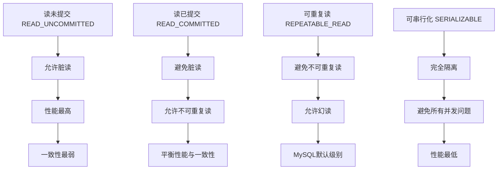

### 8.2.4 持久性（Durability）的硬件挑战：从磁盘特性到SSD优化

**理论定义**：事务提交后，对数据的修改永久保存，即使系统崩溃也不会丢失。

**工程挑战**：
1. **磁盘I/O性能瓶颈**：持久化需要写磁盘，而磁盘I/O是数据库性能的主要瓶颈
2. **写放大问题**：在SSD上频繁写入会降低寿命和性能
3. **数据安全与性能的权衡**：同步写入保证安全但性能差，异步写入性能好但有数据丢失风险

**SQLCC的持久性实现**：
- **WAL的组提交优化**：将多个事务的日志批量写入，减少磁盘I/O次数
- **双写缓冲区**：防止部分页面写入问题
- **异步检查点**：在后台定期将脏页刷新到磁盘，减少对事务的影响

## 8.3 预写日志（WAL）：数据安全的最后防线

预写日志是保证事务持久性和原子性的核心技术，它的设计体现了工程实践中安全与性能的精妙平衡。

### 8.3.1 WAL的设计哲学：为什么先写日志后写数据？

**WAL的核心原则**：任何数据页面的修改都必须先记录到日志中，并且日志必须先于数据页面持久化到磁盘。

**为什么这个顺序至关重要？**

1. **崩溃恢复的基础**：如果数据页面先写入而日志未写入，崩溃后无法确定该页面的修改是否属于已提交事务
2. **原子性保证**：通过记录每个操作的反向操作（UNDO日志），支持事务回滚
3. **性能优化**：顺序写入日志比随机写入数据页面效率高得多

### 8.3.2 日志条目的结构设计：SQLCC LogEntry类的UML类图分析

SQLCC的日志条目设计体现了事务操作的完整信息记录：

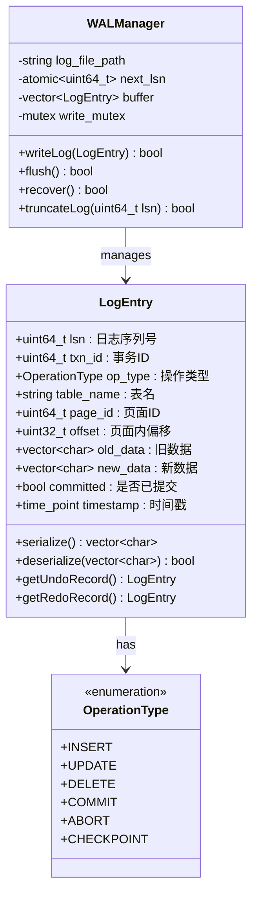

**LogEntry关键字段解析**：
1. **LSN（Log Sequence Number）**：全局唯一的日志序列号，用于日志排序和恢复
2. **事务ID**：标识产生该日志的事务，用于事务回滚
3. **操作类型**：区分不同操作（插入、更新、删除等）
4. **数据位置**：表名、页面ID、偏移量精确定位数据位置
5. **数据内容**：新旧数据记录，支持UNDO和REDO操作

### 8.3.3 日志刷盘策略：同步vs异步，性能与安全的权衡

日志写入磁盘的策略直接影响系统的性能和可靠性：

**同步刷盘策略**：
- **实现方式**：每次事务提交都调用fsync()强制将日志缓冲区写入磁盘
- **优点**：最大程度保证数据安全，崩溃后最多丢失最近一个事务
- **缺点**：性能开销大，每个事务都需要等待磁盘I/O
- **适用场景**：金融、交易等对数据安全要求极高的系统

**异步刷盘策略**：
- **实现方式**：日志先写入操作系统缓冲区，由操作系统决定刷盘时机
- **优点**：性能高，事务提交不需要等待磁盘I/O
- **缺点**：系统崩溃可能丢失最近几秒的数据
- **适用场景**：社交网络、内容发布等可容忍少量数据丢失的系统

**SQLCC的混合策略**：
```cpp
// SQLCC的日志写入策略示例
class WALManager {
public:
    enum FlushPolicy {
        SYNC_FLUSH,     // 同步刷盘
        ASYNC_FLUSH,    // 异步刷盘
        GROUP_COMMIT    // 组提交（混合策略）
    };
    
    bool writeLogWithPolicy(LogEntry& entry, FlushPolicy policy) {
        // 写入日志缓冲区
        buffer.push_back(entry);
        
        switch(policy) {
            case SYNC_FLUSH:
                return flushSync();  // 立即同步刷盘
            case ASYNC_FLUSH:
                if(buffer.size() >= BUFFER_SIZE) {
                    return flushAsync(); // 缓冲区满时异步刷盘
                }
                return true;
            case GROUP_COMMIT:
                // 组提交：等待多个事务一起提交
                if(shouldFlush()) {
                    return flushGroup();
                }
                return true;
        }
    }
};
```

### 8.3.4 故障恢复算法：UNDO/REDO的UML活动图展示

数据库崩溃后的恢复过程是WAL机制的核心价值体现：

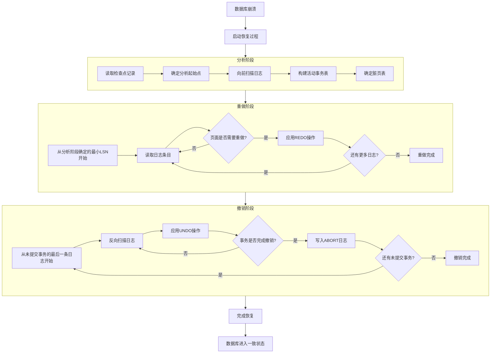

**恢复算法关键点**：
1. **分析阶段**：确定崩溃时的系统状态，包括哪些事务需要REDO，哪些需要UNDO
2. **重做阶段**：从最早的可能需要REDO的日志开始，重新执行所有已提交事务的操作
3. **撤销阶段**：从未提交事务的最后一条日志开始，反向执行UNDO操作，回滚未提交事务

### 8.3.5 断电恢复场景模拟：通过顺序图展示完整的恢复流程

通过一个具体的断电场景，理解WAL如何保证数据不丢失：

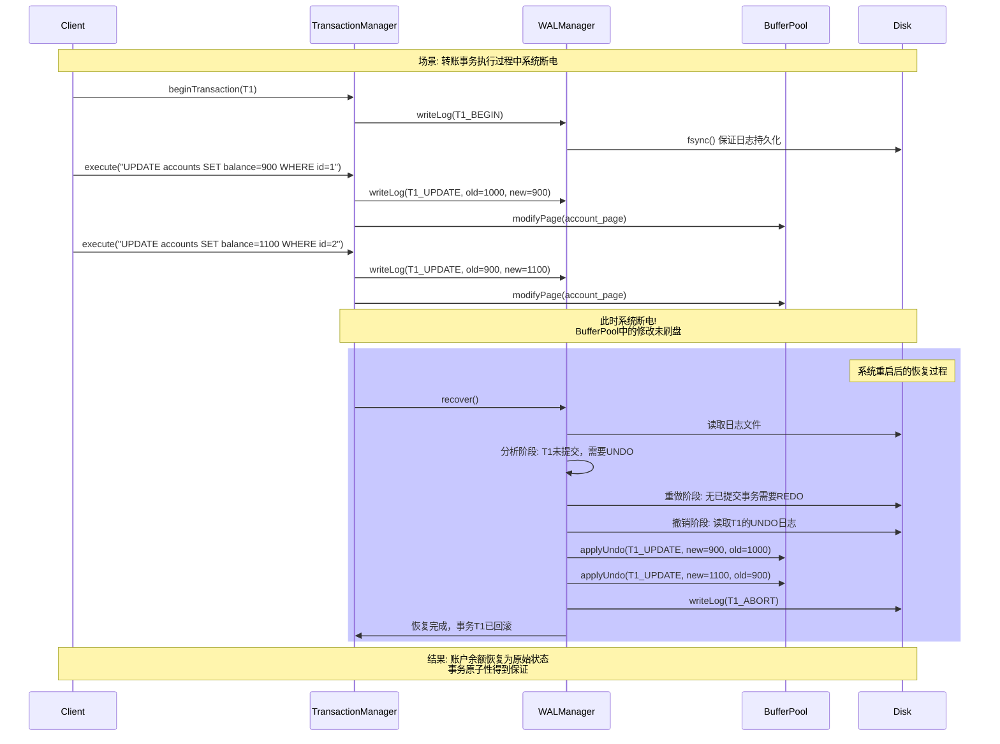

**断电恢复的关键保证**：
1. **数据不丢失**：即使缓冲池中的数据未写入磁盘，日志中已记录所有操作
2. **原子性保证**：未提交事务通过UNDO日志完整回滚
3. **一致性保持**：数据库恢复到事务开始前的一致状态

## 8.4 并发控制：从锁机制到MVCC的演进

并发控制是保证事务隔离性的核心技术，它需要在性能与正确性之间找到平衡点。

### 8.4.1 两阶段锁协议的实现：SQLCC TransactionManager的UML类图分析

两阶段锁协议是保证事务串行化的经典算法，SQLCC的TransactionManager完整实现了这一协议：

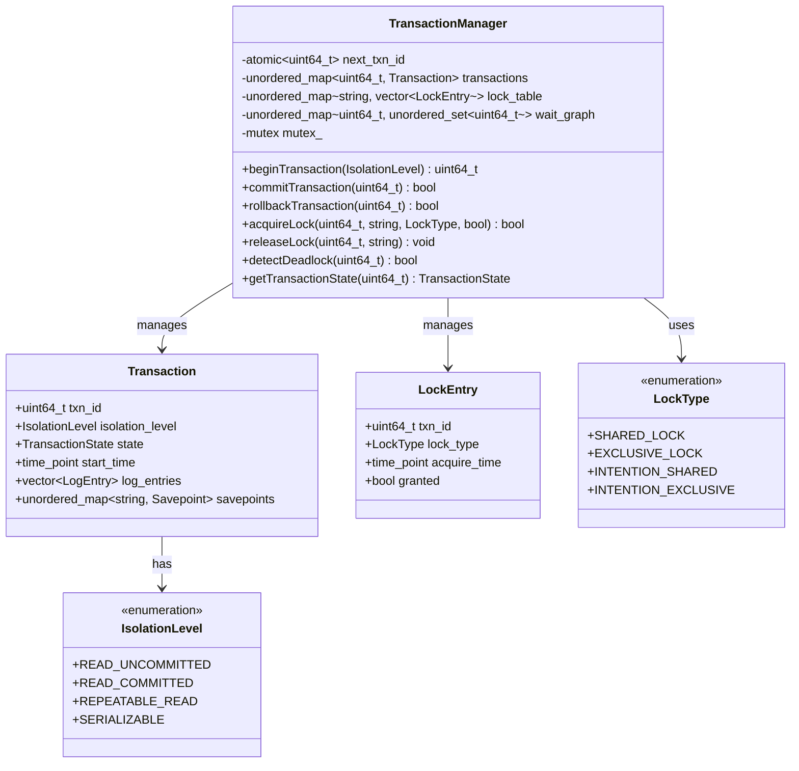

**两阶段锁协议的核心规则**：
1. **扩展阶段**：事务可以获取锁，但不能释放任何锁
2. **收缩阶段**：事务可以释放锁，但不能获取新锁
3. **锁兼容性矩阵**：不同类型的锁之间有不同的兼容性规则

### 8.4.2 死锁检测与处理：等待图算法的状态图分析

死锁是并发控制中必须处理的问题，SQLCC采用等待图算法进行死锁检测：

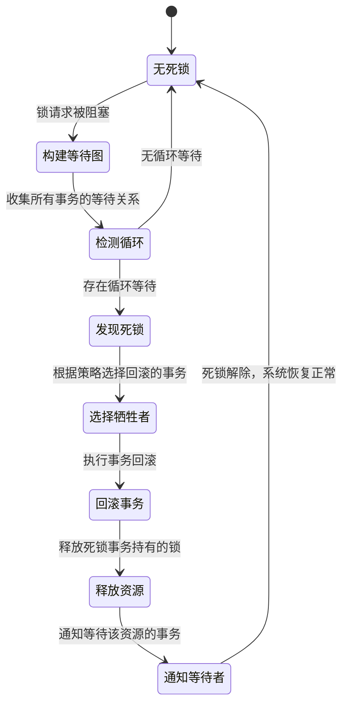

**死锁处理策略**：
1. **超时检测**：事务等待超时后自动回滚
2. **等待图检测**：定期构建等待图检测循环等待
3. **预防策略**：按固定顺序获取锁，避免循环等待
4. **牺牲者选择**：选择回滚代价最小的事务作为牺牲者

### 8.4.3 MVCC的原理与优势：多版本并发控制的时间戳机制

多版本并发控制通过维护数据的多个版本来避免读写冲突，是高性能数据库系统的关键技术：

```
MVCC的核心机制:
├── 版本链: 每个数据行维护多个版本，按时间戳排序
├── 读快照: 事务读取时看到的是开始时的数据快照
├── 写时复制: 修改数据时不覆盖旧版本，创建新版本
├── 垃圾回收: 定期清理不再需要的旧版本数据
└── 版本可见性: 根据事务开始时间和版本时间戳确定可见性
```

**MVCC vs 锁机制的对比**：
```
性能对比分析:
├── 读性能:
│   ├── 锁机制: 读操作可能被写操作阻塞
│   └── MVCC: 读操作不阻塞，直接读取快照版本
├── 写性能:
│   ├── 锁机制: 写操作需要获取排他锁
│   └── MVCC: 写操作创建新版本，不阻塞读
├── 并发度:
│   ├── 锁机制: 读写互斥，并发度受限
│   └── MVCC: 读写不冲突，高并发支持
└── 实现复杂度:
    ├── 锁机制: 相对简单，但死锁处理复杂
    └── MVCC: 版本管理和垃圾回收复杂
```

### 8.4.4 SQLCC的并发控制策略：锁与MVCC的混合实现架构图

SQLCC采用混合并发控制策略，根据不同的隔离级别选择最合适的机制：

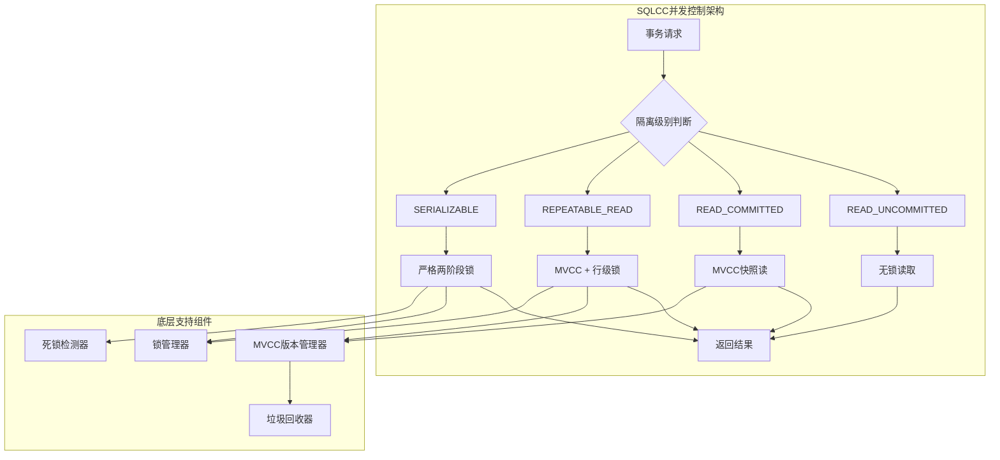

**混合策略的优势**：
1. **灵活性**：不同隔离级别使用不同并发控制机制
2. **性能优化**：读多写少场景使用MVCC，写密集场景使用锁机制
3. **资源效率**：根据需要动态分配版本存储和锁资源
4. **兼容性**：支持标准的SQL隔离级别定义

## 8.5 分布式事务处理：跨越网络边界的ACID保证

在分布式数据库系统中，事务处理面临网络延迟、节点故障、数据分区等新的挑战。

### 8.5.1 两阶段提交协议（2PC）：协调者与参与者的角色交互图

两阶段提交是分布式事务处理的基础协议，SQLCC实现了完整的2PC机制：

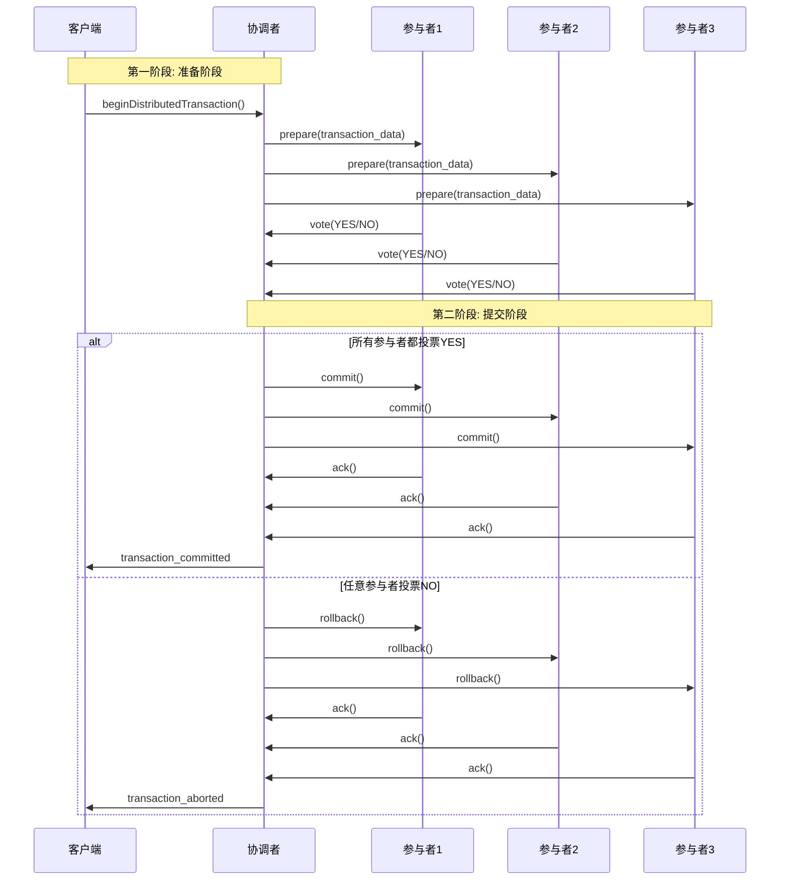

**2PC的优缺点分析**：
- **优点**：
  1. 保证分布式事务的原子性
  2. 协议简单，易于理解和实现
  3. 是其他协议（如3PC）的基础
- **缺点**：
  1. **同步阻塞**：协调者故障时参与者可能长时间阻塞
  2. **单点故障**：协调者是单点故障源
  3. **数据不一致**：网络分区时可能出现不一致状态

### 8.5.2 三阶段提交协议（3PC）：解决2PC阻塞问题的改进方案

三阶段提交在2PC基础上增加了预提交阶段，减少了阻塞时间：

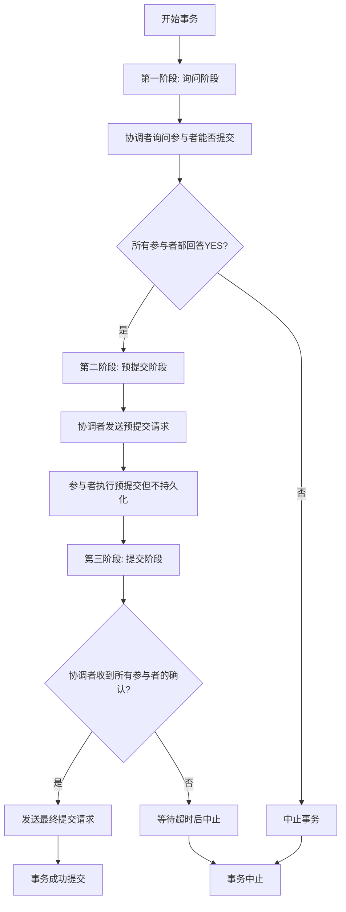

**3PC的改进点**：
1. **增加预提交阶段**：在真正提交前先确认所有参与者都已准备就绪
2. **超时机制**：参与者在预提交阶段超时后可以自动中止
3. **减少阻塞**：协调者故障时参与者不会无限期等待

### 8.5.3 长事务补偿机制：SAGA模式的UML活动图展示

对于长时间运行的分布式事务，SAGA模式通过补偿事务保证最终一致性：

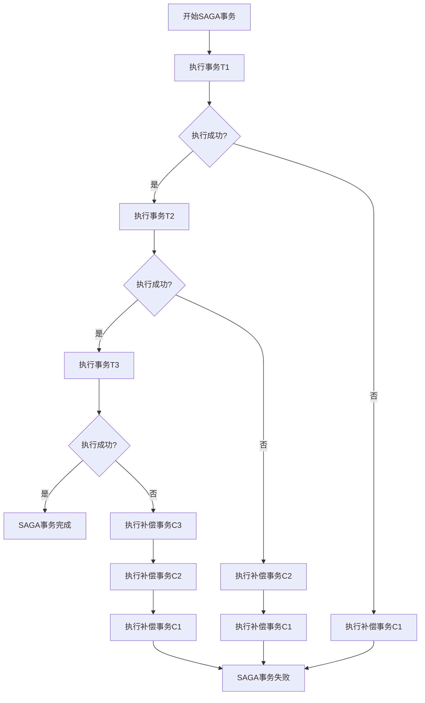

**SAGA模式的关键特性**：
1. **补偿事务**：每个正向事务都有对应的补偿事务
2. **最终一致性**：不保证强一致性，但保证最终一致性
3. **业务逻辑集成**：补偿逻辑与业务逻辑紧密相关
4. **适用场景**：适合长时间运行、跨多个服务的业务事务

### 8.5.4 网络分区场景分析：脑裂问题的检测与处理

在网络分区场景下，分布式系统可能面临脑裂问题，SQLCC采用多种机制进行防护：

```
脑裂防护策略:
├── 多数派原则: 决策需要多数节点同意
├── 租约机制: 主节点定期续租，过期自动失效
├── 心跳检测: 节点间定期发送心跳检测存活状态
├── 隔离恢复: 分区恢复后自动进行数据一致性检查
└── 人工干预: 严重脑裂时支持管理员手动介入
```

## 8.6 SQLCC事务管理系统实战分析

### 8.6.1 TransactionManager架构详解：类图展示核心组件关系

SQLCC的TransactionManager采用了模块化设计，各组件职责清晰：

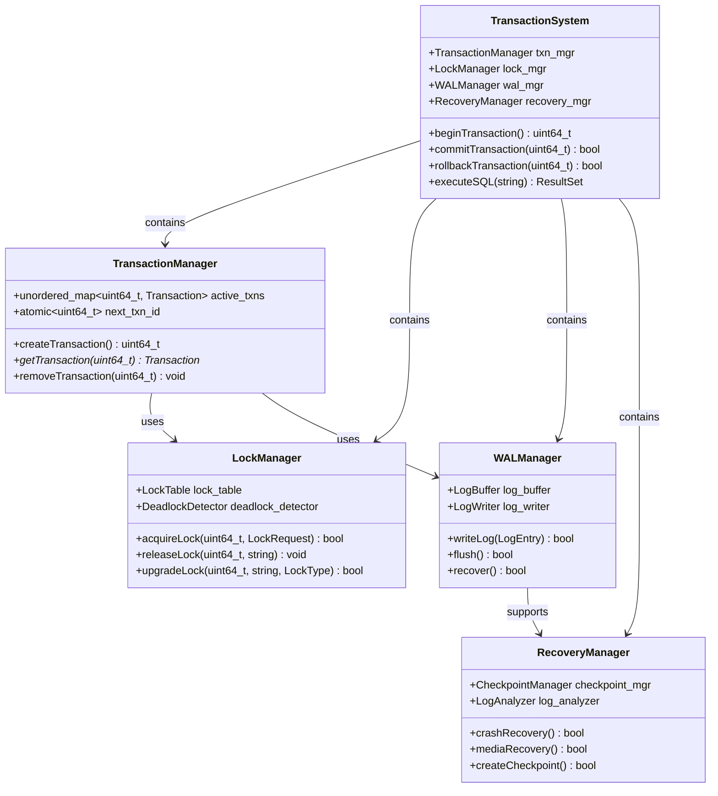

### 8.6.2 日志管理器的实现：WALManager的UML状态图

WALManager的状态转换体现了日志写入的完整生命周期：

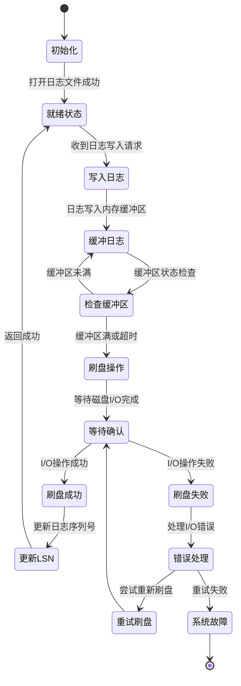

### 8.6.3 锁管理器的设计：细粒度锁与意向锁的层次结构

SQLCC的锁管理器支持多种锁粒度和锁类型：

```
锁粒度层次结构:
├── 数据库级锁: 保护整个数据库
│   ├── 共享锁(S): 多个事务可同时读取数据库
│   └── 排他锁(X): 单个事务可修改数据库结构
├── 表级锁: 保护整张表
│   ├── 意向共享锁(IS): 表示将在某些行上加共享锁
│   ├── 意向排他锁(IX): 表示将在某些行上加排他锁
│   ├── 共享意向排他锁(SIX): 共享锁+意向排他锁
│   └── 排他锁(X): 修改表结构
└── 行级锁: 保护单行数据
    ├── 共享锁(S): 多个事务可同时读取该行
    ├── 排他锁(X): 单个事务可修改该行
    └── 键范围锁: 保护索引键范围，防止幻读
```

**锁兼容性矩阵**：
```
锁兼容性表:
         |  IS  |  IX  |  S   |  SIX |  X   |
---------|------|------|------|------|------|
IS       |   ✓  |   ✓  |   ✓  |   ✓  |   ✗  |
IX       |   ✓  |   ✓  |   ✗  |   ✗  |   ✗  |
S        |   ✓  |   ✗  |   ✓  |   ✗  |   ✗  |
SIX      |   ✓  |   ✗  |   ✗  |   ✗  |   ✗  |
X        |   ✗  |   ✗  |   ✗  |   ✗  |   ✗  |
```

### 8.6.4 分布式事务支持：SQLCC的2PC实现顺序图

SQLCC的分布式事务实现展示了2PC协议的具体执行过程：

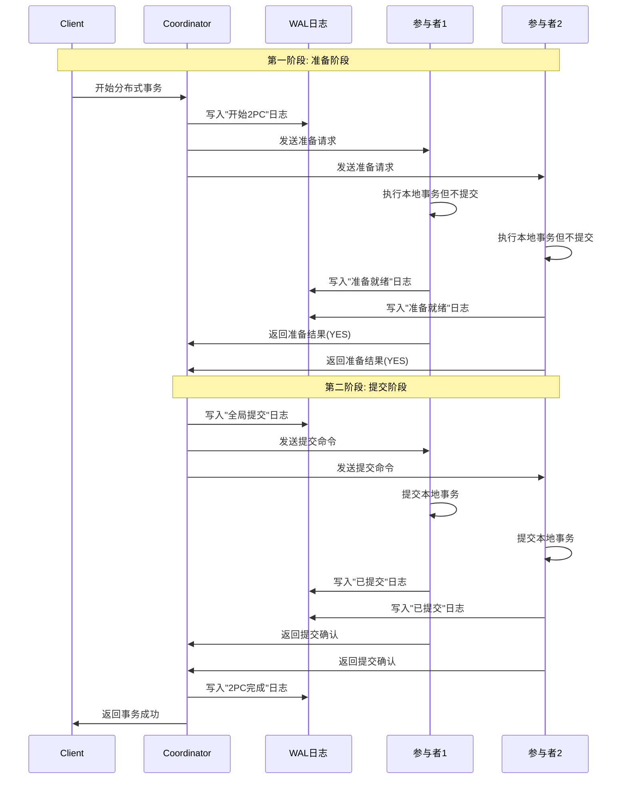

## 8.7 分布式环境下的容错设计

### 8.7.1 故障分类与应对策略

分布式数据库系统面临多种故障类型，SQLCC提供了相应的应对机制：

**断电故障处理**：
```
断电恢复机制:
├── WAL日志: 保证已提交事务的数据不丢失
├── 检查点: 定期将内存数据刷盘，减少恢复时间
├── 双写机制: 防止部分页面写入问题
└── 快速恢复: 优化恢复算法，减少停机时间
```

**网络故障处理**：
```
网络容错策略:
├── 心跳检测: 定期检测节点存活状态
├── 超时重试: 网络超时后自动重试
├── 故障转移: 主节点故障后自动切换到备节点
└── 数据同步: 保证主备节点数据一致性
```

**磁盘故障处理**：
```
磁盘冗余策略:
├── RAID技术: 磁盘阵列提供数据冗余
├── 多副本: 数据在多个节点上存储副本
├── 定期备份: 定期全量备份和增量备份
└── 快速替换: 支持热插拔磁盘替换
```

**节点故障处理**：
```
高可用架构:
├── 主从复制: 主节点写，从节点读
├── 多主复制: 多个节点都可写，最终一致性
├── 一致性哈希: 节点故障时数据自动迁移
└── 自动故障检测: 监控系统自动检测和处理故障
```

### 8.7.2 CAP定理的工程实践：在一致性、可用性、分区容忍性间的权衡

CAP定理指出分布式系统无法同时保证一致性、可用性和分区容忍性，SQLCC根据应用场景进行权衡：

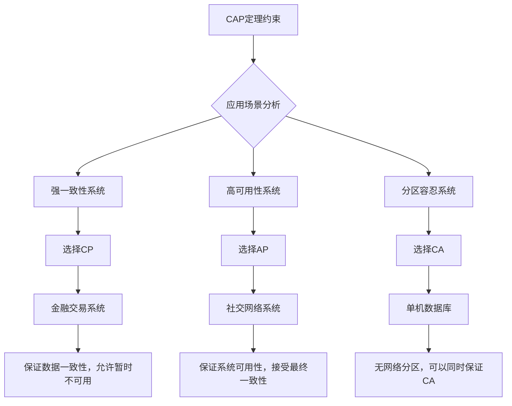

**SQLCC的CAP权衡策略**：
1. **金融场景**：选择CP，保证强一致性，牺牲部分可用性
2. **电商场景**：选择AP，保证高可用性，接受最终一致性
3. **混合策略**：根据操作类型动态选择，如支付用CP，浏览用AP

### 8.7.3 SQLCC的容错机制：多副本、心跳检测、自动故障转移的架构图

SQLCC的容错架构体现了现代分布式数据库的设计思想：

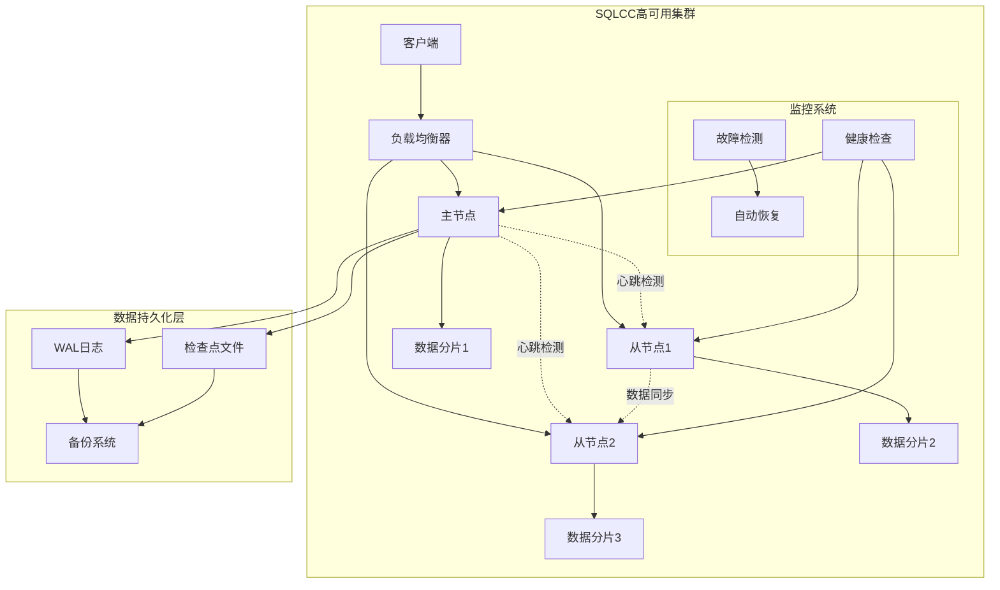

## 8.8 大型分布式数据库集群的事务处理

### 8.8.1 分片事务处理：跨分片事务的协调机制

在分片数据库中，跨分片事务需要特殊的协调机制：

```
跨分片事务处理策略:
├── 两阶段提交(2PC): 经典方案，保证强一致性
├── Saga模式: 长事务补偿，保证最终一致性
├── 本地消息表: 异步消息，保证最终一致性
└── TCC模式: 尝试-确认-取消，业务侵入性强
```

### 8.8.2 全局时钟服务：逻辑时钟与物理时钟的协调

分布式事务需要全局有序的时间戳，SQLCC采用混合时钟方案：

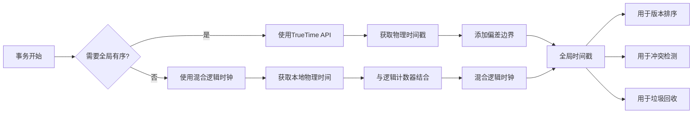

### 8.8.3 读写分离架构：主写从读的事务一致性保证

读写分离是提高数据库吞吐量的重要技术：

```
读写分离的一致性级别:
├── 强一致性读: 读主节点，保证数据最新
├── 会话一致性: 同一会话内保证读己之所写
├── 时间线一致性: 指定时间戳读取历史快照
└── 最终一致性: 读从节点，可能有延迟
```

### 8.8.4 每秒千万级事务处理：流水线、批处理、并行优化的架构图

现代分布式数据库通过多种技术实现高性能事务处理：

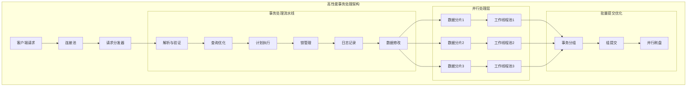

**性能优化技术**：
1. **流水线处理**：将事务处理分解为多个阶段并行执行
2. **批量提交**：将多个事务的日志批量写入磁盘
3. **异步处理**：非关键路径操作异步执行
4. **数据局部性**：优化数据分布，减少网络传输

### 8.8.5 SQLCC的扩展性设计：从单机到分布式的平滑演进路径

SQLCC设计了清晰的扩展路径，支持从单机到分布式集群的平滑过渡：

```
扩展演进路径:
├── 阶段1: 单机模式
│   ├── 完整的ACID支持
│   ├── 基本的并发控制
│   └── WAL日志恢复
├── 阶段2: 主从复制
│   ├── 读写分离
│   ├── 数据冗余
│   └── 故障转移
├── 阶段3: 数据分片
│   ├── 水平分片
│   ├── 跨分片事务
│   └── 负载均衡
└── 阶段4: 多数据中心
    ├── 地理分布
    ├── 数据同步
    └── 容灾备份
```

## 8.9 从理论到实践：工程实现中的权衡艺术

### 8.9.1 性能与安全性的权衡：同步刷盘vs异步刷盘的选择

数据库设计中最经典的权衡之一，SQLCC提供了灵活的配置选项：

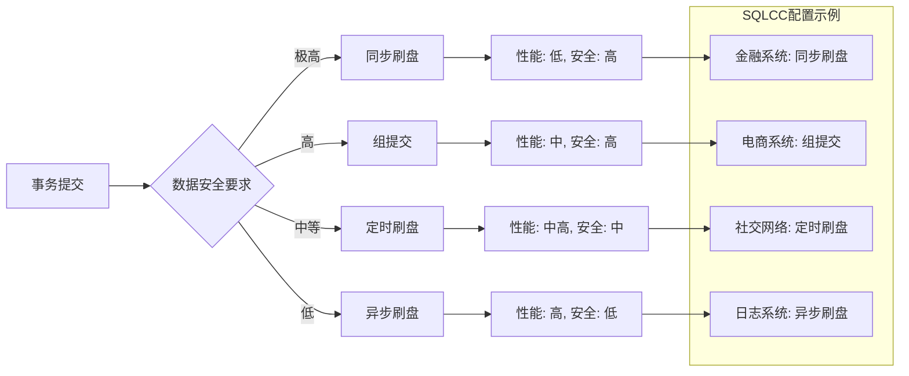

### 8.9.2 复杂度与功能的平衡：完整ACID vs 最终一致性的决策

不同的应用场景对事务特性有不同的要求：

```
一致性等级选择指南:
├── 强一致性(ACID):
│   ├── 适用场景: 银行转账、库存扣减
│   ├── 技术要求: 分布式锁、2PC、WAL
│   └── 性能影响: 吞吐量较低，延迟较高
├── 最终一致性(BASE):
│   ├── 适用场景: 社交点赞、消息推送
│   ├── 技术要求: 冲突解决、补偿事务
│   └── 性能影响: 吞吐量高，延迟低
└── 会话一致性:
    ├── 适用场景: 用户购物车、游戏状态
    ├── 技术要求: 会话粘性、读己写
    └── 性能影响: 平衡性能与用户体验
```

### 8.9.3 开发成本与运维成本：一次性实现vs渐进式优化的策略

SQLCC的设计哲学强调务实和渐进式优化：

```
成本优化策略:
├── 开发阶段:
│   ├── 模块化设计: 各组件独立开发测试
│   ├── 原型验证: 先实现核心功能验证可行性
│   └── 迭代优化: 逐步添加高级特性
├── 运维阶段:
│   ├── 监控告警: 实时监控系统状态
│   ├── 自动化运维: 脚本化部署和扩容
│   └── 容灾演练: 定期进行故障恢复演练
└── 演进策略:
    ├── 兼容性保证: 新版本兼容旧数据格式
    ├── 灰度发布: 逐步升级减少风险
    └── 回滚机制: 支持快速版本回退
```

### 8.9.4 SQLCC的设计哲学：面向工程实践的务实设计理念

SQLCC作为教学型数据库系统，体现了从理论到实践的完整设计思想：

```
SQLCC设计原则:
├── 理论指导实践: 每个特性都有明确的理论基础
├── 实践验证理论: 通过实现验证理论的可行性
├── 模块化可扩展: 组件间松耦合，便于扩展
├── 可观察可调试: 提供丰富的监控和调试接口
└── 文档化可教学: 详细的文档和示例便于学习
```

## 📚 **本章总结：从ACID到分布式容错的系统工程实践**

本章深入探讨了OLTP事务处理的核心机制与实现技术，从经典的ACID属性到现代分布式容错设计：

1. **ACID的理论深度**：理解了原子性、一致性、隔离性、持久性在工程实现中的具体挑战和解决方案
2. **WAL的工程实践**：掌握了预写日志如何保证数据安全，以及故障恢复的具体算法
3. **并发控制的演进**：从锁机制到MVCC，理解了不同并发控制技术的适用场景和权衡
4. **分布式事务的复杂性**：学习了2PC、3PC、SAGA等分布式事务处理协议
5. **容错设计的系统性**：掌握了在断电、断网、磁盘故障等场景下的容错机制
6. **性能优化的艺术**：理解了在性能、安全性、一致性之间的权衡决策

通过SQLCC的具体实现，我们看到了理论算法如何转化为实际的工程代码，理解了数据库系统设计的复杂性及其解决方案。这些知识不仅适用于数据库系统开发，也为构建其他分布式系统提供了宝贵的设计思路。

---

**思考题**：
1. 为什么WAL要求先写日志后写数据？如果顺序反过来会有什么问题？
2. MVCC如何解决读写冲突？相比锁机制有哪些优势和劣势？
3. 在分布式环境中，2PC协议可能遇到哪些问题？3PC如何改进？
4. 面对CAP定理的约束，如何根据应用场景选择合适的一致性模型？
5. 在设计高可用数据库系统时，需要考虑哪些故障场景？如何应对？

**实践项目**：
1. 基于SQLCC源代码，分析TransactionManager的具体实现
2. 实现一个简单的WAL日志系统，支持崩溃恢复
3. 设计并实现一个分布式锁服务，支持死锁检测
4. 模拟网络分区场景，测试数据库系统的容错能力
5. 性能测试不同隔离级别对事务吞吐量的影响

通过本章的学习，希望读者不仅掌握了事务处理的理论知识，更能理解这些理论在实际系统中的应用，培养系统级的设计思维和工程实现能力。
