# 《数据库系统原理与开发实践》 - 第9章：数据库网络通信与安全：从客户端-服务器到分布式集群

**网络协议、加密技术与分布式容灾架构的工程实践**

---

## 🎯 **本章核心目标**

深入理解数据库网络通信的核心机制与安全设计，掌握从基础客户端-服务器通信到复杂分布式集群的实现原理：
- 数据库客户端-服务器网络通信的完整架构与协议设计
- 密码学与网络安全在数据库通信中的应用实践
- 加密传输、身份认证与防御网络攻击的技术体系
- 分布式数据库集群的网络架构与容灾备份机制
- 自动伸缩、负载均衡与混合工作负载处理

---

## 9.1 数据库网络通信概述：连接世界的桥梁

### 9.1.1 数据库网络通信的演进：从本地访问到云原生数据库

数据库系统的网络通信经历了多个阶段的演进，每个阶段都对应着不同的应用需求和架构思想：

```
数据库网络通信演进路径:
├── 阶段1: 本地单机时代 (1970s-1990s)
│   ├── 特点: 应用程序与数据库在同一台机器上
│   ├── 通信方式: 本地进程间通信(IPC)
│   └── 代表性系统: dBase、FoxPro、早期MySQL
│
├── 阶段2: 客户端-服务器时代 (1990s-2000s)
│   ├── 特点: 客户端与数据库服务器分离部署
│   ├── 通信方式: TCP/IP网络通信
│   └── 代表性系统: Oracle、SQL Server、PostgreSQL
│
├── 阶段3: 多层架构时代 (2000s-2010s)
│   ├── 特点: Web服务器、应用服务器、数据库服务器分层
│   ├── 通信方式: 面向服务的架构(SOA)、HTTP/REST
│   └── 代表性系统: MySQL集群、Oracle RAC
│
└── 阶段4: 云原生时代 (2010s-现在)
    ├── 特点: 微服务、容器化、无服务器计算
    ├── 通信方式: gRPC、消息队列、服务网格
    └── 代表性系统: AWS Aurora、Google Spanner、CockroachDB
```

### 9.1.2 网络通信在数据库系统中的核心地位

**为什么网络通信是数据库的"神经系统"？**

1. **分布式协作的基石**：在多节点系统中协调数据一致性和事务处理
2. **安全防护的第一道防线**：保护敏感数据在传输过程中不被窃取或篡改
3. **性能优化的关键**：网络延迟和带宽直接影响查询响应时间
4. **高可用性的保障**：通过冗余网络路径和故障转移机制确保服务连续性
5. **扩展性的支撑**：支持动态添加节点实现水平扩展

### 9.1.3 SQLCC在网络通信架构中的设计定位

SQLCC作为教学型数据库系统，其网络通信设计体现了从理论到实践的完整设计思想：

```
SQLCC网络通信架构设计哲学:
├── 设计原则:
│   ├── 简单优先: 首先实现基本的客户端-服务器通信
│   ├── 安全贯穿: 在每个通信环节考虑安全防护
│   ├── 可扩展性: 为分布式集群预留接口
│   └── 教学友好: 清晰的分层设计和模块化结构
├── 架构特色:
│   ├── 双模式支持: 同时支持本地和远程访问
│   ├── 协议灵活: 支持文本和二进制协议
│   └── 安全可选: 提供明文和加密两种通信模式
└── 教学价值:
    ├── 完整展示网络通信的核心概念
    ├── 直观演示加密通信的实现原理
    └── 为分布式数据库学习奠定基础
```

### 9.1.4 典型数据库网络通信场景分析

**场景一：银行交易系统的安全通信**
- **通信需求**：客户端应用与数据库服务器之间的加密数据传输
- **安全要求**：防窃听、防篡改、防重放攻击
- **技术挑战**：平衡加密开销与查询性能，管理密钥生命周期

**场景二：电商平台的分布式数据访问**
- **通信需求**：多台应用服务器访问共享数据库集群
- **性能要求**：高并发连接管理，低延迟查询响应
- **技术挑战**：连接池优化、查询路由、负载均衡

**场景三：数据分析平台的批量数据传输**
- **通信需求**：从OLTP数据库向OLAP数据仓库传输大量数据
- **效率要求**：高效的数据压缩和批量传输机制
- **技术挑战**：网络带宽优化、传输中断恢复、数据一致性保证

## 9.2 客户端-服务器通信架构设计：TCP/IP协议栈的深度应用

### 9.2.1 TCP三次握手在数据库连接建立中的应用

TCP协议为数据库通信提供了可靠的字节流传输服务，其连接建立过程直接影响数据库连接的性能：

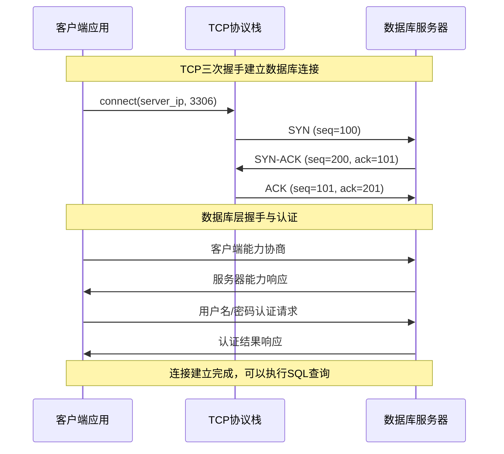
```mermaid
sequenceDiagram
    participant Client as 客户端应用
    participant TCP as TCP协议栈
    participant Server as 数据库服务器
    
    Note over Client,Server: TCP三次握手建立数据库连接
    
    Client->>TCP: connect(server_ip, 3306)
    TCP->>Server: SYN (seq=100)
    Server->>TCP: SYN-ACK (seq=200, ack=101)
    TCP->>Server: ACK (seq=101, ack=201)
    
    Note over Client,Server: 数据库层握手与认证
    
    Client->>Server: 客户端能力协商
    Server->>Client: 服务器能力响应
    
    Client->>Server: 用户名/密码认证请求
    Server->>Client: 认证结果响应
    
    Note over Client,Server: 连接建立完成，可以执行SQL查询
```

**TCP连接建立的时间开销分析**：
```
连接建立总时间 = 网络RTT × 3 + 服务器处理时间 + 客户端处理时间

典型网络环境下的时间分析:
├── 局域网环境 (RTT < 1ms):
│   ├── TCP握手: ~3ms
│   ├── 数据库握手: ~2ms
│   ├── 认证过程: ~5ms
│   └── 总时间: ~10ms
├── 跨数据中心 (RTT ≈ 50ms):
│   ├── TCP握手: ~150ms
│   ├── 数据库握手: ~10ms
│   ├── 认证过程: ~20ms
│   └── 总时间: ~180ms
└── 跨大洲网络 (RTT ≈ 200ms):
    ├── TCP握手: ~600ms
    ├── 数据库握手: ~20ms
    ├── 认证过程: ~30ms
    └── 总时间: ~650ms
```

### 9.2.2 连接池技术：解决TCP连接开销的关键方案

连接池通过复用已有连接避免了频繁建立新连接的开销，是现代数据库应用的必备技术：

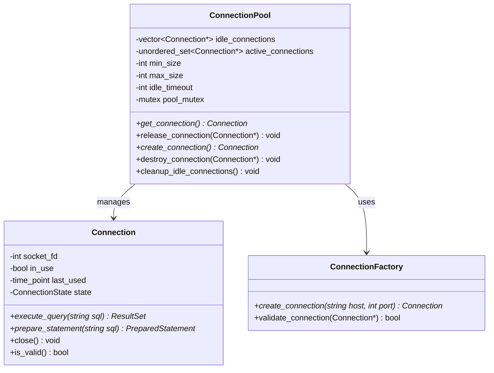
```mermaid
classDiagram
    class ConnectionPool {
        -vector~Connection*~ idle_connections
        -unordered_set~Connection*~ active_connections
        -int min_size
        -int max_size
        -int idle_timeout
        -mutex pool_mutex
        
        +get_connection() Connection*
        +release_connection(Connection*) void
        +create_connection() Connection*
        +destroy_connection(Connection*) void
        +cleanup_idle_connections() void
    }
    
    class Connection {
        -int socket_fd
        -bool in_use
        -time_point last_used
        -ConnectionState state
        
        +execute_query(string sql) ResultSet*
        +prepare_statement(string sql) PreparedStatement*
        +close() void
        +is_valid() bool
    }
    
    class ConnectionFactory {
        +create_connection(string host, int port) Connection*
        +validate_connection(Connection*) bool
    }
    
    ConnectionPool --> Connection : manages
    ConnectionPool --> ConnectionFactory : uses
```

**SQLCC连接池的核心优化策略**：

1. **预热连接**：在应用启动时预先建立最小连接数
2. **健康检查**：定期检查连接有效性，自动替换失效连接
3. **智能回收**：根据使用频率动态调整连接数
4. **超时管理**：自动关闭长时间空闲的连接

### 9.2.3 数据库通信协议设计：文本协议 vs 二进制协议

数据库客户端与服务器之间需要定义明确的通信协议，常见的协议类型各有优缺点：

```
文本协议与二进制协议的对比分析:
├── 文本协议 (如MySQL文本协议):
│   ├── 优点:
│   │   ├── 人类可读，易于调试
│   │   ├── 扩展性强，容易添加新功能
│   │   └── 兼容性好，版本升级影响小
│   └── 缺点:
│       ├── 解析开销大，性能较低
│       ├── 数据传输效率低
│       └── 容易受SQL注入攻击
└── 二进制协议 (如MySQL二进制协议):
    ├── 优点:
    │   ├── 解析速度快，性能高
    │   ├── 数据传输紧凑，节省带宽
    │   └── 类型安全，减少错误
    └── 缺点:
        ├── 可读性差，调试困难
        ├── 扩展性受限，版本兼容复杂
        └── 实现复杂度高
```

**SQLCC的混合协议设计**：
SQLCC采用灵活的协议设计，根据应用场景自动选择最合适的协议：

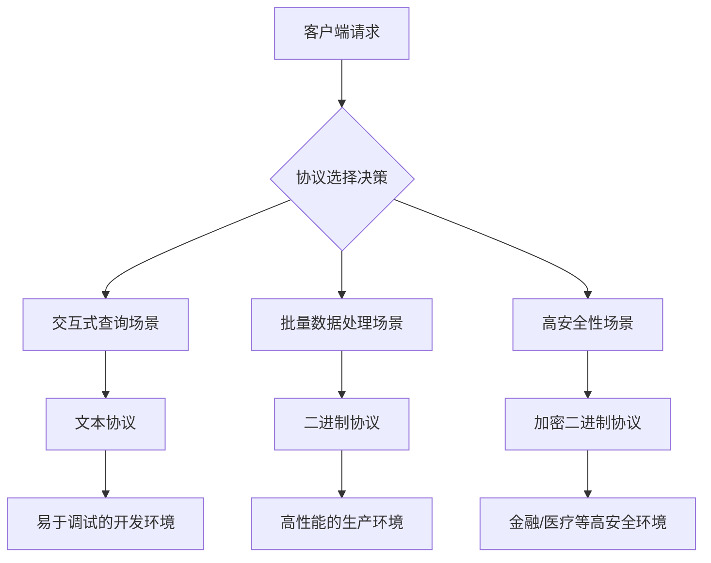
```mermaid
graph TB
    A[客户端请求] --> B{协议选择决策}
    B --> C[交互式查询场景]
    B --> D[批量数据处理场景]
    B --> E[高安全性场景]
    
    C --> F[文本协议]
    D --> G[二进制协议]
    E --> H[加密二进制协议]
    
    F --> I[易于调试的开发环境]
    G --> J[高性能的生产环境]
    H --> K[金融/医疗等高安全环境]
```

### 9.2.4 预编译语句的网络优化：减少重复解析开销

预编译语句是数据库性能优化的重要技术，在网络通信层面带来了显著的性能提升：

```mermaid
flowchart TD
    A[SQL查询请求] --> B{查询模式分析}
    B --> C[一次性查询]
    B --> D[重复性查询]
    
    C --> E[直接执行文本SQL]
    E --> F[完整解析+执行]
    
    D --> G[预编译语句流程]
    G --> H[发送PREPARE请求]
    H --> I[服务器解析并缓存执行计划]
    I --> J[返回语句ID]
    J --> K[多次发送EXECUTE请求]
    K --> L[使用缓存的执行计划]
    
    subgraph "网络流量对比"
        M[文本协议: 每次发送完整SQL]
        N[预编译协议: PREPARE(1次) + EXECUTE(N次)]
        O[节省流量: (SQL长度-参数长度)×执行次数]
    end
    
    F --> P[结果返回]
    L --> P
```

**预编译语句的网络性能优势**：
1. **减少网络流量**：SQL语句只需传输一次，后续只传输参数值
2. **降低服务器负载**：避免重复解析SQL语句
3. **提高缓存命中率**：执行计划在服务器端缓存重用
4. **增强安全性**：参数值与SQL逻辑分离，天然防御SQL注入

## 9.3 网络安全与密码学应用：保护数据传输的生命线

### 9.3.1 传输层安全(TLS)：数据库通信的加密防护罩

TLS为数据库网络通信提供了端到端的加密保护，是现代数据库系统的安全标配：

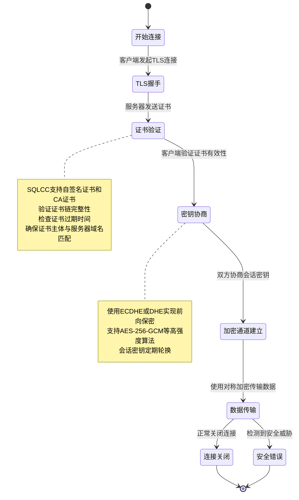
```mermaid
stateDiagram-v2
    [*] --> 开始连接
    开始连接 --> TLS握手: 客户端发起TLS连接
    TLS握手 --> 证书验证: 服务器发送证书
    证书验证 --> 密钥协商: 客户端验证证书有效性
    密钥协商 --> 加密通道建立: 双方协商会话密钥
    加密通道建立 --> 数据传输: 使用对称加密传输数据
    数据传输 --> 连接关闭: 正常关闭连接
    数据传输 --> 安全错误: 检测到安全威胁
    连接关闭 --> [*]
    安全错误 --> [*]
    
    note right of 证书验证
        SQLCC支持自签名证书和CA证书
        验证证书链完整性
        检查证书过期时间
        确保证书主体与服务器域名匹配
    end note
    
    note right of 密钥协商
        使用ECDHE或DHE实现前向保密
        支持AES-256-GCM等高强度算法
        会话密钥定期轮换
    end note
```

**SQLCC的TLS实现特性**：

1. **算法支持**：支持AES-256-GCM、ChaCha20-Poly1305等现代加密算法
2. **证书管理**：支持自签名证书、CA证书和证书链验证
3. **前向保密**：使用ECDHE密钥交换确保即使长期密钥泄露也不会影响历史通信安全
4. **性能优化**：实现会话恢复和False Start等性能优化技术

### 9.3.2 AES加密算法在数据库通信中的应用：对称加密的工程实践

AES（高级加密标准）是目前最常用的对称加密算法，在数据库通信中扮演关键角色：

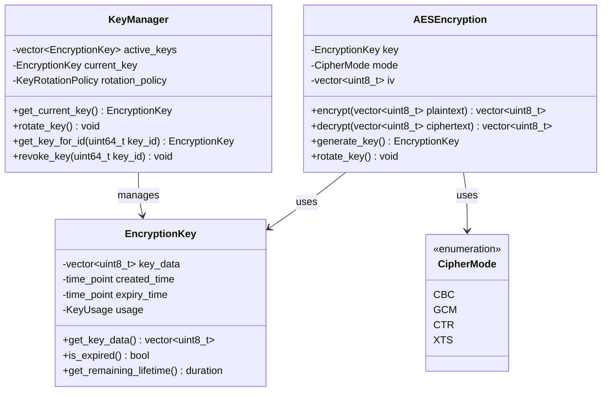
```mermaid
classDiagram
    class AESEncryption {
        -EncryptionKey key
        -CipherMode mode
        -vector~uint8_t~ iv
        
        +encrypt(vector~uint8_t~ plaintext) vector~uint8_t~
        +decrypt(vector~uint8_t~ ciphertext) vector~uint8_t~
        +generate_key() EncryptionKey
        +rotate_key() void
    }
    
    class EncryptionKey {
        -vector~uint8_t~ key_data
        -time_point created_time
        -time_point expiry_time
        -KeyUsage usage
        
        +get_key_data() vector~uint8_t~
        +is_expired() bool
        +get_remaining_lifetime() duration
    }
    
    class KeyManager {
        -vector~EncryptionKey~ active_keys
        -EncryptionKey current_key
        -KeyRotationPolicy rotation_policy
        
        +get_current_key() EncryptionKey
        +rotate_key() void
        +get_key_for_id(uint64_t key_id) EncryptionKey
        +revoke_key(uint64_t key_id) void
    }
    
    class CipherMode {
        <<enumeration>>
        CBC
        GCM
        CTR
        XTS
    }
    
    AESEncryption --> EncryptionKey : uses
    AESEncryption --> CipherMode : uses
    KeyManager --> EncryptionKey : manages
```

**AES加密在SQLCC中的具体应用**：

1. **数据包加密**：使用AES-GCM模式加密整个网络数据包
2. **密钥管理**：实现密钥轮换机制，定期更换加密密钥
3. **性能优化**：使用AES-NI硬件加速指令提高加密解密速度
4. **模式选择**：根据不同场景选择CBC、GCM或CTR加密模式

### 9.3.3 密码轮换机制：动态防御密钥泄露风险

静态密钥长期使用会增加泄露风险，密码轮换机制通过定期更换密钥增强安全性：

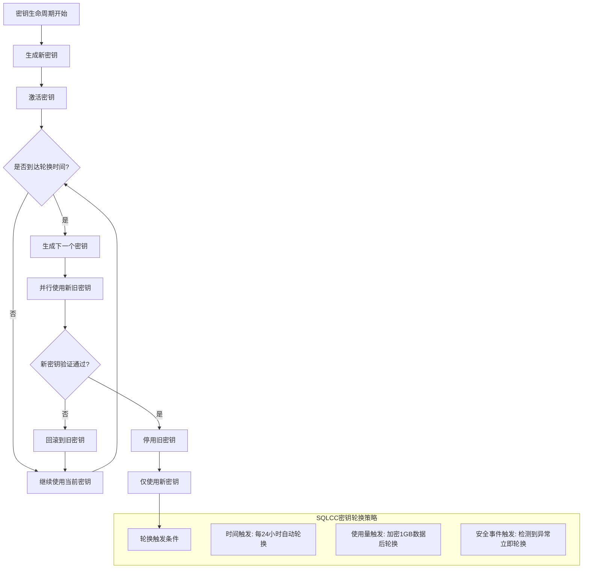
```mermaid
flowchart TD
    A[密钥生命周期开始] --> B[生成新密钥]
    B --> C[激活密钥]
    C --> D{是否到达轮换时间?}
    D -->|否| E[继续使用当前密钥]
    D -->|是| F[生成下一个密钥]
    E --> D
    
    F --> G[并行使用新旧密钥]
    G --> H{新密钥验证通过?}
    H -->|是| I[停用旧密钥]
    H -->|否| J[回滚到旧密钥]
    
    I --> K[仅使用新密钥]
    J --> E
    
    subgraph "SQLCC密钥轮换策略"
        L[轮换触发条件]
        M[时间触发: 每24小时自动轮换]
        N[使用量触发: 加密1GB数据后轮换]
        O[安全事件触发: 检测到异常立即轮换]
    end
    
    K --> L
```

**SQLCC密码轮换的核心机制**：

1. **平滑轮换**：新旧密钥并行使用一段时间，确保服务不中断
2. **回滚机制**：新密钥验证失败时自动回滚到旧密钥
3. **历史密钥保留**：保留最近几个历史密钥用于解密历史数据
4. **轮换日志**：详细记录每次密钥轮换的时间、原因和结果

### 9.3.4 防御网络攻击：SQL注入、DoS与中间人攻击的防护策略

数据库网络通信面临多种安全威胁，需要综合防御策略：

```
SQLCC网络安全防御体系:
├── SQL注入防护:
│   ├── 预编译语句强制使用
│   ├── 输入参数严格验证
│   ├── SQL语法白名单过滤
│   └── 异常查询模式检测
├── DoS攻击防护:
│   ├── 连接速率限制
│   ├── 查询频率限制
│   ├── IP黑白名单机制
│   └── 资源使用监控告警
├── 中间人攻击防护:
│   ├── TLS证书双向验证
│   ├── 证书绑定技术
│   ├── 公钥指纹验证
│   └── 通信完整性校验
└── 数据泄露防护:
    ├── 传输层加密
    ├── 字段级加密
    ├── 数据脱敏
    └── 访问审计日志
```

### 9.3.5 身份认证与授权：多因素认证与最小权限原则

数据库访问控制是网络安全的重要组成部分，需要多层次的安全机制：

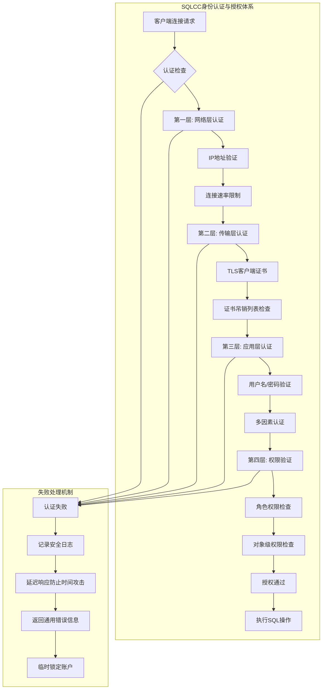
```mermaid
graph TB
    subgraph "SQLCC身份认证与授权体系"
        A[客户端连接请求] --> B{认证检查}
        
        B --> C[第一层: 网络层认证]
        C --> D[IP地址验证]
        D --> E[连接速率限制]
        
        E --> F[第二层: 传输层认证]
        F --> G[TLS客户端证书]
        G --> H[证书吊销列表检查]
        
        H --> I[第三层: 应用层认证]
        I --> J[用户名/密码验证]
        J --> K[多因素认证]
        
        K --> L[第四层: 权限验证]
        L --> M[角色权限检查]
        M --> N[对象级权限检查]
        
        N --> O[授权通过]
        O --> P[执行SQL操作]
    end
    
    subgraph "失败处理机制"
        Q[认证失败] --> R[记录安全日志]
        R --> S[延迟响应防止时间攻击]
        S --> T[返回通用错误信息]
        T --> U[临时锁定账户]
    end
    
    B --> Q
    C --> Q
    F --> Q
    I --> Q
    L --> Q
```

**SQLCC的安全认证特色**：

1. **分层防御**：网络层、传输层、应用层多层安全验证
2. **多因素认证**：支持密码、证书、生物特征等多种认证方式
3. **最小权限**：严格执行最小权限原则，避免过度授权
4. **审计追踪**：完整记录所有认证和授权操作，支持安全审计

## 9.4 SQLCC网络通信实现分析：从设计到代码的工程实践

### 9.4.1 SQLCC网络架构详解：基于模块化设计的通信系统

SQLCC的网络通信系统采用清晰的分层架构，各模块职责明确，便于理解和扩展：

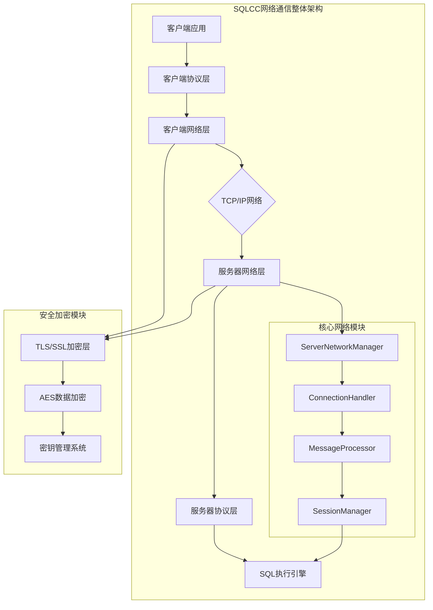
```mermaid
graph TB
    subgraph "SQLCC网络通信整体架构"
        A[客户端应用] --> B[客户端协议层]
        B --> C[客户端网络层]
        C --> D{TCP/IP网络}
        
        D --> E[服务器网络层]
        E --> F[服务器协议层]
        F --> G[SQL执行引擎]
        
        subgraph "核心网络模块"
            H[ServerNetworkManager]
            I[ConnectionHandler]
            J[MessageProcessor]
            K[SessionManager]
        end
        
        E --> H
        H --> I
        I --> J
        J --> K
        K --> G
    end
    
    subgraph "安全加密模块"
        L[TLS/SSL加密层]
        M[AES数据加密]
        N[密钥管理系统]
    end
    
    C --> L
    E --> L
    L --> M
    M --> N
```

**SQLCC网络核心模块功能分析**：

1. **ServerNetworkManager**：服务器网络管理器，负责监听端口、接受连接、管理连接池
2. **ConnectionHandler**：连接处理器，处理单个连接的所有网络I/O操作
3. **MessageProcessor**：消息处理器，解析协议消息并调用数据库功能
4. **SessionManager**：会话管理器，管理客户端会话状态和认证信息

### 9.4.2 消息处理流程：从网络字节流到SQL执行的完整链路

数据库网络通信的核心是将网络字节流转换为SQL执行请求，这个过程涉及多个处理阶段：

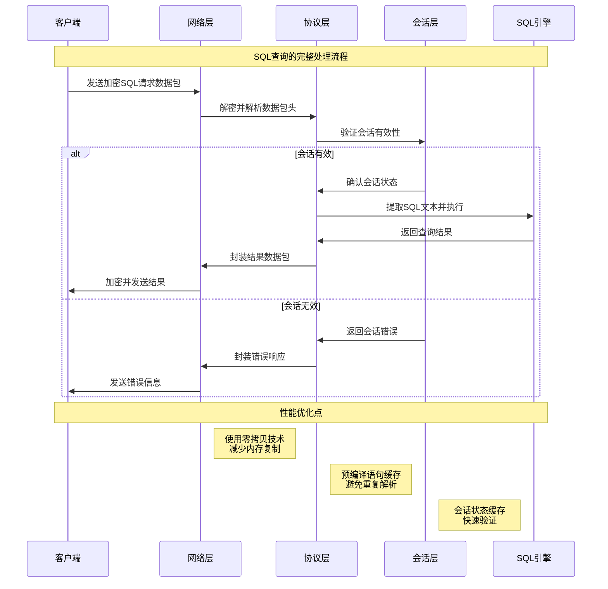
```mermaid
sequenceDiagram
    participant Client as 客户端
    participant Network as 网络层
    participant Protocol as 协议层
    participant Session as 会话层
    participant SQL as SQL引擎
    
    Note over Client,SQL: SQL查询的完整处理流程
    
    Client->>Network: 发送加密SQL请求数据包
    Network->>Protocol: 解密并解析数据包头
    Protocol->>Session: 验证会话有效性
    
    alt 会话有效
        Session->>Protocol: 确认会话状态
        Protocol->>SQL: 提取SQL文本并执行
        SQL->>Protocol: 返回查询结果
        Protocol->>Network: 封装结果数据包
        Network->>Client: 加密并发送结果
    else 会话无效
        Session->>Protocol: 返回会话错误
        Protocol->>Network: 封装错误响应
        Network->>Client: 发送错误信息
    end
    
    Note over Client,SQL: 性能优化点
    Note right of Network: 使用零拷贝技术<br>减少内存复制
    Note right of Protocol: 预编译语句缓存<br>避免重复解析
    Note right of Session: 会话状态缓存<br>快速验证
```

**SQLCC消息处理的关键优化**：

1. **零拷贝技术**：在网络层和数据解析层之间避免不必要的数据复制
2. **批量处理**：支持多个SQL语句的批量执行，减少网络往返次数
3. **流式结果集**：大型查询结果分批次传输，避免内存溢出
4. **异步处理**：网络I/O与SQL执行异步进行，提高并发处理能力

### 9.4.3 错误处理与恢复机制：构建健壮的通信系统

网络通信中不可避免会出现各种错误，健壮的错误处理机制是系统可靠性的保障：

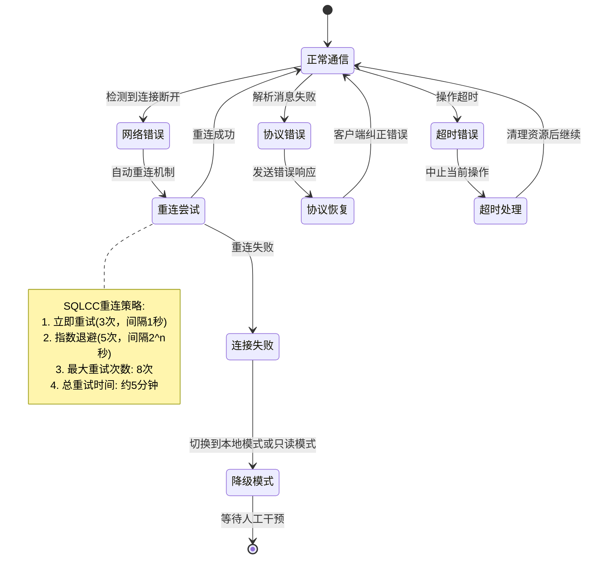
```mermaid
stateDiagram-v2
    [*] --> 正常通信
    正常通信 --> 网络错误: 检测到连接断开
    正常通信 --> 协议错误: 解析消息失败
    正常通信 --> 超时错误: 操作超时
    
    网络错误 --> 重连尝试: 自动重连机制
    重连尝试 --> 正常通信: 重连成功
    重连尝试 --> 连接失败: 重连失败
    
    协议错误 --> 协议恢复: 发送错误响应
    协议恢复 --> 正常通信: 客户端纠正错误
    
    超时错误 --> 超时处理: 中止当前操作
    超时处理 --> 正常通信: 清理资源后继续
    
    连接失败 --> 降级模式: 切换到本地模式或只读模式
    降级模式 --> [*]: 等待人工干预
    
    note right of 重连尝试
        SQLCC重连策略:
        1. 立即重试(3次，间隔1秒)
        2. 指数退避(5次，间隔2^n秒)
        3. 最大重试次数: 8次
        4. 总重试时间: 约5分钟
    end note
```

**SQLCC的错误处理特色**：

1. **分级错误处理**：区分网络错误、协议错误、业务错误，分别采取不同处理策略
2. **自动恢复机制**：对于临时性错误自动尝试恢复，减少人工干预
3. **优雅降级**：在严重故障时提供有限功能的降级服务
4. **详细错误日志**：记录完整的错误上下文，便于问题诊断

### 9.4.4 性能监控与调优：数据驱动的网络优化

现代数据库系统需要全面的性能监控来指导网络优化：

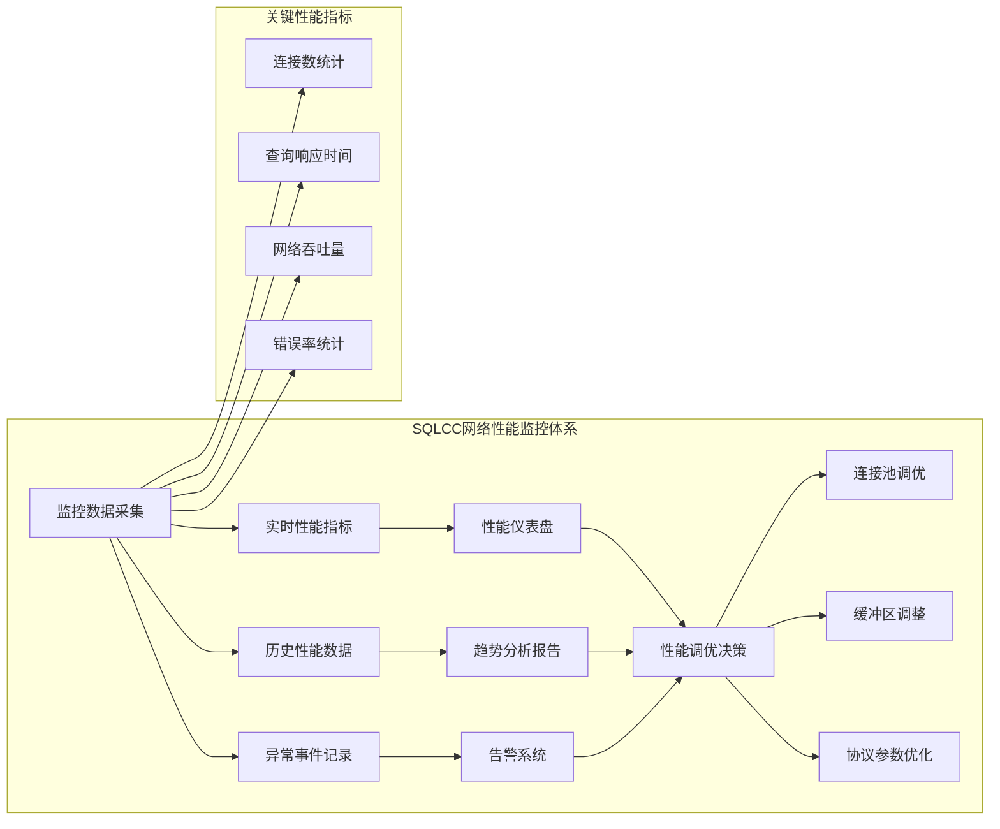
```mermaid
graph LR
    subgraph "SQLCC网络性能监控体系"
        A[监控数据采集] --> B[实时性能指标]
        A --> C[历史性能数据]
        A --> D[异常事件记录]
        
        B --> E[性能仪表盘]
        C --> F[趋势分析报告]
        D --> G[告警系统]
        
        E --> H[性能调优决策]
        F --> H
        G --> H
        
        H --> I[连接池调优]
        H --> J[缓冲区调整]
        H --> K[协议参数优化]
    end
    
    subgraph "关键性能指标"
        L[连接数统计]
        M[查询响应时间]
        N[网络吞吐量]
        O[错误率统计]
    end
    
    A --> L
    A --> M
    A --> N
    A --> O
```

**SQLCC的网络性能监控指标**：

1. **连接相关指标**：活跃连接数、连接建立时间、连接池使用率
2. **吞吐量指标**：每秒查询数(QPS)、网络带宽使用率、数据压缩比
3. **延迟指标**：查询响应时间、网络往返时间(RTT)、服务器处理时间
4. **错误指标**：连接错误率、查询错误率、超时比例

## 9.5 分布式数据库集群网络架构：从单机到集群的演进

### 9.5.1 集群通信协议：Gossip协议与RAFT共识算法的应用

分布式数据库集群需要高效的节点间通信协议来维护集群状态和数据一致性：

```mermaid
graph TB
    subgraph "SQLCC集群通信协议栈"
        A[应用层] --> B[数据同步协议]
        A --> C[成员管理协议]
        A --> D[故障检测协议]
        
        B --> E[RAFT共识算法]
        C --> F[Gossip传播协议]
        D --> G[心跳检测机制]
        
        E --> H[日志复制]
        E --> I[领导者选举]
        
        F --> J[集群状态传播]
        F --> K[配置信息同步]
        
        G --> L[节点健康状态]
        G --> M[网络分区检测]
    end
    
    subgraph "协议选择策略"
        N[小规模集群 (≤10节点)]
        O[中规模集群 (10-100节点)]
        P[大规模集群 (≥100节点)]
        
        N --> Q[使用RAFT算法]
        O --> R[混合协议: RAFT+Gossip]
        P --> S[分层协议: Gossip为主]
    end
```

**SQLCC的集群通信设计**：

1. **混合协议策略**：根据集群规模自动选择最合适的通信协议
2. **分层架构**：将数据同步、成员管理、故障检测等关注点分离
3. **自适应调整**：根据网络条件和集群负载动态调整协议参数
4. **容错机制**：在网络分区或节点故障时保持部分可用性

### 9.5.2 数据分片与路由：一致性哈希与查询路由策略

分布式数据库需要将数据分布到多个节点上，并能够正确路由查询请求：

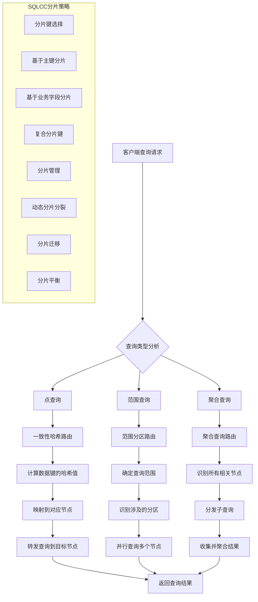
```mermaid
flowchart TD
    A[客户端查询请求] --> B{查询类型分析}
    
    B --> C[点查询]
    B --> D[范围查询]
    B --> E[聚合查询]
    
    C --> F[一致性哈希路由]
    F --> G[计算数据键的哈希值]
    G --> H[映射到对应节点]
    H --> I[转发查询到目标节点]
    
    D --> J[范围分区路由]
    J --> K[确定查询范围]
    K --> L[识别涉及的分区]
    L --> M[并行查询多个节点]
    
    E --> N[聚合查询路由]
    N --> O[识别所有相关节点]
    O --> P[分发子查询]
    P --> Q[收集并聚合结果]
    
    I --> R[返回查询结果]
    M --> R
    Q --> R
    
    subgraph "SQLCC分片策略"
        S[分片键选择]
        T[基于主键分片]
        U[基于业务字段分片]
        V[复合分片键]
        
        W[分片管理]
        X[动态分片分裂]
        Y[分片迁移]
        Z[分片平衡]
    end
```

**SQLCC的数据分片与路由特色**：

1. **智能路由**：根据查询类型自动选择最优路由策略
2. **动态分片**：支持在线分片分裂和合并，无需停机
3. **位置感知**：考虑节点地理位置，优先路由到近端节点
4. **负载均衡**：根据节点负载动态调整路由权重

### 9.5.3 读写分离架构：主从复制与多主复制的网络实现

读写分离是提高数据库吞吐量的重要技术，需要复杂的网络同步机制：

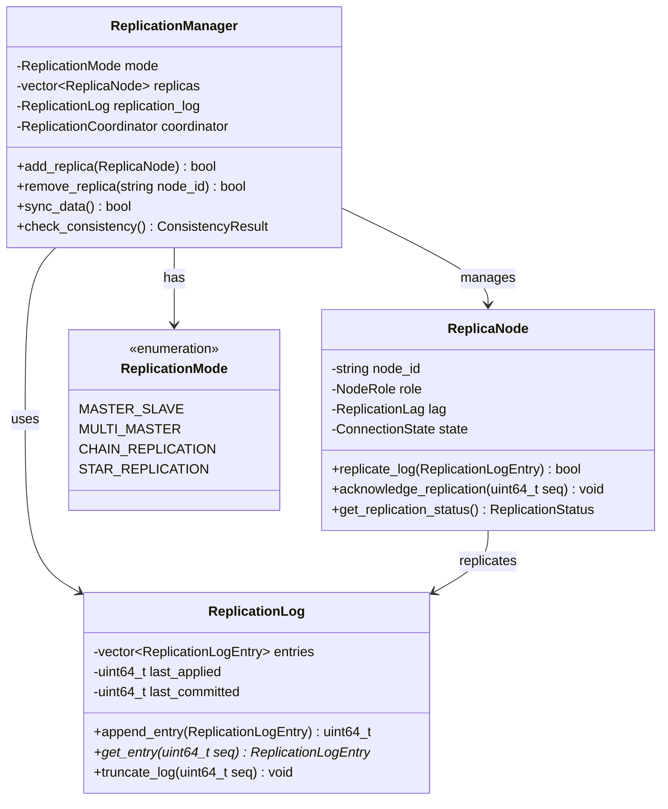
```mermaid
classDiagram
    class ReplicationManager {
        -ReplicationMode mode
        -vector~ReplicaNode~ replicas
        -ReplicationLog replication_log
        -ReplicationCoordinator coordinator
        
        +add_replica(ReplicaNode) bool
        +remove_replica(string node_id) bool
        +sync_data() bool
        +check_consistency() ConsistencyResult
    }
    
    class ReplicaNode {
        -string node_id
        -NodeRole role
        -ReplicationLag lag
        -ConnectionState state
        
        +replicate_log(ReplicationLogEntry) bool
        +acknowledge_replication(uint64_t seq) void
        +get_replication_status() ReplicationStatus
    }
    
    class ReplicationLog {
        -vector~ReplicationLogEntry~ entries
        -uint64_t last_applied
        -uint64_t last_committed
        
        +append_entry(ReplicationLogEntry) uint64_t
        +get_entry(uint64_t seq) ReplicationLogEntry*
        +truncate_log(uint64_t seq) void
    }
    
    class ReplicationMode {
        <<enumeration>>
        MASTER_SLAVE
        MULTI_MASTER
        CHAIN_REPLICATION
        STAR_REPLICATION
    }
    
    ReplicationManager --> ReplicaNode : manages
    ReplicationManager --> ReplicationLog : uses
    ReplicationManager --> ReplicationMode : has
    ReplicaNode --> ReplicationLog : replicates
```

**SQLCC的复制机制特点**：

1. **多种复制模式**：支持主从、多主、链式、星型等多种复制拓扑
2. **异步/同步可选**：根据数据一致性要求选择复制方式
3. **冲突解决**：多主复制下的自动冲突检测和解决
4. **延迟优化**：使用并行复制和流水线技术减少复制延迟

## 9.6 容灾备份与自动伸缩：构建高可用数据库服务

### 9.6.1 数据冗余策略：多副本与跨数据中心备份

数据冗余是容灾备份的基础，需要在存储成本和数据安全之间找到平衡：

```
SQLCC数据冗余策略矩阵:
├── 副本数量策略:
│   ├── 单副本: 无冗余，成本最低，风险最高
│   ├── 双副本: RAID-1风格，一主一备
│   ├── 三副本: 分布式系统标准，容忍单节点故障
│   └── 五副本: 金融级冗余，容忍多节点同时故障
├── 副本分布策略:
│   ├── 机架感知: 副本分布在不同的机架上
│   ├── 机房感知: 副本分布在不同的机房内
│   ├── 地域感知: 副本分布在不同的地理区域
│   └── 多云部署: 副本分布在不同的云服务商
└── 副本同步策略:
    ├── 强同步: 所有副本写入成功才返回成功
    ├── 弱同步: 多数副本写入成功即返回成功
    ├── 异步同步: 主副本写入成功即返回，后台同步
    └── 延迟同步: 按计划定期同步，容忍一定时间延迟
```

### 9.6.2 故障检测与恢复：心跳机制与自动故障转移

自动故障检测和恢复是数据库高可用性的核心技术：

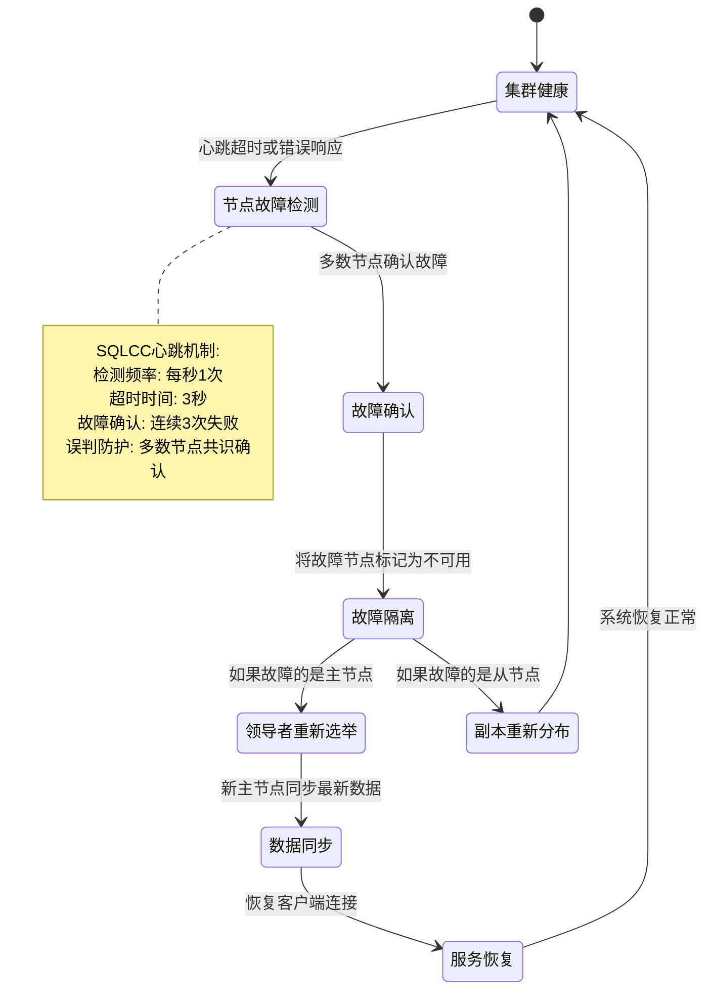
```mermaid
stateDiagram-v2
    [*] --> 集群健康
    集群健康 --> 节点故障检测: 心跳超时或错误响应
    
    节点故障检测 --> 故障确认: 多数节点确认故障
    故障确认 --> 故障隔离: 将故障节点标记为不可用
    
    故障隔离 --> 领导者重新选举: 如果故障的是主节点
    领导者重新选举 --> 数据同步: 新主节点同步最新数据
    
    数据同步 --> 服务恢复: 恢复客户端连接
    服务恢复 --> 集群健康: 系统恢复正常
    
    故障隔离 --> 副本重新分布: 如果故障的是从节点
    副本重新分布 --> 集群健康
    
    note right of 节点故障检测
        SQLCC心跳机制:
        检测频率: 每秒1次
        超时时间: 3秒
        故障确认: 连续3次失败
        误判防护: 多数节点共识确认
    end note
```

**SQLCC的故障处理特色**：

1. **快速检测**：毫秒级心跳检测，秒级故障确认
2. **自动恢复**：无需人工干预的完整故障恢复流程
3. **误判防护**：多节点共识机制避免单点误判
4. **优雅降级**：在恢复期间提供有限功能服务

### 9.6.3 负载均衡：基于负载的动态路由与连接分发

智能负载均衡是保证集群性能均匀的关键技术：

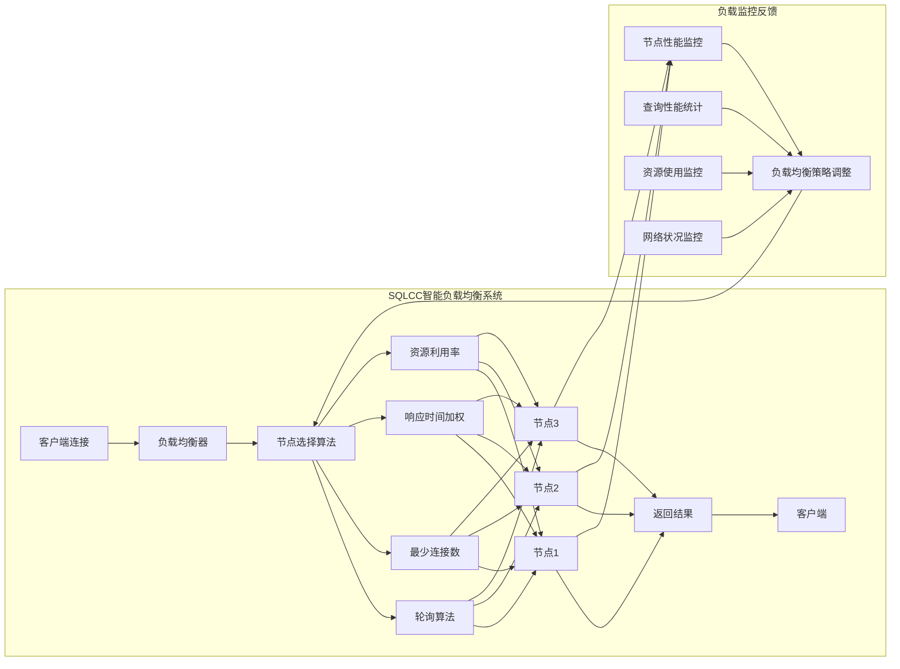
```mermaid
graph LR
    subgraph "SQLCC智能负载均衡系统"
        A[客户端连接] --> B[负载均衡器]
        
        B --> C[节点选择算法]
        C --> D[轮询算法]
        C --> E[最少连接数]
        C --> F[响应时间加权]
        C --> G[资源利用率]
        
        D --> H[节点1]
        E --> H
        F --> H
        G --> H
        
        D --> I[节点2]
        E --> I
        F --> I
        G --> I
        
        D --> J[节点3]
        E --> J
        F --> J
        G --> J
        
        H --> K[返回结果]
        I --> K
        J --> K
        
        K --> L[客户端]
    end
    
    subgraph "负载监控反馈"
        M[节点性能监控]
        N[查询性能统计]
        O[资源使用监控]
        P[网络状况监控]
        
        M --> Q[负载均衡策略调整]
        N --> Q
        O --> Q
        P --> Q
        
        Q --> C
    end
    
    H --> M
    I --> M
    J --> M
```

**SQLCC负载均衡算法**：

1. **静态算法**：轮询、随机、哈希等传统算法
2. **动态算法**：基于实时负载的加权算法
3. **预测算法**：基于历史数据的趋势预测
4. **混合算法**：多种算法组合，适应不同场景

### 9.6.4 自动伸缩机制：根据流量自动增减节点

云原生数据库的核心特性之一是根据负载自动调整集群规模：

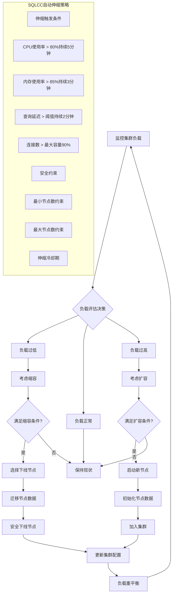
```mermaid
flowchart TD
    A[监控集群负载] --> B{负载评估决策}
    
    B --> C[负载过低]
    B --> D[负载正常]
    B --> E[负载过高]
    
    C --> F[考虑缩容]
    F --> G{满足缩容条件?}
    G -->|是| H[选择下线节点]
    H --> I[迁移节点数据]
    I --> J[安全下线节点]
    J --> K[更新集群配置]
    
    E --> L[考虑扩容]
    L --> M{满足扩容条件?}
    M -->|是| N[启动新节点]
    N --> O[初始化节点数据]
    O --> P[加入集群]
    P --> K
    
    D --> Q[保持现状]
    G -->|否| Q
    M -->|否| Q
    
    K --> R[负载重平衡]
    R --> A
    
    subgraph "SQLCC自动伸缩策略"
        S[伸缩触发条件]
        T[CPU使用率 > 80%持续5分钟]
        U[内存使用率 > 85%持续3分钟]
        V[查询延迟 > 阈值持续2分钟]
        W[连接数 > 最大容量90%]
        
        X[安全约束]
        Y[最小节点数约束]
        Z[最大节点数约束]
        AA[伸缩冷却期]
    end
```

**SQLCC自动伸缩的特色**：

1. **预测性伸缩**：基于历史数据的趋势预测，提前扩容
2. **平滑伸缩**：逐步增加或减少节点，避免服务抖动
3. **成本优化**：考虑不同时间段的计费策略，优化伸缩时机
4. **业务感知**：结合业务周期（如促销活动）调整伸缩策略

### 9.6.5 OLTP与OLAP并行处理：混合工作负载的网络优化

现代数据库需要同时处理事务型和分析型工作负载，这对网络通信提出了特殊要求：

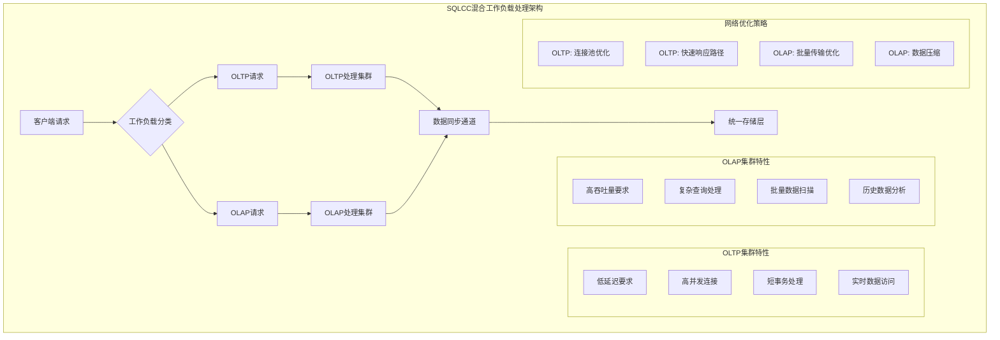
```mermaid
graph TB
    subgraph "SQLCC混合工作负载处理架构"
        A[客户端请求] --> B{工作负载分类}
        
        B --> C[OLTP请求]
        B --> D[OLAP请求]
        
        C --> E[OLTP处理集群]
        D --> F[OLAP处理集群]
        
        subgraph "OLTP集群特性"
            G[低延迟要求]
            H[高并发连接]
            I[短事务处理]
            J[实时数据访问]
        end
        
        subgraph "OLAP集群特性"
            K[高吞吐量要求]
            L[复杂查询处理]
            M[批量数据扫描]
            N[历史数据分析]
        end
        
        E --> O[数据同步通道]
        F --> O
        
        O --> P[统一存储层]
        
        subgraph "网络优化策略"
            Q[OLTP: 连接池优化]
            R[OLTP: 快速响应路径]
            S[OLAP: 批量传输优化]
            T[OLAP: 数据压缩]
        end
    end
```

**SQLCC混合工作负载的网络优化**：

1. **物理隔离**：OLTP和OLAP流量使用不同的网络路径和优先级
2. **流量整形**：限制OLAP查询对OLTP查询的影响
3. **资源预留**：为OLTP流量保留最低带宽保证
4. **智能路由**：根据查询特征自动选择处理集群

## 9.7 大型分布式数据库系统案例分析：从理论到工程实践

### 9.7.1 云原生数据库的网络设计：AWS Aurora的架构启示

AWS Aurora作为云原生数据库的代表，其网络架构设计提供了重要参考：

```
AWS Aurora网络架构关键设计:
├── 存储计算分离:
│   ├── 计算节点: 无状态，负责SQL解析和执行
│   ├── 存储节点: 有状态，负责数据持久化
│   └── 网络优化: 计算与存储间使用高速RDMA网络
├── 日志即数据库:
│   ├── 设计理念: 只传输redo日志，不传输数据页
│   ├── 网络优势: 日志量远小于数据页，减少网络传输
│   └── 一致性保证: 通过quorum机制保证日志持久化
├── 多副本读取:
│   ├── 读副本: 最多15个只读副本
│   ├── 网络优化: 读副本与主副本异步同步
│   └── 负载均衡: 读请求自动路由到最近副本
└── 跨区域复制:
    ├── 全局数据库: 数据跨多个AWS区域复制
    ├── 网络延迟: 使用专用骨干网减少跨区域延迟
    └── 故障切换: 区域级故障自动切换到备用区域
```

**SQLCC从Aurora学习的经验**：

1. **分离架构思想**：将计算和存储分离，各自独立扩展
2. **日志中心设计**：减少网络传输量，提高复制效率
3. **智能副本管理**：根据地理位置和负载智能管理副本
4. **全局数据分布**：支持跨地域部署，满足全球化业务需求

### 9.7.2 开源分布式数据库对比：CockroachDB、TiDB、YugabyteDB的网络实现

主流开源分布式数据库在网络实现上各有特色，提供了丰富的设计参考：

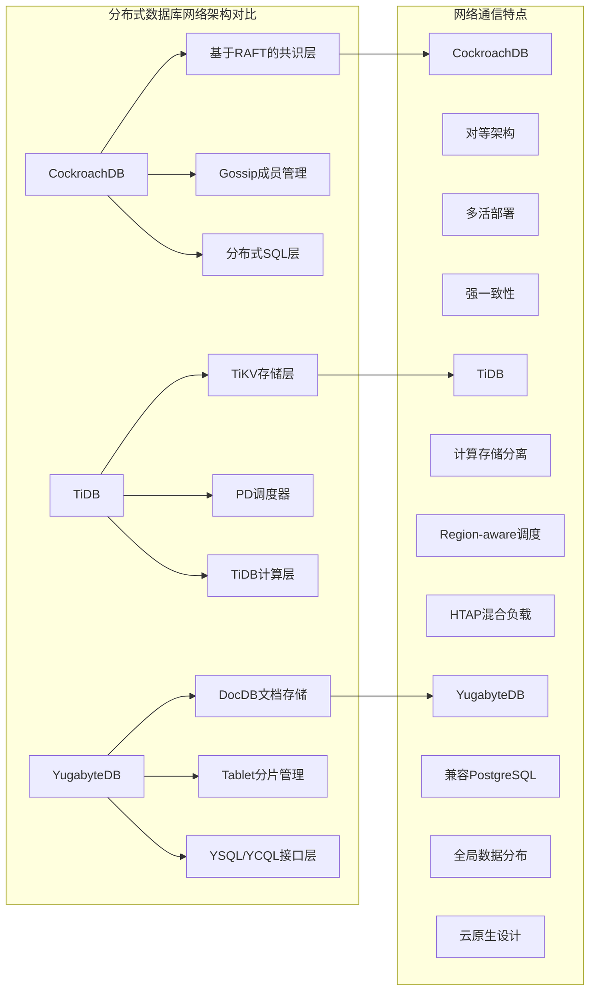
```mermaid
graph LR
    subgraph "分布式数据库网络架构对比"
        A[CockroachDB] --> B[基于RAFT的共识层]
        A --> C[Gossip成员管理]
        A --> D[分布式SQL层]
        
        E[TiDB] --> F[TiKV存储层]
        E --> G[PD调度器]
        E --> H[TiDB计算层]
        
        I[YugabyteDB] --> J[DocDB文档存储]
        I --> K[Tablet分片管理]
        I --> L[YSQL/YCQL接口层]
    end
    
    subgraph "网络通信特点"
        M[CockroachDB]
        N[对等架构]
        O[多活部署]
        P[强一致性]
        
        Q[TiDB]
        R[计算存储分离]
        S[Region-aware调度]
        T[HTAP混合负载]
        
        U[YugabyteDB]
        V[兼容PostgreSQL]
        W[全局数据分布]
        X[云原生设计]
    end
    
    B --> M
    F --> Q
    J --> U
```

**SQLCC的设计借鉴**：

1. **架构选择**：根据应用场景选择合适的架构模式
2. **协议实现**：借鉴成熟的共识算法和成员管理协议
3. **性能优化**：学习各种数据库的网络优化技巧
4. **兼容性设计**：平衡创新与兼容性，降低迁移成本

### 9.7.3 SQLCC的设计哲学：面向工程实践的务实设计

SQLCC作为教学型数据库系统，形成了独特的设计哲学：

```
SQLCC网络通信设计哲学:
├── 渐进式实现:
│   ├── 第一步: 实现基础客户端-服务器通信
│   ├── 第二步: 增加安全加密功能
│   ├── 第三步: 支持简单的主从复制
│   └── 第四步: 实现分布式集群功能
├── 模块化设计:
│   ├── 网络层: 独立于数据库核心功能
│   ├── 协议层: 支持多种协议格式
│   ├── 安全层: 可插拔的安全模块
│   └── 集群层: 可选的分布式功能
├── 配置灵活:
│   ├── 安全级别: 从无加密到金融级安全
│   ├── 部署模式: 单机、主从、集群多种选择
│   └── 性能调优: 丰富的配置参数适应不同场景
└── 教学友好:
    ├── 代码清晰: 每个模块都有详细注释
    ├── 文档完整: 从设计到实现的完整文档
    └── 示例丰富: 提供多种使用场景的示例代码
```

### 9.7.4 未来趋势：Serverless数据库、边缘计算与网络通信的新挑战

数据库网络通信技术正在经历新的变革，面临新的挑战和机遇：

```
数据库网络通信的未来趋势:
├── Serverless数据库:
│   ├── 特点: 无服务器架构，按使用量计费
│   ├── 网络挑战: 冷启动延迟，连接池管理
│   └── 解决方案: 保持热连接池，预测性预热
├── 边缘计算:
│   ├── 特点: 数据在边缘设备处理，减少云端传输
│   ├── 网络挑战: 边缘设备网络不稳定，带宽有限
│   └── 解决方案: 异步同步，数据压缩，离线处理
├── 5G与物联网:
│   ├── 特点: 海量设备连接，低延迟要求
│   ├── 网络挑战: 连接管理，数据安全
│   └── 解决方案: 轻量级协议，设备认证，数据加密
└── 人工智能集成:
    ├── 特点: 数据库内置AI能力，智能优化
    ├── 网络挑战: 模型传输，推理延迟
    └── 解决方案: 模型压缩，边缘推理，增量更新
```

**SQLCC的未来发展**：

1. **拥抱新技术**：逐步集成Serverless、边缘计算等新技术
2. **保持教学核心**：新技术实现要便于教学和理解
3. **社区驱动**：鼓励社区贡献，形成良性的发展生态
4. **持续演进**：定期更新，跟上技术发展的步伐

## 📚 **本章总结：从客户端-服务器到分布式集群的网络通信全景**

本章深入探讨了数据库网络通信的全方位技术体系，从基础的客户端-服务器通信到复杂的分布式集群架构：

### **核心知识体系**：

1. **基础通信架构**：理解了TCP/IP协议栈在数据库通信中的具体应用，掌握了连接池、预编译语句等关键技术
2. **网络安全机制**：深入学习了TLS加密、AES算法、密码轮换等安全技术，掌握了防御SQL注入、DoS攻击等安全策略
3. **分布式集群设计**：掌握了分布式数据库的通信协议、数据分片、读写分离、容灾备份等核心技术
4. **性能优化实践**：学习了网络性能监控、负载均衡、自动伸缩等工程优化技巧

### **SQLCC实践价值**：

通过SQLCC的具体设计实例，我们看到了理论算法如何转化为实际的工程代码：
- 清晰的模块化设计便于理解和学习
- 完整的安全机制实现展示了密码学的实际应用
- 渐进式的功能实现体现了工程实践的务实态度
- 丰富的配置选项支持多种使用场景

### **技术发展趋势**：

数据库网络通信技术正在向Serverless、边缘计算、AI集成等方向发展，未来的数据库系统需要：
- 更智能的网络优化能力
- 更强大的安全防护机制
- 更灵活的部署和扩展方式
- 更紧密的云原生集成

### **工程思维培养**：

学习数据库网络通信不仅是为了掌握具体技术，更重要的是培养系统工程思维：
- **权衡思维**：在性能、安全、成本之间找到最佳平衡点
- **分层思维**：将复杂问题分解为多个层次分别解决
- **容错思维**：设计系统时要考虑各种故障场景和恢复策略
- **演进思维**：技术不断进步，系统需要具备持续演进的能力

---

**思考题**：
1. 为什么TLS握手需要多个往返？能否优化为单个往返？
2. 在分布式数据库中，如何权衡数据一致性和网络延迟？
3. 自动伸缩机制如何避免"抖动"现象（频繁扩缩容）？
4. 边缘计算场景下，数据库网络通信面临哪些特殊挑战？
5. Serverless数据库如何管理数据库连接池？

**实践项目**：
1. 基于SQLCC源代码，分析ServerNetworkManager的具体实现
2. 实现一个简单的TLS加密通信模块
3. 设计并实现一个分布式键值存储系统的网络通信层
4. 模拟网络分区场景，测试分布式数据库的容错能力
5. 性能测试不同加密算法对数据库查询性能的影响

通过本章的学习，希望读者不仅掌握了数据库网络通信的技术知识，更能理解这些技术在实际系统中的应用场景和工程挑战，培养解决复杂系统问题的能力。
