# SQL执行器改进设计文档

## 1. 背景与目标

### 1.1 背景

当前SQL执行器设计存在以下问题：
- **执行器分离**: DDL/DML/DCL/Utility执行器分离，导致代码重复
- **统一优化缺失**: 各执行器独立处理，缺乏全局优化
- **维护困难**: 相同逻辑在多处实现
- **扩展不便**: 新功能添加需要修改多个执行器
- **优化机制基础**: 现有查询优化器功能简单，缺乏基于成本的优化

### 1.2 目标

- 重构执行器架构，解决代码冗余问题
- 为复杂查询、高级JOIN、子查询和查询优化器做准备
- 提高执行器的可维护性和可扩展性
- 增强统一优化能力，支持基于规则和成本的优化
- 提供更好的执行统计和监控
- 解决SqlExecutor与SystemDatabase的循环依赖问题

## 2. 架构设计

### 2.1 分层架构

采用分层架构设计，将执行器分为以下几层：

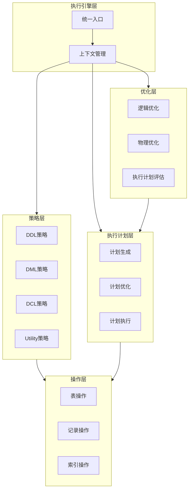

### 2.2 核心组件

#### 2.2.1 执行上下文（ExecutionContext）

**增强的执行上下文**，统一管理执行状态：

| 字段名 | 类型 | 描述 |
|--------|------|------|
| current_database | string | 当前数据库 |
| current_user | string | 当前用户 |
| user_manager | shared_ptr<UserManager> | 用户管理器 |
| system_db | shared_ptr<SystemDatabase> | 系统数据库 |
| db_manager | shared_ptr<DatabaseManager> | 数据库管理器 |
| records_affected | size_t | 影响记录数 |
| used_index | bool | 是否使用索引 |
| execution_plan | string | 执行计划描述 |
| execution_time_ms | uint64_t | 执行时间（毫秒） |
| plan_details | string | 执行计划详情 |
| optimized_plan | string | 优化后的执行计划 |
| query_optimized | bool | 查询是否被优化 |
| optimization_rules | vector<string> | 使用的优化规则 |
| index_info | string | 索引使用详情 |
| cost_estimate | double | 成本估算 |

#### 2.2.2 执行策略（ExecutionStrategy）

**统一的策略接口**，减少重复代码：

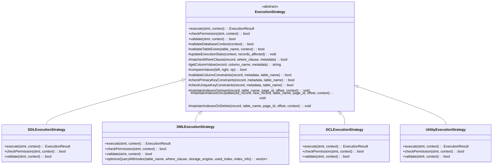

#### 2.2.3 执行计划（ExecutionPlan）

**执行计划**，描述查询的执行方式：

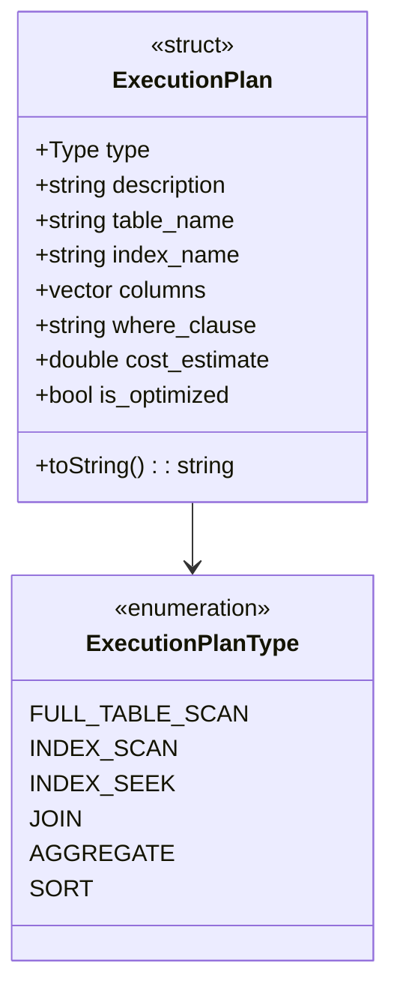

#### 2.2.4 执行计划生成器（ExecutionPlanGenerator）

**执行计划生成器**，负责生成执行计划：

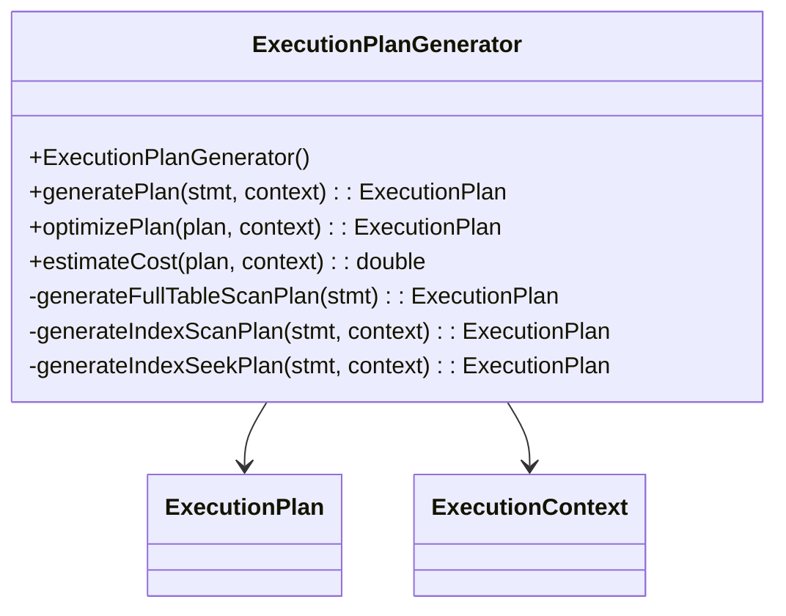

### 2.2.5 查询优化器接口（QueryOptimizer）

**查询优化器接口**，支持基于规则和成本的优化：

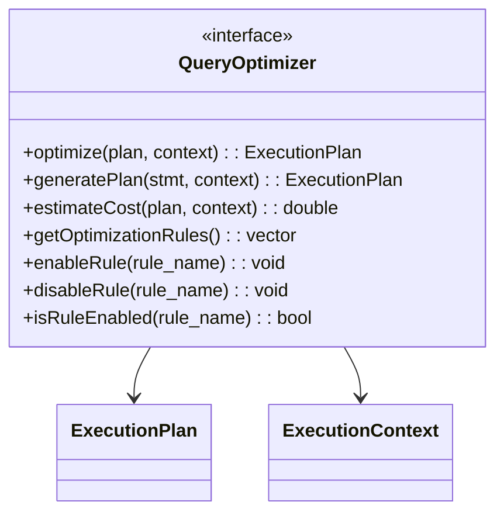

### 2.2.6 基于规则的查询优化器（RuleBasedOptimizer）

**基于规则的查询优化器**，实现基本的优化规则：

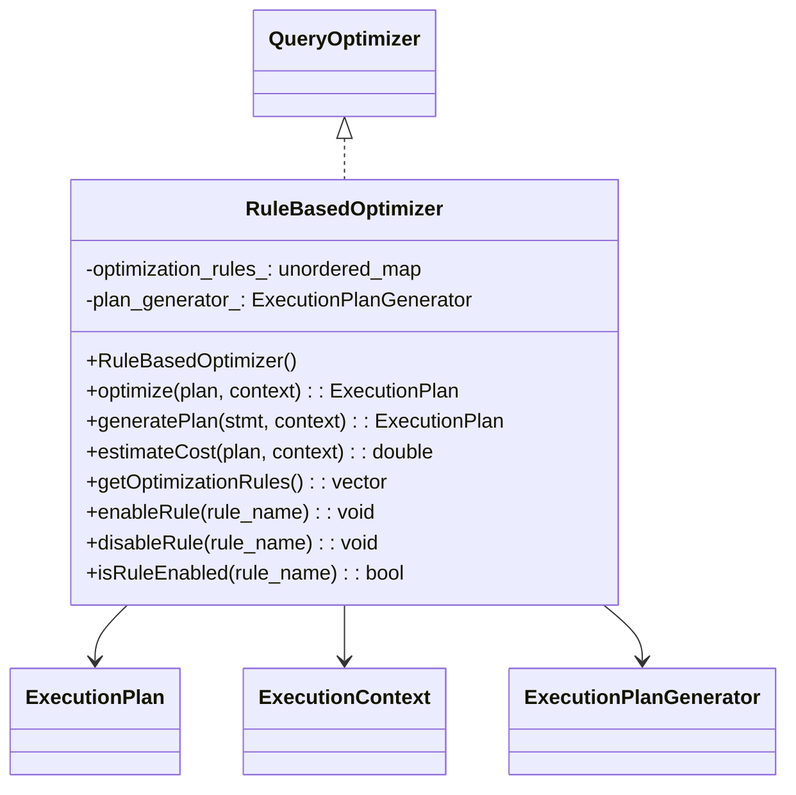

### 2.2.7 高级执行器（AdvancedExecutor）

**高级执行器**，为复杂查询提供支持：

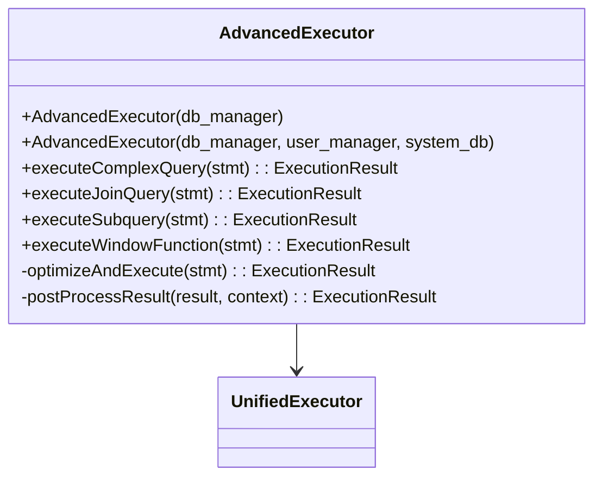

### 2.2.8 统一执行器（UnifiedExecutor）

**统一执行器**，使用策略模式统一处理所有类型的SQL语句：

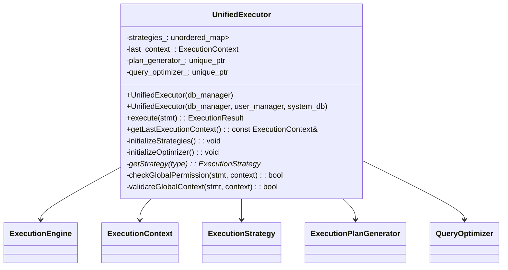

### 2.3 执行流程

**统一的执行流程**：

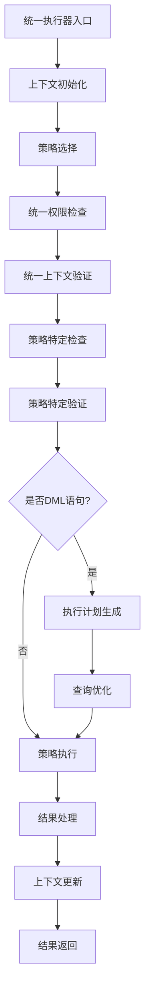

**执行流程说明**：
1. **入口处理**：统一执行器接收SQL语句
2. **上下文初始化**：创建并初始化执行上下文，包含当前数据库、用户、执行统计等信息
3. **策略选择**：根据语句类型选择相应的执行策略（DDL/DML/DCL/Utility）
4. **权限检查**：
   - 全局权限检查：验证用户是否具有基本执行权限
   - 策略特定检查：根据策略类型进行特定权限验证
5. **上下文验证**：
   - 全局上下文验证：验证数据库、表等资源是否存在
   - 策略特定验证：根据策略类型进行特定验证
6. **执行计划生成**：仅针对DML语句，生成初始执行计划
7. **查询优化**：仅针对DML语句，优化执行计划，选择最优执行方式
8. **策略执行**：执行具体的执行策略，处理SQL语句
9. **结果处理**：处理执行结果，格式化返回信息
10. **上下文更新**：更新执行上下文，记录执行统计、执行计划等信息
11. **结果返回**：返回执行结果给调用者

### 2.4 循环依赖解决方案

**问题**：SqlExecutor构造函数调用InitializeSystemDatabase()创建SystemDatabase实例，而SystemDatabase构造函数又创建SqlExecutor实例，形成无限循环。

**循环依赖问题图示**：

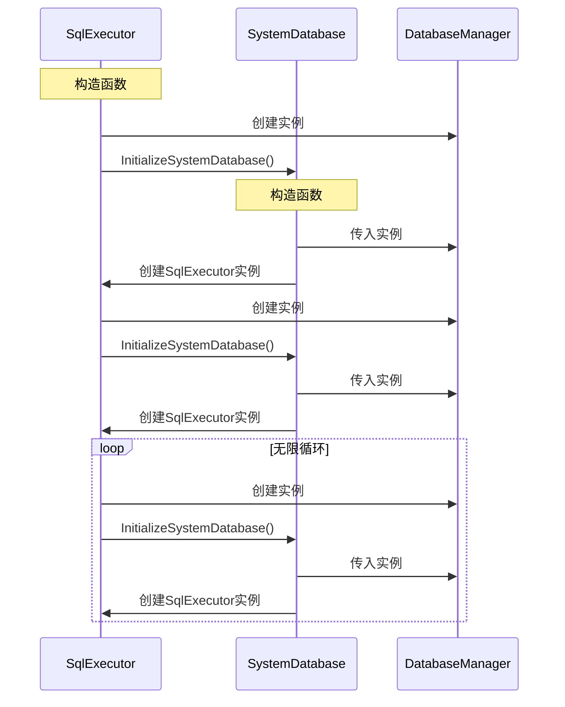

**解决方案**：

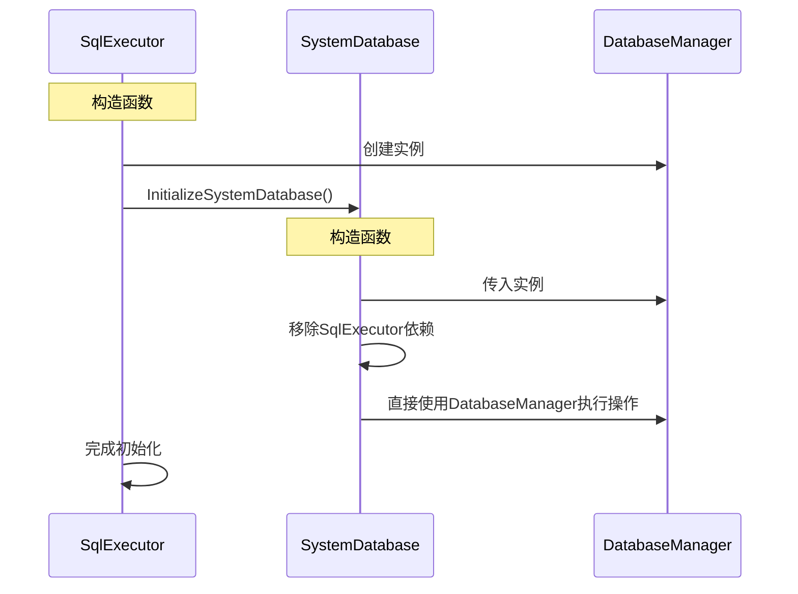

**具体措施**：
1. **移除SystemDatabase对SqlExecutor的依赖**：
   - 移除SqlExecutor的前向声明
   - 移除SqlExecutor成员变量
   - 使用DatabaseManager直接执行操作，不通过SqlExecutor
2. **简化ExecuteSQL方法**：
   - 移除SqlExecutor依赖
   - 直接使用DatabaseManager进行操作
3. **重构GetUserPrivileges方法**：
   - 移除SqlExecutor依赖
   - 实现直接查询逻辑

## 3. 代码重构方案

### 3.1 ExecutionContext 增强

扩展`ExecutionContext`，添加更多执行状态信息，统一管理执行过程中的各种状态。

### 3.2 策略模式优化

1. **抽象公共逻辑**：将各执行器中的重复逻辑提取到`ExecutionStrategy`基类
2. **统一权限检查**：实现统一的权限检查机制
3. **统一验证机制**：实现统一的上下文验证机制
4. **提供辅助方法**：提供常用的辅助方法，减少策略实现的复杂度

### 3.3 执行计划生成

添加执行计划生成模块，支持：
- 生成执行计划
- 执行计划优化
- 执行计划评估

### 3.4 查询优化器接口

设计查询优化器接口，为后续实现查询优化器做准备，支持：
- 逻辑计划优化
- 物理计划生成
- 执行计划评估

### 3.5 统一执行入口

统一执行入口，处理所有类型的SQL语句，减少重复代码。

### 3.6 循环依赖解决

重构SystemDatabase和SqlExecutor，移除它们之间的循环依赖：
- 移除SystemDatabase中的SqlExecutor成员变量
- 修改SystemDatabase的ExecuteSQL方法，直接使用DatabaseManager
- 更新SystemDatabase的GetUserPrivileges方法，移除SqlExecutor依赖

## 4. 与现有系统的兼容性

### 4.1 向后兼容

- 保持原有API不变，确保现有代码无需修改即可使用
- 新功能通过扩展接口实现，不影响现有功能

### 4.2 迁移策略

- 逐步迁移现有执行器功能到新架构
- 保持现有执行器可用，支持平滑过渡
- 提供迁移工具，协助用户迁移到新架构

## 5. 测试与验证

### 5.1 单元测试

- 测试核心组件的功能
- 测试执行上下文的正确性
- 测试策略模式的正确性
- 测试执行计划生成的正确性
- 测试查询优化器的正确性
- 测试循环依赖解决的正确性

### 5.2 集成测试

- 测试执行器与其他模块的集成
- 测试不同类型语句的执行
- 测试复杂查询的执行

### 5.3 性能测试

- 测试执行器的性能表现
- 测试不同优化策略的效果
- 测试执行计划生成的性能

### 5.4 兼容性测试

- 测试与现有代码的兼容性
- 测试与现有数据库的兼容性
- 测试与现有客户端的兼容性

## 6. 实现计划

### 6.1 实现时间表

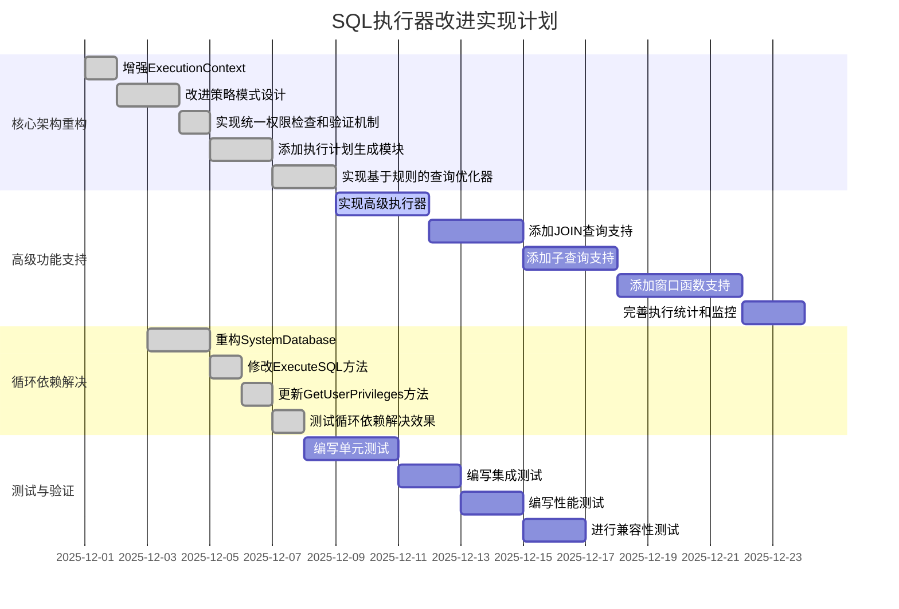

### 6.2 阶段详情

#### 6.2.1 第一阶段：核心架构重构
- **目标**：建立统一执行器的核心架构
- **内容**：
  - 增强ExecutionContext，添加执行统计和监控支持
  - 改进策略模式设计，减少代码重复
  - 实现统一的权限检查和验证机制
  - 添加执行计划生成模块
  - 实现基于规则的查询优化器
- **交付物**：
  - 增强的ExecutionContext
  - 统一的ExecutionStrategy接口
  - 执行计划生成器
  - 基于规则的查询优化器

#### 6.2.2 第二阶段：高级功能支持
- **目标**：为复杂查询提供支持
- **内容**：
  - 实现高级执行器
  - 添加JOIN查询支持
  - 添加子查询支持
  - 添加窗口函数支持
  - 完善执行统计和监控
- **交付物**：
  - 高级执行器实现
  - JOIN查询支持
  - 子查询支持
  - 窗口函数支持

#### 6.2.3 第三阶段：循环依赖解决
- **目标**：移除SqlExecutor与SystemDatabase之间的循环依赖
- **内容**：
  - 重构SystemDatabase，移除SqlExecutor依赖
  - 修改SystemDatabase的ExecuteSQL方法
  - 更新SystemDatabase的GetUserPrivileges方法
  - 测试循环依赖解决效果
- **交付物**：
  - 重构后的SystemDatabase
  - 修复后的依赖关系
  - 测试报告

#### 6.2.4 第四阶段：测试与验证
- **目标**：确保改进后的执行器稳定可靠
- **内容**：
  - 编写单元测试
  - 编写集成测试
  - 编写性能测试
  - 进行兼容性测试
- **交付物**：
  - 单元测试用例
  - 集成测试用例
  - 性能测试报告
  - 兼容性测试报告

## 7. 预期成果

- 解决执行器设计冗余问题，减少代码重复
- 解决SqlExecutor与SystemDatabase的循环依赖问题
- 为复杂查询、高级JOIN、子查询和查询优化器做准备
- 提高执行器的可维护性和可扩展性
- 增强统一优化能力
- 提供更好的执行统计和监控
- 支持执行计划生成和优化
- 为查询优化器实现奠定基础

## 8. 风险评估

| 风险 | 影响 | 应对措施 |
|------|------|----------|
| 代码重构引入新bug | 影响系统稳定性 | 充分测试，逐步迁移 |
| 性能下降 | 影响系统性能 | 进行性能测试，优化关键路径 |
| 兼容性问题 | 影响现有代码 | 保持原有API不变，提供迁移工具 |
| 实现复杂度高 | 影响开发进度 | 分阶段实现，逐步完善 |
| 测试覆盖不足 | 影响系统质量 | 编写全面的测试用例，进行自动化测试 |

## 9. 结论

本设计文档详细描述了SQL执行器的改进方案，采用分层架构和策略模式，解决了当前执行器设计的冗余问题和循环依赖问题，为复杂查询、高级JOIN、子查询和查询优化器做准备。改进后的执行器将具有更好的可维护性、可扩展性和统一优化能力，为后续功能扩展奠定坚实的基础。